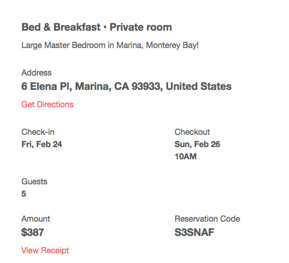

# driver-training

## SSCP - Driver Training

## Driver Training

PLAN

Autocross School & Autocross Fun Run: February 25-26&#x20;

We were originally going to have you guys do a car control clinic before autocross, but this is just the way the dates worked out on the BMW CCA calendar. This is a 2 day event geared towards people who have no experience with autocross, which is basically a cone course in a big parking lot that makes you really focus on vehicle handling rather than just going fast. I did this school last year and it was amazing. Plan on driving down the Friday evening prior and returning Sunday evening.

Car Control Clinic: tentatively May 6 -- ! Note: No longer tentative ! May 6 is finalized.

This date is still tentative on the BMW CCA calendar but should be finalized far in advance, but for now be aware that it'll be sometime around May 6.

Alameda Civilian Safety Course: June 24

This is a defensive driving course run by the Alameda County Sheriff's Office, so it should be a good change from BMW CCA.

Crow's Landing with the team: July 8-9

This is supposed to be your first time really driving the solar car above parking lot speeds, so that we can all make sure the car is tuned correctly and learn its quirks before getting onto public roads. We'll also be doing general race crew car control practice in passenger cars with an instructor.

Housing

From Erina about DDL's driver training program:

We have an amazing relationship with the track manager.&#x20;

He donates his time to train everyone. So the cost is the track rental and vehicle rentals.

The track rental cost is posted online. The cars are about $500 each.

Then there are fees for membership etc that run around $160 per person.

Jan 23 Convo:

Kelsey:

Could you look through this and see if any of these would work?

http://www.dreamcarrentals.com/exotic-car-rentals/convertible-rentals/

[http://www.dreamcarrentals.com/exotic-car-rentals/convertible-rentals/](http://www.dreamcarrentals.com/exotic-car-rentals/convertible-rentals/)

Also found this: https://www.getaround.com/mx5alive

[https://www.getaround.com/mx5alive](https://www.getaround.com/mx5alive)

And here's the one we already looked at; including here so I have all the links in the same place.

http://cityrentacar.com/fleet-convertibles-fun-cars.html

[http://cityrentacar.com/fleet-convertibles-fun-cars.html](http://cityrentacar.com/fleet-convertibles-fun-cars.html)

https://www.google.com/search?q=Sunbelt+Car+Rental\&rlz=1C5CHFA\_enUS726US728\&oq=Sunbelt+Car+Rental\&aqs=chrome..69i57j0l5.303j0j7\&sourceid=chrome\&ie=UTF-8

[https://www.google.com/search?q=Sunbelt+Car+Rental\&rlz=1C5CHFA\_enUS726US728\&oq=Sunbelt+Car+Rental\&aqs=chrome..69i57j0l5.303j0j7\&sourceid=chrome\&ie=UTF-8](https://www.google.com/search?q=Sunbelt+Car+Rental\&rlz=1C5CHFA_enUS726US728\&oq=Sunbelt+Car+Rental\&aqs=chrome..69i57j0l5.303j0j7\&sourceid=chrome\&ie=UTF-8)

Rachel:

First link: Not seeing anything great, these kind of seem like last resorts. Like maaaybe the Mustang, but the last link also has Mustangs available.

Second link: That looks excellent! Are there any others like it on that site?

Third link: We already discussed, but the ideal case would be 3 of the auto Miatas from here, then as a second choice we could go for the BMW 328i. Would be logistically easier to get all of them from the same place.

Solar Car Driver Motorsport Reg Account Info

All drivers' account information is contained within one login.

email address: rabril@stanford.edu

password: s0lar.p0w3r

#### Embedded Google Drive File

Google Drive File: [Embedded Content](https://drive.google.com/embeddedfolderview?id=1oCwBSFIu4pwr29Y44eYsycm9MlL4Safp#list)
