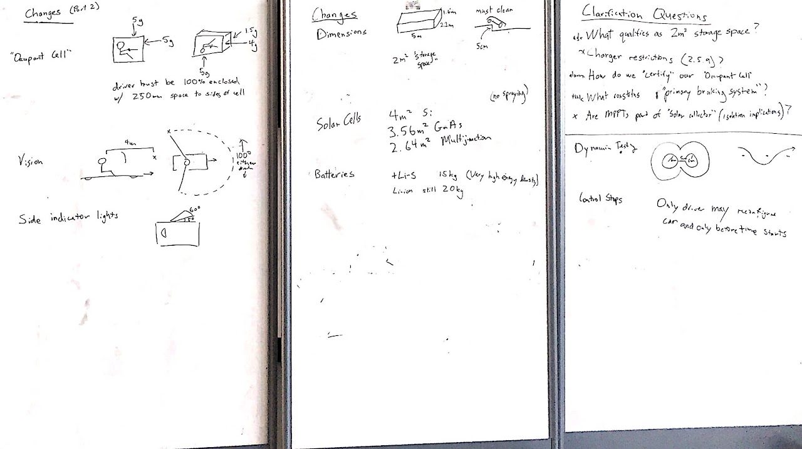

# SSCP - WSC 2017 Rules and Announcements

# WSC 2017 Rules and Announcements

## Post-Rules Release Discussion

Big Changes:

* At control stops, array normalization must be actuated by the driver only.
* Driver must be contained within an "Occupant Cell" that can take a certain amount of force.
* Array size has decreased.  3.56m^2 of GaAs may be better than 4m^2 of Si.
* Vehicle can be 5m long, 2.2m wide, 1.6m high, giving aero a bit more freedom.
* Li-S cells are explicitly allowed, have much higher energy density than Li-ion.
* "Primary Braking System" needs to stop all four wheels.
* Car must have 2m^2 of "storage" space.
* Driver needs wider range of vision.
* Side-indicator lights required.
* Different dynamic scrutineering requirements -- required turn radius may actually be longer than last cycle.

At control stops, array normalization must be actuated by the driver only.

Driver must be contained within an "Occupant Cell" that can take a certain amount of force.

Array size has decreased.  3.56m^2 of GaAs may be better than 4m^2 of Si.

Vehicle can be 5m long, 2.2m wide, 1.6m high, giving aero a bit more freedom.

Li-S cells are explicitly allowed, have much higher energy density than Li-ion.

"Primary Braking System" needs to stop all four wheels.

Car must have 2m^2 of "storage" space.

Driver needs wider range of vision.

Side-indicator lights required.

Different dynamic scrutineering requirements -- required turn radius may actually be longer than last cycle.

Need Clarification:

(2.3.4) What qualifies as 2m^2 storage space?

---- Ask WSC.

(2.11.5) How do we "certify" our "Occupant Cell"?

---  Ask Alumni.

(2.21.2) What constitutes "primary braking system"?

--- Think about more, then ask.

More detailed notes in discussion document.

[ discussion document](https://docs.google.com/a/stanford.edu/document/d/1cW8JakcKQiR6RTHf0u0NsbbUcXLWVtw3PK5YfMtjfJs/edit?usp=sharing)

### Embedded Google Drive File

Google Drive File: [Embedded Content](https://drive.google.com/embeddedfolderview?id=1yTP9LEK8DgqFlGmyn0CWVcIWPb-yR_Wb#list)

<iframe width="100%" height="400" src="https://drive.google.com/embeddedfolderview?id=1yTP9LEK8DgqFlGmyn0CWVcIWPb-yR_Wb#list" frameborder="0"></iframe>

