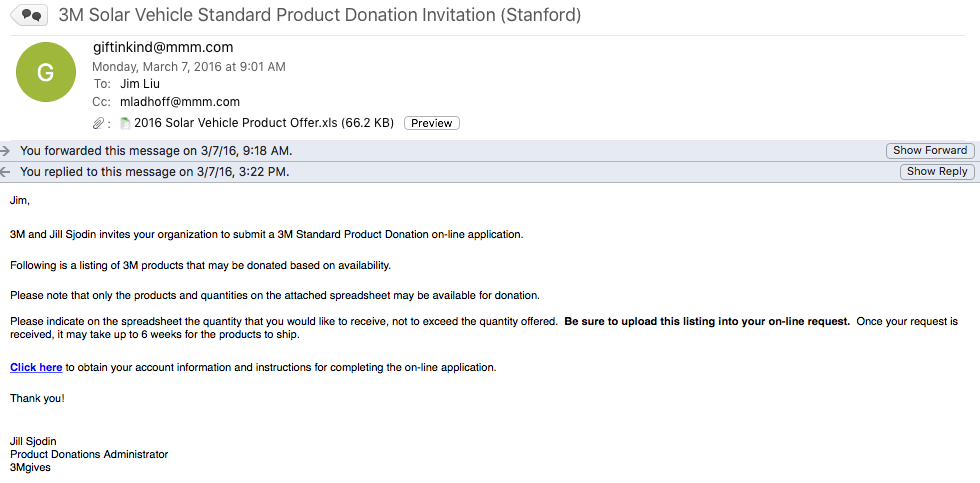
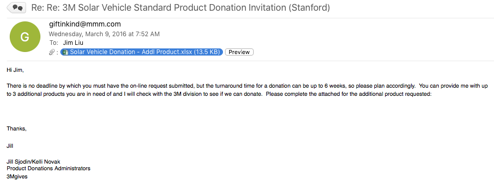
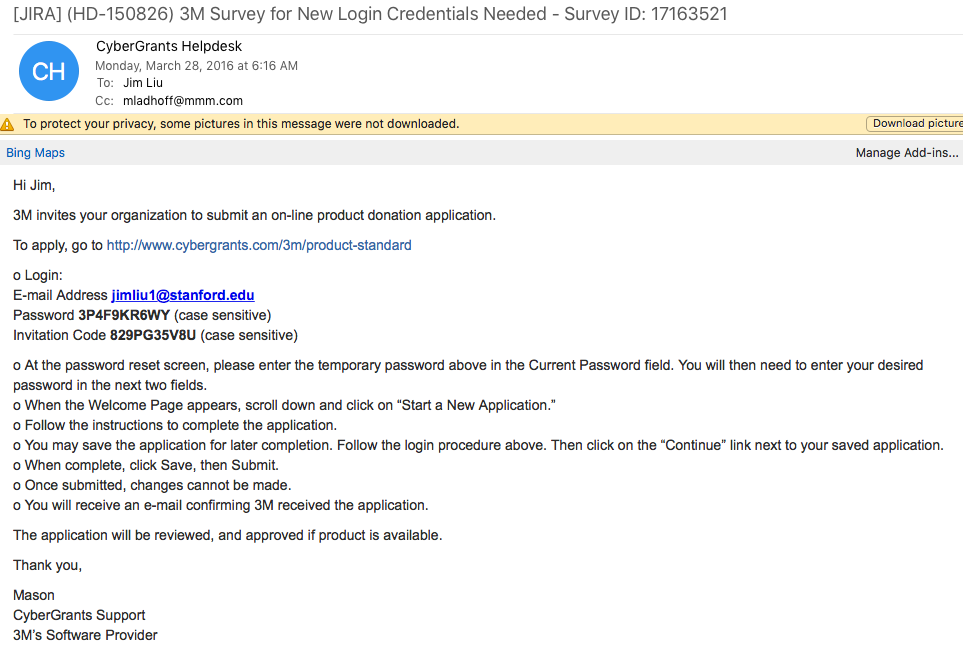

# 3m

## SSCP - 3M

## 3M

Process for receiving 3M part donations (In Chrono Order \[early >> late])

3/03/16 (might want to send a little earlier for 2017-2018 cycle):&#x20;

Sent email to 3msupport@cybergrants.com in order to request an invitation to submit a product donation request (you need an invitation to access the product donation portal). Send an&#x20;

[3msupport@cybergrants.com](mailto:3msupport@cybergrants.com)

email to 3msupport using this format (copy + make changes + paste) if you don't get an email first with an invitation:

Proposal Type:     3Mgives College/University Match (12634 - Employee Programs)

Source:    &#x20;

Organization Name:     Stanford Solar Car Project

Organization Address:     473 Oak Road

Organization City:     Stanford

Organization State/Province:     CA

Organization Zip/Postal Code:     94305

Organization Country:    &#x20;

Tax ID/Charity ID (if applicable):     941279777

School District ID (U.S. Pre-K-12 public schools and public school districts only):    &#x20;

School ID (U.S. Pre-K-12 public and private schools only):    &#x20;

Name:     Jim  Liu (replace with whoever is spearheading this)

E-mail Address:     jimliu1@stanford.edu (same)

Telephone Number:     9172873798 (same)

Password:    &#x20;

NOTES:

Hello,

The Stanford Solar Car Project has been receiving support from 3M through product donations for many years. 3M has been a major sponsor of our project since 2011 and we have received invitations from Jill Sjodin to participate in the educational giving program yearly. We have not received an invitation yet this year and wanted to reach out to begin the product donation process. Please let me know of next steps and I appreciate your help.

Best,

(NAME)

3/03/16 Received email being forwarded to Account Coordinator (If you get this, reply to acknowledge receipt and ask when you can expect to hear back)

3/07/16 Received email from giftinkind@mmm.com:

[giftinkind@mmm.com](mailto:giftinkind@mmm.com)

&#x20;

Click the link in the email and fill out the form to receive login information for the donation portal - once submitted you will receive login information (see 2nd email below). The initial products they offered weren't enough for us and I asked Jill is we can order more...she said we could add 3 products (3/09/16):

3/28/16 Received login credentials (YOU WILL NEED YOUR OWN - THIS IS JUST FOR REFERENCE):

We tried adding our own items we wanted in our initial request and got denied. Please see attached files for the original offering they gave us the 3 additional item spreadsheet template and what they actually ended up giving us.

When filling out the product donation through the portal, you can look at previous applications to see how you should fill the forms out.

We ended up receiving the materials in late July/early August I think.

November/2016: Received an email to fill out and mail in Donation receipt acknowledgment form (for 3M tax purposes) FILL THIS OUT PROMPTLY AND SEND BACK

Below files are only for reference, you will most likely receive new product offers

#### Embedded Google Drive File

Google Drive File: [Embedded Content](https://drive.google.com/embeddedfolderview?id=1NhJNyK2KXepMvgUFphrzmY5UDmWilxFO#list)
