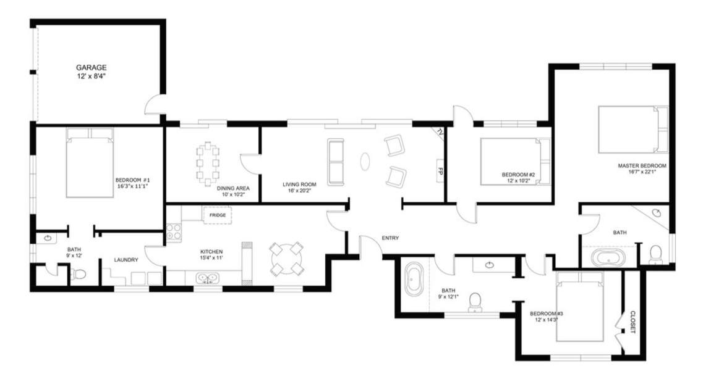

# SSCP - Housing

# Housing

DECISION:

2 houses:

1701 Valparaiso Avenue, Menlo Park, CA 94025, United States

https://zeusliving.com/listings/1701-valparaiso-avenue-menlo-park-ca

    paid ~$9000 March 10

    to pay ~$14000

    sleeps 10

179 E Creek Drive, Menlo Park, CA

    paid $14750 (full amount) March 16

    sleeps 7

Total cost: $39000 --> $30000 after subsidy --> $9000/16 people = $562.50 for the summer each

Summer House Interest:

### Embedded Content

Embedded content: [Custom embed]()

<iframe width="100%" height="400" src="" frameborder="0"></iframe>

Ashe

Kate Pregler

02/16:

* Met with ResEd Housing AssignmentsAdvisor needs to email in ~August with the list of people who will be away Fall Quarter to secure return-from-abroad priority for themWe can all enter the summer draw in groups of up to 4 and coordinated group names (ie "solarcar1", "solarcar2"...) to attempt to get put together
* Advisor needs to email in ~August with the list of people who will be away Fall Quarter to secure return-from-abroad priority for them
* We can all enter the summer draw in groups of up to 4 and coordinated group names (ie "solarcar1", "solarcar2"...) to attempt to get put together

Met with ResEd Housing Assignments

* Advisor needs to email in ~August with the list of people who will be away Fall Quarter to secure return-from-abroad priority for them
* We can all enter the summer draw in groups of up to 4 and coordinated group names (ie "solarcar1", "solarcar2"...) to attempt to get put together

Advisor needs to email in ~August with the list of people who will be away Fall Quarter to secure return-from-abroad priority for them

We can all enter the summer draw in groups of up to 4 and coordinated group names (ie "solarcar1", "solarcar2"...) to attempt to get put together

01/18:

* Budgeted $30,000Found a house in Sharon Heights for $18,999 for the summer, sleeps 10Proposed: 10 people, fully paid rent, plus $1890 given to each other person on stipend as rent assistanceThis would work out to $1890*6 = $11,340 so we'd be about our budget and everyone would get a major rent subsidyAlternatively, subsidize something less and have people pay somethingie $1500 * 16 = $24,000 paid by the team, with $300 full summer rent for the 10 in the houseNOT ACTUALLY AVAILABLE
* Budgeted $30,000
* Found a house in Sharon Heights for $18,999 for the summer, sleeps 10Proposed: 10 people, fully paid rent, plus $1890 given to each other person on stipend as rent assistanceThis would work out to $1890*6 = $11,340 so we'd be about our budget and everyone would get a major rent subsidyAlternatively, subsidize something less and have people pay somethingie $1500 * 16 = $24,000 paid by the team, with $300 full summer rent for the 10 in the houseNOT ACTUALLY AVAILABLE
* Proposed: 10 people, fully paid rent, plus $1890 given to each other person on stipend as rent assistance
* This would work out to $1890*6 = $11,340 so we'd be about our budget and everyone would get a major rent subsidy
* Alternatively, subsidize something less and have people pay somethingie $1500 * 16 = $24,000 paid by the team, with $300 full summer rent for the 10 in the house
* ie $1500 * 16 = $24,000 paid by the team, with $300 full summer rent for the 10 in the house
* NOT ACTUALLY AVAILABLE

* Budgeted $30,000
* Found a house in Sharon Heights for $18,999 for the summer, sleeps 10Proposed: 10 people, fully paid rent, plus $1890 given to each other person on stipend as rent assistanceThis would work out to $1890*6 = $11,340 so we'd be about our budget and everyone would get a major rent subsidyAlternatively, subsidize something less and have people pay somethingie $1500 * 16 = $24,000 paid by the team, with $300 full summer rent for the 10 in the houseNOT ACTUALLY AVAILABLE
* Proposed: 10 people, fully paid rent, plus $1890 given to each other person on stipend as rent assistance
* This would work out to $1890*6 = $11,340 so we'd be about our budget and everyone would get a major rent subsidy
* Alternatively, subsidize something less and have people pay somethingie $1500 * 16 = $24,000 paid by the team, with $300 full summer rent for the 10 in the house
* ie $1500 * 16 = $24,000 paid by the team, with $300 full summer rent for the 10 in the house
* NOT ACTUALLY AVAILABLE

Budgeted $30,000

Found a house in Sharon Heights for $18,999 for the summer, sleeps 10

[a house in Sharon Heights](https://www.homeaway.com/vacation-rental/p628417vb?utm_campaign=HAUS_TRV_PAY_HASC_paymentrequest_PPS&utm_content=propid_text_o_lprop&utm_term=20161028&utm_source=SYS&utm_medium=email)

* Proposed: 10 people, fully paid rent, plus $1890 given to each other person on stipend as rent assistance
* This would work out to $1890*6 = $11,340 so we'd be about our budget and everyone would get a major rent subsidy
* Alternatively, subsidize something less and have people pay somethingie $1500 * 16 = $24,000 paid by the team, with $300 full summer rent for the 10 in the house
* ie $1500 * 16 = $24,000 paid by the team, with $300 full summer rent for the 10 in the house
* NOT ACTUALLY AVAILABLE

Proposed: 10 people, fully paid rent, plus $1890 given to each other person on stipend as rent assistance

This would work out to $1890*6 = $11,340 so we'd be about our budget and everyone would get a major rent subsidy

Alternatively, subsidize something less and have people pay something

* ie $1500 * 16 = $24,000 paid by the team, with $300 full summer rent for the 10 in the house

ie $1500 * 16 = $24,000 paid by the team, with $300 full summer rent for the 10 in the house

NOT ACTUALLY AVAILABLE

### Embedded Google Drive File

Google Drive File: [Embedded Content](https://drive.google.com/embeddedfolderview?id=1Ehnq8htwd3Mf_L7_5I3iCOY2ZdrxWjLK#list)

<iframe width="100%" height="400" src="https://drive.google.com/embeddedfolderview?id=1Ehnq8htwd3Mf_L7_5I3iCOY2ZdrxWjLK#list" frameborder="0"></iframe>

