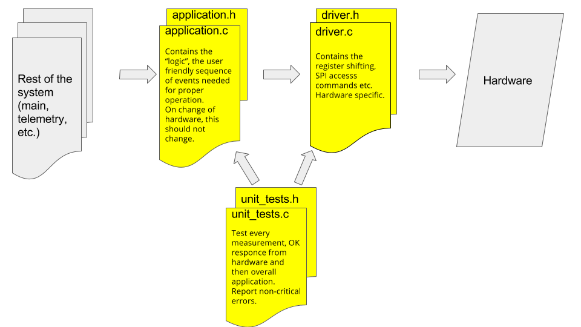

# SSCP - Code Structure

# Code Structure

Here's how the code should be structure for every new project. You should end up with 6 files.

We decided on the above structure in order to improve readability, maintainability and reliability. It is a work in progress. Below are the notes from that meeting:

* Super-high-level architecture (device and application layers)Breakdown of work (who is doing what, and when? What can we do before boards are done?)Reuse of code from Arctan and earlier (What should we reuse, and how do we make the call besides "it seems like a good idea'?)MISRA C standards + other standardsGet IAR to include MISRA checker in our license (done)Variable and (public) function naming procedures: include layer_path_filename at the beginningDevice drivers to make code more portable and easier to debug (but a little more code)Unit tests:Full unit tests may be too much workAny other more lightweight option?Code review procedure (at Tesla every bit of code is reviewed/read by at least two people and preferably everyone -- should we institute something similar, and if so, how? When and how frequently should we have alums review code? At least I think someone from the five of us should review everything by the newer members, and probably/definitely a lot more)Peloton:Lots of people review itTesla:Reviewed by senior firmware engineersShould we do this?Should we do this here?Are we doing this the right way?Is the code written neatly/nicely/following guidelines?(up to the author and the testing team to make sure it works)Google:Reviewed by the owner of the fileStyle guides, functionalityBrandon’s job:Tested by two peopleMultiple machinesAudited by bossFacebook:Have to specify exactly how to test and what the results should beSOLAR CAR?DesignAPIs for application layer to interact with device layer (drivers)Coding standardsTestingTime is the biggest factor in determining how we testSome projects are hard to testBasic testing layer (input -> output testing), then tailor more tests to the code at handFor every example.c file, have an example_test.c file in a different folderHave an example test file (w/ instructions on how to modify it to test your code)ReviewPre codingAny time new code is being written, programmer should sit down with a senior member and go over:Should this be written?Should this be written here?How to test it?Post codingHave at least 2 senior members review all code that goes on carPull in alumni for review of large projectsAdd alumni to githubReview process:Does it work? (functionality review)Could it be faster? (efficiency review)Does it look pretty (style review)Is there a proper testing procedure?
* Breakdown of work (who is doing what, and when? What can we do before boards are done?)
* Reuse of code from Arctan and earlier (What should we reuse, and how do we make the call besides "it seems like a good idea'?)
* MISRA C standards + other standardsGet IAR to include MISRA checker in our license (done)Variable and (public) function naming procedures: include layer_path_filename at the beginningDevice drivers to make code more portable and easier to debug (but a little more code)Unit tests:Full unit tests may be too much workAny other more lightweight option?
* Get IAR to include MISRA checker in our license (done)
* Variable and (public) function naming procedures: include layer_path_filename at the beginning
* Device drivers to make code more portable and easier to debug (but a little more code)
* Unit tests:Full unit tests may be too much workAny other more lightweight option?
* Full unit tests may be too much work
* Any other more lightweight option?
* Code review procedure (at Tesla every bit of code is reviewed/read by at least two people and preferably everyone -- should we institute something similar, and if so, how? When and how frequently should we have alums review code? At least I think someone from the five of us should review everything by the newer members, and probably/definitely a lot more)Peloton:Lots of people review itTesla:Reviewed by senior firmware engineersShould we do this?Should we do this here?Are we doing this the right way?Is the code written neatly/nicely/following guidelines?(up to the author and the testing team to make sure it works)Google:Reviewed by the owner of the fileStyle guides, functionalityBrandon’s job:Tested by two peopleMultiple machinesAudited by bossFacebook:Have to specify exactly how to test and what the results should beSOLAR CAR?DesignAPIs for application layer to interact with device layer (drivers)Coding standardsTestingTime is the biggest factor in determining how we testSome projects are hard to testBasic testing layer (input -> output testing), then tailor more tests to the code at handFor every example.c file, have an example_test.c file in a different folderHave an example test file (w/ instructions on how to modify it to test your code)ReviewPre codingAny time new code is being written, programmer should sit down with a senior member and go over:Should this be written?Should this be written here?How to test it?Post codingHave at least 2 senior members review all code that goes on carPull in alumni for review of large projectsAdd alumni to githubReview process:Does it work? (functionality review)Could it be faster? (efficiency review)Does it look pretty (style review)Is there a proper testing procedure?
* Peloton:Lots of people review it
* Lots of people review it
* Tesla:Reviewed by senior firmware engineersShould we do this?Should we do this here?Are we doing this the right way?Is the code written neatly/nicely/following guidelines?(up to the author and the testing team to make sure it works)
* Reviewed by senior firmware engineers
* Should we do this?
* Should we do this here?
* Are we doing this the right way?
* Is the code written neatly/nicely/following guidelines?
* (up to the author and the testing team to make sure it works)
* Google:Reviewed by the owner of the fileStyle guides, functionality
* Reviewed by the owner of the file
* Style guides, functionality
* Brandon’s job:Tested by two peopleMultiple machinesAudited by boss
* Tested by two peopleMultiple machines
* Multiple machines
* Audited by boss
* Facebook:Have to specify exactly how to test and what the results should be
* Have to specify exactly how to test and what the results should be
* SOLAR CAR?DesignAPIs for application layer to interact with device layer (drivers)Coding standardsTestingTime is the biggest factor in determining how we testSome projects are hard to testBasic testing layer (input -> output testing), then tailor more tests to the code at handFor every example.c file, have an example_test.c file in a different folderHave an example test file (w/ instructions on how to modify it to test your code)ReviewPre codingAny time new code is being written, programmer should sit down with a senior member and go over:Should this be written?Should this be written here?How to test it?Post codingHave at least 2 senior members review all code that goes on carPull in alumni for review of large projectsAdd alumni to githubReview process:Does it work? (functionality review)Could it be faster? (efficiency review)Does it look pretty (style review)Is there a proper testing procedure?
* DesignAPIs for application layer to interact with device layer (drivers)
* APIs for application layer to interact with device layer (drivers)
* Coding standards
* TestingTime is the biggest factor in determining how we testSome projects are hard to testBasic testing layer (input -> output testing), then tailor more tests to the code at handFor every example.c file, have an example_test.c file in a different folderHave an example test file (w/ instructions on how to modify it to test your code)
* Time is the biggest factor in determining how we test
* Some projects are hard to test
* Basic testing layer (input -> output testing), then tailor more tests to the code at handFor every example.c file, have an example_test.c file in a different folderHave an example test file (w/ instructions on how to modify it to test your code)
* For every example.c file, have an example_test.c file in a different folder
* Have an example test file (w/ instructions on how to modify it to test your code)
* ReviewPre codingAny time new code is being written, programmer should sit down with a senior member and go over:Should this be written?Should this be written here?How to test it?Post codingHave at least 2 senior members review all code that goes on carPull in alumni for review of large projectsAdd alumni to githubReview process:Does it work? (functionality review)Could it be faster? (efficiency review)Does it look pretty (style review)Is there a proper testing procedure?
* Pre codingAny time new code is being written, programmer should sit down with a senior member and go over:Should this be written?Should this be written here?How to test it?
* Any time new code is being written, programmer should sit down with a senior member and go over:Should this be written?Should this be written here?How to test it?
* Should this be written?
* Should this be written here?
* How to test it?
* Post codingHave at least 2 senior members review all code that goes on carPull in alumni for review of large projectsAdd alumni to githubReview process:Does it work? (functionality review)Could it be faster? (efficiency review)Does it look pretty (style review)Is there a proper testing procedure?
* Have at least 2 senior members review all code that goes on car
* Pull in alumni for review of large projectsAdd alumni to github
* Add alumni to github
* Review process:Does it work? (functionality review)Could it be faster? (efficiency review)Does it look pretty (style review)Is there a proper testing procedure?
* Does it work? (functionality review)
* Could it be faster? (efficiency review)
* Does it look pretty (style review)
* Is there a proper testing procedure?

Super-high-level architecture (device and application layers)

* Breakdown of work (who is doing what, and when? What can we do before boards are done?)
* Reuse of code from Arctan and earlier (What should we reuse, and how do we make the call besides "it seems like a good idea'?)
* MISRA C standards + other standardsGet IAR to include MISRA checker in our license (done)Variable and (public) function naming procedures: include layer_path_filename at the beginningDevice drivers to make code more portable and easier to debug (but a little more code)Unit tests:Full unit tests may be too much workAny other more lightweight option?
* Get IAR to include MISRA checker in our license (done)
* Variable and (public) function naming procedures: include layer_path_filename at the beginning
* Device drivers to make code more portable and easier to debug (but a little more code)
* Unit tests:Full unit tests may be too much workAny other more lightweight option?
* Full unit tests may be too much work
* Any other more lightweight option?
* Code review procedure (at Tesla every bit of code is reviewed/read by at least two people and preferably everyone -- should we institute something similar, and if so, how? When and how frequently should we have alums review code? At least I think someone from the five of us should review everything by the newer members, and probably/definitely a lot more)Peloton:Lots of people review itTesla:Reviewed by senior firmware engineersShould we do this?Should we do this here?Are we doing this the right way?Is the code written neatly/nicely/following guidelines?(up to the author and the testing team to make sure it works)Google:Reviewed by the owner of the fileStyle guides, functionalityBrandon’s job:Tested by two peopleMultiple machinesAudited by bossFacebook:Have to specify exactly how to test and what the results should beSOLAR CAR?DesignAPIs for application layer to interact with device layer (drivers)Coding standardsTestingTime is the biggest factor in determining how we testSome projects are hard to testBasic testing layer (input -> output testing), then tailor more tests to the code at handFor every example.c file, have an example_test.c file in a different folderHave an example test file (w/ instructions on how to modify it to test your code)ReviewPre codingAny time new code is being written, programmer should sit down with a senior member and go over:Should this be written?Should this be written here?How to test it?Post codingHave at least 2 senior members review all code that goes on carPull in alumni for review of large projectsAdd alumni to githubReview process:Does it work? (functionality review)Could it be faster? (efficiency review)Does it look pretty (style review)Is there a proper testing procedure?
* Peloton:Lots of people review it
* Lots of people review it
* Tesla:Reviewed by senior firmware engineersShould we do this?Should we do this here?Are we doing this the right way?Is the code written neatly/nicely/following guidelines?(up to the author and the testing team to make sure it works)
* Reviewed by senior firmware engineers
* Should we do this?
* Should we do this here?
* Are we doing this the right way?
* Is the code written neatly/nicely/following guidelines?
* (up to the author and the testing team to make sure it works)
* Google:Reviewed by the owner of the fileStyle guides, functionality
* Reviewed by the owner of the file
* Style guides, functionality
* Brandon’s job:Tested by two peopleMultiple machinesAudited by boss
* Tested by two peopleMultiple machines
* Multiple machines
* Audited by boss
* Facebook:Have to specify exactly how to test and what the results should be
* Have to specify exactly how to test and what the results should be
* SOLAR CAR?DesignAPIs for application layer to interact with device layer (drivers)Coding standardsTestingTime is the biggest factor in determining how we testSome projects are hard to testBasic testing layer (input -> output testing), then tailor more tests to the code at handFor every example.c file, have an example_test.c file in a different folderHave an example test file (w/ instructions on how to modify it to test your code)ReviewPre codingAny time new code is being written, programmer should sit down with a senior member and go over:Should this be written?Should this be written here?How to test it?Post codingHave at least 2 senior members review all code that goes on carPull in alumni for review of large projectsAdd alumni to githubReview process:Does it work? (functionality review)Could it be faster? (efficiency review)Does it look pretty (style review)Is there a proper testing procedure?
* DesignAPIs for application layer to interact with device layer (drivers)
* APIs for application layer to interact with device layer (drivers)
* Coding standards
* TestingTime is the biggest factor in determining how we testSome projects are hard to testBasic testing layer (input -> output testing), then tailor more tests to the code at handFor every example.c file, have an example_test.c file in a different folderHave an example test file (w/ instructions on how to modify it to test your code)
* Time is the biggest factor in determining how we test
* Some projects are hard to test
* Basic testing layer (input -> output testing), then tailor more tests to the code at handFor every example.c file, have an example_test.c file in a different folderHave an example test file (w/ instructions on how to modify it to test your code)
* For every example.c file, have an example_test.c file in a different folder
* Have an example test file (w/ instructions on how to modify it to test your code)
* ReviewPre codingAny time new code is being written, programmer should sit down with a senior member and go over:Should this be written?Should this be written here?How to test it?Post codingHave at least 2 senior members review all code that goes on carPull in alumni for review of large projectsAdd alumni to githubReview process:Does it work? (functionality review)Could it be faster? (efficiency review)Does it look pretty (style review)Is there a proper testing procedure?
* Pre codingAny time new code is being written, programmer should sit down with a senior member and go over:Should this be written?Should this be written here?How to test it?
* Any time new code is being written, programmer should sit down with a senior member and go over:Should this be written?Should this be written here?How to test it?
* Should this be written?
* Should this be written here?
* How to test it?
* Post codingHave at least 2 senior members review all code that goes on carPull in alumni for review of large projectsAdd alumni to githubReview process:Does it work? (functionality review)Could it be faster? (efficiency review)Does it look pretty (style review)Is there a proper testing procedure?
* Have at least 2 senior members review all code that goes on car
* Pull in alumni for review of large projectsAdd alumni to github
* Add alumni to github
* Review process:Does it work? (functionality review)Could it be faster? (efficiency review)Does it look pretty (style review)Is there a proper testing procedure?
* Does it work? (functionality review)
* Could it be faster? (efficiency review)
* Does it look pretty (style review)
* Is there a proper testing procedure?

Breakdown of work (who is doing what, and when? What can we do before boards are done?)

Reuse of code from Arctan and earlier (What should we reuse, and how do we make the call besides "it seems like a good idea'?)

MISRA C standards + other standards

* Get IAR to include MISRA checker in our license (done)
* Variable and (public) function naming procedures: include layer_path_filename at the beginning
* Device drivers to make code more portable and easier to debug (but a little more code)
* Unit tests:Full unit tests may be too much workAny other more lightweight option?
* Full unit tests may be too much work
* Any other more lightweight option?

Get IAR to include MISRA checker in our license (done)

Variable and (public) function naming procedures: include layer_path_filename at the beginning

Device drivers to make code more portable and easier to debug (but a little more code)

Unit tests:

* Full unit tests may be too much work
* Any other more lightweight option?

Full unit tests may be too much work

Any other more lightweight option?

Code review procedure (at Tesla every bit of code is reviewed/read by at least two people and preferably everyone -- should we institute something similar, and if so, how? When and how frequently should we have alums review code? At least I think someone from the five of us should review everything by the newer members, and probably/definitely a lot more)

* Peloton:Lots of people review it
* Lots of people review it
* Tesla:Reviewed by senior firmware engineersShould we do this?Should we do this here?Are we doing this the right way?Is the code written neatly/nicely/following guidelines?(up to the author and the testing team to make sure it works)
* Reviewed by senior firmware engineers
* Should we do this?
* Should we do this here?
* Are we doing this the right way?
* Is the code written neatly/nicely/following guidelines?
* (up to the author and the testing team to make sure it works)
* Google:Reviewed by the owner of the fileStyle guides, functionality
* Reviewed by the owner of the file
* Style guides, functionality
* Brandon’s job:Tested by two peopleMultiple machinesAudited by boss
* Tested by two peopleMultiple machines
* Multiple machines
* Audited by boss
* Facebook:Have to specify exactly how to test and what the results should be
* Have to specify exactly how to test and what the results should be
* SOLAR CAR?DesignAPIs for application layer to interact with device layer (drivers)Coding standardsTestingTime is the biggest factor in determining how we testSome projects are hard to testBasic testing layer (input -> output testing), then tailor more tests to the code at handFor every example.c file, have an example_test.c file in a different folderHave an example test file (w/ instructions on how to modify it to test your code)ReviewPre codingAny time new code is being written, programmer should sit down with a senior member and go over:Should this be written?Should this be written here?How to test it?Post codingHave at least 2 senior members review all code that goes on carPull in alumni for review of large projectsAdd alumni to githubReview process:Does it work? (functionality review)Could it be faster? (efficiency review)Does it look pretty (style review)Is there a proper testing procedure?
* DesignAPIs for application layer to interact with device layer (drivers)
* APIs for application layer to interact with device layer (drivers)
* Coding standards
* TestingTime is the biggest factor in determining how we testSome projects are hard to testBasic testing layer (input -> output testing), then tailor more tests to the code at handFor every example.c file, have an example_test.c file in a different folderHave an example test file (w/ instructions on how to modify it to test your code)
* Time is the biggest factor in determining how we test
* Some projects are hard to test
* Basic testing layer (input -> output testing), then tailor more tests to the code at handFor every example.c file, have an example_test.c file in a different folderHave an example test file (w/ instructions on how to modify it to test your code)
* For every example.c file, have an example_test.c file in a different folder
* Have an example test file (w/ instructions on how to modify it to test your code)
* ReviewPre codingAny time new code is being written, programmer should sit down with a senior member and go over:Should this be written?Should this be written here?How to test it?Post codingHave at least 2 senior members review all code that goes on carPull in alumni for review of large projectsAdd alumni to githubReview process:Does it work? (functionality review)Could it be faster? (efficiency review)Does it look pretty (style review)Is there a proper testing procedure?
* Pre codingAny time new code is being written, programmer should sit down with a senior member and go over:Should this be written?Should this be written here?How to test it?
* Any time new code is being written, programmer should sit down with a senior member and go over:Should this be written?Should this be written here?How to test it?
* Should this be written?
* Should this be written here?
* How to test it?
* Post codingHave at least 2 senior members review all code that goes on carPull in alumni for review of large projectsAdd alumni to githubReview process:Does it work? (functionality review)Could it be faster? (efficiency review)Does it look pretty (style review)Is there a proper testing procedure?
* Have at least 2 senior members review all code that goes on car
* Pull in alumni for review of large projectsAdd alumni to github
* Add alumni to github
* Review process:Does it work? (functionality review)Could it be faster? (efficiency review)Does it look pretty (style review)Is there a proper testing procedure?
* Does it work? (functionality review)
* Could it be faster? (efficiency review)
* Does it look pretty (style review)
* Is there a proper testing procedure?

Peloton:

* Lots of people review it

Lots of people review it

Tesla:

* Reviewed by senior firmware engineers
* Should we do this?
* Should we do this here?
* Are we doing this the right way?
* Is the code written neatly/nicely/following guidelines?
* (up to the author and the testing team to make sure it works)

Reviewed by senior firmware engineers

Should we do this?

Should we do this here?

Are we doing this the right way?

Is the code written neatly/nicely/following guidelines?

(up to the author and the testing team to make sure it works)

Google:

* Reviewed by the owner of the file
* Style guides, functionality

Reviewed by the owner of the file

Style guides, functionality

Brandon’s job:

* Tested by two peopleMultiple machines
* Multiple machines
* Audited by boss

Tested by two people

* Multiple machines

Multiple machines

Audited by boss

Facebook:

* Have to specify exactly how to test and what the results should be

Have to specify exactly how to test and what the results should be

SOLAR CAR?

* DesignAPIs for application layer to interact with device layer (drivers)
* APIs for application layer to interact with device layer (drivers)
* Coding standards
* TestingTime is the biggest factor in determining how we testSome projects are hard to testBasic testing layer (input -> output testing), then tailor more tests to the code at handFor every example.c file, have an example_test.c file in a different folderHave an example test file (w/ instructions on how to modify it to test your code)
* Time is the biggest factor in determining how we test
* Some projects are hard to test
* Basic testing layer (input -> output testing), then tailor more tests to the code at handFor every example.c file, have an example_test.c file in a different folderHave an example test file (w/ instructions on how to modify it to test your code)
* For every example.c file, have an example_test.c file in a different folder
* Have an example test file (w/ instructions on how to modify it to test your code)
* ReviewPre codingAny time new code is being written, programmer should sit down with a senior member and go over:Should this be written?Should this be written here?How to test it?Post codingHave at least 2 senior members review all code that goes on carPull in alumni for review of large projectsAdd alumni to githubReview process:Does it work? (functionality review)Could it be faster? (efficiency review)Does it look pretty (style review)Is there a proper testing procedure?
* Pre codingAny time new code is being written, programmer should sit down with a senior member and go over:Should this be written?Should this be written here?How to test it?
* Any time new code is being written, programmer should sit down with a senior member and go over:Should this be written?Should this be written here?How to test it?
* Should this be written?
* Should this be written here?
* How to test it?
* Post codingHave at least 2 senior members review all code that goes on carPull in alumni for review of large projectsAdd alumni to githubReview process:Does it work? (functionality review)Could it be faster? (efficiency review)Does it look pretty (style review)Is there a proper testing procedure?
* Have at least 2 senior members review all code that goes on car
* Pull in alumni for review of large projectsAdd alumni to github
* Add alumni to github
* Review process:Does it work? (functionality review)Could it be faster? (efficiency review)Does it look pretty (style review)Is there a proper testing procedure?
* Does it work? (functionality review)
* Could it be faster? (efficiency review)
* Does it look pretty (style review)
* Is there a proper testing procedure?

Design

* APIs for application layer to interact with device layer (drivers)

APIs for application layer to interact with device layer (drivers)

Coding standards

Testing

* Time is the biggest factor in determining how we test
* Some projects are hard to test
* Basic testing layer (input -> output testing), then tailor more tests to the code at handFor every example.c file, have an example_test.c file in a different folderHave an example test file (w/ instructions on how to modify it to test your code)
* For every example.c file, have an example_test.c file in a different folder
* Have an example test file (w/ instructions on how to modify it to test your code)

Time is the biggest factor in determining how we test

Some projects are hard to test

Basic testing layer (input -> output testing), then tailor more tests to the code at hand

* For every example.c file, have an example_test.c file in a different folder
* Have an example test file (w/ instructions on how to modify it to test your code)

For every example.c file, have an example_test.c file in a different folder

Have an example test file (w/ instructions on how to modify it to test your code)

Review

* Pre codingAny time new code is being written, programmer should sit down with a senior member and go over:Should this be written?Should this be written here?How to test it?
* Any time new code is being written, programmer should sit down with a senior member and go over:Should this be written?Should this be written here?How to test it?
* Should this be written?
* Should this be written here?
* How to test it?
* Post codingHave at least 2 senior members review all code that goes on carPull in alumni for review of large projectsAdd alumni to githubReview process:Does it work? (functionality review)Could it be faster? (efficiency review)Does it look pretty (style review)Is there a proper testing procedure?
* Have at least 2 senior members review all code that goes on car
* Pull in alumni for review of large projectsAdd alumni to github
* Add alumni to github
* Review process:Does it work? (functionality review)Could it be faster? (efficiency review)Does it look pretty (style review)Is there a proper testing procedure?
* Does it work? (functionality review)
* Could it be faster? (efficiency review)
* Does it look pretty (style review)
* Is there a proper testing procedure?

Pre coding

* Any time new code is being written, programmer should sit down with a senior member and go over:Should this be written?Should this be written here?How to test it?
* Should this be written?
* Should this be written here?
* How to test it?

Any time new code is being written, programmer should sit down with a senior member and go over:

* Should this be written?
* Should this be written here?
* How to test it?

Should this be written?

Should this be written here?

How to test it?

Post coding

* Have at least 2 senior members review all code that goes on car
* Pull in alumni for review of large projectsAdd alumni to github
* Add alumni to github
* Review process:Does it work? (functionality review)Could it be faster? (efficiency review)Does it look pretty (style review)Is there a proper testing procedure?
* Does it work? (functionality review)
* Could it be faster? (efficiency review)
* Does it look pretty (style review)
* Is there a proper testing procedure?

Have at least 2 senior members review all code that goes on car

Pull in alumni for review of large projects

* Add alumni to github

Add alumni to github

Review process:

* Does it work? (functionality review)
* Could it be faster? (efficiency review)
* Does it look pretty (style review)
* Is there a proper testing procedure?

Does it work? (functionality review)

Could it be faster? (efficiency review)

Does it look pretty (style review)

Is there a proper testing procedure?

Creating a collection of articles about C (for people who have not taken 107 - and even those who have)

Discussion with new code members about time commitment and what you learn and what you get out of it?

Kelsey and Gawan got their internships (Tesla and Peloton) because of solar car firmware work and can do the work solely because of their experiences writing code for solar car. There is nowhere else at Stanford where you can learn this kind of thing.

