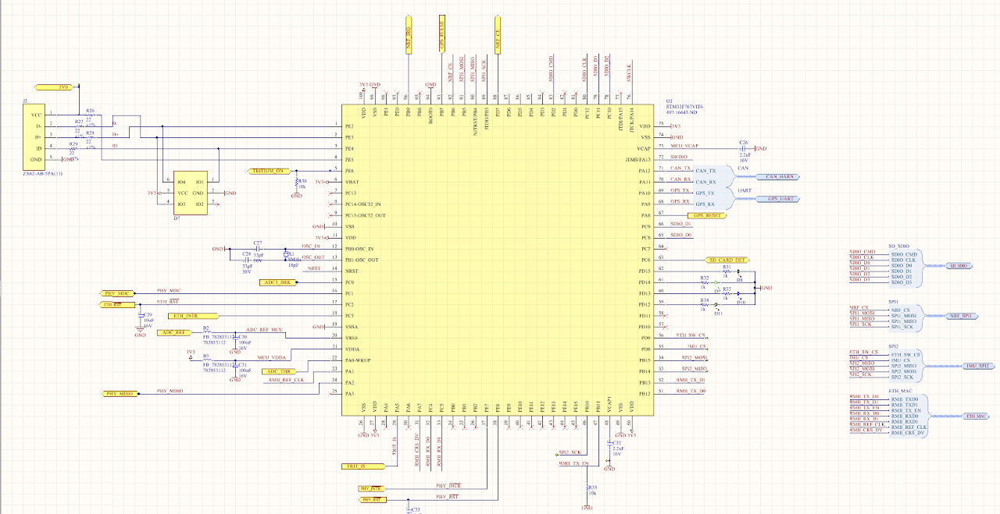

# SSCP - STM32F7xx Boards

# STM32F7xx Boards

Note: make sure you have IAR version 7.80.1. Check this within IAR by navigating to Help -> About -> Product Info. If you don't, you should reinstall IAR.

For the 2017 cycle, we are switching to STM32F7xx microcontrollers from STM32F4xx microcontrollers. This is because the previous STM32F4xx microcontrollers did not have sufficient RAM; the vehicle computer board, which is effectively the old IMU and Driver Controls boards combined, has greater RAM requirements as a result of using more code.

We are currently using two different microcontrollers:

* STM32F767VI: used on the 2017 vehicle computer board.STM32F769NI: for the f7 discovery boards. Not to be confused with the f4 discovery boards.
* STM32F767VI: used on the 2017 vehicle computer board.
* STM32F769NI: for the f7 discovery boards. Not to be confused with the f4 discovery boards.

* STM32F767VI: used on the 2017 vehicle computer board.
* STM32F769NI: for the f7 discovery boards. Not to be confused with the f4 discovery boards.

STM32F767VI: used on the 2017 vehicle computer board.

STM32F769NI: for the f7 discovery boards. Not to be confused with the f4 discovery boards.

Vehicle Computer Board Layout

STM32CubeMX

2/26 note: the code generation may not work as anticipated. We suggest referencing STM's example projects instead of generating code from scratch, available at the link "STM32CubeF7" near the bottom of the page.

[ink "STM32CubeF7"](http://www.st.com/content/st_com/en/products/embedded-software/mcus-embedded-software/stm32-embedded-software/stm32cube-embedded-software/stm32cubef7.html)

STM conveniently provides a code generation application. Visit the page here to download the tool. http://www.st.com/en/development-tools/stm32cubemx.html

[http://www.st.com/en/development-tools/stm32cubemx.html](http://www.st.com/en/development-tools/stm32cubemx.html)

Once you have downloaded the tool:

* Either create a new project, or open one of the following projects (*.ioc) below in the STM32CubeMX application.Modify the settings as necessary:Go to File -> Save Project As...Edit the project name. This will create a separate .ioc file -- each .ioc file corresponds to a distinct IAR project.Go to Project -> Generate Code. Fix any errors as necessary. You should now have a new complete project in IAR!
* Either create a new project, or open one of the following projects (*.ioc) below in the STM32CubeMX application.
* Modify the settings as necessary:Go to File -> Save Project As...Edit the project name. This will create a separate .ioc file -- each .ioc file corresponds to a distinct IAR project.
* Go to File -> Save Project As...
* Edit the project name. This will create a separate .ioc file -- each .ioc file corresponds to a distinct IAR project.
* Go to Project -> Generate Code. Fix any errors as necessary. You should now have a new complete project in IAR!

1. Either create a new project, or open one of the following projects (*.ioc) below in the STM32CubeMX application.
2. Modify the settings as necessary:Go to File -> Save Project As...Edit the project name. This will create a separate .ioc file -- each .ioc file corresponds to a distinct IAR project.
3. Go to File -> Save Project As...
4. Edit the project name. This will create a separate .ioc file -- each .ioc file corresponds to a distinct IAR project.
5. Go to Project -> Generate Code. Fix any errors as necessary. You should now have a new complete project in IAR!

Either create a new project, or open one of the following projects (*.ioc) below in the STM32CubeMX application.

Modify the settings as necessary:

1. Go to File -> Save Project As...
2. Edit the project name. This will create a separate .ioc file -- each .ioc file corresponds to a distinct IAR project.

Go to File -> Save Project As...

Edit the project name. This will create a separate .ioc file -- each .ioc file corresponds to a distinct IAR project.

Go to Project -> Generate Code. Fix any errors as necessary. You should now have a new complete project in IAR!

Notable differences from STM32F4xx boards

* The STM32F4 boards use the standard peripheral libraries (stdlib), while the STM32F7 boards use the HAL drivers. The HAL drivers are apparently simpler.
* Anything else? We're still learning about them.

The STM32F4 boards use the standard peripheral libraries (stdlib), while the STM32F7 boards use the HAL drivers. The HAL drivers are apparently simpler.

Anything else? We're still learning about them.

We're still fiddling around with this, but Harrison (h2o@stanford.edu) has the most information thus far about this, so bug him with questions.

### Embedded Google Drive File

Google Drive File: [Embedded Content](https://drive.google.com/embeddedfolderview?id=1GG9JnNEVz50WmnlYOHTiWmxlXcAqjmgD#list)

<iframe width="100%" height="400" src="https://drive.google.com/embeddedfolderview?id=1GG9JnNEVz50WmnlYOHTiWmxlXcAqjmgD#list" frameborder="0"></iframe>

