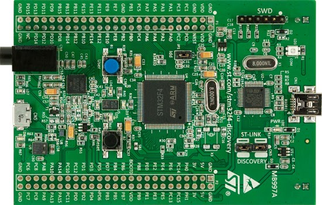
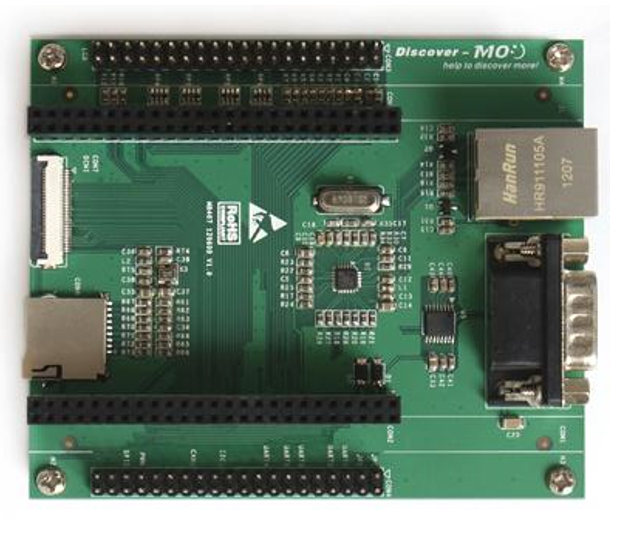

# the-discovery-board

## SSCP - The Discovery Board

## The Discovery Board

The Discovery Board is used for prototyping.  It contains the STM32F4 processor that we use on the boards in our car, with pins exposed.  This allows us to easily hook up external hardware to the board for testing.

See attached datasheet for pin-outs and other information.

The Discovery Extension Base Board attaches to the bottom of the discovery board.  It adds LCD/Camera, SD card, and Ethernet ports. It also better organized UART, I2C, CAN, and SPI pins. Its datasheet and schematic are attached. Taken from here.

[here](https://www.element14.com/community/docs/DOC-51693/l/stm32f4dis-bb-stm32dis-cam-stm32f4dis-lcd-discover-more-schematics)

#### Embedded Google Drive File

Google Drive File: [Embedded Content](https://drive.google.com/embeddedfolderview?id=1YglALfjxZmowZr0OqefQXYlvpFsdFcV0#list)
