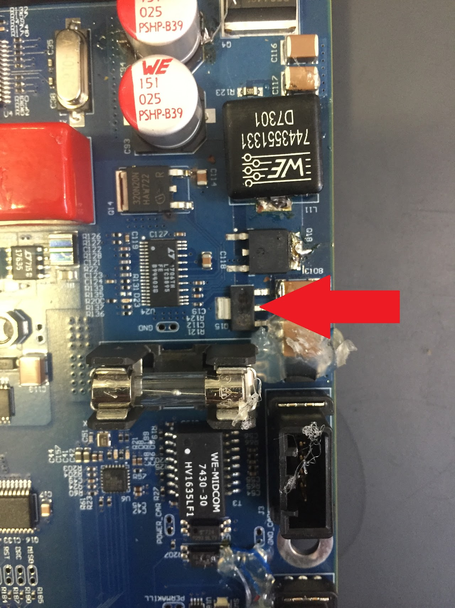
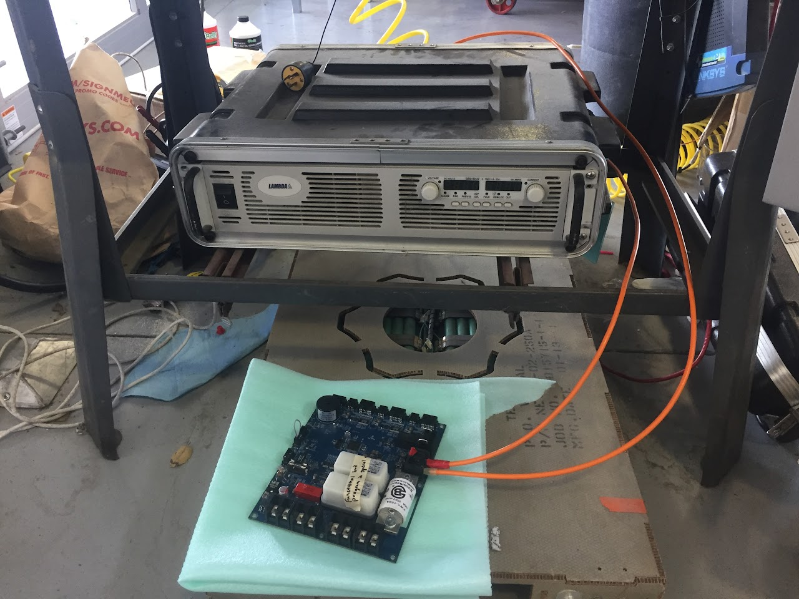
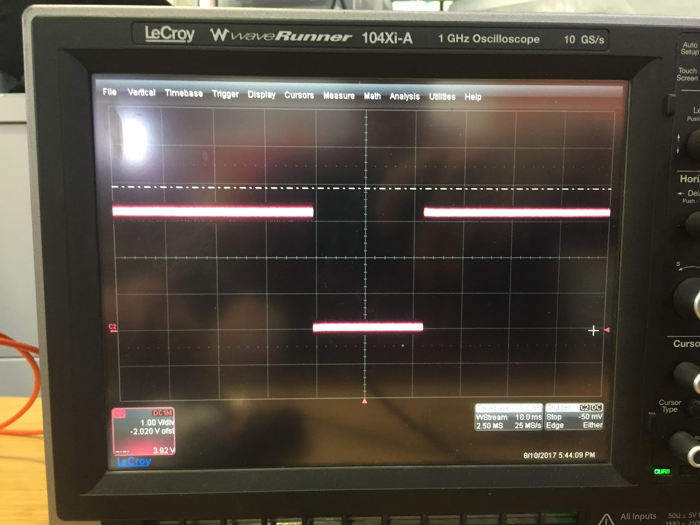
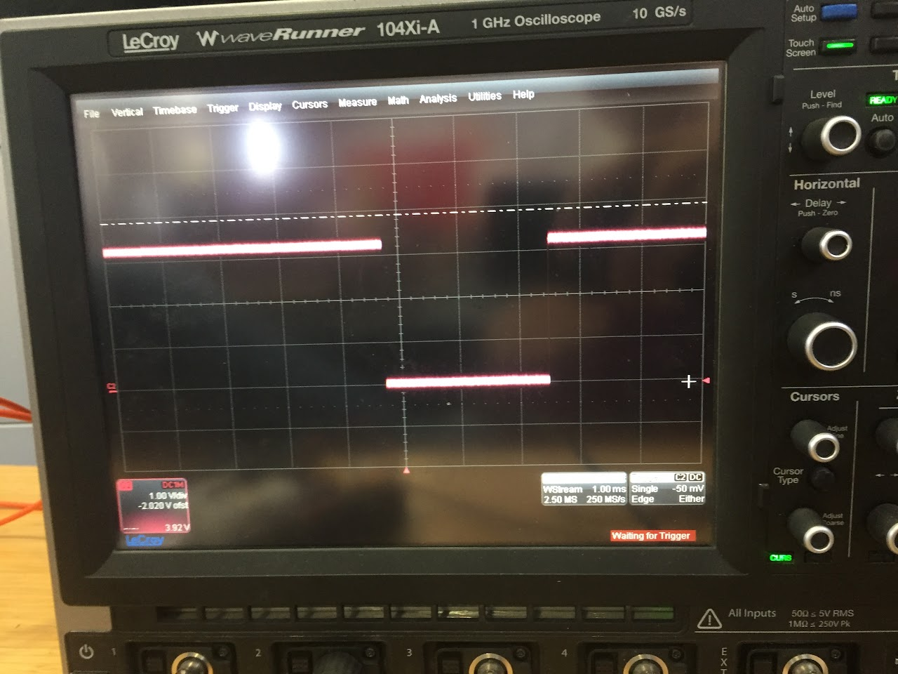

# SSCP - Finicky MCU + 12v Buck Debugging

# Finicky MCU + 12v Buck Debugging

The BMS appears to have two issues.

Issue 1: The 1A, 250V fuse on the 12V bus blows when the car is charging or driving.

History:

Sometime around 8/5: a blue BMS blows the fuse on the 12v output while charging at ~125V, 8A.  The fuse is rated to 1A, 250V.

Sunday,  8/6: During a parking lot test drive, the same fuse blows while braking w/ the topshell on.

Tuesday, 8/8: during a neighborhood test drive the same fuse blows while braking w/ the left blinker on and no topshell.

Tests:

8/10: A blue BMS without the extra capacitors was hooked up to the Lambda power supply.  Voltage was gradually increased from 10V to 130.2V.  Current remained on the order of millivolts.  When the voltage reached ~40V, the board ran through fake precharge without issues.  After sitting for ~10s at ~130.2V, there was a loud pop and a spark somewhere near the 12v bus fuse.  The 12v bus fuse is 5A, 250V and the battery fuse is 1A, 250V.  The Lambda power supply was powered down.  Both fuses remained intact.  

Results and conclusion:  It appears as though the FDT86246 mosfet blew as there is now a crater in its top.  It's possible, however, that this crater was caused by a soldering iron at some point previously.  

[FDT86246](http://www.onsemi.com/pub/Collateral/FDT86246-D.pdf)

  

(left: FDT86246, right: setup)

Issue 2: The MCUs cannot be programmed, or must be programmed with manual resetting.

History:

The week of 8/6: Two of three BMS cannot be programmed normally even though they worked fine when the board first arrived.  When MCUs are replaced, they work once again.  The St-link utility sometimes can connect and erase chip when IAR cannot.

Tests:

8/10: The reset pin voltage was measured on the blue board that can only be programmed with manual resetting as code was flashed from IAR.

Results and conclusion: Reset voltage goes low from 3.3v as expected.  This is the same as the behavior observed when connecting successfully with the ST-link utility.

(left: st-link hardware reset, right: IAR hardware reset)

Why does IAR fail when ST-link succeeds?  Although IAR first successfully executes a hardware reset, it seems to attempt an additional software reset before programming.  The ST-link utility, on the other hand, only performs a hardware reset.  Because the software reset fails IAR fails to flash.  By manually forcing a hardware reset during IAR's attempted software reset, we can coax IAR past this step.

Why does IAR fail the software reset?  It believe this is a problem with the CPU clock.  IAR throws a "could not halt CPU error", and I've seen similar behavior when a chip is accidentally programmed with the wrong clock settings (system_stm32f4xx.c).  Forum posts also support this hypothesis.

[ hypothesis](http://forum.segger.com/index.php?page=Thread&threadID=56)

