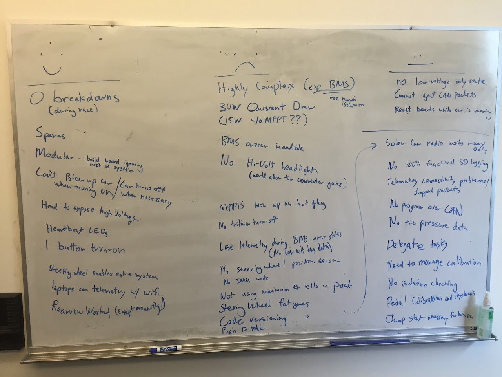
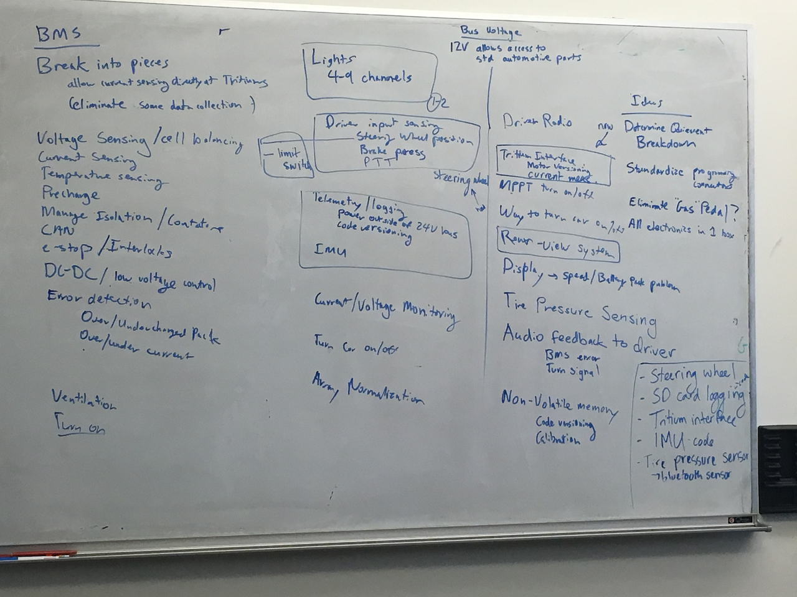

# SSCP - Design meeting 2/28/2016

# Design meeting 2/28/2016

Goods and Bads from Arctan's Electrical System

Above: good, bad, neutral features of the Arctan system.

Below: proposed features of Sundae's electrical system, possible board breakdown denoted by boxes around functions (except for lower right corner).

