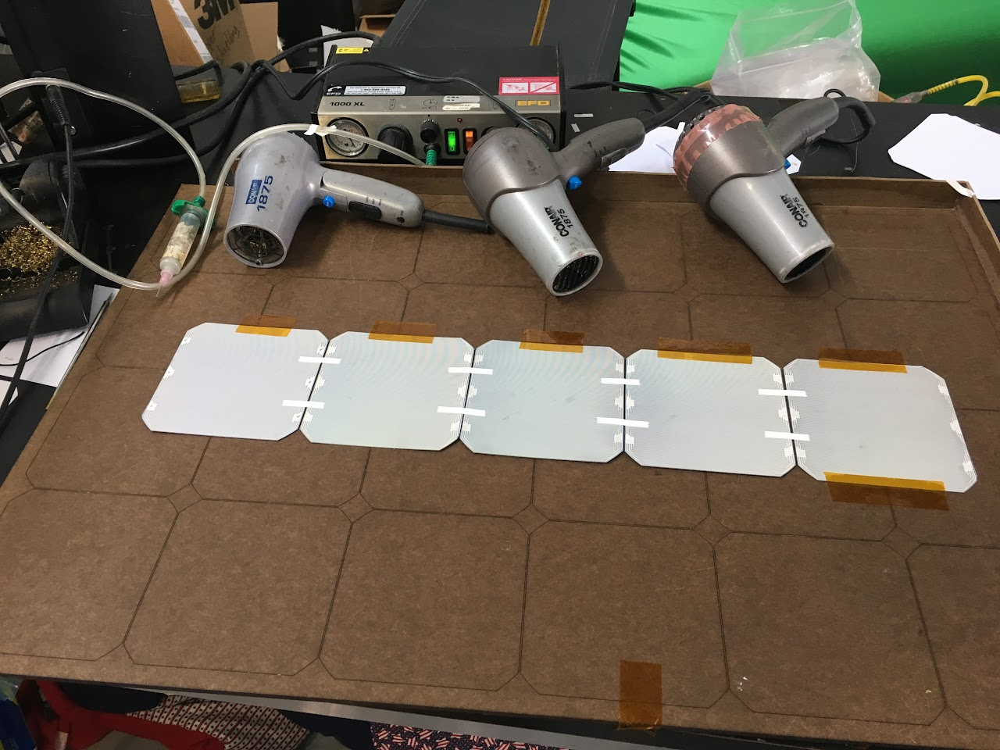
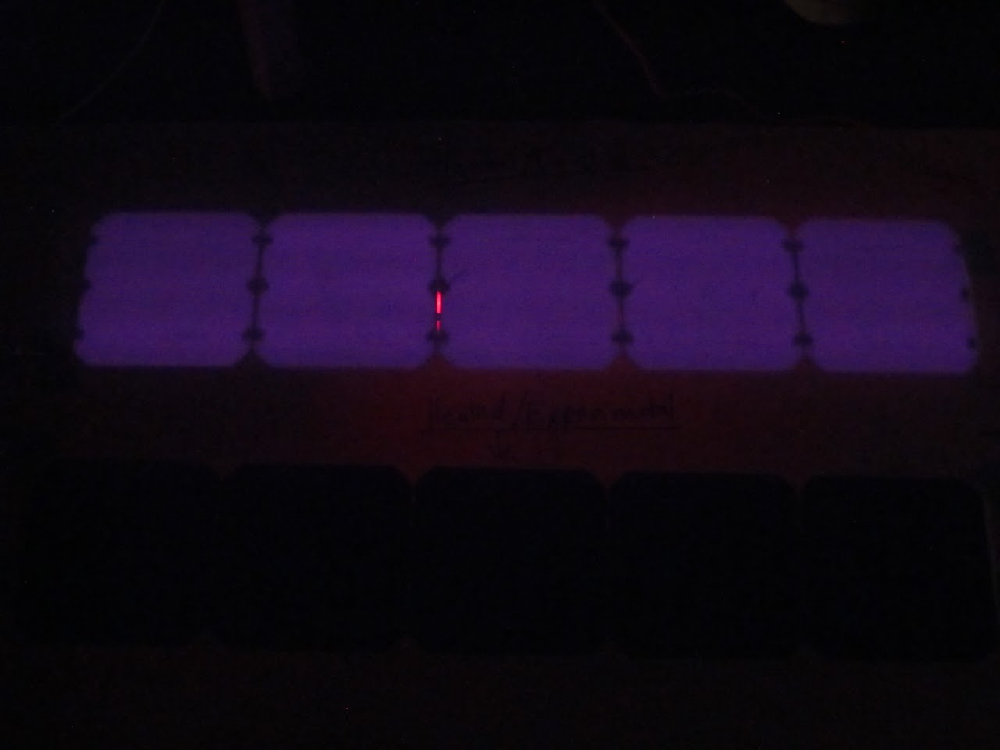
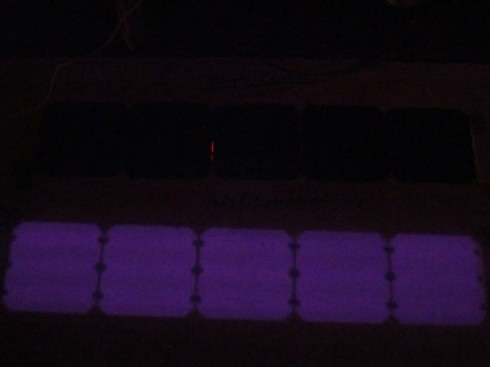

# SSCP - Soldering with Heated Cells

# Soldering with Heated Cells

In March of 2017 we received advice from the array division at SSL to heat our cells before soldering. The idea being that a lower temperature differential would cause less cracking at the solder sites. To test this, we made two groups of five cells to be soldered in series and then EL tested. 

The first was the control group and was soldered as we normally do. For the second group, heat was applied using hairdryers. We allowed each cell to warm for a few minutes before applying the soldering iron. One unforeseen factor of this heating method is that the hot air from the hairdryers caused more solder paste to be dispensed. 

From EL testing, the unheated group had two noticeable cracks (on different cells) stemming from solder sites. The heated group of cells had no such noticeable cracks. 

Based on the results of this test, we will explore a heating element for the solder tray that is currently being designed. For this purpose, a heating plate may be used. 

Unheated Cells:

Heated Cells:

### Embedded Google Drive File

Google Drive File: [Embedded Content](https://drive.google.com/embeddedfolderview?id=1oNakAk7-72x3Gxoas4L14mk1zy95gsl6#list)

<iframe width="100%" height="400" src="https://drive.google.com/embeddedfolderview?id=1oNakAk7-72x3Gxoas4L14mk1zy95gsl6#list" frameborder="0"></iframe>

