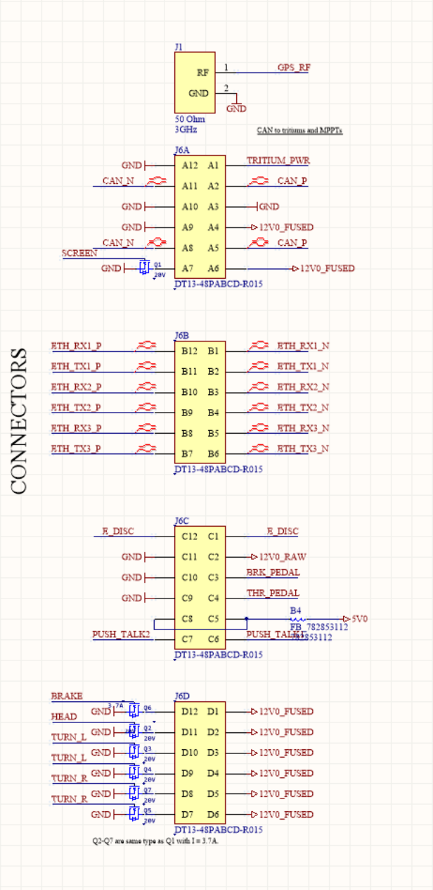
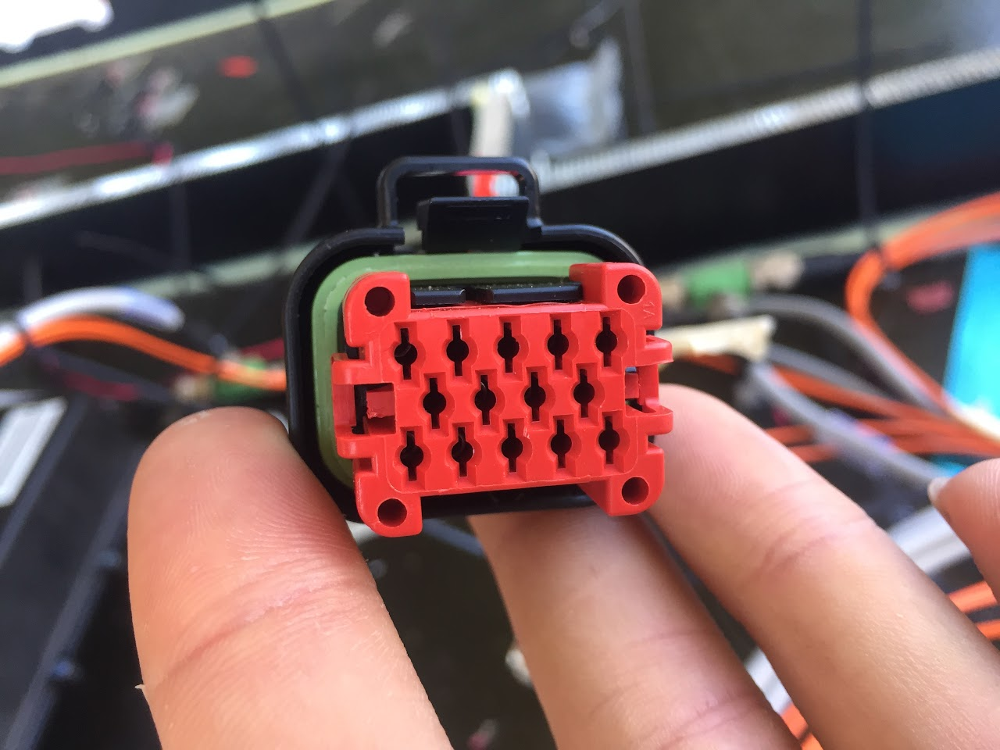
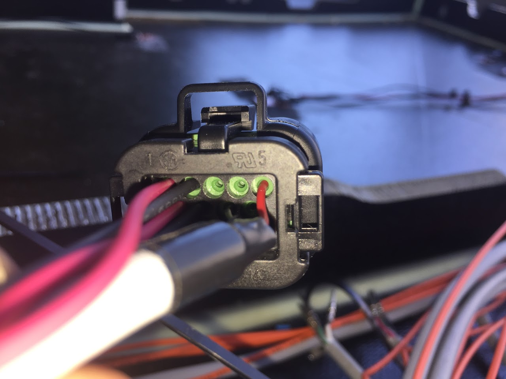
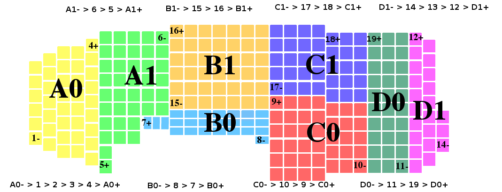
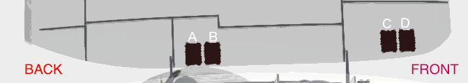
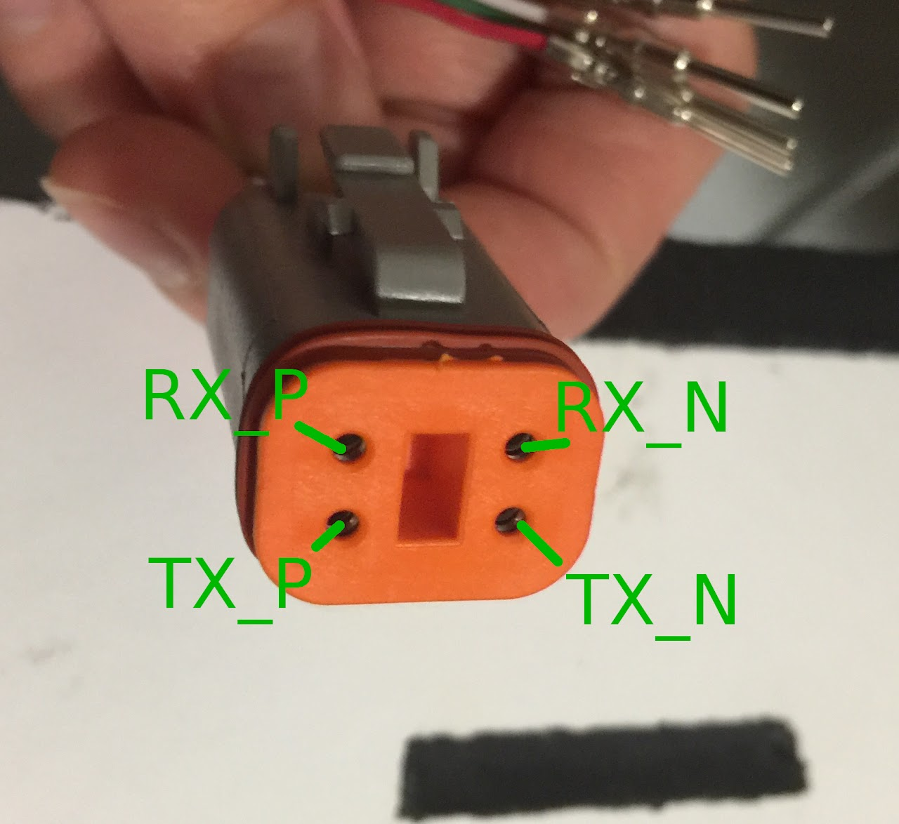
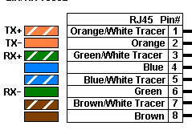
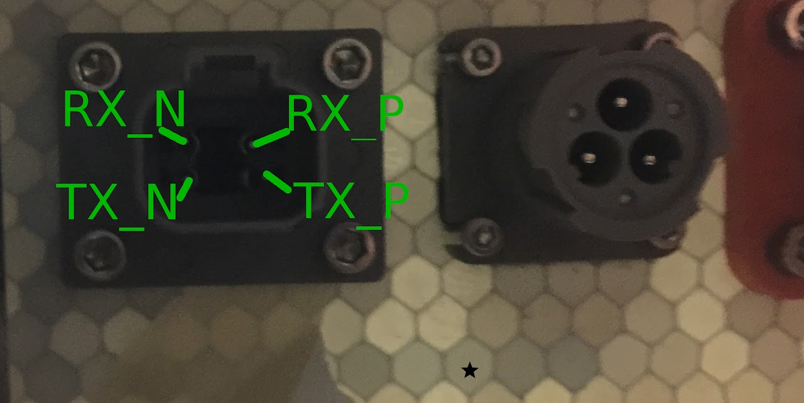
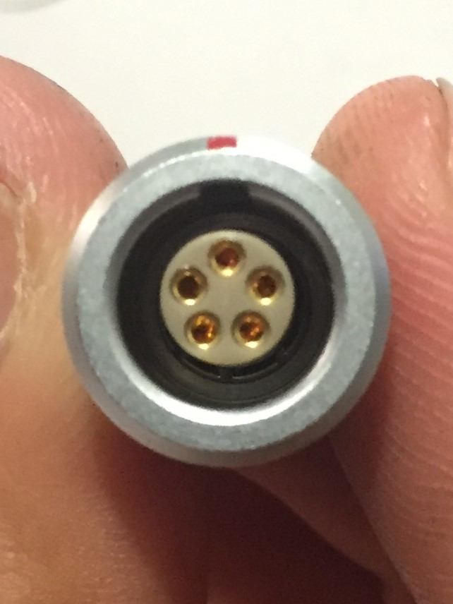
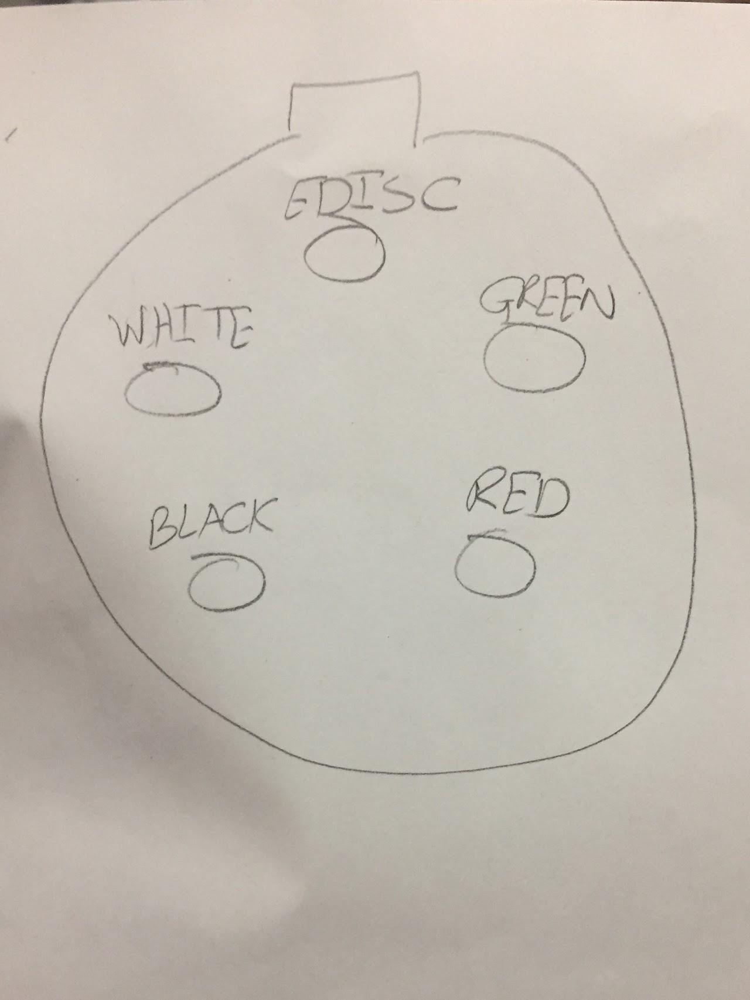

# SSCP - Wiring

# Wiring

Rough sketch of wiring in Sundae:

(old diagram)

[old diagram](https://docs.google.com/drawings/d/198CTBvlpVDiW_9TMsFFJhCCNxLxcaQPUJWUnu60GV3o/edit?usp=sharing)

### Embedded Content

Embedded content: [Embedded Content](https://docs.google.com/drawings/d/1RlxQpM3Mshu7fn7yJw62MvfnwgAq6WG7331qhdKhhN8/preview?ac=true)

<iframe width="100%" height="400" src="https://docs.google.com/drawings/d/1RlxQpM3Mshu7fn7yJw62MvfnwgAq6WG7331qhdKhhN8/preview?ac=true" frameborder="0"></iframe>

### Embedded Content

Embedded content: [Embedded Content]()

<iframe width="100%" height="400" src="" frameborder="0"></iframe>

Below is a list of wiring and connectors for each point-to-point connection in the car:

Bottomshell

From Vehicle Computer

Each of these connections ends on the Vehicle Computer side in a Deutsch DT12 connector.  Required parts to build the DT connectors mating with the VC Deutsch Box are as follows:

### Embedded Content

Embedded content: [Custom embed]()

<iframe width="100%" height="400" src="" frameborder="0"></iframe>

See the instructional video here on how to assemble the connector: https://www.youtube.com/watch?v=jE712DGw8CY

[https://www.youtube.com/watch?v=jE712DGw8CY](https://www.youtube.com/watch?v=jE712DGw8CY)

Additionally, the crimper box contains a sheet with information on how wires should be stripped prior to crimping.  Only use the Deutsch crimper to make these crimps.

Below is an image of the VC pinout.

Note these are not arranged in the same order as they will be arranged in the header of the box.  The below image shows the order of the connectors when VC is viewed from above:

Array Wiring

Strings:

A0- > 1 > 2 > 3 > 4 > A0+

A1- > 6 > 5 > A1+

B0- > 8 > 7 > B0+

B1- > 15 > 16 > B1+

C0- > 10 > 9 > C0+

C1- > 17 > 18 > C1+

D0- > 11 > 19 > D0+

D1- > 14 > 13 > 12 > D1+

from Sam Lenius (also see attached document)

AMPSEAL PINOUT (CABLE SIDE, TOP LEFT IS PIN 1, BOTTOM RIGHT IS PIN 14) 

TOP ROW 

1. ARRAY CHANNEL 0 POSITIVE (6-120V, 0-6.5A) 

2. ARRAY CHANNEL 0 RETURN 

3. CAN HI 

4. CAN LO 

5. CAN VCC (9-36V) 

MIDDLE ROW 

6. ARRAY CHANNEL 1 POSITIVE (6-120V, 0-6.5A) 

7. ARRAY CHANNEL 1 RETURN 

8. CAN GND 

9. CAN GND 

BOTTOM ROW 

10. BATTERY POSITIVE (MAX ARRAY VOLTAGE - 160V) 

11. BATTERY NEGATIVE 

12. CAN VCC (9-36V) 

13. CAN HI 

14. CAN LO

The below photos show the [MPPT][Channel] each string is connected to

Practice topshell 8/5 map from mppt channel to address (assumes lower address is channel 0):

A0 -- 0x602

A1 -- 0x603

B0 -- 0x60A

B1 -- 0x60B

C0 -- 0x604

C1 -- 0x605

D0 -- 0x606

D1 -- 0x607

Umbilical Cord Connector (571-HDP24-24-23PE / 571-HDP26-24-23SE)

Center

A

Inner circle (MPPT outputs)

B: MPPT A +

C: MPPT B + 

D: MPPT C + 

E   MPPT D + 

F:  MPPT A - 

G: MPPT B - 

H   MPPT C - 

J:  MPPT D - 

Outer circle

K:  Blink Left +

L:  Blink Left -

M:  Blink Right +

N:  Blink Right -

O:  Brake +

P:  Brake -

Q:  LV+       (Phoenix cable RED)

R:  LV-        (Phoenix cable BLACK)

S:  CAN H    (Phoenix cable WHITE)

T:  CAN L     (Phoneix cable BLUE)

U:  EDisc in

V:  EDisc out

W:  

X:  

BMS Ethernet:

Pack-side Connector:

TX+ Red

TX- Black

RX+ White

RX- Green

Car-side Connector:

Steering Wheel Connector

Ethernet wire to RJ45 wire

Red - Striped Orange

White - Striped Green

Black - Solid Orange

Green - Solid Green

The wiring and connectors needed for each connection from VC are listed below, organized by their other endpoint:

1. VC-> BMS

    a. Power

        - cable: 2-conductor Alphawire 

        - connector (BMS side): 3-position Deutsch HD10 (do not plug leftover pin, it's for Edisc)

    b. Ethernet

        - cable: 2-pair/4-conductor Belden

        - connector (BMS side): Deutsch DT4

2. VC-> Steering Wheel

    a. Ethernet + Edisc

        - cable: 2-pair/4-conductor Belden

        - connector (SW side): Lifeline p/n 410-200-019

3. VC-> Umbilical

    a. MPPT CAN

        - cable: Phoenix 5-conductor

        - connector: Phoenix A-code 5-pin (built in to cable); ends at Umbilical connector

    b. Edisc

        - cable: a single conductor, can be red array wiring

        - connector: Umbilical

    c. Power for Taillights, Rear Turn Signals 

        - cable: 2-conductor Alphawire x 3 (Taillights, L turn, R turn)

        - connector: Umbilical

4. VC-> Pedals

    a. Power + Signal

        - cable: 3-conductor Alphawire x 2 (Throttle, Brake)

        - connector: Ampseal connector

5. VC-> Headlights, Front Turn Signals, and Side Lights

    a. Power

6. VC-> Rear View System

    a. Power

7. VC-> Handheld Radio Microphone

    a. Switch

8. VC-> GPS Antenna

    a. Feed

9. VC-> Wifi Antenna

    a. Ethernet

10. VC-> Tritiums

    a. Tritium CAN

From BMS

Harnesses that include BMS as one endpoint but do not go to VC are the wiring to power the motors (other endpoint is the Tritiums), wiring to the MPPTs (other endpoint is the Umbilical), and wiring to the 

1. BMS-> Tritiums

    a. HV Power (L+R)

2. BMS->HV Splitter Box

    a. HV Power

HVA-280 Assembly manual

[HVA-280 Assembly manual](http://www.te.com/commerce/DocumentDelivery/DDEController?Action=showdoc&DocId=Specification+Or+Standard%7F408-10299%7FB%7Fpdf%7FEnglish%7FENG_SS_408-10299_B.pdf%7F1587826-2)

From HV Splitter Box

1. HV Splitter Box-> Umbilical

    a. HV Power (for MPPTs)

Tritiums->Motors

1. Motor Resolver Cable

    a. Signal

2. 3-Phase Power

    a. HV Power

Topshell

From Umbilical

1. Umbilical-> MPPTs

    a. MPPT CAN

    b. HV Power

    

2. Umbilical-> Edisc button

    a. Edisc (x2)

3. Umbilical-> Taillights, Rear Turn Signals

From Array

1. Array-> MPPTs

    cable: Alphawire red/black hook-up wire 

    connector: TE ELCON mini

    Assembly instructions: see "ENG_SS_114-19110_C.pdf" attached at the bottom of the page.

 

### Embedded Google Drive File

Google Drive File: [Embedded Content](https://drive.google.com/embeddedfolderview?id=150gbJjDgxJ22sl1ATQiqVnxpJUGqPm1X#list)

<iframe width="100%" height="400" src="https://drive.google.com/embeddedfolderview?id=150gbJjDgxJ22sl1ATQiqVnxpJUGqPm1X#list" frameborder="0"></iframe>

