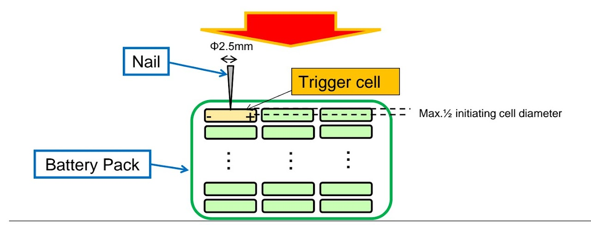

# SSCP - Battery Mechanical Testing

# Battery Mechanical Testing

## Nail Penetration Test

READ FIRST:

Documentation from Arctan Cycle

[Documentation from Arctan Cycle](/home/sscp-2014-2015/business-logistics-2014-2015/business-2014-2015-projects/panasonic-batteries-and-testing-2014-2015)

EQUIPMENT (JANUARY 2017)

- Sir Eddie

- 100% SOC module with clamshell and collector plate (4-5x)

- 3 J type thermocouples (>1000 degrees C)

- Welding shield

- Nail (2.5mm D x 45 mm L) x5

- Robust camera to record >1 hour of footage (GoPro or CamCorder)

- Arbor Press

- Fire proofing

- Fire extinguisher x2

TEST CONDITIONS (Final)

【Test Condition】

1. Charging pack or module to 100% SOC

2. Nail Specification:(Diameter) Φ2.5mm (Length) 45mm

3. Penetration speed: 5mm/sec

4. Depth of penetration: Max.1⁄2 initiating cell diameter

(Max.9mm from initiating cell surface)

5. Test temperature: Worst (Highest) temperature in your specific charge temp.

6. To make hole on pack case in advance so that it easy to penetrate

7. Observe for reaching to room temperature after test

Panasonic Comments

12/19/16 (Received)

1.//

Please advise SSCP as follows.

If cell bricks are isolated and no influence from neighborhood brick is expected, the anti-propagation test can be performed with one brick.

If any influence is estimated, the test should be done with concerned multiple bricks. The number of cells can be determined accordingly.

To be on safer side, if possible, max number (3?) of bricks may be tested, but it’s up to SSCP.

If SSCP firmly believes their isolation design, we will follow it as long as it’s proven by their evaluation result.

 

In any cases, we require that the anti-propagation test should be performed at the highest temperature for charging.

 (ex. If temp. range for charging is +10deg.C to +45deg.C, the test needs to done at +45deg.C.)

Please remember to advise SSCP of this point.

_______________________________________________

2.//

Here are comments from our engineers.

 

-VENTILATION

Regarding ventilation, we will implement cut outs in the box to accommodate ventilation fans for each of the 3 modules. The vents will be designed to allow gas to flow out but it will prevent debris and water and dust from coming in.

(Comments from Panasonic) Understood.

 

- ISOLATION

Isolation between cells is going to be provided by some fabric or gel that we insert in the gaps. We are looking at a non-conductive Mica fabric or, if Panasonic has the bandwidth, its own material.  {Note from Paul to Henry:  I am waiting for a reply from Marshall Funaba whether or not Panasonic can promote our thermal materials for batteries.  He should tell me any day.}

(Comments from Panasonic) How is the Mica fabric to be attached between cells? (Every cell? Or, some grouped cells?)

 

- FUSING

Lastly, regarding cell-level fusing we are looking into ways we might implement this, but this is something we might not be able to do without sacrificing huge performance metrics. We hope to not be required to implement fusing on the cell level because it would drastically how we do our collector plate and interconnects and introduce a lot of unnecessary resistance that will only penalize our car's performance.  In previous years, the pack has had fusing, but not at the block or cell level  {Note from Paul to Henry:  Does Panasonic have some expectation here, like a fused collector plate, or tabbed interconnects for cells like thin wires?  If so, the series resistance will increase.}

(Comments from Panasonic) Understood. It’s not a must as long as the anti-propagation test cab be passed.

 

- TESTING

Please let me know if you have any updates on when we might be able to secure an initial delivery of the test cells? And we would like a final or near-final set of guidelines for the nail test before the Holidays.

(Comments from Panasonic)

(a)  Basically, no change. Please find page 1 of the attached file.

To be clear, the worst case temperature is specified as the max. temp. for charging.

The worst case nailing position is also specified.

(b)  Either way is fine.

(c)  (Replied in another mail earlier today)

(d   Please refer to page 2 of the attached file.  

***********************************************************************************************

Key test conditions: 

* fully wired
* charged 4.2 V
* temperature soaked at 45 C for 3 hours
* circumferential puncture of cell surrounded by other cells
* demonstrate that no propagation occurs

fully wired

charged 4.2 V

temperature soaked at 45 C for 3 hours

circumferential puncture of cell surrounded by other cells

demonstrate that no propagation occurs

Equipment needed:

* Temperature Chamber (Sir Eddie) for 3 hours
* DC source to charge module
* Arbor Press with nailTrigger mechanism
* Trigger mechanism
* Welding shield
* Fire extinguisher
* Welding gear and protective clothing
* Data collection and recording Thermocouples hooked up to thermometer (need to be relatively long)Are J and K type accurate enough due to time lag worries? Best would be RTD, but is expensive. Video recording and photography before and afterGo Pro - risks heat damage
* Thermocouples hooked up to thermometer (need to be relatively long)Are J and K type accurate enough due to time lag worries? Best would be RTD, but is expensive.
* Are J and K type accurate enough due to time lag worries? Best would be RTD, but is expensive.
*  Video recording and photography before and afterGo Pro - risks heat damage
* Go Pro - risks heat damage
* Modules of various configurations and sizes
* Container for explosionWire mesh or CinderblockHi-temp, fireproof insulation
* Wire mesh or Cinderblock
* Hi-temp, fireproof insulation

Temperature Chamber (Sir Eddie) for 3 hours

DC source to charge module

Arbor Press with nail

* Trigger mechanism

Trigger mechanism

Welding shield

Fire extinguisher

Welding gear and protective clothing

Data collection and recording 

* Thermocouples hooked up to thermometer (need to be relatively long)Are J and K type accurate enough due to time lag worries? Best would be RTD, but is expensive.
* Are J and K type accurate enough due to time lag worries? Best would be RTD, but is expensive.
*  Video recording and photography before and afterGo Pro - risks heat damage
* Go Pro - risks heat damage

Thermocouples hooked up to thermometer (need to be relatively long)

* Are J and K type accurate enough due to time lag worries? Best would be RTD, but is expensive.

Are J and K type accurate enough due to time lag worries? Best would be RTD, but is expensive.

 Video recording and photography before and after

* Go Pro - risks heat damage

Go Pro - risks heat damage

Modules of various configurations and sizes

Container for explosion

* Wire mesh or Cinderblock
* Hi-temp, fireproof insulation

Wire mesh or Cinderblock

Hi-temp, fireproof insulation

Decision needed:

* How to interpret "fully wired" (welded to collector plate so cells are in parallel)?
* Puncture mechanism and location
* Testing timelineNeeds to occur discretely and in a safe environment
* Needs to occur discretely and in a safe environment
* How to iterate quickly on designs (will be expensive ~$1200) for several quickly 3D printed iterations
* How to iterate quickly on collector plates

How to interpret "fully wired" (welded to collector plate so cells are in parallel)?

Puncture mechanism and location

Testing timeline

* Needs to occur discretely and in a safe environment

Needs to occur discretely and in a safe environment

How to iterate quickly on designs (will be expensive ~$1200) for several quickly 3D printed iterations

How to iterate quickly on collector plates

### Potential Inter-cell Materials

AllCell Tech

Graphite-based

"Phase-change material"

UL 94V-0

* Need to contact

Need to contact

https://www.allcelltech.com/images/datasheets/pcc/AllCell_PCC.pdf

[https://www.allcelltech.com/images/datasheets/pcc/AllCell_PCC.pdf](https://www.allcelltech.com/images/datasheets/pcc/AllCell_PCC.pdf)

Mica Fabric

Used for Arctan tests

* Need to find supplier and datasheet

Need to find supplier and datasheet

*Needs clarification

### Embedded Google Drive File

Google Drive File: [Embedded Content](https://drive.google.com/embeddedfolderview?id=12ce1A1iijvTWEskhaCUqQ5F-NFjoqWpU#list)

<iframe width="100%" height="400" src="https://drive.google.com/embeddedfolderview?id=12ce1A1iijvTWEskhaCUqQ5F-NFjoqWpU#list" frameborder="0"></iframe>

