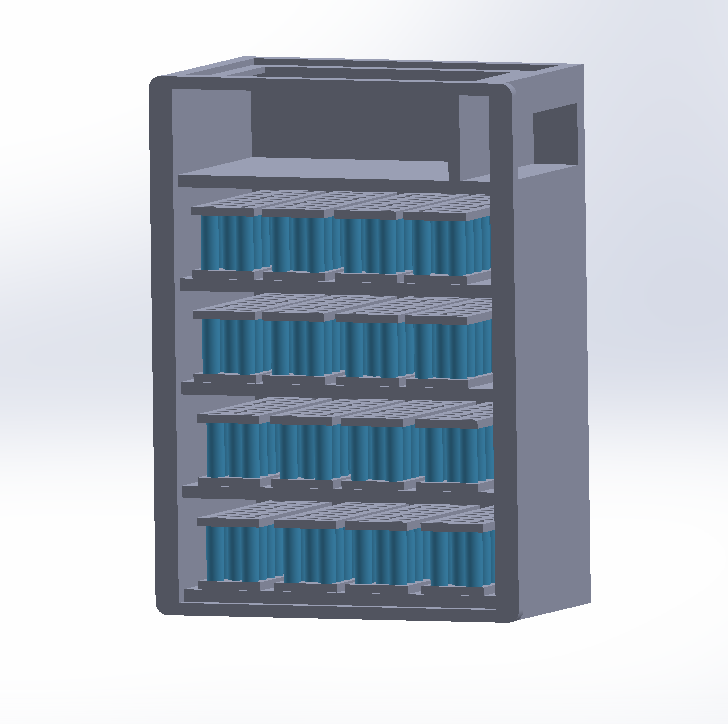
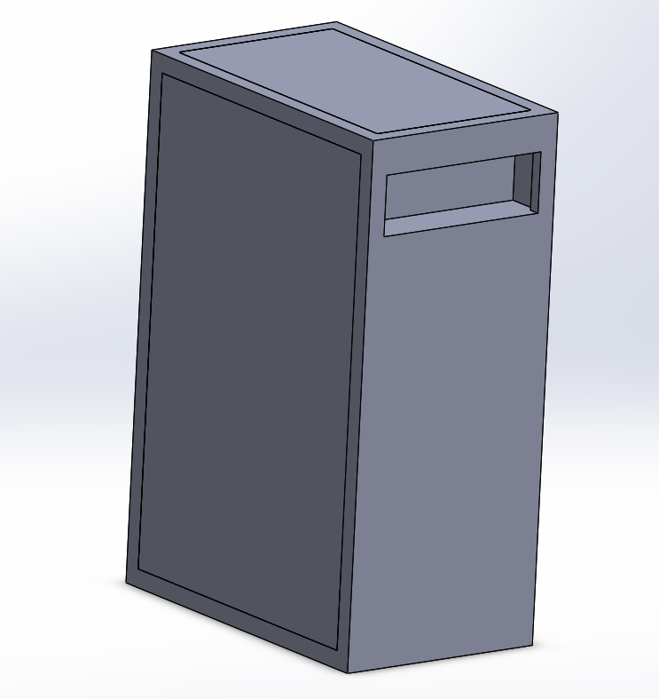
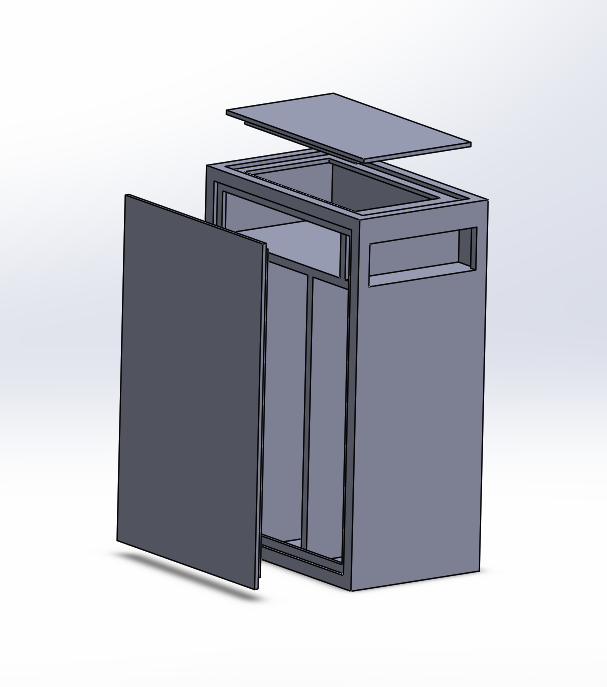
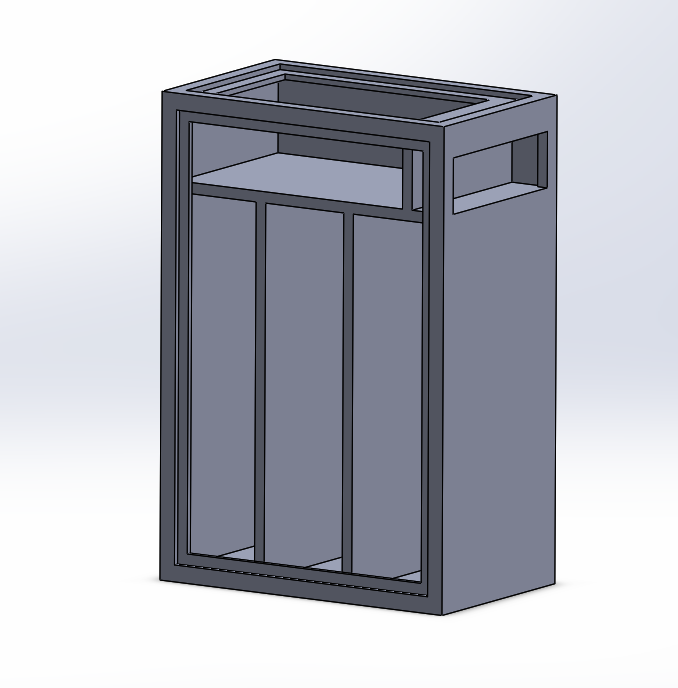

# battery-pack-box

## SSCP - Battery Pack Box

## Battery Pack Box

Current Design \[2/5]

Key Features

&#x20;   \- Access panels

&#x20;   \- Horizontal shelves

&#x20;   \- Removable shelve mechanism

&#x20;   \- Fastened connectors and bus bars

&#x20;   \- Ability to swap out modules and inspect individual shelves

Challenges

&#x20;   \- Need to figure out how shelve will be removable but also fastened securely

&#x20;   \- Module to shelf connection

&#x20;   \- How to secure and wire sense and bus bars

Dimensions

&#x20;   \- Unchanged from before

Design V1 \[2/1]

Key Features

&#x20;   \- Access panels

&#x20;   \- Connector cave

&#x20;   \- Flange for panels to be set and flush against rest of pack

&#x20;   \- Rubber seal on flange

&#x20;   \- Isolation between cell components

Challenges   &#x20;

&#x20;   \- Latching locations (needed dimensions for calculations later)

&#x20;   \- Mounting at an angle (HD foam?)

&#x20;   \- Ventilation (?)

&#x20;   \- Need to create mockup

Dimensions

&#x20;   14.65"

&#x20;   21.65"

&#x20;   9.0"

Latching:

20 g compliance

&#x20;   \- (30-35 kg) \* 20 \* 9.81 = 5886 N

&#x20;   \- If we estimate our pack mass at around 30 kg, we will need a heftier latch. Latches are documented in the pdf.

[pdf](http://www.southco.com/static/Literature/r4-r.en.pdf)

&#x20;   \- Weight from larger striker and latch helps with ballasting but might make handling of the pack tougher.

&#x20;   \- 4 mounting points: 2 latches and 2 pins + receivers

Latches considered:

Southco

&#x20;   R4 - 10 - 22 - 601 - 10

&#x20;   R4 - 10 - 12 - 601 - 10

&#x20;   R4 - 30 - 31 - 101 - 10&#x20;

&#x20;   R4 - 50 - 31 - 101 - 10
