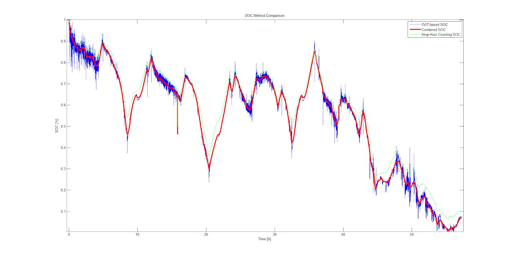

# SSCP - SOC Modeling

# SOC Modeling

**Updates needed

**Below is copied from Luminos documentation

-------------------

### Luminos: SOC Modeling

See the bottom of the page for a discussion of how SOC was implemented for Luminos.

Accurately modeling the state of charge (SOC) of the battery pack, or how much energy is left is the pack, is essential for developing a race strategy. Modeling the battery pack is accomplished by modeling an individual battery and building a pack from that. While ideal batteries are easy to model, real batteries have complexities that require a bit more understanding and testing. Battery models can be rather elaborate and may vary with the chemistry it is comprised of. For the teams purposes, we only need a model that exhibits the external characteristics of the battery, that is power in, power lost, and available power out. 

The requirements for a good SOC model is one that can keep track of voltage of the cells and energy that is left in the pack. Knowing the voltage of the cells and thus the pack can be important when accurately modeling the other systems whose performance/efficiency is dependent upon pack voltage (i.e. MPPTs and Motor). A good model of battery also takes into consideration internal loses. 

Note: Eric and Nikhil briefly worked with BMS6 and wrote a python CAN script to help in discharge tests. It is located in sunflower/strategy/can parser

## Models

### Tank of Electrons

The simplest model of a battery is a lossless tank of electrons with a limited capacity.

### Simple Circuit

A simple model would model the internal resistance of the battery as a function of charge and discharge rate and temperature. Simplfying this model would result in a resistor and capacitor model. This is a simple model that takes into consideration the small internal losses of the batteries.

### More Advanced Circuit

Other modeling in the circuit form, like a thevinan equivalent. Components where might have to change with SOC, discharge, and charge rate for complete accuracy.

### Empirical Data

use data to map voltage to SOC. still need to find out the resistance to account for those loses?

WSC2013 (Luminos) Methodology

Using a sample NCR18650B (3.4Ah) cell, I ran straight charge and discharge curves at three different temperatures and three different rates (I used an Agilent B2902A SMU to cycle the batteries, with a custom cycler program written in C# with the Agilent libraries). The raw data is on the FTP server, and the programs for post-processing in SVN (sunbad/strategy/soc)

The model can best be described as a statistical model, rather than some sort of Thevenin-equivalent circuit model. I felt the simplest approach to modeling the battery would be interpolating among real data, rather than attempting to capture the complex chemistry of a battery in a mathematical model.

The only downside to straight discharge curves (no waiting between data points) is that it represents the cell under steady-state current draw, which excludes the response of the cell as it lifts and sags over time. For our application with infrequent pulses of current, though, this method seemed appropriate. The minimum current is on par with the quiescent draw of the electrical system, so we should be able to accurately measure SOC with the car not moving.

I started taking data by letting the cell settle after draining and charging, but found that the time it takes to settle is on the order of hours from a 1C charge/discharge.

The data is all read in to the model generator and transformed into a MATLAB function using TriScatteredInterp - so you can plug in a current / voltage / temperature and receive an estimated SOC.

To combine voltage/current/temperature (IVT) based SOC and amp-hour counting, a Kalman filter would be ideal. I opted for the simple approach of a complementary filter, which essentially low-pass-filters the IVT lookup and high-pass-filters the amp-hour counting. This combination does introduce some amount of phase lag because it is implemented as an IIR (although this phase lag can be lessened by relying more on amp-hour counting). The benefit of this approach is that an incorrectly guessed total capacity will be ignored over a long timespan of low current (such as when the car is sitting). This is important because the capacity of the cell at 0.01C versus 1.0C is significant - it varied from 3.19 Ah to 3.37 Ah depending on the current and temperature of the discharge. 

 

It is very difficult to identify the success of a SOC methodology. That being said, I am very happy with how it has worked so far! Having everything in MATLAB is great.

The below graph gives an indication of how a lookup-based method, amp-hour method, and complementary filter combination performed over WSC2013:

I highly recommend that the next team use a complementary filter (it is simple, easy to tune by visual inspection, and computationally light). If further work is to be done, I recommend that it be put into calibration of the amp-hour counter, because it drifted by multiple percentage points over the course of the race. The NCR18650B model worked well and required perhaps hundreds of hours of effort and data collection, and it's not worth repeating unless we get new cells. The complementary filter did a splendid job of utilizing both data sets. The pack cut out when MATLAB reported 1-2% SOC.

### Embedded Google Drive File

Google Drive File: [Embedded Content](https://drive.google.com/embeddedfolderview?id=12gaxmmYtxVkhAJzX99EsL0OE0u7cvoPi#list)

<iframe width="100%" height="400" src="https://drive.google.com/embeddedfolderview?id=12gaxmmYtxVkhAJzX99EsL0OE0u7cvoPi#list" frameborder="0"></iframe>

