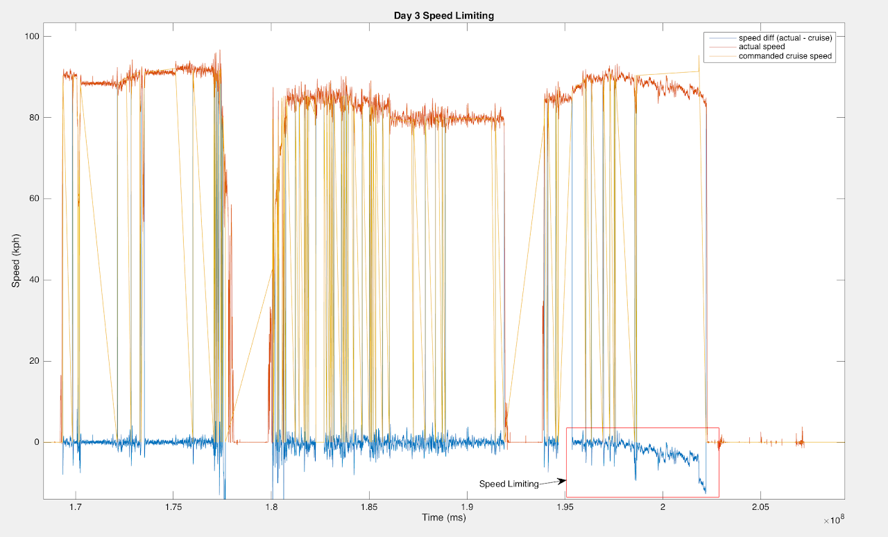
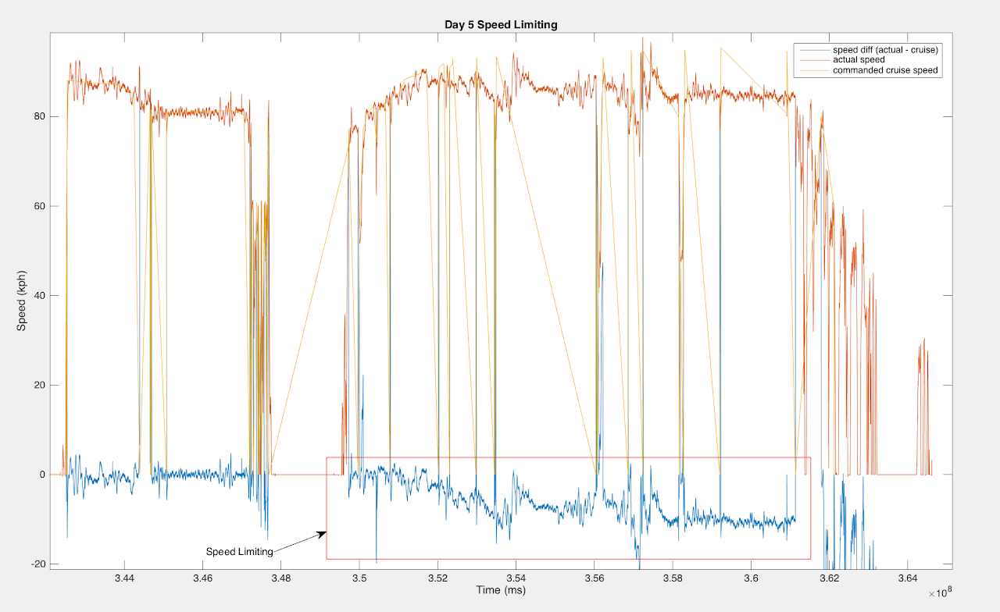
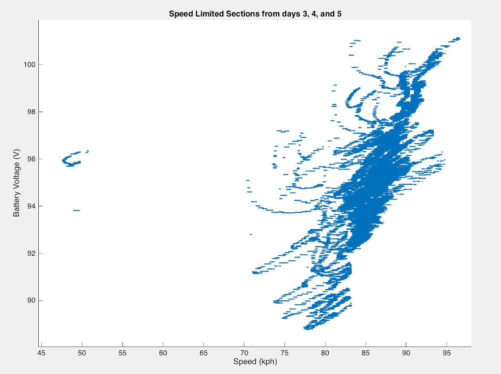

# arctan-speed-limiting-analysis

## SSCP - Arctan Speed Limiting Analysis

## Arctan Speed Limiting Analysis

During WSC 2015, Arctan was speed limited by our motors. Toward the ends of days 2, 3, 4, and 5 we set cruise speed to be a certain speed and the motors were not able to achieve that speed. This difference between commanded cruise speed and actual speed is cause by the battery pack voltage being low. The maximum stable difference seen occurred on day 5 and was 11 kph (94 kph commanded, 83 kph actual) and the absolute maximum difference seen was 22 kph, also on day 5.

The speed limiting significantly affected our strategy model because it meant that we would travel far above our average speed at some points and far below it at others, depending on how full the battery pack was (which is inefficient). Below are some charts of the speed limiting.

The speed limiting started to occur at rather high voltages\*:

* Day 2: 100.5 V  @94.5 kphDay 3: 99 V  @90.5 kphDay 4: 94 V  @88.0 kphDay 5: 97 V  @87.0 kph
* Day 3: 99 V  @90.5 kphDay 4: 94 V  @88.0 kphDay 5: 97 V  @87.0 kph
* Day 4: 94 V  @88.0 kph
* Day 5: 97 V  @87.0 kph

Day 2: 100.5 V  @94.5 kph

* Day 3: 99 V  @90.5 kphDay 4: 94 V  @88.0 kphDay 5: 97 V  @87.0 kph
* Day 4: 94 V  @88.0 kph
* Day 5: 97 V  @87.0 kph

Day 3: 99 V  @90.5 kph

* Day 4: 94 V  @88.0 kph
* Day 5: 97 V  @87.0 kph

Day 4: 94 V  @88.0 kph

Day 5: 97 V  @87.0 kph

\*after consulting with Sam Lenius, this makes sense. The theoretical voltage-to-top-speed-kph ratio for the motors is around 1:1. It appears that in practice it's about 1:0.92 on average.

How the speed limiting affected our race performance:

Our average speed without speed limiting would have been 85.2 kph (vs. 84.46 actual).

Completion of the race would have taken 35.47 hrs of driving time (vs. 35.78 hrs actual).

This is a difference of 19 minutes.

The speed limiting segments are as follows.

Speed diffs are the difference between commanded kph and actual kph (and are averages of the segment).

Calculated extra power is the power that we would have needed to use to actually drive at the commanded speed.

#### Embedded Content

Embedded content: [Custom embed](arctan-speed-limiting-analysis.md)

We ended the race with 27.5% SOC minimum, which translates to 1.4 kWh of power (based on Arctan's 5.1 kWh pack).

Thus, we could have driven at the commanded speeds and still had 0.4 kWh of power in the pack at the end of timing.

(To do this analysis I wrote two functions:  sundae-strategy/matlab/findVarValueDiff.m  &  sundae-strategy/matlab/findSpeedLimitingVoltageVsSpeed.m)

Voltage vs. Maximum Speed (data from speed limited segments only):

Plain plot

Possible boundary lines for our speed given pack voltage

Red is assuming that the two right-hand spurs are outliers (eg. terrain differences)

Green assumes that they are not outliers

Orange is a decent linear fit of our max possible speed

\[Gawan Fiore - gfiore@stanford.edu]
