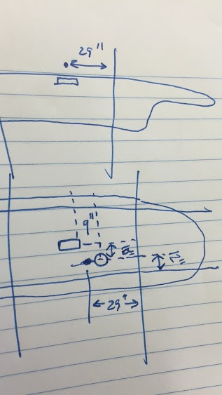

# SSCP - Vehicle Dynamics

# Vehicle Dynamics

This page is organized chronologically with the newest notes at the top.

Crow's Landing: August 14, 2016 Summary

Measurement

We finally weighed Arctan on automotive grade scales. Here are its corner weights with all equipment including the driver in the car:

### Embedded Content

Embedded content: [Custom embed]()

<iframe width="100%" height="400" src="" frameborder="0"></iframe>

Here are the measurements of the data loggers' (SSCP and DDL) respective distances from the vehicle CG. The rectangle is the DDL data logger and the dot is the SSCP data logger. The circle is the DDL data logger's GPS location, which was just necessary for setting up the logger config.

Arrival and Setup

The site is secured by a single gate that seems like it's always left open. DDL accompanied us with Shelley. Phill came in his car, which was useful for fetching unplanned supplies in town. Crow's Landing only allows use of certain sections of the runway. See attached document 'Exhibit B to Letter Agreement.' SSCP ended up testing outside of the prescribed testing area because we found the best surface on the upper righthand leg of site, as seen in the document. Shelley used the entirety of the crossing runway. Things worked out pretty nicely because we were able to borrow their automotive grade car scales (finally weighing our car accurately!) and their fancy velocity-logging OxTS data logger. We also had our SSCP-bought Autosport Labs RaceCapture/Pro logger. Our steer angle sensor was logging through CAN. This meant that we would have to sync all this data manually, which is not ideal, but an unfortunate fact of not enough time and planning. Hopefully we can have steer angle (perhaps integrated with the steering wheel?) easy to sync with our data logger in the future.

Testing

Firstly, we drove the van around to demonstrate what we were about to do in the (more poorly handling) solar car. Afterwards, we began warming up in the solar car and getting a sense of the space we had on the 2013 race tires, so as not to abuse our fewer in number 2015 tires just yet.

Since the battery pack was fully charged (our mistake, should have discharged it a little), the top of pack behavior hindered our initial progress significantly. At first, the solar cells were charging the pack, so we unplugged the MPPTs. But then, whenever Hayden (driving the solar car for all tests) used the brakes, the regen would charge the pack and the car would powercycle, both kicking Kate off telemetry and corrupting the SSCP data logger files (since the logger was getting power from the car). We had originally wanted regen working for its softer braking, but Hayden wasn't really even using it to stop, since he was braking hard enough that he was primarily using the mechanical brakes.

About the time we realized we would not be able to discharge the pack enough by just driving back and forth, we found we had a flat on the rear right tire. At this time, we swapped to the 2015s. It took awhile to get rolling again, as there was some technical difficulty in getting regen successfully deactivated. There was also some trouble figuring out how to properly log with the DDL data logger, which we figured out then as well. We took a short break and ate burritos in the trailer.

The final 30 minutes of testing was the sum total of our useful data. While 5 deg/s seemed very slow in the van, it was enough to reach the tire friction limit across the width of the runway at higher speeds in the solar car.

8 total maneuvers:

* 1 ramp right at 50kph 5 deg/s
* 1 ramp left at 50kph 5 deg/s
* 1 ramp right at 60kph 5 deg/s
* 1 ramp left at 60kph 5 deg/s
* 1 ramp right at 70kph 5 deg/s
* 1 ramp left at 70kph 5 deg/s
* 1 ramp right at 80kph 5 deg/s
* 1 ramp left at 80kph 5 deg/s

1 ramp right at 50kph 5 deg/s

1 ramp left at 50kph 5 deg/s

1 ramp right at 60kph 5 deg/s

1 ramp left at 60kph 5 deg/s

1 ramp right at 70kph 5 deg/s

1 ramp left at 70kph 5 deg/s

1 ramp right at 80kph 5 deg/s

1 ramp left at 80kph 5 deg/s

At 70 kph, the car nearly reached its limit. At 80 kph, the car slid/reached friction limit going both right and left.

At this point, I checked the tires and found a puncture in the rear right. It's likely this happened during one of the final two tests, when the car slid. That effectively ended testing since we only had one set of 2015 tires remaining to SSCP's name, and did not want to destroy those as well.

There is quite a bit of data processing that needs to happen in the next few weeks.

Game Plan for August 14 at Crow's Landing

BOOKING CROW'S LANDING: See attached 'Solar Car Contract fr Nanci Howe', our contract for the day. Booking at Crow's Landing was not easy and required Kelsey, Stanford, and the Crow's Landing county to all be involved to sort out insurance and payment. Communication was terrible from both Stanford and the county and we almost did not have our contract ready in time. Though we had our contract ready, we hadn't paid yet. SSCP needs an invoice in order to issue a check, and the county was pretty unresponsive whenever Kelsey asked for an invoice.

Schedule

Our current plan is to have everything ready to go on Wednesday, August 10. That night, we'll load the car in the trailer to prep it for the upcoming Sunday, August 14.

On Sunday, we'll meet at the shop at 5:30am to leave the shop at exactly 6am. Plan to spend the rest of your daylight hours at Crow's Landing, though it will very likely not take that long.

Getting Tire Data

Why are we getting tire data? Arctan made the entire team more aware of vehicle handling attributes. At our team goals meeting at the beginning of the cycle, our team indicated that we want a car that does not sacrifice stability for speed nor speed for stability. It is difficult to make this compromise without being able to model degree of stability. To model vehicle dynamics, we need to know the tire forces that react to steer input from the driver and external forces from wind. 'Tire data' in the linear region can be summed into a single number, the tire cornering stiffness. For a little more about vehicle dynamics with a focus on solar cars, see alumni Ben Stabler's brief intro attached to this page.

We're using Arctan as a test jig from which we'll extract tire data. Tire data, or any other data from the car for that matter, is not particularly useful unless the tires are in reasonable shape. Solar car tires are made for durability in straight lines, not for any sort of lateral behavior, so they will wear fairly quickly from the tests we will be doing. If we do the tests right, hopefully we should not need too many tests.

Data Collection

We have an AutoSport Labs RaceCapture/Pro that has a gyro, accelerometer, and GPS to get acceleration and yaw rate. EE and code have put together a steer angle sensor to get the remaining information we need for a comprehensive data set.

Ramp Steer

A ramp steer is the type of maneuver that is typically used to calculate linear cornering stiffnesses. Industry typically does 5 deg/s (handwheel angle rate of turning) ramp steers, as this slower rate of turning gives a longer linear response along which to fit cornering stiffnesses. Higher rates of turning can also return good data, however. Our goal is to get 3 good ramps turning left and right, respectively. While these tests are few in number, we want to get them right, so we are devoting the entire day to have time to check our data and make sure it's looking good.

Data Processing

The main signals we'll be using are lateral and longitudinal acceleration, yaw rate, and vehicle position. We'll need to integrate acceleration to get velocity, which should be alright as long as the data is filtered properly (I have a set of filters recommended from coworkers) and the integration is not across a lot of time. A 3 DoF ("bicycle") model is quite good at capturing information below 0.4g. From there, it's pretty easy to use an unconstrained optimization like fminsearch in MATLAB to back out cornering stiffnesses.

From here, this information will help us create a model of Arctan to compare to our own experiences of its handling characteristics (as a baseline) and then create a model of Sundae for the team to use to agree on a measure of stability.

### Embedded Google Drive File

Google Drive File: [Embedded Content](https://drive.google.com/embeddedfolderview?id=1921uVHRgZm-qvECXRD48XFRngYE4sDxY#list)

<iframe width="100%" height="400" src="https://drive.google.com/embeddedfolderview?id=1921uVHRgZm-qvECXRD48XFRngYE4sDxY#list" frameborder="0"></iframe>

