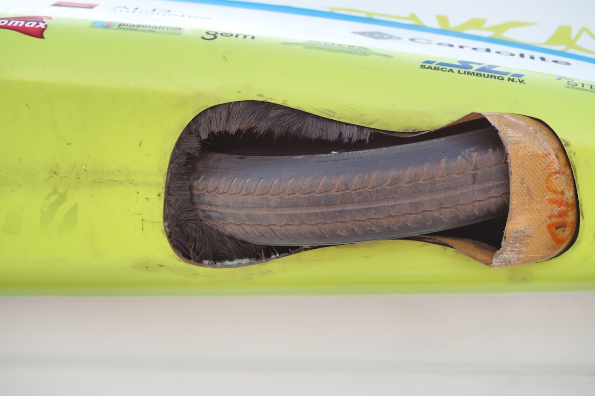

# SSCP - Wheels Shrouds

# Wheels Shrouds

Southco Quarter-Turn Fasteners: Receptacle, Stud, and Retainer

Intended panel thickness: 0.075" (~5 layers of carbon)

For receptacle, drill 15/32" hole, larger if alignment issues arise

...

Alumni Input:

Alum

Dec 1st email from Adem Rudin:

There are three goals with aerodynamic features around the wheels/suspension. That aren't mutually exclusive, but they aren't automatically overlapping, either:

1: Prevent the wheel and tire from acting as a centrifugal blower and wasting energy by circulating air inside the car

2: Prevent the hourglass hole for the front wheel turning volume from acting as a scoop and wasting energy by forcing flow through the car

3: Fairing in the protruding tire at the front and/or rear so that it creates less drag moving forward through the air.

Which of these are you targeting?

A shroud rigidly attached to the suspension is usually targeted at (1), and will also allow for a feature targeted at (3) to get as close to the ground as possible (since you don't have to worry about bottoming out under suspension compression), but in order for it not to be an awful hack, you need to plan for it ahead of time with hardpoints on the suspension upright/kingpin/whatever you folks call it. You will also need to expand the hourglass hole for clearance, which may affect the design of your pontoons/catamarans, and will complicate features aimed at (2)!

I really like Punch's leading-edge shroud - a thin, uncored layup of Kevlar that is a little flexy and very abrasion resistant, so it can brush the road occasionally without getting destroyed. Tokai's little leading/trailing bumps were replaceable and they had several spares. Nuon in years past has also utilized ablative/expendable parts to accomplish (2) and (3).

On Mon, Nov 28, 2016 at 9:20 PM, Hayden Robert Hall <hhall8@stanford.edu> wrote:

[hhall8@stanford.edu](mailto:hhall8@stanford.edu)

Hi Adem and Nathan,

We're designing our wheel shrouds right now, and we wanted to see if you had any insight on the aerodynamic benefits of what other teams have done.

We currently plan to mount the wheel shroud to the suspension, so that the wheel shroud will move with the wheel in jounce and rebound.

These are the things that we still need to research:

* The distance between the wheel and the wheel shroudThe height of the wheel shroud above the ground - possibility of broken shroud puncturing tireClosing the gap between the wheel shroud and the car body - possibly use bristle skirt (like punch used)Reducing the effects of the rolling wheel on the flow of the exterior of the car
* The distance between the wheel and the wheel shroud
* The height of the wheel shroud above the ground - possibility of broken shroud puncturing tire
* Closing the gap between the wheel shroud and the car body - possibly use bristle skirt (like punch used)
* Reducing the effects of the rolling wheel on the flow of the exterior of the car

* The distance between the wheel and the wheel shroud
* The height of the wheel shroud above the ground - possibility of broken shroud puncturing tire
* Closing the gap between the wheel shroud and the car body - possibly use bristle skirt (like punch used)
* Reducing the effects of the rolling wheel on the flow of the exterior of the car

The distance between the wheel and the wheel shroud

The height of the wheel shroud above the ground - possibility of broken shroud puncturing tire

Closing the gap between the wheel shroud and the car body - possibly use bristle skirt (like punch used)

Reducing the effects of the rolling wheel on the flow of the exterior of the car

These photos certainly caught our attention:

We currently don't think it will be possible to test at a wind tunnel with rolling wheels. It's likely that our decisions will be based on applying best principles rather than proven efficiency increases. We'd really appreciate any guidance, advice, or suggestions that either of you could offer.

Best, 

Hayden 

