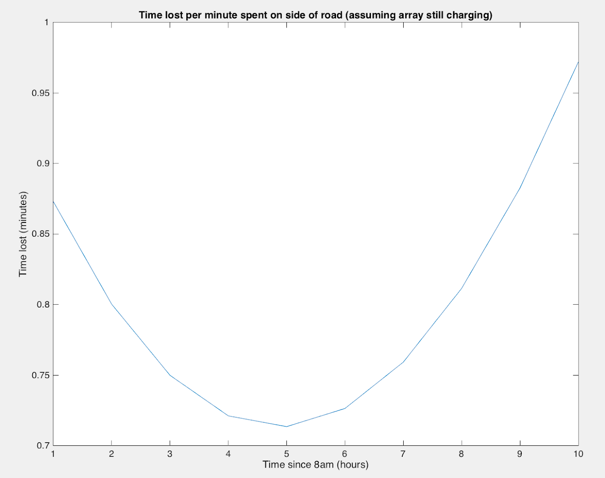

# SSCP - Arctan WSC Baseline

# Arctan WSC Baseline

Analysis of Arctan’s Race Performance

Notes

* There is some small uncertainty in the power-to-drive numbers. This is due to 2 things:1) The motor power data differs significantly between the Central Valley and Australia (likely due to increased side winds, and thus wheel scrubbing and rolling resistance).  As a result, only Australia data can be used to accurately characterize Arctan’s power-to-drive under race conditions. On average, Arctan’s power-to-drive in the Central Valley was ~200 W lower than in Australia.2) For much of the data recorded in Australia, when a polynomial (cubic) fit was generated the curve was ill-fitting and had a negative cubic coefficient (should be positive). This includes the race data. There was a small, yet reasonable amount of data for which a good fit could be generated, so I have used that (and the poorly-fitted race data) in the power-to-drive analysis.
* There is some small uncertainty in the power-to-drive numbers. This is due to 2 things:1) The motor power data differs significantly between the Central Valley and Australia (likely due to increased side winds, and thus wheel scrubbing and rolling resistance).  As a result, only Australia data can be used to accurately characterize Arctan’s power-to-drive under race conditions. On average, Arctan’s power-to-drive in the Central Valley was ~200 W lower than in Australia.2) For much of the data recorded in Australia, when a polynomial (cubic) fit was generated the curve was ill-fitting and had a negative cubic coefficient (should be positive). This includes the race data. There was a small, yet reasonable amount of data for which a good fit could be generated, so I have used that (and the poorly-fitted race data) in the power-to-drive analysis.
* 1) The motor power data differs significantly between the Central Valley and Australia (likely due to increased side winds, and thus wheel scrubbing and rolling resistance).  As a result, only Australia data can be used to accurately characterize Arctan’s power-to-drive under race conditions. On average, Arctan’s power-to-drive in the Central Valley was ~200 W lower than in Australia.
* 2) For much of the data recorded in Australia, when a polynomial (cubic) fit was generated the curve was ill-fitting and had a negative cubic coefficient (should be positive). This includes the race data. There was a small, yet reasonable amount of data for which a good fit could be generated, so I have used that (and the poorly-fitted race data) in the power-to-drive analysis.

* There is some small uncertainty in the power-to-drive numbers. This is due to 2 things:1) The motor power data differs significantly between the Central Valley and Australia (likely due to increased side winds, and thus wheel scrubbing and rolling resistance).  As a result, only Australia data can be used to accurately characterize Arctan’s power-to-drive under race conditions. On average, Arctan’s power-to-drive in the Central Valley was ~200 W lower than in Australia.2) For much of the data recorded in Australia, when a polynomial (cubic) fit was generated the curve was ill-fitting and had a negative cubic coefficient (should be positive). This includes the race data. There was a small, yet reasonable amount of data for which a good fit could be generated, so I have used that (and the poorly-fitted race data) in the power-to-drive analysis.
* 1) The motor power data differs significantly between the Central Valley and Australia (likely due to increased side winds, and thus wheel scrubbing and rolling resistance).  As a result, only Australia data can be used to accurately characterize Arctan’s power-to-drive under race conditions. On average, Arctan’s power-to-drive in the Central Valley was ~200 W lower than in Australia.
* 2) For much of the data recorded in Australia, when a polynomial (cubic) fit was generated the curve was ill-fitting and had a negative cubic coefficient (should be positive). This includes the race data. There was a small, yet reasonable amount of data for which a good fit could be generated, so I have used that (and the poorly-fitted race data) in the power-to-drive analysis.

There is some small uncertainty in the power-to-drive numbers. This is due to 2 things:

* 1) The motor power data differs significantly between the Central Valley and Australia (likely due to increased side winds, and thus wheel scrubbing and rolling resistance).  As a result, only Australia data can be used to accurately characterize Arctan’s power-to-drive under race conditions. On average, Arctan’s power-to-drive in the Central Valley was ~200 W lower than in Australia.
* 2) For much of the data recorded in Australia, when a polynomial (cubic) fit was generated the curve was ill-fitting and had a negative cubic coefficient (should be positive). This includes the race data. There was a small, yet reasonable amount of data for which a good fit could be generated, so I have used that (and the poorly-fitted race data) in the power-to-drive analysis.

1) The motor power data differs significantly between the Central Valley and Australia (likely due to increased side winds, and thus wheel scrubbing and rolling resistance).  As a result, only Australia data can be used to accurately characterize Arctan’s power-to-drive under race conditions. On average, Arctan’s power-to-drive in the Central Valley was ~200 W lower than in Australia.

2) For much of the data recorded in Australia, when a polynomial (cubic) fit was generated the curve was ill-fitting and had a negative cubic coefficient (should be positive). This includes the race data. There was a small, yet reasonable amount of data for which a good fit could be generated, so I have used that (and the poorly-fitted race data) in the power-to-drive analysis.

* All figures are at the bottom of the page, referenced by number.

All figures are at the bottom of the page, referenced by number.

Speed

* 23.46 m/s = 84.46 kph average speed (avg of all speed data while driving)23.77 m/s = 85.57 kph average cruise speed (avg of sections w/ low fluctuation*)*100 data-point segments w/ st.d. < 0.1028.36 m/s = 102.1 kph max speed
* 23.46 m/s = 84.46 kph average speed (avg of all speed data while driving)
* 23.77 m/s = 85.57 kph average cruise speed (avg of sections w/ low fluctuation*)*100 data-point segments w/ st.d. < 0.10
* *100 data-point segments w/ st.d. < 0.10
* *100 data-point segments w/ st.d. < 0.10
* *100 data-point segments w/ st.d. < 0.10
* *100 data-point segments w/ st.d. < 0.10
* *100 data-point segments w/ st.d. < 0.10
* *100 data-point segments w/ st.d. < 0.10
* 28.36 m/s = 102.1 kph max speed

* 23.46 m/s = 84.46 kph average speed (avg of all speed data while driving)
* 23.77 m/s = 85.57 kph average cruise speed (avg of sections w/ low fluctuation*)*100 data-point segments w/ st.d. < 0.10
* *100 data-point segments w/ st.d. < 0.10
* *100 data-point segments w/ st.d. < 0.10
* *100 data-point segments w/ st.d. < 0.10
* *100 data-point segments w/ st.d. < 0.10
* *100 data-point segments w/ st.d. < 0.10
* *100 data-point segments w/ st.d. < 0.10
* 28.36 m/s = 102.1 kph max speed

23.46 m/s = 84.46 kph average speed (avg of all speed data while driving)

23.77 m/s = 85.57 kph average cruise speed (avg of sections w/ low fluctuation*)

* *100 data-point segments w/ st.d. < 0.10
* *100 data-point segments w/ st.d. < 0.10
* *100 data-point segments w/ st.d. < 0.10
* *100 data-point segments w/ st.d. < 0.10
* *100 data-point segments w/ st.d. < 0.10
* *100 data-point segments w/ st.d. < 0.10

* *100 data-point segments w/ st.d. < 0.10
* *100 data-point segments w/ st.d. < 0.10
* *100 data-point segments w/ st.d. < 0.10
* *100 data-point segments w/ st.d. < 0.10
* *100 data-point segments w/ st.d. < 0.10

* *100 data-point segments w/ st.d. < 0.10
* *100 data-point segments w/ st.d. < 0.10
* *100 data-point segments w/ st.d. < 0.10
* *100 data-point segments w/ st.d. < 0.10

* *100 data-point segments w/ st.d. < 0.10
* *100 data-point segments w/ st.d. < 0.10
* *100 data-point segments w/ st.d. < 0.10

* *100 data-point segments w/ st.d. < 0.10
* *100 data-point segments w/ st.d. < 0.10

* *100 data-point segments w/ st.d. < 0.10

*100 data-point segments w/ st.d. < 0.10

28.36 m/s = 102.1 kph max speed

Power

* Power To Drive:1.33 kW to drive at 23.77 m/s (Arctan average race cruise speed)  -  this is based on race data (avg of clean power vs. speed data sections)Polynomial (cubic) fit of race data is poor (negative x^3 coefficient), but suggests 1.35 kW. See Figure 1.1.30 kW to drive at 23.77 m/s  -  based on polynomial (cubic) fit of clean power-vs-speed data from 09.26.15 (cleanest Australia test data). See Figure 2.Conclusion: Because race data yields a poor fit, the fit from 09.26.15 can be used. However, that fit appears to be slightly lower than the measured average of the race data, and thus should be viewed as a lower bound for race performance. The average of the clean power vs. speed race data seems to be right on the mark, though it is not extendible beyond the power value corresponding to the average cruise speed. The result is a relatively small range (1.30-1.33 kW). Note, additionally, that the race power data is skewed upward slightly by unusually high headwinds on the final days.Luminos: 1.17 kW @ 21 m/sArctan: 0.94 kW @ 21 m/s (09.26.15 fit)Arctan: 1.11 kW @ 21 m/s (race data - fit overestimates around this point)Either way there was a significant decrease in Arctan’s power-to-drive vs. Luminos  -  (5-18%)44.5 kWh array power collected during WSC 2015 (Luminos: 41.3 kWh)45.5 kWh delivered to motors during WSC 2015 (Luminos: 43.8 kWh)1.66 kWh delivered to car electrical system during WSC 2015 (Luminos: 2.73 kWh)30.36 W average delivered to electrical system (Luminos: 47.9 W)31.44 W average while driving28.16 W average while stoppedOverall avg electrical power draw is equivalent to 74.1 kg via rolling resistance losses (Luminos: 131 kg)
* Power To Drive:1.33 kW to drive at 23.77 m/s (Arctan average race cruise speed)  -  this is based on race data (avg of clean power vs. speed data sections)Polynomial (cubic) fit of race data is poor (negative x^3 coefficient), but suggests 1.35 kW. See Figure 1.1.30 kW to drive at 23.77 m/s  -  based on polynomial (cubic) fit of clean power-vs-speed data from 09.26.15 (cleanest Australia test data). See Figure 2.Conclusion: Because race data yields a poor fit, the fit from 09.26.15 can be used. However, that fit appears to be slightly lower than the measured average of the race data, and thus should be viewed as a lower bound for race performance. The average of the clean power vs. speed race data seems to be right on the mark, though it is not extendible beyond the power value corresponding to the average cruise speed. The result is a relatively small range (1.30-1.33 kW). Note, additionally, that the race power data is skewed upward slightly by unusually high headwinds on the final days.Luminos: 1.17 kW @ 21 m/sArctan: 0.94 kW @ 21 m/s (09.26.15 fit)Arctan: 1.11 kW @ 21 m/s (race data - fit overestimates around this point)Either way there was a significant decrease in Arctan’s power-to-drive vs. Luminos  -  (5-18%)
* 1.33 kW to drive at 23.77 m/s (Arctan average race cruise speed)  -  this is based on race data (avg of clean power vs. speed data sections)
* Polynomial (cubic) fit of race data is poor (negative x^3 coefficient), but suggests 1.35 kW. See Figure 1.
* 1.30 kW to drive at 23.77 m/s  -  based on polynomial (cubic) fit of clean power-vs-speed data from 09.26.15 (cleanest Australia test data). See Figure 2.
* Conclusion: Because race data yields a poor fit, the fit from 09.26.15 can be used. However, that fit appears to be slightly lower than the measured average of the race data, and thus should be viewed as a lower bound for race performance. The average of the clean power vs. speed race data seems to be right on the mark, though it is not extendible beyond the power value corresponding to the average cruise speed. The result is a relatively small range (1.30-1.33 kW). Note, additionally, that the race power data is skewed upward slightly by unusually high headwinds on the final days.
* Luminos: 1.17 kW @ 21 m/sArctan: 0.94 kW @ 21 m/s (09.26.15 fit)Arctan: 1.11 kW @ 21 m/s (race data - fit overestimates around this point)Either way there was a significant decrease in Arctan’s power-to-drive vs. Luminos  -  (5-18%)
* Arctan: 0.94 kW @ 21 m/s (09.26.15 fit)
* Arctan: 1.11 kW @ 21 m/s (race data - fit overestimates around this point)
* Either way there was a significant decrease in Arctan’s power-to-drive vs. Luminos  -  (5-18%)
* 44.5 kWh array power collected during WSC 2015 (Luminos: 41.3 kWh)
* 45.5 kWh delivered to motors during WSC 2015 (Luminos: 43.8 kWh)
* 1.66 kWh delivered to car electrical system during WSC 2015 (Luminos: 2.73 kWh)
* 30.36 W average delivered to electrical system (Luminos: 47.9 W)31.44 W average while driving28.16 W average while stoppedOverall avg electrical power draw is equivalent to 74.1 kg via rolling resistance losses (Luminos: 131 kg)
* 31.44 W average while driving
* 28.16 W average while stopped
* Overall avg electrical power draw is equivalent to 74.1 kg via rolling resistance losses (Luminos: 131 kg)

* Power To Drive:1.33 kW to drive at 23.77 m/s (Arctan average race cruise speed)  -  this is based on race data (avg of clean power vs. speed data sections)Polynomial (cubic) fit of race data is poor (negative x^3 coefficient), but suggests 1.35 kW. See Figure 1.1.30 kW to drive at 23.77 m/s  -  based on polynomial (cubic) fit of clean power-vs-speed data from 09.26.15 (cleanest Australia test data). See Figure 2.Conclusion: Because race data yields a poor fit, the fit from 09.26.15 can be used. However, that fit appears to be slightly lower than the measured average of the race data, and thus should be viewed as a lower bound for race performance. The average of the clean power vs. speed race data seems to be right on the mark, though it is not extendible beyond the power value corresponding to the average cruise speed. The result is a relatively small range (1.30-1.33 kW). Note, additionally, that the race power data is skewed upward slightly by unusually high headwinds on the final days.Luminos: 1.17 kW @ 21 m/sArctan: 0.94 kW @ 21 m/s (09.26.15 fit)Arctan: 1.11 kW @ 21 m/s (race data - fit overestimates around this point)Either way there was a significant decrease in Arctan’s power-to-drive vs. Luminos  -  (5-18%)
* 1.33 kW to drive at 23.77 m/s (Arctan average race cruise speed)  -  this is based on race data (avg of clean power vs. speed data sections)
* Polynomial (cubic) fit of race data is poor (negative x^3 coefficient), but suggests 1.35 kW. See Figure 1.
* 1.30 kW to drive at 23.77 m/s  -  based on polynomial (cubic) fit of clean power-vs-speed data from 09.26.15 (cleanest Australia test data). See Figure 2.
* Conclusion: Because race data yields a poor fit, the fit from 09.26.15 can be used. However, that fit appears to be slightly lower than the measured average of the race data, and thus should be viewed as a lower bound for race performance. The average of the clean power vs. speed race data seems to be right on the mark, though it is not extendible beyond the power value corresponding to the average cruise speed. The result is a relatively small range (1.30-1.33 kW). Note, additionally, that the race power data is skewed upward slightly by unusually high headwinds on the final days.
* Luminos: 1.17 kW @ 21 m/sArctan: 0.94 kW @ 21 m/s (09.26.15 fit)Arctan: 1.11 kW @ 21 m/s (race data - fit overestimates around this point)Either way there was a significant decrease in Arctan’s power-to-drive vs. Luminos  -  (5-18%)
* Arctan: 0.94 kW @ 21 m/s (09.26.15 fit)
* Arctan: 1.11 kW @ 21 m/s (race data - fit overestimates around this point)
* Either way there was a significant decrease in Arctan’s power-to-drive vs. Luminos  -  (5-18%)
* 44.5 kWh array power collected during WSC 2015 (Luminos: 41.3 kWh)
* 45.5 kWh delivered to motors during WSC 2015 (Luminos: 43.8 kWh)
* 1.66 kWh delivered to car electrical system during WSC 2015 (Luminos: 2.73 kWh)
* 30.36 W average delivered to electrical system (Luminos: 47.9 W)31.44 W average while driving28.16 W average while stoppedOverall avg electrical power draw is equivalent to 74.1 kg via rolling resistance losses (Luminos: 131 kg)
* 31.44 W average while driving
* 28.16 W average while stopped
* Overall avg electrical power draw is equivalent to 74.1 kg via rolling resistance losses (Luminos: 131 kg)

Power To Drive:

* 1.33 kW to drive at 23.77 m/s (Arctan average race cruise speed)  -  this is based on race data (avg of clean power vs. speed data sections)
* Polynomial (cubic) fit of race data is poor (negative x^3 coefficient), but suggests 1.35 kW. See Figure 1.
* 1.30 kW to drive at 23.77 m/s  -  based on polynomial (cubic) fit of clean power-vs-speed data from 09.26.15 (cleanest Australia test data). See Figure 2.
* Conclusion: Because race data yields a poor fit, the fit from 09.26.15 can be used. However, that fit appears to be slightly lower than the measured average of the race data, and thus should be viewed as a lower bound for race performance. The average of the clean power vs. speed race data seems to be right on the mark, though it is not extendible beyond the power value corresponding to the average cruise speed. The result is a relatively small range (1.30-1.33 kW). Note, additionally, that the race power data is skewed upward slightly by unusually high headwinds on the final days.
* Luminos: 1.17 kW @ 21 m/sArctan: 0.94 kW @ 21 m/s (09.26.15 fit)Arctan: 1.11 kW @ 21 m/s (race data - fit overestimates around this point)Either way there was a significant decrease in Arctan’s power-to-drive vs. Luminos  -  (5-18%)
* Arctan: 0.94 kW @ 21 m/s (09.26.15 fit)
* Arctan: 1.11 kW @ 21 m/s (race data - fit overestimates around this point)
* Either way there was a significant decrease in Arctan’s power-to-drive vs. Luminos  -  (5-18%)

1.33 kW to drive at 23.77 m/s (Arctan average race cruise speed)  -  this is based on race data (avg of clean power vs. speed data sections)

Polynomial (cubic) fit of race data is poor (negative x^3 coefficient), but suggests 1.35 kW. See Figure 1.

1.30 kW to drive at 23.77 m/s  -  based on polynomial (cubic) fit of clean power-vs-speed data from 09.26.15 (cleanest Australia test data). See Figure 2.

Conclusion: Because race data yields a poor fit, the fit from 09.26.15 can be used. However, that fit appears to be slightly lower than the measured average of the race data, and thus should be viewed as a lower bound for race performance. The average of the clean power vs. speed race data seems to be right on the mark, though it is not extendible beyond the power value corresponding to the average cruise speed. The result is a relatively small range (1.30-1.33 kW). Note, additionally, that the race power data is skewed upward slightly by unusually high headwinds on the final days.

Luminos: 1.17 kW @ 21 m/s

* Arctan: 0.94 kW @ 21 m/s (09.26.15 fit)
* Arctan: 1.11 kW @ 21 m/s (race data - fit overestimates around this point)
* Either way there was a significant decrease in Arctan’s power-to-drive vs. Luminos  -  (5-18%)

Arctan: 0.94 kW @ 21 m/s (09.26.15 fit)

Arctan: 1.11 kW @ 21 m/s (race data - fit overestimates around this point)

Either way there was a significant decrease in Arctan’s power-to-drive vs. Luminos  -  (5-18%)

44.5 kWh array power collected during WSC 2015 (Luminos: 41.3 kWh)

45.5 kWh delivered to motors during WSC 2015 (Luminos: 43.8 kWh)

1.66 kWh delivered to car electrical system during WSC 2015 (Luminos: 2.73 kWh)

30.36 W average delivered to electrical system (Luminos: 47.9 W)

* 31.44 W average while driving
* 28.16 W average while stopped
* Overall avg electrical power draw is equivalent to 74.1 kg via rolling resistance losses (Luminos: 131 kg)

31.44 W average while driving

28.16 W average while stopped

Overall avg electrical power draw is equivalent to 74.1 kg via rolling resistance losses (Luminos: 131 kg)

* 27.5% SOC of battery pack at end of timing (36.5% SOC at finish line)Note: If we had not been speed limited during certain portions of the race (and were able to drive at the optimal speed), we would have ended up with 7.9% SOC at end of timing, and 16.9% SOC at the finish line.
* Note: If we had not been speed limited during certain portions of the race (and were able to drive at the optimal speed), we would have ended up with 7.9% SOC at end of timing, and 16.9% SOC at the finish line.
* Note: If we had not been speed limited during certain portions of the race (and were able to drive at the optimal speed), we would have ended up with 7.9% SOC at end of timing, and 16.9% SOC at the finish line.

27.5% SOC of battery pack at end of timing (36.5% SOC at finish line)

* Note: If we had not been speed limited during certain portions of the race (and were able to drive at the optimal speed), we would have ended up with 7.9% SOC at end of timing, and 16.9% SOC at the finish line.
* Note: If we had not been speed limited during certain portions of the race (and were able to drive at the optimal speed), we would have ended up with 7.9% SOC at end of timing, and 16.9% SOC at the finish line.

* Note: If we had not been speed limited during certain portions of the race (and were able to drive at the optimal speed), we would have ended up with 7.9% SOC at end of timing, and 16.9% SOC at the finish line.

Note: If we had not been speed limited during certain portions of the race (and were able to drive at the optimal speed), we would have ended up with 7.9% SOC at end of timing, and 16.9% SOC at the finish line.

[ speed limited](/home/sscp-2016-2017/mechanical-2016-2017/motors/arctan-speed-limiting-analysis)

* 0.409 W / kg, or 2.44 kg / W (calculation at Arctan cruise speed. See this page on tires for the Crr value and explanation of Michelin tires) (Luminos: 0.365 W/kg)Frr = Crr * m * gPrr = Frr * vPrr / m = Crr * v * g = (0.0013 * 1.40 * 0.976) * 23.46 m/s * 9.81 m/s^2 = 0.409 W/kgCrr scaled by 140% for road surface, 97.6% for temperature effectsAs Max cautioned last year, use this number carefully. For example, 1kg could cost more than this value because it causes the motor to change efficiency points, higher power draw during acceleration, etc. Gravity is a conservative force, but Crr losses are not - and thus weight is more detrimental than this value when the elevation profile has a non-zero area under it.1kph ~= 34W for small deviations from ~85kph cruise speed for Arctan~0.66 min / W - the change in time to finish race vs. change in power consumption of car. See "deltaTime_vs_deltaPower.m" in SVNBased on Arctan strategy simulations, changing a steady-state power draw.This number is only true local to Arctan’s performance in WSC. Figures over a wider range are shown belowQuantization caused by speed being represented as whole numbersI have included the expected 2017 placings (based on a 5% improvement over 2015 podium times), however a major rule change will likely scramble these significantly.See Figure 4 (coming soon… need to regenerate it and it takes a while to run)Aero Power Draw = 0.06561*x3 + 0.59283*x2 - 3.2319*x + 31.7281Calculated by subtracting theoretical Crr losses from the measured dataI will provide the same warnings that Max provided 2 years ago:Not all factors are separated out in this model. Things still encompassed:Drivetrain inefficiencySpinning wheel dragBearing lossesHeavily dependent on Crr of tiresHowever, work is being done on a model that will attempt to take these variables into account and provide a better understanding and incorporation of Crr losses.Only should be considered between ~17-27 m/s (where power consumption was actually measured)
* 0.409 W / kg, or 2.44 kg / W (calculation at Arctan cruise speed. See this page on tires for the Crr value and explanation of Michelin tires) (Luminos: 0.365 W/kg)Frr = Crr * m * gPrr = Frr * vPrr / m = Crr * v * g = (0.0013 * 1.40 * 0.976) * 23.46 m/s * 9.81 m/s^2 = 0.409 W/kgCrr scaled by 140% for road surface, 97.6% for temperature effectsAs Max cautioned last year, use this number carefully. For example, 1kg could cost more than this value because it causes the motor to change efficiency points, higher power draw during acceleration, etc. Gravity is a conservative force, but Crr losses are not - and thus weight is more detrimental than this value when the elevation profile has a non-zero area under it.
* Frr = Crr * m * g
* Prr = Frr * v
* Prr / m = Crr * v * g = (0.0013 * 1.40 * 0.976) * 23.46 m/s * 9.81 m/s^2 = 0.409 W/kgCrr scaled by 140% for road surface, 97.6% for temperature effects
* Crr scaled by 140% for road surface, 97.6% for temperature effects
* As Max cautioned last year, use this number carefully. For example, 1kg could cost more than this value because it causes the motor to change efficiency points, higher power draw during acceleration, etc. Gravity is a conservative force, but Crr losses are not - and thus weight is more detrimental than this value when the elevation profile has a non-zero area under it.
* 1kph ~= 34W for small deviations from ~85kph cruise speed for Arctan
* ~0.66 min / W - the change in time to finish race vs. change in power consumption of car. See "deltaTime_vs_deltaPower.m" in SVNBased on Arctan strategy simulations, changing a steady-state power draw.This number is only true local to Arctan’s performance in WSC. Figures over a wider range are shown belowQuantization caused by speed being represented as whole numbersI have included the expected 2017 placings (based on a 5% improvement over 2015 podium times), however a major rule change will likely scramble these significantly.See Figure 4 (coming soon… need to regenerate it and it takes a while to run)
* Based on Arctan strategy simulations, changing a steady-state power draw.
* This number is only true local to Arctan’s performance in WSC. Figures over a wider range are shown below
* Quantization caused by speed being represented as whole numbers
* I have included the expected 2017 placings (based on a 5% improvement over 2015 podium times), however a major rule change will likely scramble these significantly.
* See Figure 4 (coming soon… need to regenerate it and it takes a while to run)
* Aero Power Draw = 0.06561*x3 + 0.59283*x2 - 3.2319*x + 31.7281Calculated by subtracting theoretical Crr losses from the measured dataI will provide the same warnings that Max provided 2 years ago:Not all factors are separated out in this model. Things still encompassed:Drivetrain inefficiencySpinning wheel dragBearing lossesHeavily dependent on Crr of tiresHowever, work is being done on a model that will attempt to take these variables into account and provide a better understanding and incorporation of Crr losses.Only should be considered between ~17-27 m/s (where power consumption was actually measured)
* Calculated by subtracting theoretical Crr losses from the measured data
* I will provide the same warnings that Max provided 2 years ago:
* Not all factors are separated out in this model. Things still encompassed:Drivetrain inefficiencySpinning wheel dragBearing losses
* Drivetrain inefficiency
* Spinning wheel drag
* Bearing losses
* Heavily dependent on Crr of tires
* However, work is being done on a model that will attempt to take these variables into account and provide a better understanding and incorporation of Crr losses.
* Only should be considered between ~17-27 m/s (where power consumption was actually measured)

* 0.409 W / kg, or 2.44 kg / W (calculation at Arctan cruise speed. See this page on tires for the Crr value and explanation of Michelin tires) (Luminos: 0.365 W/kg)Frr = Crr * m * gPrr = Frr * vPrr / m = Crr * v * g = (0.0013 * 1.40 * 0.976) * 23.46 m/s * 9.81 m/s^2 = 0.409 W/kgCrr scaled by 140% for road surface, 97.6% for temperature effectsAs Max cautioned last year, use this number carefully. For example, 1kg could cost more than this value because it causes the motor to change efficiency points, higher power draw during acceleration, etc. Gravity is a conservative force, but Crr losses are not - and thus weight is more detrimental than this value when the elevation profile has a non-zero area under it.
* Frr = Crr * m * g
* Prr = Frr * v
* Prr / m = Crr * v * g = (0.0013 * 1.40 * 0.976) * 23.46 m/s * 9.81 m/s^2 = 0.409 W/kgCrr scaled by 140% for road surface, 97.6% for temperature effects
* Crr scaled by 140% for road surface, 97.6% for temperature effects
* As Max cautioned last year, use this number carefully. For example, 1kg could cost more than this value because it causes the motor to change efficiency points, higher power draw during acceleration, etc. Gravity is a conservative force, but Crr losses are not - and thus weight is more detrimental than this value when the elevation profile has a non-zero area under it.
* 1kph ~= 34W for small deviations from ~85kph cruise speed for Arctan
* ~0.66 min / W - the change in time to finish race vs. change in power consumption of car. See "deltaTime_vs_deltaPower.m" in SVNBased on Arctan strategy simulations, changing a steady-state power draw.This number is only true local to Arctan’s performance in WSC. Figures over a wider range are shown belowQuantization caused by speed being represented as whole numbersI have included the expected 2017 placings (based on a 5% improvement over 2015 podium times), however a major rule change will likely scramble these significantly.See Figure 4 (coming soon… need to regenerate it and it takes a while to run)
* Based on Arctan strategy simulations, changing a steady-state power draw.
* This number is only true local to Arctan’s performance in WSC. Figures over a wider range are shown below
* Quantization caused by speed being represented as whole numbers
* I have included the expected 2017 placings (based on a 5% improvement over 2015 podium times), however a major rule change will likely scramble these significantly.
* See Figure 4 (coming soon… need to regenerate it and it takes a while to run)
* Aero Power Draw = 0.06561*x3 + 0.59283*x2 - 3.2319*x + 31.7281Calculated by subtracting theoretical Crr losses from the measured dataI will provide the same warnings that Max provided 2 years ago:Not all factors are separated out in this model. Things still encompassed:Drivetrain inefficiencySpinning wheel dragBearing lossesHeavily dependent on Crr of tiresHowever, work is being done on a model that will attempt to take these variables into account and provide a better understanding and incorporation of Crr losses.Only should be considered between ~17-27 m/s (where power consumption was actually measured)
* Calculated by subtracting theoretical Crr losses from the measured data
* I will provide the same warnings that Max provided 2 years ago:
* Not all factors are separated out in this model. Things still encompassed:Drivetrain inefficiencySpinning wheel dragBearing losses
* Drivetrain inefficiency
* Spinning wheel drag
* Bearing losses
* Heavily dependent on Crr of tires
* However, work is being done on a model that will attempt to take these variables into account and provide a better understanding and incorporation of Crr losses.
* Only should be considered between ~17-27 m/s (where power consumption was actually measured)

0.409 W / kg, or 2.44 kg / W (calculation at Arctan cruise speed. See this page on tires for the Crr value and explanation of Michelin tires) (Luminos: 0.365 W/kg)

[ this](/home/sscp-2012-2013/mechanical-2012-2013/mechanical-team-projects/tires)

* Frr = Crr * m * g
* Prr = Frr * v
* Prr / m = Crr * v * g = (0.0013 * 1.40 * 0.976) * 23.46 m/s * 9.81 m/s^2 = 0.409 W/kgCrr scaled by 140% for road surface, 97.6% for temperature effects
* Crr scaled by 140% for road surface, 97.6% for temperature effects
* As Max cautioned last year, use this number carefully. For example, 1kg could cost more than this value because it causes the motor to change efficiency points, higher power draw during acceleration, etc. Gravity is a conservative force, but Crr losses are not - and thus weight is more detrimental than this value when the elevation profile has a non-zero area under it.

Frr = Crr * m * g

Prr = Frr * v

Prr / m = Crr * v * g = (0.0013 * 1.40 * 0.976) * 23.46 m/s * 9.81 m/s^2 = 0.409 W/kg

* Crr scaled by 140% for road surface, 97.6% for temperature effects

Crr scaled by 140% for road surface, 97.6% for temperature effects

As Max cautioned last year, use this number carefully. For example, 1kg could cost more than this value because it causes the motor to change efficiency points, higher power draw during acceleration, etc. Gravity is a conservative force, but Crr losses are not - and thus weight is more detrimental than this value when the elevation profile has a non-zero area under it.

1kph ~= 34W for small deviations from ~85kph cruise speed for Arctan

~0.66 min / W - the change in time to finish race vs. change in power consumption of car. See "deltaTime_vs_deltaPower.m" in SVN

* Based on Arctan strategy simulations, changing a steady-state power draw.
* This number is only true local to Arctan’s performance in WSC. Figures over a wider range are shown below
* Quantization caused by speed being represented as whole numbers
* I have included the expected 2017 placings (based on a 5% improvement over 2015 podium times), however a major rule change will likely scramble these significantly.
* See Figure 4 (coming soon… need to regenerate it and it takes a while to run)

Based on Arctan strategy simulations, changing a steady-state power draw.

This number is only true local to Arctan’s performance in WSC. Figures over a wider range are shown below

Quantization caused by speed being represented as whole numbers

I have included the expected 2017 placings (based on a 5% improvement over 2015 podium times), however a major rule change will likely scramble these significantly.

See Figure 4 (coming soon… need to regenerate it and it takes a while to run)

Aero Power Draw = 0.06561*x3 + 0.59283*x2 - 3.2319*x + 31.7281

* Calculated by subtracting theoretical Crr losses from the measured data
* I will provide the same warnings that Max provided 2 years ago:
* Not all factors are separated out in this model. Things still encompassed:Drivetrain inefficiencySpinning wheel dragBearing losses
* Drivetrain inefficiency
* Spinning wheel drag
* Bearing losses
* Heavily dependent on Crr of tires
* However, work is being done on a model that will attempt to take these variables into account and provide a better understanding and incorporation of Crr losses.
* Only should be considered between ~17-27 m/s (where power consumption was actually measured)

Calculated by subtracting theoretical Crr losses from the measured data

I will provide the same warnings that Max provided 2 years ago:

Not all factors are separated out in this model. Things still encompassed:

* Drivetrain inefficiency
* Spinning wheel drag
* Bearing losses

Drivetrain inefficiency

Spinning wheel drag

Bearing losses

Heavily dependent on Crr of tires

However, work is being done on a model that will attempt to take these variables into account and provide a better understanding and incorporation of Crr losses.

Only should be considered between ~17-27 m/s (where power consumption was actually measured)

* 1N ~= 1kph ~= 34WTrue for 1N difference locally around Arctan's 36N of drag @ 88.5 kphThe equivalent kph-per-N or W-per-N would start to increase significantly as you move away from the reference drag of 36N.
* True for 1N difference locally around Arctan's 36N of drag @ 88.5 kphThe equivalent kph-per-N or W-per-N would start to increase significantly as you move away from the reference drag of 36N.
* True for 1N difference locally around Arctan's 36N of drag @ 88.5 kph
* The equivalent kph-per-N or W-per-N would start to increase significantly as you move away from the reference drag of 36N.

1N ~= 1kph ~= 34W

* True for 1N difference locally around Arctan's 36N of drag @ 88.5 kphThe equivalent kph-per-N or W-per-N would start to increase significantly as you move away from the reference drag of 36N.
* True for 1N difference locally around Arctan's 36N of drag @ 88.5 kph
* The equivalent kph-per-N or W-per-N would start to increase significantly as you move away from the reference drag of 36N.

* True for 1N difference locally around Arctan's 36N of drag @ 88.5 kph
* The equivalent kph-per-N or W-per-N would start to increase significantly as you move away from the reference drag of 36N.

True for 1N difference locally around Arctan's 36N of drag @ 88.5 kph

The equivalent kph-per-N or W-per-N would start to increase significantly as you move away from the reference drag of 36N.

Array Power Details

* Peak Array Power by Day (while driving):
* Peak Array Power by Day (while driving):

* Peak Array Power by Day (while driving):

Peak Array Power by Day (while driving):

* 1365 W (NOTE: possible cloud lensing. Without, may be closer to 1200 W)1155 W1440 W (NOTE: this was due to cloud lensing effects. A more realistic upper limit is 1150 W)1140 W1150 W
* 1365 W (NOTE: possible cloud lensing. Without, may be closer to 1200 W)
* 1155 W
* 1440 W (NOTE: this was due to cloud lensing effects. A more realistic upper limit is 1150 W)
* 1140 W
* 1150 W

1. 1365 W (NOTE: possible cloud lensing. Without, may be closer to 1200 W)
2. 1155 W
3. 1440 W (NOTE: this was due to cloud lensing effects. A more realistic upper limit is 1150 W)
4. 1140 W
5. 1150 W

1365 W (NOTE: possible cloud lensing. Without, may be closer to 1200 W)

1155 W

1440 W (NOTE: this was due to cloud lensing effects. A more realistic upper limit is 1150 W)

1140 W

1150 W

* 8.92 kWh collected during morning/evening array standing20.04% of the total array power for the race3.98 kWh collected from control stops array standing (4.52 kWh from control stops in total)8.94% and 10.16%, respectively, of the total race array powerThus, 28.99% of the array power for the race was collected while doing some sort of array standing31.06 kWh collected while driving (and pulling into/out of camp sites)69.80% of the total array power for the raceMorning array standing yielded anywhere between 60-66% of the median peak array power while driving (about 1150W, which was also the average peak in South Australia), over an average of 1.95 hours.Day 2 (10/19/15): 1.71 hrs | 1.171 kWh | avg array power = .685 kWDay 3 (10/20/15): 1.71 hrs | 1.248 kWh | avg array power = .730 kWDay 4 (10/21/15): 2.09 hrs | 1.577 kWh | avg array power = .755 kWDay 5 (10/22/15): 2.28 hrs | 1.603 kWh | avg array power = .703 kW1.40 kWh average collected from morning array standing0.83 kWh average collected from evening array standing
* 8.92 kWh collected during morning/evening array standing20.04% of the total array power for the race
* 20.04% of the total array power for the race
* 3.98 kWh collected from control stops array standing (4.52 kWh from control stops in total)8.94% and 10.16%, respectively, of the total race array power
* 8.94% and 10.16%, respectively, of the total race array power
* Thus, 28.99% of the array power for the race was collected while doing some sort of array standing
* 31.06 kWh collected while driving (and pulling into/out of camp sites)69.80% of the total array power for the race
* 69.80% of the total array power for the race
* Morning array standing yielded anywhere between 60-66% of the median peak array power while driving (about 1150W, which was also the average peak in South Australia), over an average of 1.95 hours.Day 2 (10/19/15): 1.71 hrs | 1.171 kWh | avg array power = .685 kWDay 3 (10/20/15): 1.71 hrs | 1.248 kWh | avg array power = .730 kWDay 4 (10/21/15): 2.09 hrs | 1.577 kWh | avg array power = .755 kWDay 5 (10/22/15): 2.28 hrs | 1.603 kWh | avg array power = .703 kW
* Day 2 (10/19/15): 1.71 hrs | 1.171 kWh | avg array power = .685 kW
* Day 3 (10/20/15): 1.71 hrs | 1.248 kWh | avg array power = .730 kW
* Day 4 (10/21/15): 2.09 hrs | 1.577 kWh | avg array power = .755 kW
* Day 5 (10/22/15): 2.28 hrs | 1.603 kWh | avg array power = .703 kW
* 1.40 kWh average collected from morning array standing
* 0.83 kWh average collected from evening array standing

* 8.92 kWh collected during morning/evening array standing20.04% of the total array power for the race
* 20.04% of the total array power for the race
* 3.98 kWh collected from control stops array standing (4.52 kWh from control stops in total)8.94% and 10.16%, respectively, of the total race array power
* 8.94% and 10.16%, respectively, of the total race array power
* Thus, 28.99% of the array power for the race was collected while doing some sort of array standing
* 31.06 kWh collected while driving (and pulling into/out of camp sites)69.80% of the total array power for the race
* 69.80% of the total array power for the race
* Morning array standing yielded anywhere between 60-66% of the median peak array power while driving (about 1150W, which was also the average peak in South Australia), over an average of 1.95 hours.Day 2 (10/19/15): 1.71 hrs | 1.171 kWh | avg array power = .685 kWDay 3 (10/20/15): 1.71 hrs | 1.248 kWh | avg array power = .730 kWDay 4 (10/21/15): 2.09 hrs | 1.577 kWh | avg array power = .755 kWDay 5 (10/22/15): 2.28 hrs | 1.603 kWh | avg array power = .703 kW
* Day 2 (10/19/15): 1.71 hrs | 1.171 kWh | avg array power = .685 kW
* Day 3 (10/20/15): 1.71 hrs | 1.248 kWh | avg array power = .730 kW
* Day 4 (10/21/15): 2.09 hrs | 1.577 kWh | avg array power = .755 kW
* Day 5 (10/22/15): 2.28 hrs | 1.603 kWh | avg array power = .703 kW
* 1.40 kWh average collected from morning array standing
* 0.83 kWh average collected from evening array standing

8.92 kWh collected during morning/evening array standing

* 20.04% of the total array power for the race

20.04% of the total array power for the race

3.98 kWh collected from control stops array standing (4.52 kWh from control stops in total)

* 8.94% and 10.16%, respectively, of the total race array power

8.94% and 10.16%, respectively, of the total race array power

Thus, 28.99% of the array power for the race was collected while doing some sort of array standing

31.06 kWh collected while driving (and pulling into/out of camp sites)

* 69.80% of the total array power for the race

69.80% of the total array power for the race

Morning array standing yielded anywhere between 60-66% of the median peak array power while driving (about 1150W, which was also the average peak in South Australia), over an average of 1.95 hours.

* Day 2 (10/19/15): 1.71 hrs | 1.171 kWh | avg array power = .685 kW
* Day 3 (10/20/15): 1.71 hrs | 1.248 kWh | avg array power = .730 kW
* Day 4 (10/21/15): 2.09 hrs | 1.577 kWh | avg array power = .755 kW
* Day 5 (10/22/15): 2.28 hrs | 1.603 kWh | avg array power = .703 kW

Day 2 (10/19/15): 1.71 hrs | 1.171 kWh | avg array power = .685 kW

Day 3 (10/20/15): 1.71 hrs | 1.248 kWh | avg array power = .730 kW

Day 4 (10/21/15): 2.09 hrs | 1.577 kWh | avg array power = .755 kW

Day 5 (10/22/15): 2.28 hrs | 1.603 kWh | avg array power = .703 kW

1.40 kWh average collected from morning array standing

0.83 kWh average collected from evening array standing

Sun Position Stats (all times in Darwin time, GMT + 9:30):

* 26.5 degree avg sun angle from horizontal @ 8am21.7 degree avg sun angle from horizontal @ 5pmAvg rise time: 5:57 amAvg set time: 6:39 pmDay-by-day breakdownDay 1 (10/18/15):   Darwin – DunmarraAngle @ 8am: 23.4 degreesAngle @ 5pm: 22.2 degreesRise: 6:23 amSet: 6:35 pmDay 2 (10/19/15):   Dunmarra – Ti TreeAngle @ 8am: 26.2 degreesAngle @ 5pm: 22.5 degreesRise: 6:09 amSet: 6:40 pmDay 3 (10/20/15):   Ti Tree – MarlaAngle @ 8am: 26.6 degreesAngle @ 5pm: 22.8 degreesRise: 6:04 amSet: 6:45 pmDay 4 (10/21/15):   Marla – Port AugustaAngle @ 8am: 26.6 degreesAngle @ 5pm: 19.6 degreesRise: 5:58 amSet: 6:35 pmDay 5 (10/22/15):   Port Augusta - AdelaideAngle @ 8am: 29.9 degreesAngle @ 5pm: 18.7 degreesRise: 5:37 amSet: 6:35 pmA useful tool for sun position calculation: http://aa.usno.navy.mil/data/docs/AltAz.php
* 26.5 degree avg sun angle from horizontal @ 8am21.7 degree avg sun angle from horizontal @ 5pmAvg rise time: 5:57 amAvg set time: 6:39 pmDay-by-day breakdownDay 1 (10/18/15):   Darwin – DunmarraAngle @ 8am: 23.4 degreesAngle @ 5pm: 22.2 degreesRise: 6:23 amSet: 6:35 pmDay 2 (10/19/15):   Dunmarra – Ti TreeAngle @ 8am: 26.2 degreesAngle @ 5pm: 22.5 degreesRise: 6:09 amSet: 6:40 pmDay 3 (10/20/15):   Ti Tree – MarlaAngle @ 8am: 26.6 degreesAngle @ 5pm: 22.8 degreesRise: 6:04 amSet: 6:45 pmDay 4 (10/21/15):   Marla – Port AugustaAngle @ 8am: 26.6 degreesAngle @ 5pm: 19.6 degreesRise: 5:58 amSet: 6:35 pmDay 5 (10/22/15):   Port Augusta - AdelaideAngle @ 8am: 29.9 degreesAngle @ 5pm: 18.7 degreesRise: 5:37 amSet: 6:35 pmA useful tool for sun position calculation: http://aa.usno.navy.mil/data/docs/AltAz.php
* 26.5 degree avg sun angle from horizontal @ 8am
* 21.7 degree avg sun angle from horizontal @ 5pm
* Avg rise time: 5:57 am
* Avg set time: 6:39 pm
* Day-by-day breakdown
* Day 1 (10/18/15):   Darwin – DunmarraAngle @ 8am: 23.4 degreesAngle @ 5pm: 22.2 degreesRise: 6:23 amSet: 6:35 pm
* Angle @ 8am: 23.4 degrees
* Angle @ 5pm: 22.2 degrees
* Rise: 6:23 am
* Set: 6:35 pm
* Day 2 (10/19/15):   Dunmarra – Ti TreeAngle @ 8am: 26.2 degreesAngle @ 5pm: 22.5 degreesRise: 6:09 amSet: 6:40 pm
* Angle @ 8am: 26.2 degrees
* Angle @ 5pm: 22.5 degrees
* Rise: 6:09 am
* Set: 6:40 pm
* Day 3 (10/20/15):   Ti Tree – MarlaAngle @ 8am: 26.6 degreesAngle @ 5pm: 22.8 degreesRise: 6:04 amSet: 6:45 pm
* Angle @ 8am: 26.6 degrees
* Angle @ 5pm: 22.8 degrees
* Rise: 6:04 am
* Set: 6:45 pm
* Day 4 (10/21/15):   Marla – Port AugustaAngle @ 8am: 26.6 degreesAngle @ 5pm: 19.6 degreesRise: 5:58 amSet: 6:35 pm
* Angle @ 8am: 26.6 degrees
* Angle @ 5pm: 19.6 degrees
* Rise: 5:58 am
* Set: 6:35 pm
* Day 5 (10/22/15):   Port Augusta - AdelaideAngle @ 8am: 29.9 degreesAngle @ 5pm: 18.7 degreesRise: 5:37 amSet: 6:35 pm
* Angle @ 8am: 29.9 degrees
* Angle @ 5pm: 18.7 degrees
* Rise: 5:37 am
* Set: 6:35 pm
* A useful tool for sun position calculation: http://aa.usno.navy.mil/data/docs/AltAz.php

* 26.5 degree avg sun angle from horizontal @ 8am21.7 degree avg sun angle from horizontal @ 5pmAvg rise time: 5:57 amAvg set time: 6:39 pmDay-by-day breakdownDay 1 (10/18/15):   Darwin – DunmarraAngle @ 8am: 23.4 degreesAngle @ 5pm: 22.2 degreesRise: 6:23 amSet: 6:35 pmDay 2 (10/19/15):   Dunmarra – Ti TreeAngle @ 8am: 26.2 degreesAngle @ 5pm: 22.5 degreesRise: 6:09 amSet: 6:40 pmDay 3 (10/20/15):   Ti Tree – MarlaAngle @ 8am: 26.6 degreesAngle @ 5pm: 22.8 degreesRise: 6:04 amSet: 6:45 pmDay 4 (10/21/15):   Marla – Port AugustaAngle @ 8am: 26.6 degreesAngle @ 5pm: 19.6 degreesRise: 5:58 amSet: 6:35 pmDay 5 (10/22/15):   Port Augusta - AdelaideAngle @ 8am: 29.9 degreesAngle @ 5pm: 18.7 degreesRise: 5:37 amSet: 6:35 pmA useful tool for sun position calculation: http://aa.usno.navy.mil/data/docs/AltAz.php
* 26.5 degree avg sun angle from horizontal @ 8am
* 21.7 degree avg sun angle from horizontal @ 5pm
* Avg rise time: 5:57 am
* Avg set time: 6:39 pm
* Day-by-day breakdown
* Day 1 (10/18/15):   Darwin – DunmarraAngle @ 8am: 23.4 degreesAngle @ 5pm: 22.2 degreesRise: 6:23 amSet: 6:35 pm
* Angle @ 8am: 23.4 degrees
* Angle @ 5pm: 22.2 degrees
* Rise: 6:23 am
* Set: 6:35 pm
* Day 2 (10/19/15):   Dunmarra – Ti TreeAngle @ 8am: 26.2 degreesAngle @ 5pm: 22.5 degreesRise: 6:09 amSet: 6:40 pm
* Angle @ 8am: 26.2 degrees
* Angle @ 5pm: 22.5 degrees
* Rise: 6:09 am
* Set: 6:40 pm
* Day 3 (10/20/15):   Ti Tree – MarlaAngle @ 8am: 26.6 degreesAngle @ 5pm: 22.8 degreesRise: 6:04 amSet: 6:45 pm
* Angle @ 8am: 26.6 degrees
* Angle @ 5pm: 22.8 degrees
* Rise: 6:04 am
* Set: 6:45 pm
* Day 4 (10/21/15):   Marla – Port AugustaAngle @ 8am: 26.6 degreesAngle @ 5pm: 19.6 degreesRise: 5:58 amSet: 6:35 pm
* Angle @ 8am: 26.6 degrees
* Angle @ 5pm: 19.6 degrees
* Rise: 5:58 am
* Set: 6:35 pm
* Day 5 (10/22/15):   Port Augusta - AdelaideAngle @ 8am: 29.9 degreesAngle @ 5pm: 18.7 degreesRise: 5:37 amSet: 6:35 pm
* Angle @ 8am: 29.9 degrees
* Angle @ 5pm: 18.7 degrees
* Rise: 5:37 am
* Set: 6:35 pm
* A useful tool for sun position calculation: http://aa.usno.navy.mil/data/docs/AltAz.php

* 26.5 degree avg sun angle from horizontal @ 8am
* 21.7 degree avg sun angle from horizontal @ 5pm
* Avg rise time: 5:57 am
* Avg set time: 6:39 pm
* Day-by-day breakdown
* Day 1 (10/18/15):   Darwin – DunmarraAngle @ 8am: 23.4 degreesAngle @ 5pm: 22.2 degreesRise: 6:23 amSet: 6:35 pm
* Angle @ 8am: 23.4 degrees
* Angle @ 5pm: 22.2 degrees
* Rise: 6:23 am
* Set: 6:35 pm
* Day 2 (10/19/15):   Dunmarra – Ti TreeAngle @ 8am: 26.2 degreesAngle @ 5pm: 22.5 degreesRise: 6:09 amSet: 6:40 pm
* Angle @ 8am: 26.2 degrees
* Angle @ 5pm: 22.5 degrees
* Rise: 6:09 am
* Set: 6:40 pm
* Day 3 (10/20/15):   Ti Tree – MarlaAngle @ 8am: 26.6 degreesAngle @ 5pm: 22.8 degreesRise: 6:04 amSet: 6:45 pm
* Angle @ 8am: 26.6 degrees
* Angle @ 5pm: 22.8 degrees
* Rise: 6:04 am
* Set: 6:45 pm
* Day 4 (10/21/15):   Marla – Port AugustaAngle @ 8am: 26.6 degreesAngle @ 5pm: 19.6 degreesRise: 5:58 amSet: 6:35 pm
* Angle @ 8am: 26.6 degrees
* Angle @ 5pm: 19.6 degrees
* Rise: 5:58 am
* Set: 6:35 pm
* Day 5 (10/22/15):   Port Augusta - AdelaideAngle @ 8am: 29.9 degreesAngle @ 5pm: 18.7 degreesRise: 5:37 amSet: 6:35 pm
* Angle @ 8am: 29.9 degrees
* Angle @ 5pm: 18.7 degrees
* Rise: 5:37 am
* Set: 6:35 pm
* A useful tool for sun position calculation: http://aa.usno.navy.mil/data/docs/AltAz.php

26.5 degree avg sun angle from horizontal @ 8am

21.7 degree avg sun angle from horizontal @ 5pm

Avg rise time: 5:57 am

Avg set time: 6:39 pm

Day-by-day breakdown

Day 1 (10/18/15):   Darwin – Dunmarra

* Angle @ 8am: 23.4 degrees
* Angle @ 5pm: 22.2 degrees
* Rise: 6:23 am
* Set: 6:35 pm

Angle @ 8am: 23.4 degrees

Angle @ 5pm: 22.2 degrees

Rise: 6:23 am

Set: 6:35 pm

Day 2 (10/19/15):   Dunmarra – Ti Tree

* Angle @ 8am: 26.2 degrees
* Angle @ 5pm: 22.5 degrees
* Rise: 6:09 am
* Set: 6:40 pm

Angle @ 8am: 26.2 degrees

Angle @ 5pm: 22.5 degrees

Rise: 6:09 am

Set: 6:40 pm

Day 3 (10/20/15):   Ti Tree – Marla

* Angle @ 8am: 26.6 degrees
* Angle @ 5pm: 22.8 degrees
* Rise: 6:04 am
* Set: 6:45 pm

Angle @ 8am: 26.6 degrees

Angle @ 5pm: 22.8 degrees

Rise: 6:04 am

Set: 6:45 pm

Day 4 (10/21/15):   Marla – Port Augusta

* Angle @ 8am: 26.6 degrees
* Angle @ 5pm: 19.6 degrees
* Rise: 5:58 am
* Set: 6:35 pm

Angle @ 8am: 26.6 degrees

Angle @ 5pm: 19.6 degrees

Rise: 5:58 am

Set: 6:35 pm

Day 5 (10/22/15):   Port Augusta - Adelaide

* Angle @ 8am: 29.9 degrees
* Angle @ 5pm: 18.7 degrees
* Rise: 5:37 am
* Set: 6:35 pm

Angle @ 8am: 29.9 degrees

Angle @ 5pm: 18.7 degrees

Rise: 5:37 am

Set: 6:35 pm

A useful tool for sun position calculation: http://aa.usno.navy.mil/data/docs/AltAz.php

[ http://aa.usno.navy.mil/data/docs/AltAz.php](http://aa.usno.navy.mil/data/docs/AltAz.php)

Weight Data

* Weight distribution (without driver & ballast):FL - 51.5 kg = 24.2%FR - 59.0 kg = 27.7%BL - 62.6 kg = 29.4%BR - 39.6 kg = 18.6%Front Total - 110.5 kg = 51.9%Back Total  - 102.2 kg = 48.0%Left Total   - 114.1 kg = 53.6%Right Total -   98.6 kg = 46.4%TOTAL = 212.7 kgTOTAL + driver + ballast  =  292.7 kg
* Weight distribution (without driver & ballast):
* FL - 51.5 kg = 24.2%
* FR - 59.0 kg = 27.7%
* BL - 62.6 kg = 29.4%
* BR - 39.6 kg = 18.6%
* Front Total - 110.5 kg = 51.9%
* Back Total  - 102.2 kg = 48.0%
* Left Total   - 114.1 kg = 53.6%
* Right Total -   98.6 kg = 46.4%
* TOTAL = 212.7 kg
* TOTAL + driver + ballast  =  292.7 kg

* Weight distribution (without driver & ballast):
* FL - 51.5 kg = 24.2%
* FR - 59.0 kg = 27.7%
* BL - 62.6 kg = 29.4%
* BR - 39.6 kg = 18.6%
* Front Total - 110.5 kg = 51.9%
* Back Total  - 102.2 kg = 48.0%
* Left Total   - 114.1 kg = 53.6%
* Right Total -   98.6 kg = 46.4%
* TOTAL = 212.7 kg
* TOTAL + driver + ballast  =  292.7 kg

Weight distribution (without driver & ballast):

FL - 51.5 kg = 24.2%

FR - 59.0 kg = 27.7%

BL - 62.6 kg = 29.4%

BR - 39.6 kg = 18.6%

Front Total - 110.5 kg = 51.9%

Back Total  - 102.2 kg = 48.0%

Left Total   - 114.1 kg = 53.6%

Right Total -   98.6 kg = 46.4%

TOTAL = 212.7 kg

TOTAL + driver + ballast  =  292.7 kg

<><><><><><><><><><><><><><><><><><><><><><><><><><><><><><><><><><>

Data

* Race data can be found on the SSCP FTP server at Strategy/Arctan/WSC.mat .csv and .log.data formats are available
* Race data can be found on the SSCP FTP server at Strategy/Arctan/WSC
* .mat .csv and .log.data formats are available

* Race data can be found on the SSCP FTP server at Strategy/Arctan/WSC
* .mat .csv and .log.data formats are available

Race data can be found on the SSCP FTP server at Strategy/Arctan/WSC

.mat .csv and .log.data formats are available

Useful Timestamps for Data

* StartTime = 1445124537004(this is the base timestamp to add to all other timestamps in order to obtain real timestamps)driving_timestamps = [1000,13238000; 15055000,28930000; 84295000,99620000; 101400000,110815000; 112612000,115411000; 168943000,178060000; 179860000,191976000; 193820000,202362000; 256185000,265605000; 267400000,279218000; 281060000,288586000; 342112000,347735000; 349535000,363204000;]stopped_timestamps = [13238000,15055000; 28930000,34111000; 76663000,84295000; 99620000,101400000; 110815000,112612000; 115411000,120731000; 162744000,168943000; 178060000,179860000; 191976000,193820000; 202362000,207487000; 248447000,256185000; 265605000,267400000; 279218000,281060000; 288586000,293441000; 333851000,342112000; 347735000,349535000;]night_timestamps = [34112000,76662000; 120732000,162743000; 207488000,248446000; 293442000,333850000;]control_stop_timestamps = [13238000,15055000; 28930000,29937000; 83360000,84190000; 99620000,101400000; 110815000,112612000; 178060000,179860000; 191976000,193820000; 265605000,267400000; 279218000,281060000; 347735000,349535000;]control_stop_continually_array_standing_timestamps = [13791000,14749000; 28988000,29935000; 83384000,84069000; 99883000,101169000; 111214000,112328000; 178277000,179650000; 192143000,193627000; 265715000,267214000; 279322000,280806000; 347908000,349344000;]morn_eve_timestamps = [76663000,83360000; 29937000,34111000; 115411000,120731000; 162744000,168943000; 202362000,207487000; 248447000,256185000; 288586000,293441000; 333851000,342112000;]morning_timestamps = [76663000,83360000; 162744000,168943000; 248447000,256185000; 333851000,342112000;]evening_timestamps = [29937000,34111000; 115411000,120731000; 202362000,207487000; 288586000,293441000;]
* StartTime = 1445124537004
* (this is the base timestamp to add to all other timestamps in order to obtain real timestamps)
* driving_timestamps = [1000,13238000; 15055000,28930000; 84295000,99620000; 101400000,110815000; 112612000,115411000; 168943000,178060000; 179860000,191976000; 193820000,202362000; 256185000,265605000; 267400000,279218000; 281060000,288586000; 342112000,347735000; 349535000,363204000;]
* stopped_timestamps = [13238000,15055000; 28930000,34111000; 76663000,84295000; 99620000,101400000; 110815000,112612000; 115411000,120731000; 162744000,168943000; 178060000,179860000; 191976000,193820000; 202362000,207487000; 248447000,256185000; 265605000,267400000; 279218000,281060000; 288586000,293441000; 333851000,342112000; 347735000,349535000;]
* night_timestamps = [34112000,76662000; 120732000,162743000; 207488000,248446000; 293442000,333850000;]
* control_stop_timestamps = [13238000,15055000; 28930000,29937000; 83360000,84190000; 99620000,101400000; 110815000,112612000; 178060000,179860000; 191976000,193820000; 265605000,267400000; 279218000,281060000; 347735000,349535000;]
* control_stop_continually_array_standing_timestamps = [13791000,14749000; 28988000,29935000; 83384000,84069000; 99883000,101169000; 111214000,112328000; 178277000,179650000; 192143000,193627000; 265715000,267214000; 279322000,280806000; 347908000,349344000;]
* morn_eve_timestamps = [76663000,83360000; 29937000,34111000; 115411000,120731000; 162744000,168943000; 202362000,207487000; 248447000,256185000; 288586000,293441000; 333851000,342112000;]
* morning_timestamps = [76663000,83360000; 162744000,168943000; 248447000,256185000; 333851000,342112000;]
* evening_timestamps = [29937000,34111000; 115411000,120731000; 202362000,207487000; 288586000,293441000;]

* StartTime = 1445124537004
* (this is the base timestamp to add to all other timestamps in order to obtain real timestamps)
* driving_timestamps = [1000,13238000; 15055000,28930000; 84295000,99620000; 101400000,110815000; 112612000,115411000; 168943000,178060000; 179860000,191976000; 193820000,202362000; 256185000,265605000; 267400000,279218000; 281060000,288586000; 342112000,347735000; 349535000,363204000;]
* stopped_timestamps = [13238000,15055000; 28930000,34111000; 76663000,84295000; 99620000,101400000; 110815000,112612000; 115411000,120731000; 162744000,168943000; 178060000,179860000; 191976000,193820000; 202362000,207487000; 248447000,256185000; 265605000,267400000; 279218000,281060000; 288586000,293441000; 333851000,342112000; 347735000,349535000;]
* night_timestamps = [34112000,76662000; 120732000,162743000; 207488000,248446000; 293442000,333850000;]
* control_stop_timestamps = [13238000,15055000; 28930000,29937000; 83360000,84190000; 99620000,101400000; 110815000,112612000; 178060000,179860000; 191976000,193820000; 265605000,267400000; 279218000,281060000; 347735000,349535000;]
* control_stop_continually_array_standing_timestamps = [13791000,14749000; 28988000,29935000; 83384000,84069000; 99883000,101169000; 111214000,112328000; 178277000,179650000; 192143000,193627000; 265715000,267214000; 279322000,280806000; 347908000,349344000;]
* morn_eve_timestamps = [76663000,83360000; 29937000,34111000; 115411000,120731000; 162744000,168943000; 202362000,207487000; 248447000,256185000; 288586000,293441000; 333851000,342112000;]
* morning_timestamps = [76663000,83360000; 162744000,168943000; 248447000,256185000; 333851000,342112000;]
* evening_timestamps = [29937000,34111000; 115411000,120731000; 202362000,207487000; 288586000,293441000;]

StartTime = 1445124537004

(this is the base timestamp to add to all other timestamps in order to obtain real timestamps)

driving_timestamps = [1000,13238000; 15055000,28930000; 84295000,99620000; 101400000,110815000; 112612000,115411000; 168943000,178060000; 179860000,191976000; 193820000,202362000; 256185000,265605000; 267400000,279218000; 281060000,288586000; 342112000,347735000; 349535000,363204000;]

stopped_timestamps = [13238000,15055000; 28930000,34111000; 76663000,84295000; 99620000,101400000; 110815000,112612000; 115411000,120731000; 162744000,168943000; 178060000,179860000; 191976000,193820000; 202362000,207487000; 248447000,256185000; 265605000,267400000; 279218000,281060000; 288586000,293441000; 333851000,342112000; 347735000,349535000;]

night_timestamps = [34112000,76662000; 120732000,162743000; 207488000,248446000; 293442000,333850000;]

control_stop_timestamps = [13238000,15055000; 28930000,29937000; 83360000,84190000; 99620000,101400000; 110815000,112612000; 178060000,179860000; 191976000,193820000; 265605000,267400000; 279218000,281060000; 347735000,349535000;]

control_stop_continually_array_standing_timestamps = [13791000,14749000; 28988000,29935000; 83384000,84069000; 99883000,101169000; 111214000,112328000; 178277000,179650000; 192143000,193627000; 265715000,267214000; 279322000,280806000; 347908000,349344000;]

morn_eve_timestamps = [76663000,83360000; 29937000,34111000; 115411000,120731000; 162744000,168943000; 202362000,207487000; 248447000,256185000; 288586000,293441000; 333851000,342112000;]

morning_timestamps = [76663000,83360000; 162744000,168943000; 248447000,256185000; 333851000,342112000;]

evening_timestamps = [29937000,34111000; 115411000,120731000; 202362000,207487000; 288586000,293441000;]

Other Notes on the Data

* ‘cell_v_13’ was consistently different from the voltage of the rest of the battery cells. It often took the extreme - if the battery was discharging, it would be lower, if the battery was charging, it would be higher) TODO: RMS delta from mean of remaining cells during charging and discharging.
* ‘cell_v_13’ was consistently different from the voltage of the rest of the battery cells. It often took the extreme - if the battery was discharging, it would be lower, if the battery was charging, it would be higher) TODO: RMS delta from mean of remaining cells during charging and discharging.

* ‘cell_v_13’ was consistently different from the voltage of the rest of the battery cells. It often took the extreme - if the battery was discharging, it would be lower, if the battery was charging, it would be higher) TODO: RMS delta from mean of remaining cells during charging and discharging.

‘cell_v_13’ was consistently different from the voltage of the rest of the battery cells. It often took the extreme - if the battery was discharging, it would be lower, if the battery was charging, it would be higher) TODO: RMS delta from mean of remaining cells during charging and discharging.

<><><><><><><><><><><><><><><><><><><><><><><><><><><><><><><><><><>

Figures

#1  -  WSC 2015 race cubic fit

#2  -  09.26.15 cubic fit (Australia testing)

#3  -  09.26.15 cubic fit overlaid on WSC 2015 race data

[Gawan Fiore - gfiore@stanford.edu]

### Embedded Google Drive File

Google Drive File: [Embedded Content](https://drive.google.com/embeddedfolderview?id=1YGTfBHsjEslMWnOGpeF-cmBOUtmC3_HY#list)

<iframe width="100%" height="400" src="https://drive.google.com/embeddedfolderview?id=1YGTfBHsjEslMWnOGpeF-cmBOUtmC3_HY#list" frameborder="0"></iframe>

