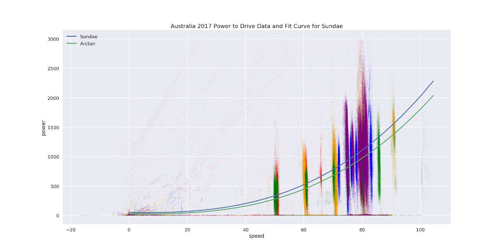

# SSCP - Power to Drive

# Power to Drive

The data used in the scatterplot can be found on ftp

red - 9_24_coober_pedy

yellow - 9_25_coober_pedy (this was a day of controlled speed runs)

green - 9_26_dingo_fence  (this was a day of controlled speed runs)

blue - 9_27_south_of_marla

purple - 9_28_kulgera

It was windy on 9/25, the yellow day.

