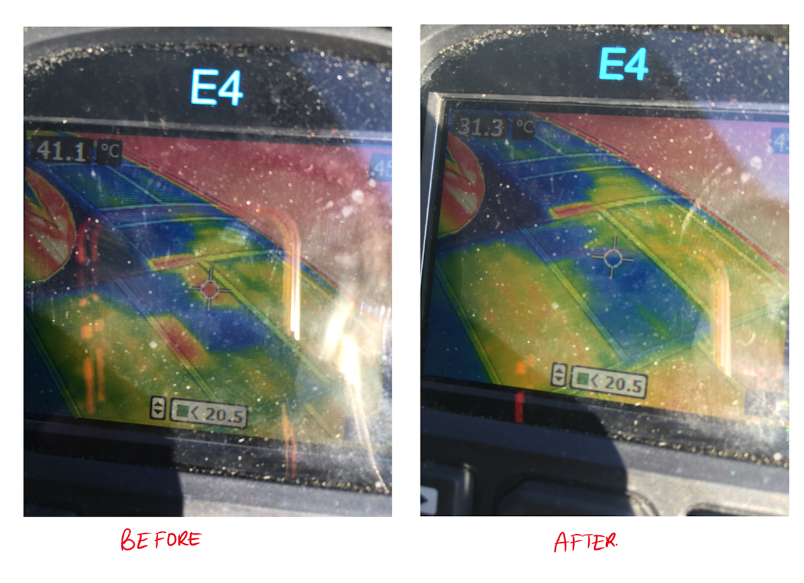

# hot-spot-testing

## SSCP - Hot spot Testing

## Hot spot Testing

Sometimes an array can be faulty, this would lead to it not producing the amount of voltage you would expect from it. A potential cause of this could be the faulty array itself or a busted diode. This will appear in the form of a hot spot on the array (You can use the FLIR to see this).

&#x20;

A common false error could be due to the flow of current from the other array cells into one of them (That has a lower voltage due to its manufacturing) since they are connected in parallel. While they have a bypass diode, the diode is not through each individual cell but instead through each combined module of cells, so this happens.

&#x20;

Since the current can not go elsewhere due to the absence of a load, this concentration of current in one module could lead to an unusual buildup of power which is lost through heat thereby causing it to warm up.

&#x20;

To confirm that this is that false error, follow the below steps:

&#x20;

Remember to carry out this test outside in the sun and don't block the array

&#x20;

1. Use the programmable DC Electronic load (300W one in the shop with the blue bezels)
2. Use a multi meter to measure the Open Circuit Voltage (OCV) across the array string (Multi meter or the Electronic load can both measure OCV)
3. Multiply the value of the open circuit voltage by 0.8 (Since Maximum Power Point (MPP) is usually around 80% of total power and this is how much the battery will pull)
4. Punch that value into the Electronic load and connect the positive and negative end of the array to the load. Remember, higher voltage side of the array is positive.
5. The Electronic load will sink the voltage, acting like the power is being used to charge the battery and you should see the hotpots slowly equalize with the rest of the array. The total temperature of the array should drop too.

Use the programmable DC Electronic load (300W one in the shop with the blue bezels)

Use a multi meter to measure the Open Circuit Voltage (OCV) across the array string (Multi meter or the Electronic load can both measure OCV)

Multiply the value of the open circuit voltage by 0.8 (Since Maximum Power Point (MPP) is usually around 80% of total power and this is how much the battery will pull)

Punch that value into the Electronic load and connect the positive and negative end of the array to the load. Remember, higher voltage side of the array is positive.

The Electronic load will sink the voltage, acting like the power is being used to charge the battery and you should see the hotpots slowly equalize with the rest of the array. The total temperature of the array should drop too.

&#x20;

Below are images of what the array will look like before and after you use the load, confirming that your arrays do indeed function as you would like them to

String with 1 Hot spot:

String with 2 hot spots:

