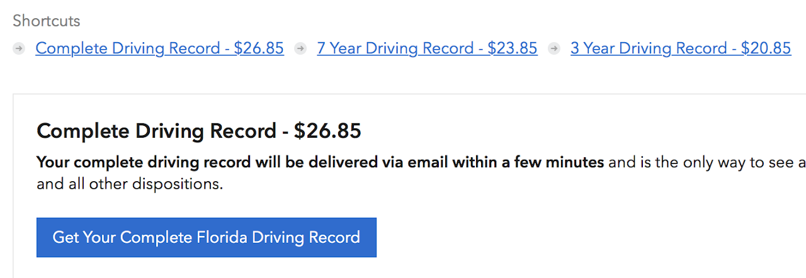
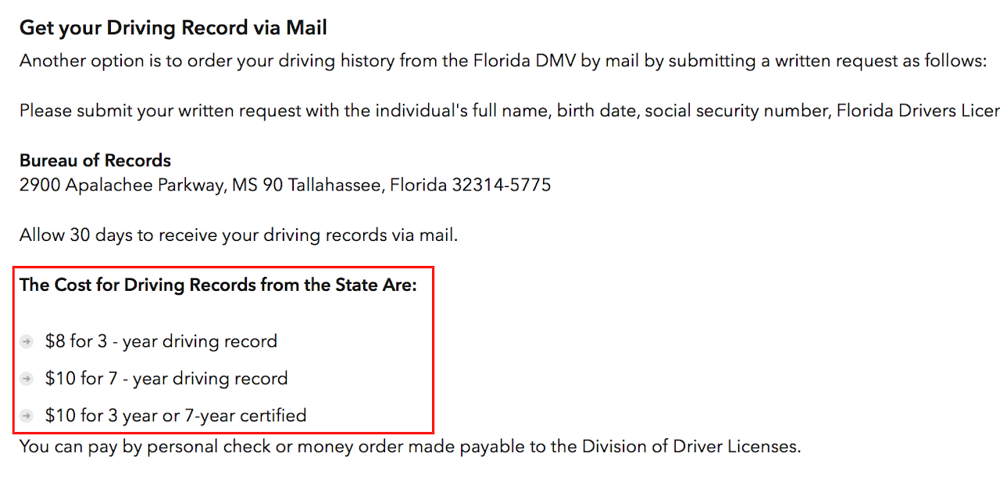

# SSCP - Van Access / Driver Authorization Form

# Van Access / Driver Authorization Form

Warning to those watching their blood-pressure: this page is high in salt.

Because Stanford hires lawyers from only the very best clown schools, we now need yet another form before we can drive our own vehicles. (This actually also applies to all University fleet vehicles, including our van and the research vehicles.)

Here's the process we must follow before we can drive our own vehicle:

1. Scan your driver's license
2. Fill out the dumb driver authorization form (attached below)From Erina's email:"If you do not have a California license, or have not had a CA license for 3 years, you must obtain a driving record from the State in which your license was issued."In other words, if you have NOT had a California driver's license for 3 years or more, you need to buy a driving record.To do so, google "[Your state] driver record DMV".Beware! The first website that came up for me was a website (dmvflorida.org, so not the actual dmv) that was trying to pull this stunt:
3. From Erina's email:
4. "If you do not have a California license, or have not had a CA license for 3 years, you must obtain a driving record from the State in which your license was issued."In other words, if you have NOT had a California driver's license for 3 years or more, you need to buy a driving record.
5. In other words, if you have NOT had a California driver's license for 3 years or more, you need to buy a driving record.
6. To do so, google "[Your state] driver record DMV".
7. Beware! The first website that came up for me was a website (dmvflorida.org, so not the actual dmv) that was trying to pull this stunt:

Scan your driver's license

Fill out the dumb driver authorization form (attached below)

1. From Erina's email:
2. "If you do not have a California license, or have not had a CA license for 3 years, you must obtain a driving record from the State in which your license was issued."In other words, if you have NOT had a California driver's license for 3 years or more, you need to buy a driving record.
3. In other words, if you have NOT had a California driver's license for 3 years or more, you need to buy a driving record.
4. To do so, google "[Your state] driver record DMV".
5. Beware! The first website that came up for me was a website (dmvflorida.org, so not the actual dmv) that was trying to pull this stunt:

From Erina's email:

"If you do not have a California license, or have not had a CA license for 3 years, you must obtain a driving record from the State in which your license was issued."

1. In other words, if you have NOT had a California driver's license for 3 years or more, you need to buy a driving record.

In other words, if you have NOT had a California driver's license for 3 years or more, you need to buy a driving record.

To do so, google "[Your state] driver record DMV".

Beware! The first website that came up for me was a website (dmvflorida.org, so not the actual dmv) that was trying to pull this stunt:

    4. So basically, a $12 service fee

    5. Just know that these marked-up services are not the only option!

    4. Send items 1-3 to Cori (cbrendel@stanford.edu)

             1. IMPORTANT: The information in your email is considered secure, so please begin your     email subject line with "SECURE: " (without the quotes)

According to Erina, you should get approval within 1-3 days. Happy paperworking!

### Embedded Google Drive File

Google Drive File: [Embedded Content](https://drive.google.com/embeddedfolderview?id=1aE8_YkO8w93G36DH3A-0UVI2hyFphIdC#list)

<iframe width="100%" height="400" src="https://drive.google.com/embeddedfolderview?id=1aE8_YkO8w93G36DH3A-0UVI2hyFphIdC#list" frameborder="0"></iframe>

