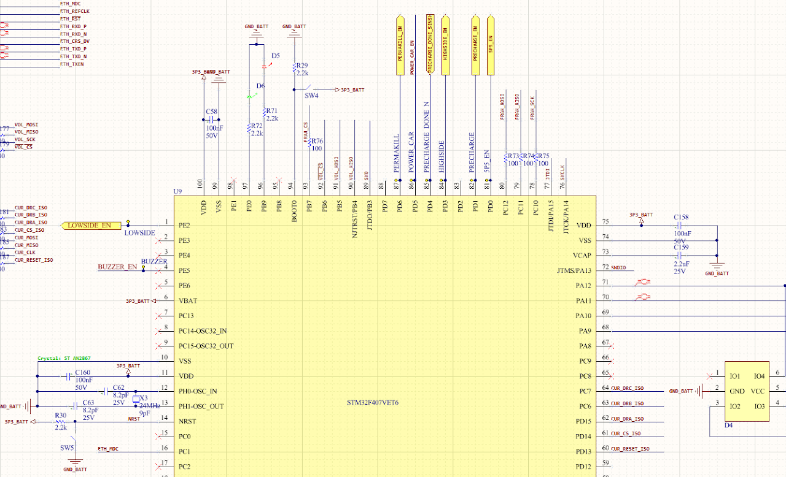
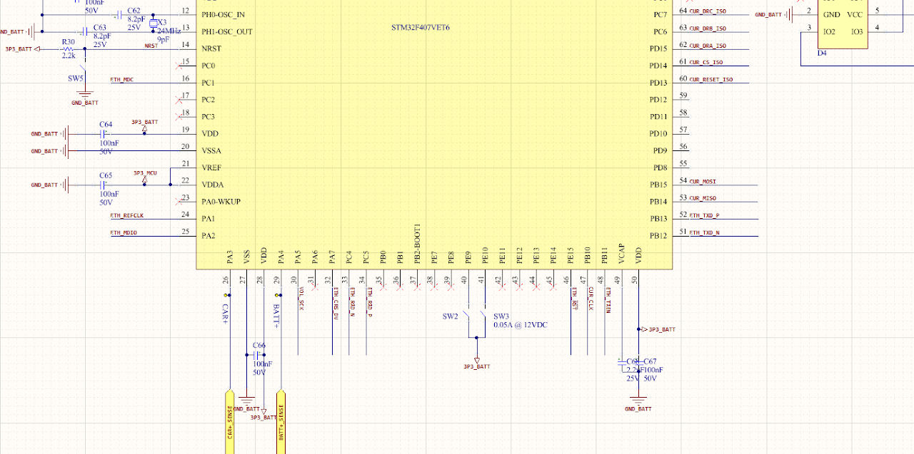

# SSCP - BMS Hardware Guide

# BMS Hardware Guide

Current Sense

MPC3903 | Datasheet

[ Datasheet](http://ww1.microchip.com/downloads/en/DeviceDoc/25048B.pdf)

Same chip as Sundae and Sunwhale cycle, the MPC3903 is just an ADC and calibration must be done by BMS software.

Communicates via SPI on SPI2 of the MCU. Four extra pins wired to allow for an isolated SPI bus in hardware, ask Sarah W. for details.

Ethernet PHY

LAN8720AI-CP | Datasheet

[ Datasheet](http://ww1.microchip.com/downloads/en/devicedoc/8720a.pdf)

Same chip as Sundae cycle.

Communicates via MDIO on ETH_MDIO of the MCU.

Microcontroller

STM32F407VET6 | Datasheet | Reference Manual | Programming Manual

[ Datasheet](https://www.st.com/resource/en/datasheet/dm00037051.pdf)

[ Reference Manual](https://www.st.com/resource/en/reference_manual/dm00031020.pdf)

[ Programming Manual](https://www.st.com/resource/en/programming_manual/dm00046982.pdf)

Same chip as Sundae and Sunwhale cycle.

Rev 1 pinout diagram from Altium:

Precharge Logic

State Diagram

Voltage Sense

LTC6804 | Datasheet & LTC6820 | Datasheet

[ Datasheet](https://www.analog.com/media/en/technical-documentation/data-sheets/680412fc.pdf)

[ Datasheet](https://www.analog.com/media/en/technical-documentation/data-sheets/6820fb.pdf)

Same chips as Sundae and Sunwhale cycle, 6804 is the voltage sense, 6820 is the SPI converter.

LTC6820 communicates via SPI on SPI1 of the MCU. LTC6804 communicates via IsoSPI of the 6820. Hardware handles IsoSPI <--> SPI conversion.

