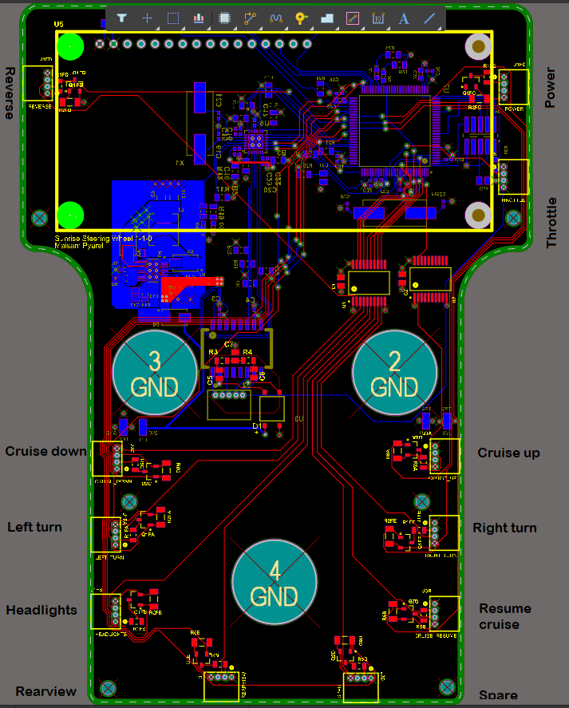
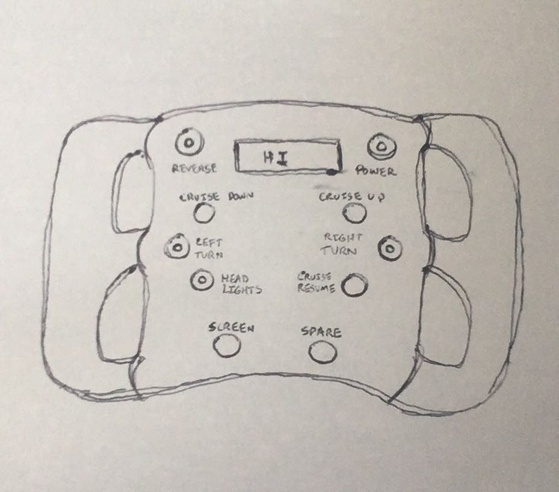
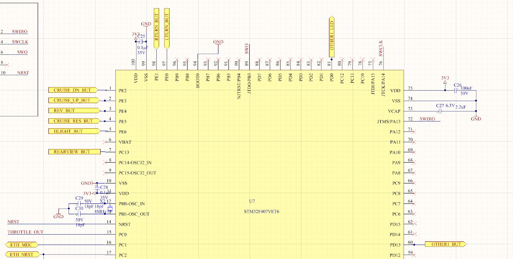
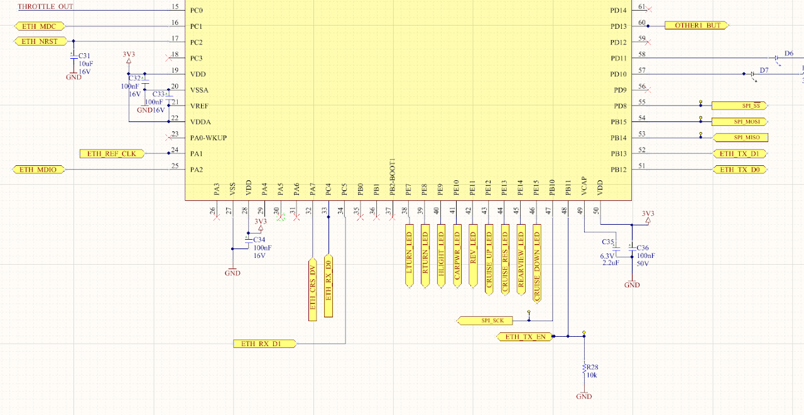
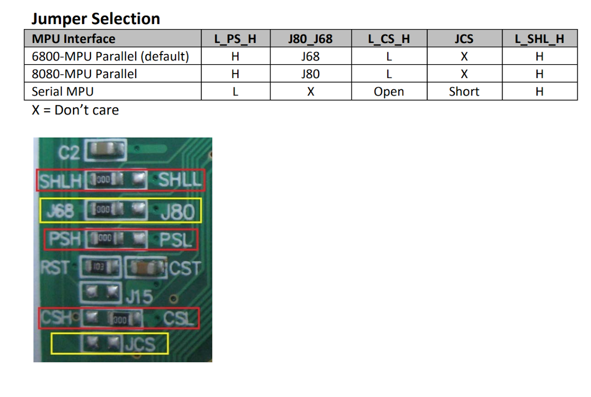
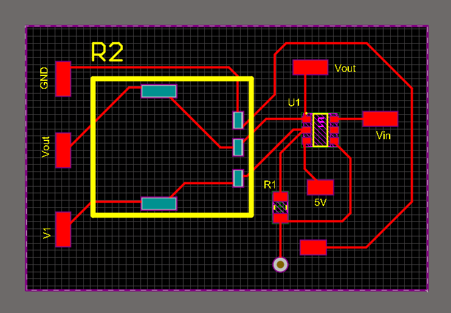

# SSCP - Steering Wheel Hardware Guide

# Steering Wheel Hardware Guide

Buttons

Datasheet

Same buttons, but different layout, from Sundae cycle.

Button layout diagrams:

Labeled board diagram from Altium:

An artist's rendition of the physical steering wheel:

The buttons with circles in the center have LEDs to indicate whether or not they are latched, the plain buttons are momentary buttons that do not latch when pressed.

Button Wiring Convention:

These are the wire colour conventions the team has decided to use while wiring Black Mamba's steering wheel

Red - LED High

White - LED low

Green - Button Activate pin

Blue - GND

Ethernet PHY

LAN8720AI-CP | Datasheet

[ Datasheet](http://ww1.microchip.com/downloads/en/devicedoc/8720a.pdf)

Same chip as Sundae cycle.

Communicates via MDIO on ETH_MDIO of the MCU.

Microcontroller

STM32F407VET6 | Datasheet | Reference Manual | Programming Manual

[ Datasheet](https://www.st.com/resource/en/datasheet/dm00037051.pdf)

[ Reference Manual](https://www.st.com/resource/en/reference_manual/dm00031020.pdf)

[ Programming Manual](https://www.st.com/resource/en/programming_manual/dm00046982.pdf)

Same chip as Sundae and Sunwhale cycle.

Rev 2 pinout diagram from Altium:

Screen

NHD-0216KZW-AG5 | Datasheet

[ Datasheet](https://www.mouser.com/datasheet/2/291/NHD-0216KZW-AG5-35894.pdf)

Communicates via SPI on SPI2 of the MCU.

Same screen as Sundae cycle. Harass your EEs and make sure they get the jumper settings right before they give it to you. i.e switch the resistors to match the serial MPU mode:

Throttle

A discrete board this cycle with op-amp and potentiometer.

Located on ADC123_IN10 of the MCU (pin PC0). V1 is the ADC line in the picture below.

### Embedded Google Drive File

Google Drive File: [Embedded Content](https://drive.google.com/embeddedfolderview?id=1F4SOPvZr1qDTirnNLjXvVGyeEIHNd6Fy#list)

<iframe width="100%" height="400" src="https://drive.google.com/embeddedfolderview?id=1F4SOPvZr1qDTirnNLjXvVGyeEIHNd6Fy#list" frameborder="0"></iframe>

