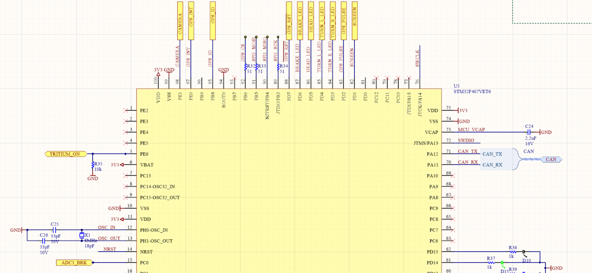
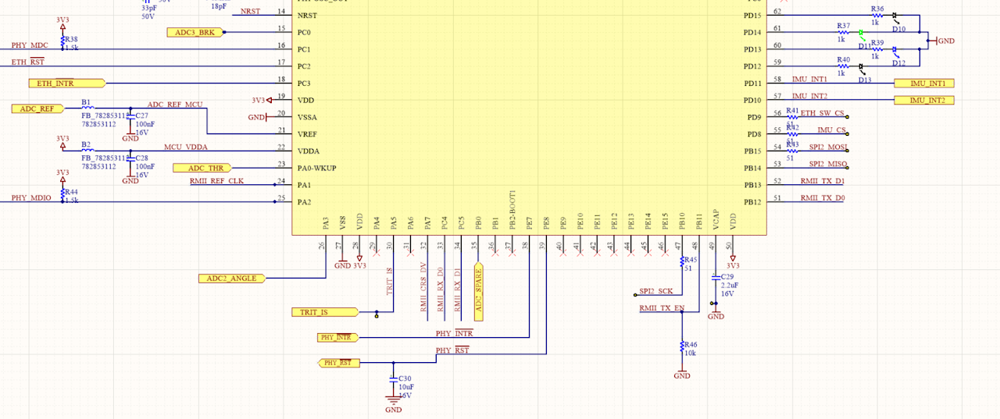
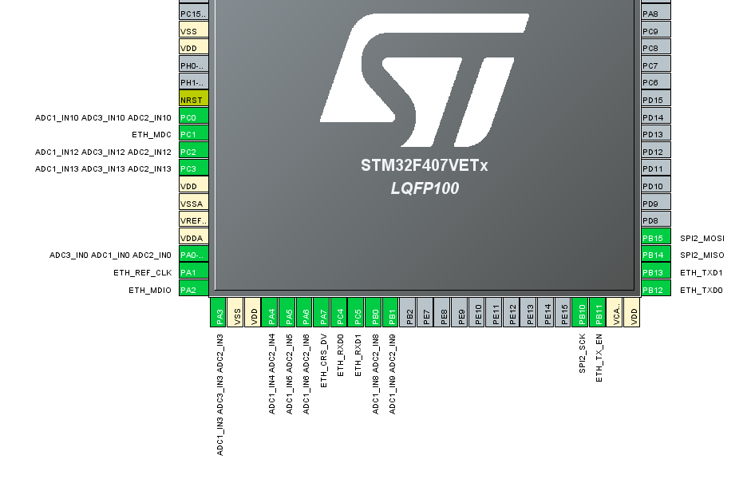

# SSCP - Vehicle Computer Hardware Guide

# Vehicle Computer Hardware Guide

Brake

Datasheet

Same sensor as Sundae cycle, but throttle was moved to steering wheel.

Located on ADC123_IN10 (pin PC0, check the datasheet) of the MCU. If necessary, throttle hardware option on pin PA0.

CAN

SN65HVD1050QDRQ1 | Datasheet

[ Datasheet](http://www.ti.com/lit/ds/symlink/sn65hvd1050-q1.pdf)

Same chip as Sundae cycle, but with updates to the magnetics.

Communicates via CAN on CAN1 of the MCU.

Ethernet PHY

LAN8720AI-CP | Datasheet

[ Datasheet](http://ww1.microchip.com/downloads/en/devicedoc/8720a.pdf)

Same chip as Sundae cycle.

Communicates via MDIO on ETH_MDIO of the MCU.

Ethernet Switch

KSZ8864RMNUB | Datasheet

[ Datasheet](http://ww1.microchip.com/downloads/en/DeviceDoc/00002229A.pdf)

Same chip as Sundae cycle.

Communicates via RMII on RMII of the MCU.

GPS

NEO-M8U | Datasheet | Protocol Manual

[ Datasheet](https://www.u-blox.com/sites/default/files/NEO-M8U_DataSheet_%28UBX-15015679%29.pdf)

[ Protocol Manual](https://www.u-blox.com/sites/default/files/products/documents/u-blox8-M8_ReceiverDescrProtSpec_%28UBX-13003221%29_Public.pdf)

New chip, uBlox offers an automotive-specific version of this chip but it had a 10-week lead time.

Communicates via SPI on SPI1 of the MCU.

IMU

ISM330DLC | Datasheet

[ Datasheet](https://www.st.com/resource/en/datasheet/ism330dlc.pdf)

An upgrade from the previous cycle's IMU, the LSM6DS33TR.

[ LSM6DS33TR](https://www.st.com/resource/en/datasheet/lsm6ds33.pdf)

Communicates via SPI on SPI2 of the MCU.

Microcontroller

STM32F407VET6 | Datasheet | Reference Manual | Programming Manual

[ Datasheet](https://www.st.com/resource/en/datasheet/dm00037051.pdf)

[ Reference Manual](https://www.st.com/resource/en/reference_manual/dm00031020.pdf)

[ Programming Manual](https://www.st.com/resource/en/programming_manual/dm00046982.pdf)

Same chip as Sundae and Arctan cycle.

Rev 3 pinout diagram from Altium:

STMCubeMX Diagram showing possible ADC configurations

