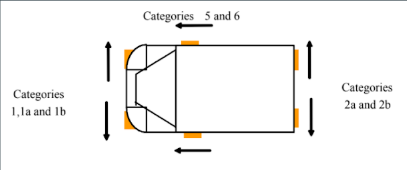
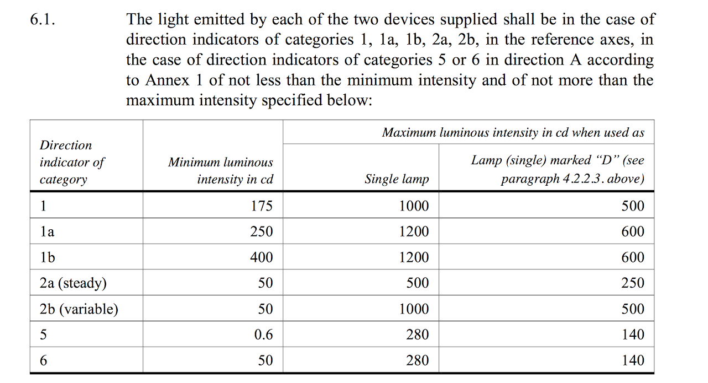
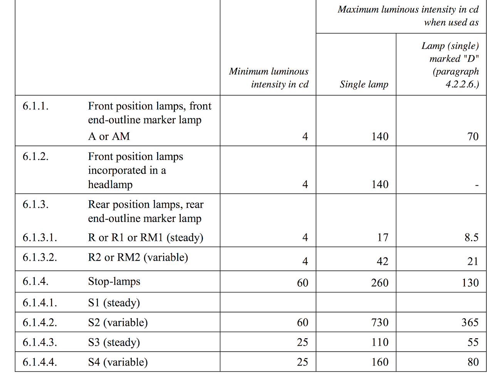
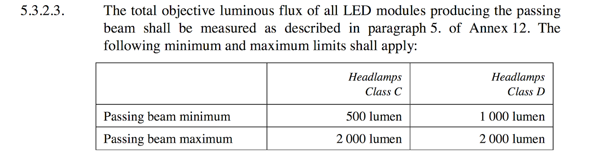
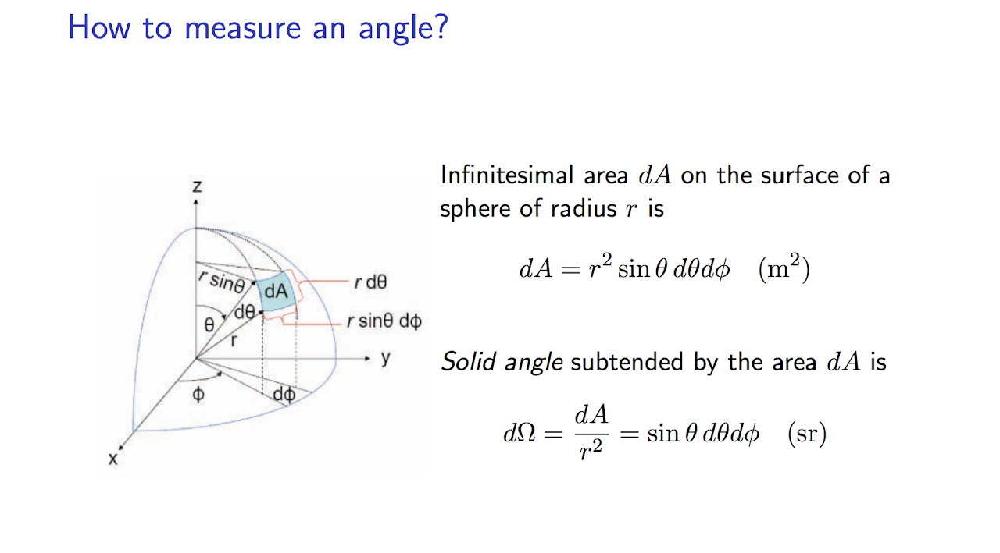
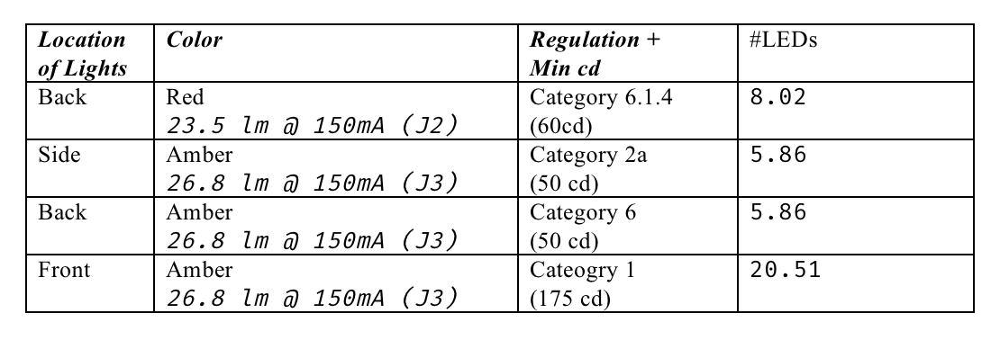
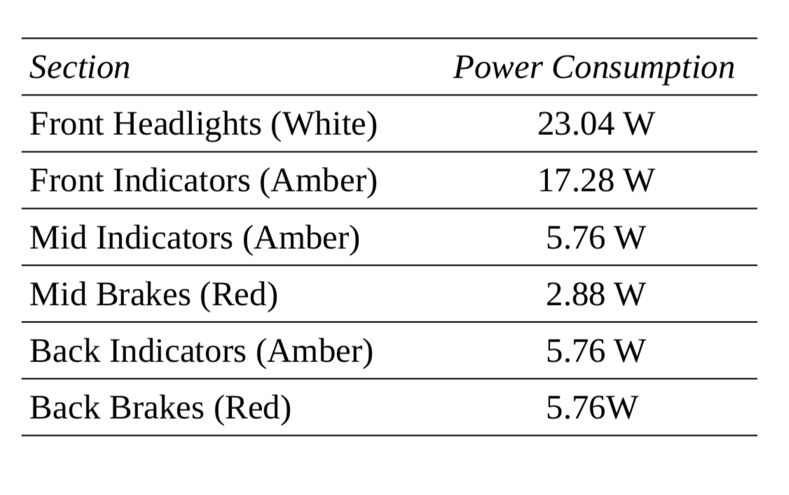

# headlights

## SSCP - Headlights

## Headlights

We are focusing on making the headlight design more efficient. Additionally, we may switch the lights to run off the high voltage to prevent high currents that impact the BMS. Updates will be posted here as we make progress.

Selected Controller: LT3492 Triple Output LED Driver

Our LEDs: http://www.cree.com/led-components/products/xlamp-leds-discrete/xlamp-ml-e

[http://www.cree.com/led-components/products/xlamp-leds-discrete/xlamp-ml-e](http://www.cree.com/led-components/products/xlamp-leds-discrete/xlamp-ml-e)

From 2016-2017 Rules:

* 2.24.1  Solar cars must be fitted with:●  two rear stop lamps●  one central stop lamp●  left and right front direction indicator lamps●  left and right side direction indicator lamps●  left and right rear direction indicator lamps2.24.2  Stop lamps must emit red light. Direction indicator lamps must emit amber light.2.24.3  Lamps must be compliant with UNECE Regulations 6, 7 and 37, or the SAE/DOT equivalents. Teams must demonstrate compliance by either:
* 2.24.1  Solar cars must be fitted with:●  two rear stop lamps●  one central stop lamp●  left and right front direction indicator lamps●  left and right side direction indicator lamps●  left and right rear direction indicator lamps
* ●  two rear stop lamps●  one central stop lamp●  left and right front direction indicator lamps●  left and right side direction indicator lamps●  left and right rear direction indicator lamps
* ●  two rear stop lamps
* ●  one central stop lamp
* ●  left and right front direction indicator lamps
* ●  left and right side direction indicator lamps
* ●  left and right rear direction indicator lamps
* 2.24.2  Stop lamps must emit red light. Direction indicator lamps must emit amber light.
* 2.24.3  Lamps must be compliant with UNECE Regulations 6, 7 and 37, or the SAE/DOT equivalents. Teams must demonstrate compliance by either:
* 2.24.1  Solar cars must be fitted with:●  two rear stop lamps●  one central stop lamp●  left and right front direction indicator lamps●  left and right side direction indicator lamps●  left and right rear direction indicator lamps
* ●  two rear stop lamps●  one central stop lamp●  left and right front direction indicator lamps●  left and right side direction indicator lamps●  left and right rear direction indicator lamps
* ●  two rear stop lamps
* ●  one central stop lamp
* ●  left and right front direction indicator lamps
* ●  left and right side direction indicator lamps
* ●  left and right rear direction indicator lamps
* 2.24.2  Stop lamps must emit red light. Direction indicator lamps must emit amber light.
* 2.24.3  Lamps must be compliant with UNECE Regulations 6, 7 and 37, or the SAE/DOT equivalents. Teams must demonstrate compliance by either:

2.24.1  Solar cars must be fitted with:

* ●  two rear stop lamps●  one central stop lamp●  left and right front direction indicator lamps●  left and right side direction indicator lamps●  left and right rear direction indicator lamps
* ●  two rear stop lamps
* ●  one central stop lamp
* ●  left and right front direction indicator lamps
* ●  left and right side direction indicator lamps
* ●  left and right rear direction indicator lamps
* ●  two rear stop lamps
* ●  one central stop lamp
* ●  left and right front direction indicator lamps
* ●  left and right side direction indicator lamps
* ●  left and right rear direction indicator lamps

●  two rear stop lamps

●  one central stop lamp

●  left and right front direction indicator lamps

●  left and right side direction indicator lamps

●  left and right rear direction indicator lamps

2.24.2  Stop lamps must emit red light. Direction indicator lamps must emit amber light.

2.24.3  Lamps must be compliant with UNECE Regulations 6, 7 and 37, or the SAE/DOT equivalents. Teams must demonstrate compliance by either:

&#x20;          ● the presence of compliance markings on the lamps, or

&#x20;          ● documentation confirmed by the certifying engineer.

* 2.24.4  Solar cars must have the correct type of lamp in each position. For example, side marker lamps may not be used as stop lamps.Lamp position and visibility requirements are based on UNECE Regulation 48.2.24.5  Rear stop lamps must be within 400 mm of the extreme outer edge of the solar car on each side, at least 600 mm apart (at least 400 mm apart if the solar car is less than 1300 mm wide), and at least 350 mm above the ground. They must be visible 15° up, 5° down and 45° to the left and right.2.24.6  A central stop lamp is required. Viewed from behind the solar car, the lateral position of the lamp must coincide with the visual centre of the solar car (see the examples in the following diagram). The lamp must be higher than a point 150 mm below the rear windscreen or canopy. The lamp must be visible 10° up, 5° down and 10° to the left and right.2.24.7  Front and rear direction indicator lamps must be within 400 mm of the extreme outer edge of the solar car on each side, at least 600 mm apart (at least 400 mm apart if the solar car is less than 1300 mm wide), and at least 350 mm above the ground.2.24.8  Side direction indicator lamps must be less than 1800 mm behind the front most part of the solar car.2.24.9  Direction indicator lamps must be visible 15° up and 5° down. Minimum horizontal visibility requirements of the right direction indicator lamps are shown in the following diagram.
* 2.24.4  Solar cars must have the correct type of lamp in each position. For example, side marker lamps may not be used as stop lamps.Lamp position and visibility requirements are based on UNECE Regulation 48.
* Lamp position and visibility requirements are based on UNECE Regulation 48.
* 2.24.5  Rear stop lamps must be within 400 mm of the extreme outer edge of the solar car on each side, at least 600 mm apart (at least 400 mm apart if the solar car is less than 1300 mm wide), and at least 350 mm above the ground. They must be visible 15° up, 5° down and 45° to the left and right.
* 2.24.6  A central stop lamp is required. Viewed from behind the solar car, the lateral position of the lamp must coincide with the visual centre of the solar car (see the examples in the following diagram). The lamp must be higher than a point 150 mm below the rear windscreen or canopy. The lamp must be visible 10° up, 5° down and 10° to the left and right.
* 2.24.7  Front and rear direction indicator lamps must be within 400 mm of the extreme outer edge of the solar car on each side, at least 600 mm apart (at least 400 mm apart if the solar car is less than 1300 mm wide), and at least 350 mm above the ground.
* 2.24.8  Side direction indicator lamps must be less than 1800 mm behind the front most part of the solar car.
* 2.24.9  Direction indicator lamps must be visible 15° up and 5° down. Minimum horizontal visibility requirements of the right direction indicator lamps are shown in the following diagram.
* 2.24.4  Solar cars must have the correct type of lamp in each position. For example, side marker lamps may not be used as stop lamps.Lamp position and visibility requirements are based on UNECE Regulation 48.
* Lamp position and visibility requirements are based on UNECE Regulation 48.
* 2.24.5  Rear stop lamps must be within 400 mm of the extreme outer edge of the solar car on each side, at least 600 mm apart (at least 400 mm apart if the solar car is less than 1300 mm wide), and at least 350 mm above the ground. They must be visible 15° up, 5° down and 45° to the left and right.
* 2.24.6  A central stop lamp is required. Viewed from behind the solar car, the lateral position of the lamp must coincide with the visual centre of the solar car (see the examples in the following diagram). The lamp must be higher than a point 150 mm below the rear windscreen or canopy. The lamp must be visible 10° up, 5° down and 10° to the left and right.
* 2.24.7  Front and rear direction indicator lamps must be within 400 mm of the extreme outer edge of the solar car on each side, at least 600 mm apart (at least 400 mm apart if the solar car is less than 1300 mm wide), and at least 350 mm above the ground.
* 2.24.8  Side direction indicator lamps must be less than 1800 mm behind the front most part of the solar car.
* 2.24.9  Direction indicator lamps must be visible 15° up and 5° down. Minimum horizontal visibility requirements of the right direction indicator lamps are shown in the following diagram.

2.24.4  Solar cars must have the correct type of lamp in each position. For example, side marker lamps may not be used as stop lamps.

* Lamp position and visibility requirements are based on UNECE Regulation 48.

Lamp position and visibility requirements are based on UNECE Regulation 48.

2.24.5  Rear stop lamps must be within 400 mm of the extreme outer edge of the solar car on each side, at least 600 mm apart (at least 400 mm apart if the solar car is less than 1300 mm wide), and at least 350 mm above the ground. They must be visible 15° up, 5° down and 45° to the left and right.

2.24.6  A central stop lamp is required. Viewed from behind the solar car, the lateral position of the lamp must coincide with the visual centre of the solar car (see the examples in the following diagram). The lamp must be higher than a point 150 mm below the rear windscreen or canopy. The lamp must be visible 10° up, 5° down and 10° to the left and right.

2.24.7  Front and rear direction indicator lamps must be within 400 mm of the extreme outer edge of the solar car on each side, at least 600 mm apart (at least 400 mm apart if the solar car is less than 1300 mm wide), and at least 350 mm above the ground.

2.24.8  Side direction indicator lamps must be less than 1800 mm behind the front most part of the solar car.

2.24.9  Direction indicator lamps must be visible 15° up and 5° down. Minimum horizontal visibility requirements of the right direction indicator lamps are shown in the following diagram.

&#x20;         2.24.10 Direction indicators must flash at 90±30 flashes per minute.

&#x20;         2.24.11 It must be possible to flash the left and right direction indicator lamps simultaneously, as a hazard warning               signal.&#x20;

Vehicle lighting had to follow UNECE regulations 6, 7, and the LED equivalent of 37, all attached below.  UNECE regulation 48 is also attached for reference, though all relevant regulations from 48 are already summarized above.

Turn signals:

Brake Lights:

Headlights (for reference, not necessary as of 2017):

Explanation of All That Stuff

You can go read the regulations in full (they're attached below).

Tl;dr --

For direction indicators (first table):

Front turn signals are category 1 (because there are no headlights on ever)

Rear turn signals are category 2a (because they don't change brightness)

Side turn signals are category 6

For brake lights (second table):

Our brake lights are category S1 (regular brake lights)

For headlights:

As of 2017 regulations, WSC does not require the car to have headlights, so ignore these regulations.  We usually fit our car with headlights because if we get stopped in the US and asked if the car is road legal, we can be like "yah look it even has headlights."  You guys can re-evaluate if you want to do this.&#x20;

How to calculate if your LEDs are bright enough:

The angle of the light produced by a single LED is considered to be the half power beamwidth--i.e. where the light produced falls to 50%.  For our LED's, this is at 60º from the center (see the datasheet).  Thus our theta for the calculation below is pi/3, and phi is 2\*pi.

Calculation of How many LEDs We Need

For 1 parallel LED (RED) = 23.5 lm (@ 150mA)

Candela = lumens / sradians

sradians = pi (upload proof later)

Candela = (23.5) / pi = 7.480 cd

Min cd for Stop Lamps (6.1.4) = 60 cd

Therefore, we need (60 / 7.480) = 8-9 LEDs for our stop lights

\*\* See Number of LEDs Calculation below for details

Trade-Offs to Consider

If you look at the datasheet for any LED, it is evident that the LED gets brighter as you raise the current.  Why not use the maximum current then? Why pick any specific current value over another?

The main tradeoff is between size and heat dissipation.  Running the LEDs at a higher current allows you to use less LEDs and thus build a smaller PCB.  However, each LED then produces more heat, and because the PCB is smaller, there is less surface area on the PCB over which to dissipate this heat, so controlling the temperature of the LEDs then becomes a bigger challenge.  It may save weight or volume overall to make a slightly larger board with more LEDs at lower currents that does not need a chunky heat sink on the back as a result.  It all depends on whether the dimensions of the board or the presence/dimensions of a heat sink are more important to you. 150mA is a good place to start as it's in the middle of the operating range--but consider moving up or down from here after testing.

Power Consumption

Below is the final layout for how the lights system is going to be arranged, as well as its power consumption.

There are eleven "sets" of lights

1. Front Headlights, Left (x24)
2. Front Headlights, Right (x24)
3. Front Indicator, Left (x24)
4. Front Indicator, Right (x24)
5. Mid Indicator, Left (x8)
6. Mid Indicator, Right (x8)
7. Mid Brake (x8)
8. Back Indicator, Left (x8)
9. Back Indicator, Right (x8)
10. Back Brake, Left (x8)
11. Back Brake, Right (x8)

Front Headlights, Left (x24)

Front Headlights, Right (x24)

Front Indicator, Left (x24)

Front Indicator, Right (x24)

Mid Indicator, Left (x8)

Mid Indicator, Right (x8)

Mid Brake (x8)

Back Indicator, Left (x8)

Back Indicator, Right (x8)

Back Brake, Left (x8)

Back Brake, Right (x8)

Below is a breakdown of the power consumption for the lights, assuming 150mA and Amber/Red Lights operating at 2.4V, and White lights operating at 3.4V:

Attached is the Clojure file used to calculate these powers (LEDPowers.clj).

#### Embedded Google Drive File

Google Drive File: [Embedded Content](https://drive.google.com/embeddedfolderview?id=1twRydTmyF32mcB_i7QzmFmbJbFCcXomi#list)
