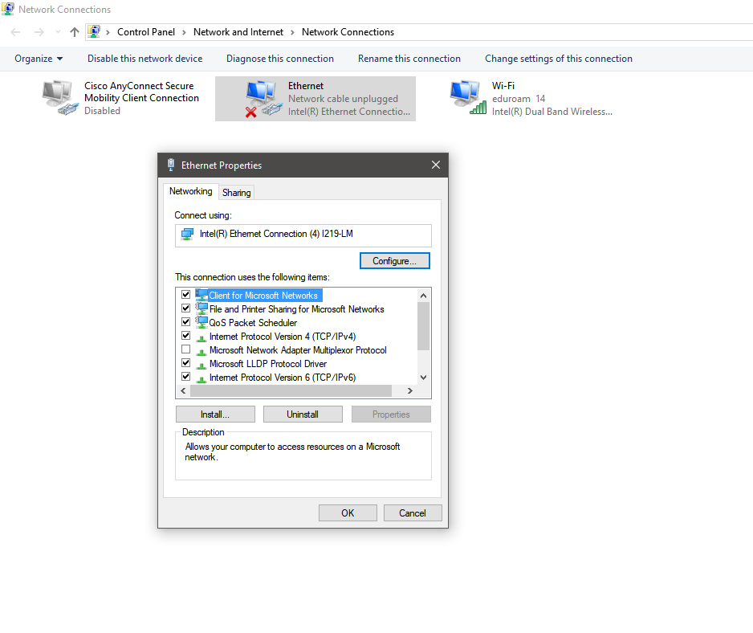
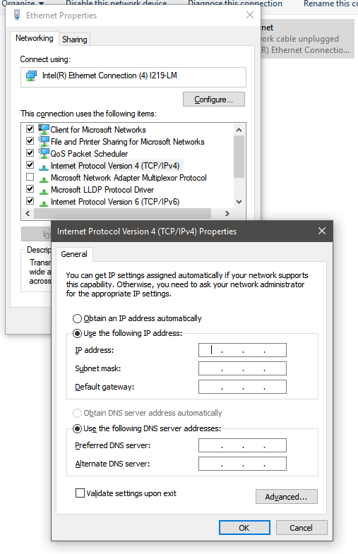

# phasor-sense

## SSCP - Phasor Sense

## Phasor Sense

PhasorSense tells the motor controllers where the Phasors in the motor are.  It is necessary to run it whenever motor controllers are changed, or motors are changed.

Here are the steps required to run Phasor Sense.  The attached folder contains all software required to run PhasorSense as well as the Tritium User-Manual and Software-Manual.

Establishing Link to Computer

1. Turn of Low-Voltage Bus power.  Elevate motorized wheels so they can spin freely without moving car.
2. You may want to disconnect one of the Tritiums so you can be sure that you are modifying the settings of the intended motor controller.
3. Connect adapter cable to CAN network.  In the past this has been a 5-pin round cable used by the car's CAN bus to the flatter trapezoid connector that plugs in to our CAN-Ethernet bridge adapter PCB.

Note: Depending on the adapter cable you use, you may not need the bridge PCB.

4. Attach CAN-Ethernet bridge to the CAN-Ethernet adapter and link this to your laptop with an Ethernet cable.
5. Re-enable Low-Voltage bus power with Can Debugger, Power Supply, or Battery Pack.
6. Run the CanBridgeConfig.exe program in the zip folder attached to this page.
7. Make sure that your computer is on the same subnet as the CAN-Ethernet bridge.  You can edit your computer ip manually using the Network Config Manager screenshotted below.  If you type in a somewhat-similar ip address to the one listed by the CanBridgeConfig, the correct subnet should fill in automatically if the field is blank.

Note: Windows networks options are finicky.  You may have to disable the ethernet adapter, make changes to ip address, then re-enable to make sure the the changes occur immediately.

Highlight the "Internet Protocol Version 4..." field and click "Properties" to manually assign the IP address.

Running PhasorSense

1. Open wsConfig.exe
2. Tools->Configuration can be used to replace the config already on the Tritum with one stored on your laptop.
3. If you successfully followed the "Establishing Link" instructions you should be able to run tools->PhasorSense.
4. Click the button in the Phasor Sense window to start collecting data.  Spin the wheel corresponding to the motor controller that you are currently modifying.
5. It should automatically write the config to the motor controller before/when you close the PhasorSense window.  You can also save the current config (with correct PhasorSense data) to your computer so you don't need to re-run it in the future when you swap motor controllers or motors.

Note: if you spin the wheel in the wrong direction during PhasorSense, the car will drive backwards.

#### Embedded Google Drive File

Google Drive File: [Embedded Content](https://drive.google.com/embeddedfolderview?id=1yV-KSa5-0cd15MgIUAAqgzSmOgsuNEfb#list)
