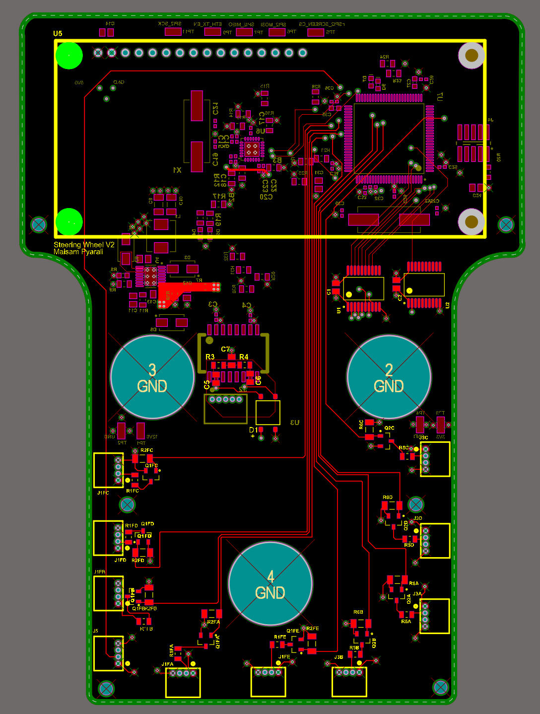

# steering-wheel

## SSCP - Steering Wheel

## Steering Wheel

This page gives the high level overview of the set up and components for sunrise's steering wheel. Before we begin, soak in the beauty of this PCB (especially accentuated by Altium's colouring scheme). Special thanks to Maggie, Sarah, Ricardo and Kate for walking me through the design of this board, you lot are gems!

In case of any questions, feel free to reach out to Maisam Pyarali on maisam@stanford.edu

[maisam@stanford.edu](mailto:maisam@stanford.edu)

(Can be found on SVN sunrise\electrical\projects\SteeringWheel)

This PCB has 5 key parts:

* The ScreenMCUEthernetConnectors (to buttons and throttle)'The power ConvertorTest point.
* The Screen
* MCU
* Ethernet
* Connectors (to buttons and throttle)'
* The power Convertor
* Test point.

1. The Screen
2. MCU
3. Ethernet
4. Connectors (to buttons and throttle)'
5. The power Convertor
6. Test point.

The Screen

MCU

Ethernet

Connectors (to buttons and throttle)'

The power Convertor

Test point.

1. The Screen:

The screen we are used for the steering wheel for the sunrise cycle was an off the shelf OLED Display Module (NEWHAVEN OLED GREEN NHD-0216KZW-AG5). The Datasheet should be linked and all relevant information on the screen should be on there. Please note that the default for the screen out of the box is for the screen to be compatible with an MPU that runs in parallel, and we don't want that. On page 4 of the datasheet is a jumper selection list, please modify the five jumpers so that they are in "Serial MCU" configuration and make sure that none of the High side of the jumpers (left side) is touching the Low side of the jumpers (right side).

[NEWHAVEN OLED GREEN NHD-0216KZW-AG5](https://www.mouser.com/datasheet/2/291/NHD-0216KZW-AG5-35894.pdf)

The information coded to be displayed in the screen was:

* Speed of the vehicleBattery CurrentBattery VoltageBMS State
* Speed of the vehicle
* Battery Current
* Battery Voltage
* BMS State
* Speed of the vehicle
* Battery Current
* Battery Voltage
* BMS State

Speed of the vehicle

Battery Current

Battery Voltage

BMS State

2. The MCU:

This is the brain of the PCB, it takes in inputs from the buttons, throttle and Ethernet&#x20;
