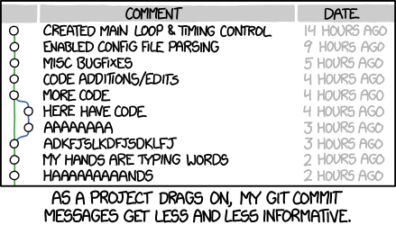

# svn-protocoletiquette

## SSCP - SVN Protocol/Etiquette

## SVN Protocol/Etiquette

SVN is our repository of designs, it is a tool for collaboration.  In order to protect other's designs while still sharing designs, it is important to make sure it is used properly.  Group effort is required to keep it tidy and pleasant to use for everybody.  Here is what should be done:

* SVN is for "source" files only. That means that only files that are required to generate outputs are to be stored. Do not commit temporary files (ie, Solidworks \~. files, FreePCB .bak files, TinyCAD .autosave files, etc). You may set up a TortoiseSVN filter to ignore those files. Do not add files that are not needed.  Any file that another user would not click on to open the file/required to open the needed file should not be added. (history files, temporary files, etc.)Update Often - saves you the headache of large downloads and keeps conflicts from happening.Respect the directory structure already in place, and avoid creating narrowly focused top-level directories.When adding new projects, follow the structure of similar projects added before it.When committing, use useful commit messages!
* SVN is for "source" files only. That means that only files that are required to generate outputs are to be stored. Do not commit temporary files (ie, Solidworks \~. files, FreePCB .bak files, TinyCAD .autosave files, etc). You may set up a TortoiseSVN filter to ignore those files. Do not add files that are not needed.  Any file that another user would not click on to open the file/required to open the needed file should not be added. (history files, temporary files, etc.)
* Update Often - saves you the headache of large downloads and keeps conflicts from happening.
* Respect the directory structure already in place, and avoid creating narrowly focused top-level directories.
* When adding new projects, follow the structure of similar projects added before it.
* When committing, use useful commit messages!
* SVN is for "source" files only. That means that only files that are required to generate outputs are to be stored. Do not commit temporary files (ie, Solidworks \~. files, FreePCB .bak files, TinyCAD .autosave files, etc). You may set up a TortoiseSVN filter to ignore those files. Do not add files that are not needed.  Any file that another user would not click on to open the file/required to open the needed file should not be added. (history files, temporary files, etc.)
* Update Often - saves you the headache of large downloads and keeps conflicts from happening.
* Respect the directory structure already in place, and avoid creating narrowly focused top-level directories.
* When adding new projects, follow the structure of similar projects added before it.
* When committing, use useful commit messages!

SVN is for "source" files only. That means that only files that are required to generate outputs are to be stored. Do not commit temporary files (ie, Solidworks \~. files, FreePCB .bak files, TinyCAD .autosave files, etc). You may set up a TortoiseSVN filter to ignore those files. Do not add files that are not needed.  Any file that another user would not click on to open the file/required to open the needed file should not be added. (history files, temporary files, etc.)

Update Often - saves you the headache of large downloads and keeps conflicts from happening.

Respect the directory structure already in place, and avoid creating narrowly focused top-level directories.

When adding new projects, follow the structure of similar projects added before it.

When committing, use useful commit messages!

* When adding to electrical libraries, use these steps;1. Update SVN2. Recompile the libraries. (should be intlib)3. Lock the file you want to change (go to schlib)4. Add your part (save, recompile, check that it works)5. Commit your changes (should unlock the file)6. Repeat 1 and 2 (might as well)
*
  1. Update SVN2. Recompile the libraries. (should be intlib)3. Lock the file you want to change (go to schlib)4. Add your part (save, recompile, check that it works)5. Commit your changes (should unlock the file)6. Repeat 1 and 2 (might as well)
*
  1. Update SVN2. Recompile the libraries. (should be intlib)3. Lock the file you want to change (go to schlib)4. Add your part (save, recompile, check that it works)5. Commit your changes (should unlock the file)6. Repeat 1 and 2 (might as well)
*
  2. Recompile the libraries. (should be intlib)
*
  3. Lock the file you want to change (go to schlib)
*
  4. Add your part (save, recompile, check that it works)
*
  5. Commit your changes (should unlock the file)
*
  6. Repeat 1 and 2 (might as well)

When adding to electrical libraries, use these steps;

*
  1. Update SVN2. Recompile the libraries. (should be intlib)3. Lock the file you want to change (go to schlib)4. Add your part (save, recompile, check that it works)5. Commit your changes (should unlock the file)6. Repeat 1 and 2 (might as well)
*
  1. Update SVN2. Recompile the libraries. (should be intlib)3. Lock the file you want to change (go to schlib)4. Add your part (save, recompile, check that it works)5. Commit your changes (should unlock the file)6. Repeat 1 and 2 (might as well)
*
  2. Recompile the libraries. (should be intlib)
*
  3. Lock the file you want to change (go to schlib)
*
  4. Add your part (save, recompile, check that it works)
*
  5. Commit your changes (should unlock the file)
*
  6. Repeat 1 and 2 (might as well)
*
  1. Update SVN2. Recompile the libraries. (should be intlib)3. Lock the file you want to change (go to schlib)4. Add your part (save, recompile, check that it works)5. Commit your changes (should unlock the file)6. Repeat 1 and 2 (might as well)
*
  2. Recompile the libraries. (should be intlib)
*
  3. Lock the file you want to change (go to schlib)
*
  4. Add your part (save, recompile, check that it works)
*
  5. Commit your changes (should unlock the file)
*
  6. Repeat 1 and 2 (might as well)

1. Update SVN

*
  2. Recompile the libraries. (should be intlib)
*
  3. Lock the file you want to change (go to schlib)
*
  4. Add your part (save, recompile, check that it works)
*
  5. Commit your changes (should unlock the file)
*
  6. Repeat 1 and 2 (might as well)

2. Recompile the libraries. (should be intlib)
3. Lock the file you want to change (go to schlib)
4. Add your part (save, recompile, check that it works)
5. Commit your changes (should unlock the file)
6. Repeat 1 and 2 (might as well)
