# SSCP - Wiring

# Wiring

Sunrise Wiring Diagram

           

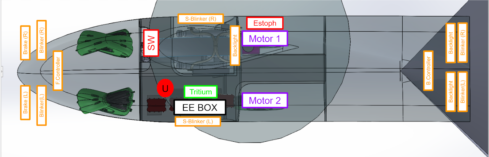

EE Box Contains:

- Mid Lights Controller Board

- Vehicle Computer

- BMS + Battery

- Tritium Motor Controllers x2

- High Voltage Box

Wire lengths, connectors, and crimps for Sunrise

### Embedded Content

Embedded content: [Embedded Content]()

<iframe width="100%" height="400" src="" frameborder="0"></iframe>

Below is a list of wiring and connectors for each point-to-point connection in the car:

### Bottomshell

From Vehicle Computer

Each of these connections ends on the Vehicle Computer side in a Deutsch DT12 connector.  Required parts to build the DT connectors mating with the VC Deutsch Box are as follows:

### Embedded Content

Embedded content: [Custom embed]()

<iframe width="100%" height="400" src="" frameborder="0"></iframe>

See the instructional video here on how to assemble the connector: https://www.youtube.com/watch?v=jE712DGw8CY

[https://www.youtube.com/watch?v=jE712DGw8CY](https://www.youtube.com/watch?v=jE712DGw8CY)

Additionally, the crimper box contains a sheet with information on how wires should be stripped prior to crimping.  Only use the Deutsch crimper to make these crimps.

Below is an image of the VC pinout for Sunrise VC 1_2_0.

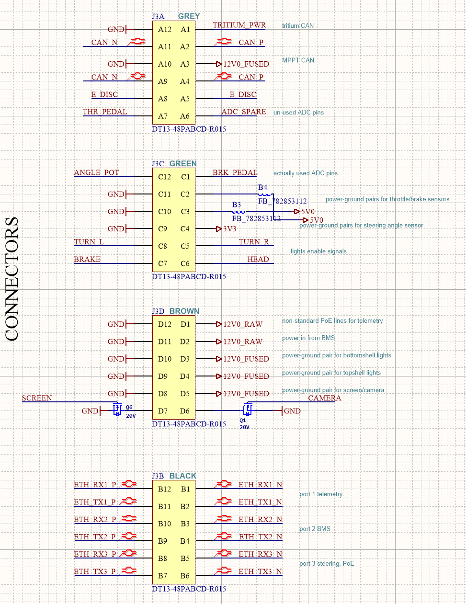

Note these are not arranged in the same order as they will be arranged in the header of the box.  The below image shows the order of the connectors when VC is viewed from above:

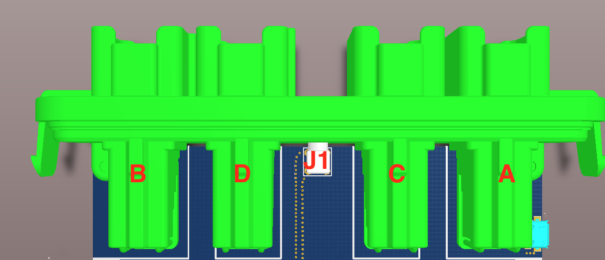

### Umbilical Cord Connector

(MALE -> 1734-1203-ND / FEMALE -> 1734-1226-ND)

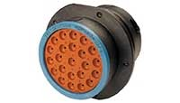

Center

A

Inner circle (MPPT outputs)

B: MPPT A +

C: MPPT B + 

D: MPPT C + 

E  

F:  MPPT A - 

G: MPPT B - 

H   MPPT C - 

J: 

Outer circle

K:  Blink Left Enable (RED)

L:  Blink Right Enable (GREEN)

M:  Brake Enable (WHITE)

N:  Headlight Enable (BLACK)

O:  12 V

P:  GND

Q:  LV+       (Phoenix cable RED)

R:  LV-        (Phoenix cable BLACK)

S:  CAN H    (Phoenix cable WHITE)

T:  CAN L     (Phoneix cable BLUE)

U:  EDisc in

V:  EDisc out

W:  

X:  

### CAN:

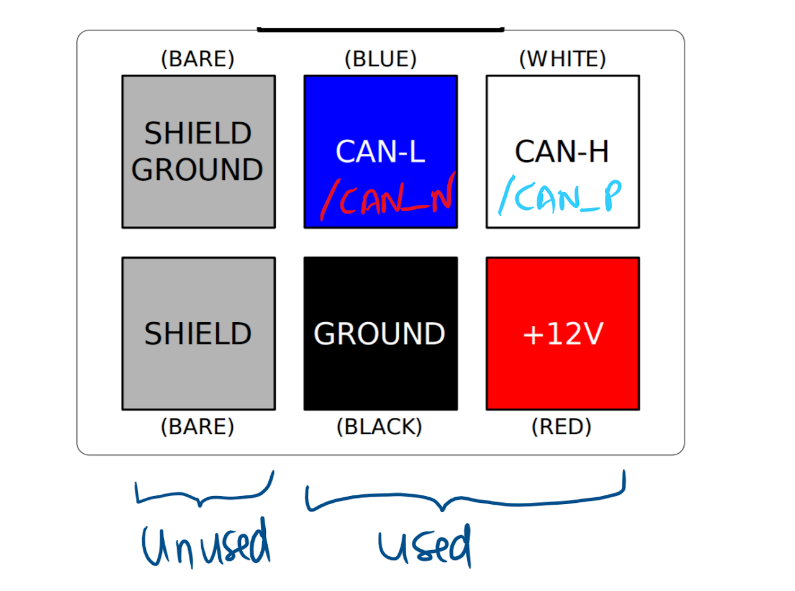

### Ethernet:

BMS Pack-side Connector:

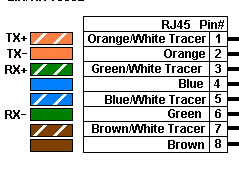

4 Pair Ethernet wire Colour convention

TX+ Red

TX- Black

RX+ White

RX- Green

Below is the wiring diagram for the Ethernet:

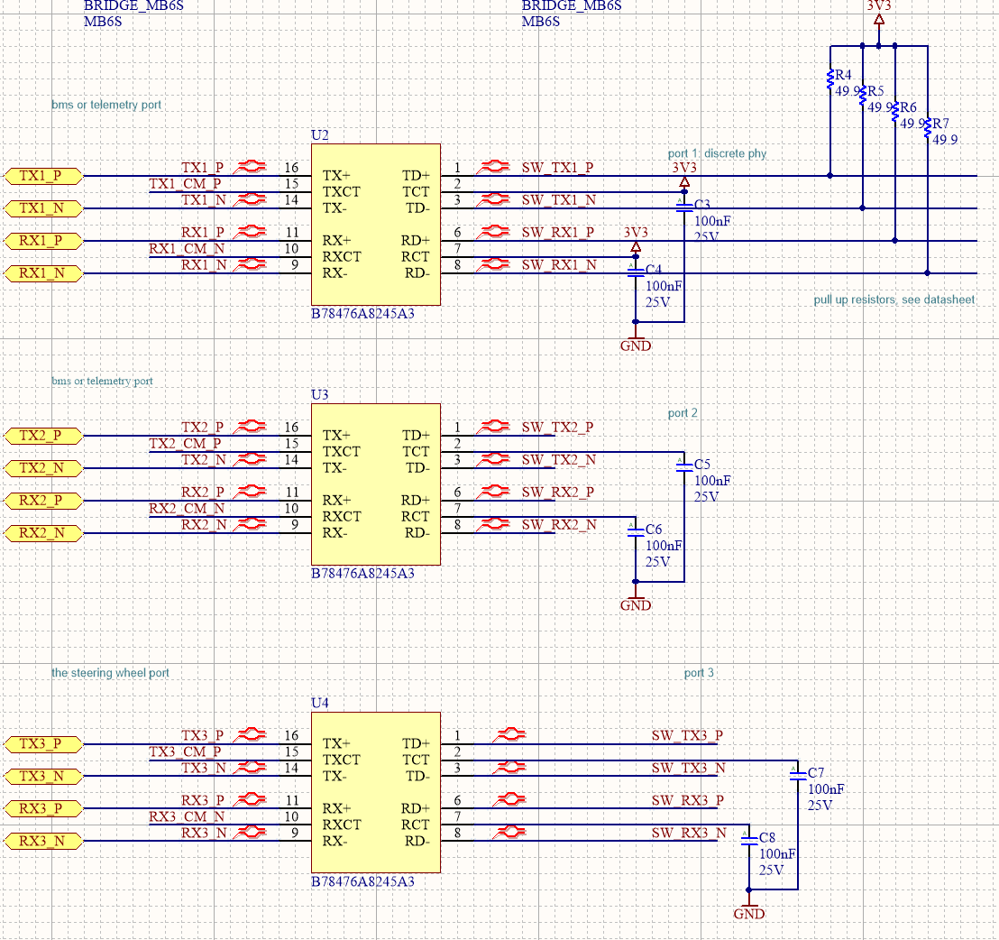

Note the ports for the Steering wheel

Car-side Connector:

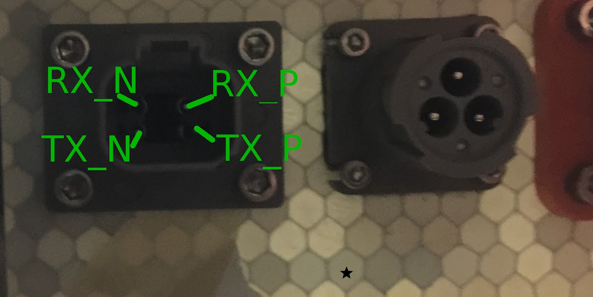

### Steering Wheel Connector:

Make many of these, you will need the spares. Altertivelym solder them well the first time and add a ton of super glue / Epoxy to it

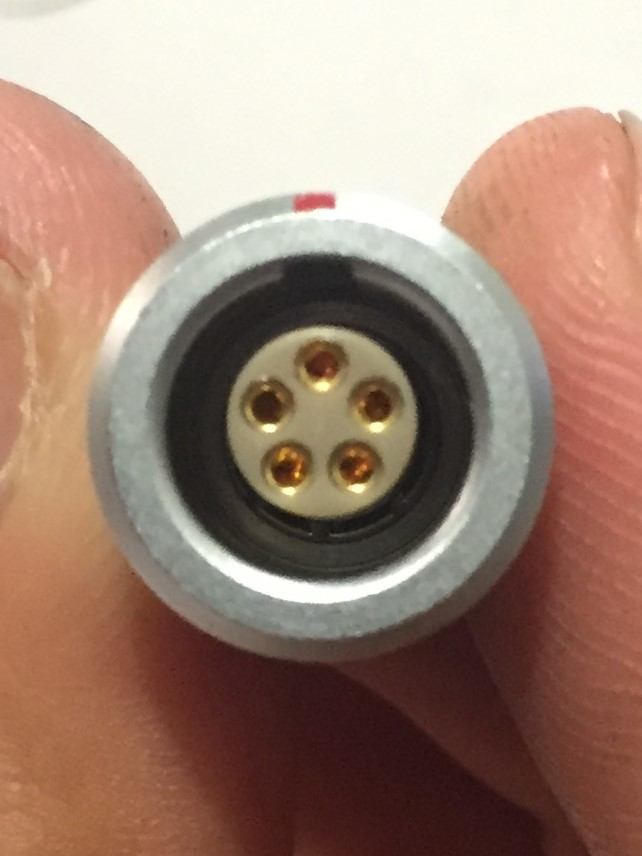

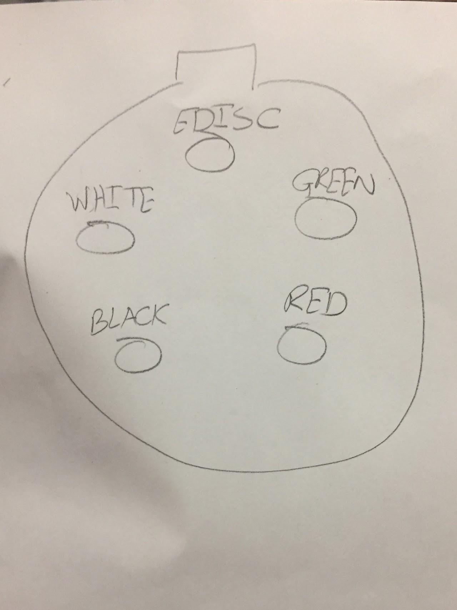

### Ethernet wire to RJ45 wire

Red - Striped Orange

White - Striped Green

Black - Solid Orange

Green - Solid Green

The wiring and connectors needed for each connection from VC are listed below, organized by their other endpoint:

1. VC-> BMS

    a. Power

        - cable: 2-conductor Alphawire 

        - connector (BMS side): 3-position Deutsch HD10 (do not plug leftover pin, it's for Edisc)

    b. Ethernet

        - cable: 2-pair/4-conductor Belden

        - connector (BMS side): Deutsch DT4

2. VC-> Steering Wheel

    a. Ethernet + Edisc

        - cable: 2-pair/4-conductor Belden

        - connector (SW side): Lifeline p/n 410-200-019

3. VC-> Umbilical

    a. MPPT CAN

        - cable: Phoenix 5-conductor

        - connector: Phoenix A-code 5-pin (built in to cable); ends at Umbilical connector

    b. Edisc

        - cable: a single conductor, can be red array wiring

        - connector: Umbilical

    c. Power for Taillights, Rear Turn Signals 

        - cable: 2-conductor Alphawire x 3 (Taillights, L turn, R turn)

        - connector: Umbilical

4. VC-> Pedals

    a. Power + Signal

        - cable: 3-conductor Alphawire x 2 (Throttle, Brake)

        - connector: Ampseal connector

5. VC-> Headlights, Front Turn Signals, and Side Lights

    a. Controller Boards

    b. LED boards

6. VC-> Rear View System

    a. Power

7. VC-> Handheld Radio Microphone

    a. Switch

8. VC-> GPS Antenna

    a. Feed

9. VC-> Wifi Antenna

    a. Ethernet

10. VC-> Tritiums

    a. Tritium CAN

### From BMS

Harnesses that include BMS as one endpoint but do not go to VC are the wiring to power the motors (other endpoint is the Tritiums), wiring to the MPPTs (other endpoint is the Umbilical), and wiring to the 

1. BMS-> Tritiums

    a. HV Power (L+R)

2. BMS->HV Splitter Box

    a. HV Power

HVA-280 Assembly manual

[HVA-280 Assembly manual](http://www.te.com/commerce/DocumentDelivery/DDEController?Action=showdoc&DocId=Specification+Or+Standard%7F408-10299%7FB%7Fpdf%7FEnglish%7FENG_SS_408-10299_B.pdf%7F1587826-2)

### From HV Splitter Box

1. HV Splitter Box-> Umbilical

    a. HV Power (for MPPTs)

### Tritiums->Motors

1. Motor Resolver Cable

    a. Signal

2. 3-Phase Power

    a. HV Power

Lights Controllers:

Below is the wiring schematic for the light controller boards

Front Controller:

12V - Red (2 Pair)

GND - Black (2 Pair)

Right Indicator EN - White (Pair3 Pair)

Left Indicator EN - Black (3 Pair)

Headlight EN - Red (3 Pair)

Back Controller:

12V - Red (2 Pair)

GND - Black (2 Pair)

Right Indicator EN - White (Pair3 Pair)

Left Indicator EN - Black (3 Pair)

Brake EN - Red (3 Pair)

Mid Controller:

12V - Red (2 Pair)

GND - Black (2 Pair)

Right Indicator EN - White (Pair3 Pair)

Left Indicator EN - Black (3 Pair)

Brake EN - Red (3 Pair)

### Topshell:

From Umbilical

1. Umbilical-> MPPTs

    a. MPPT CAN

    b. HV Power

    

2. Umbilical-> Edisc button

    a. Edisc (x2)

3. Umbilical-> Taillights, Rear Turn Signals

Array:

We used 22 AWG speaker wire for all module tab connections (soldered to PCB boards to attach to the array flat wire tabs). We used ~350ft of wire.

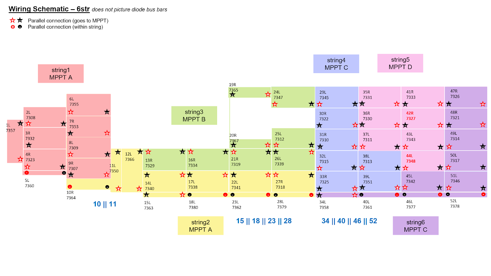

<< insert photo of array string +/- connectors >>

<< insert photo of array harness >>

<< comment on array harness cap and diode block >>

<< list diodes used >>

MPPT Connectors

We use the Ampseal 14 POS Housing for array wiring with 1.3 mm crimps. The pinout is as below:

[Ampseal 14 POS](https://www.te.com/usa-en/product-776273-1.html)

[1.3 mm crimps](https://www.te.com/usa-en/product-CAT-AM78-T273.html?c=538089&compatible=776273-1)

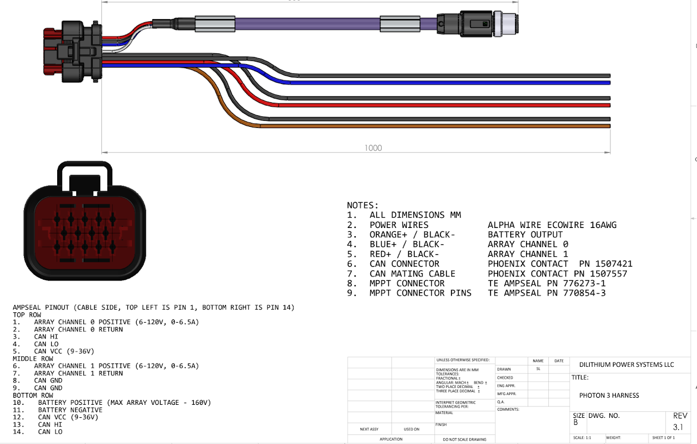

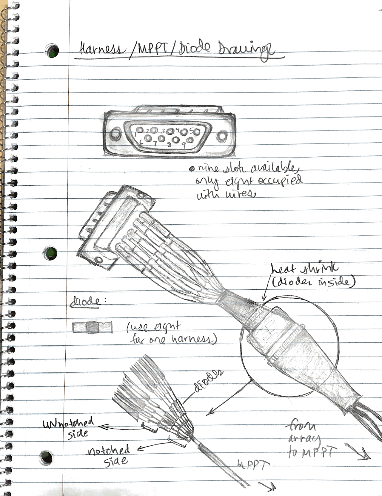

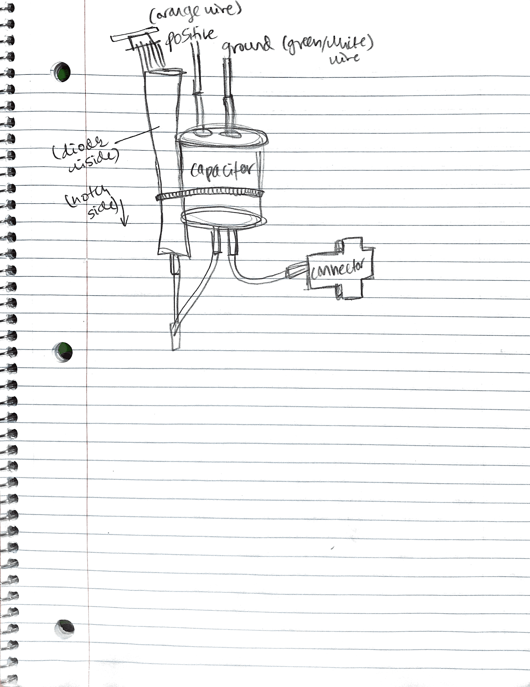

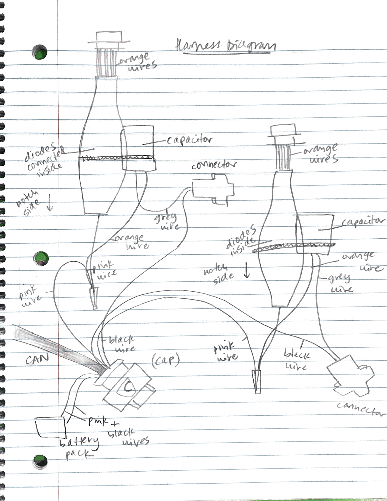

Harness Overview Image:

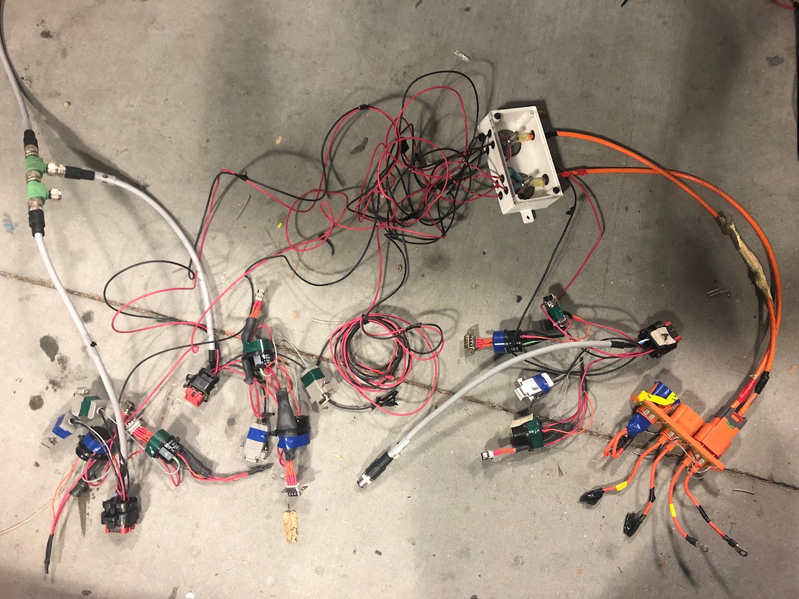

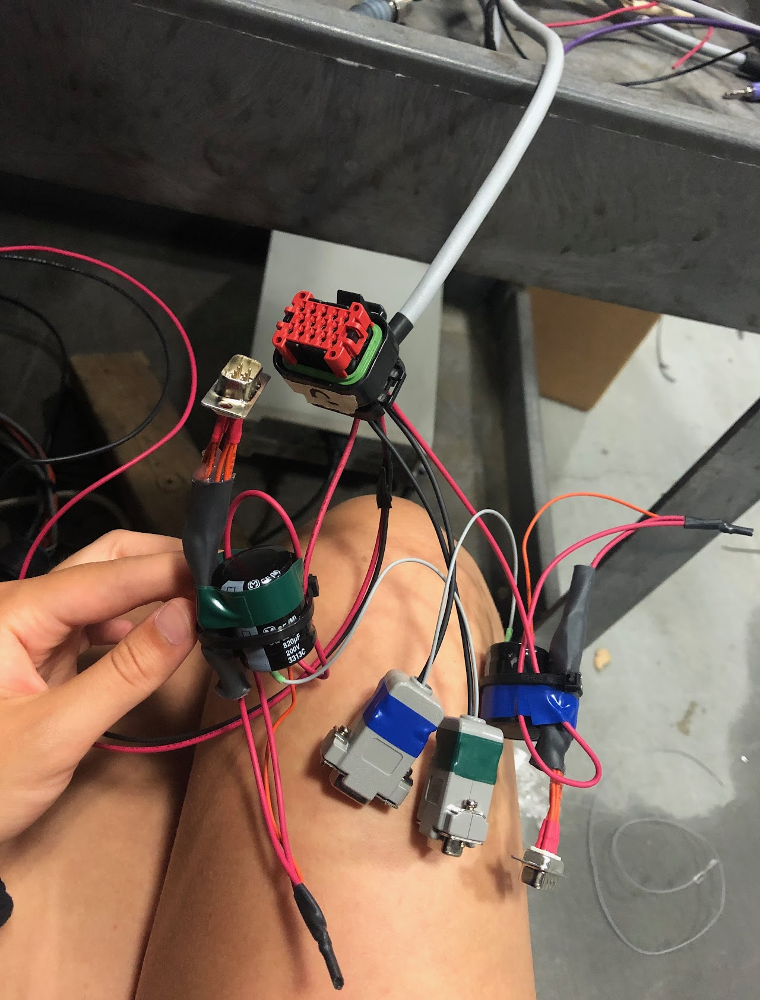

### Embedded Google Drive File

Google Drive File: [Embedded Content](https://drive.google.com/embeddedfolderview?id=1uygxgJ-h0BhuSPjIUrTgxoMrbFEyPy38#list)

<iframe width="100%" height="400" src="https://drive.google.com/embeddedfolderview?id=1uygxgJ-h0BhuSPjIUrTgxoMrbFEyPy38#list" frameborder="0"></iframe>

