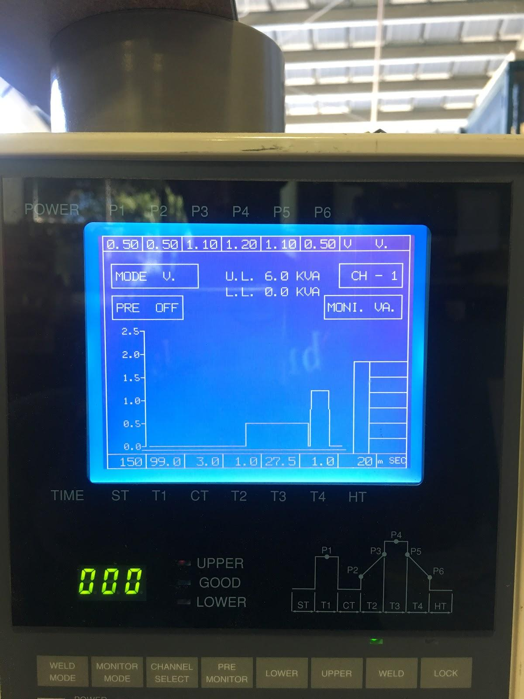

# battery-module-manufacturing

## SSCP - Battery Module Manufacturing

## Battery Module Manufacturing

See the attached slides for a step-by-step procedure for the battery module manufacturing process with corresponding pictures. Important note: we made sure to keep the egg-carton-like packaging the cells came in so that cells could be placed securely back into the packaging between each manufacturing step to decrease the risk of shorting. In order to prevent shorting, we did not carry more than a single cell in each hand at a time.

Some of the pictures in the build book slides are not entirely representative of the final manufacturing process we implemented. Refer to these notes while looking at the attached slides.

Notes on each step:

Top clamshell:

Step 1: The pictures in the slides show a piece of 2x4 as the wooden fixture plate we used, but this was only used while initially figuring out the manufacturing process. During actual manufacturing, the fixture plates we used were laser-cut pieces of 1/4" thick Duron that specifically matched the shape of the clamshell (as indicated by the sharpie drawing in the slides), which was easier to handle.&#x20;

Step 3: Cutting the laminate off of each end of the cell was done by placing a razor blade at the desired point on the cell and rolling the cell on the table to cut all the way around. We were sure to cut enough of the laminate off so that epoxy was bonding to the metal of the cell rather than the laminate when integrated into the module. We cut all of the cells at once so that all the cells we needed for future steps were already prepared.

Step 4: The surface prep was done in an assembly line at a single table, with the egg-carton-like cell packaging in the center of the table. The packaging was divided into 3 distinct areas - "acetone-d" cells, sanded cells, and completed cells.&#x20;

Person/Group 1: Cleaned each end of the cell with acetone and placed it back in the center in the area for "acetone-d" cells.

Person/Group 2: Took a cell from the "acetone-d" area, and sanded each end of the cell. (There were several good techniques for this, one that worked quite well was putting a piece of sandpaper between your index finger and thumb, and rolling the cell in this area 5 to 10 times.) The sanding needed to be visibly noticeable on the metal before moving on. We were careful not to sand the weld area on the flat end of the cell, and only sand the bond area where epoxy would go around the cell. The cell was then placed back in the center in the separate area for sanded cells.

Person/Group 3: Took a cell from the sanded area, cleaned each end of a sanded cell with acetone, and placed the completed cell in the separate "completed" area in the center.

We did not use IPA on the cells - it is conductive.

Once a large number of cells had been prepared, a separate group at another end of the table began placing completed cells into clamshells while the first group continued surface prep. In order to ensure we were placing the cells in the correct orientation, we had a drawing/sketch in the middle of the table to reference during the build process, indicating where positive and negative terminals should go.&#x20;

(Note: in our case the "top clamshell" was the one on the fixture plate (the bottom one in the pictures), and the "bottom clamshell" was the one that was placed over the cells (the top one in the pictures)). The picture in the slides shows all the cells placed into the top clamshell before the bottom clamshell was placed over them. Doing it this way made it very difficult to place the bottom clamshell over the cells, since all 18 of the cells had to line up with all 18 holes (it also increased the danger of knocking cells over, increasing the risk of shorting), and we wouldn't recommend doing it this way.&#x20;

Instead, we initially placed two cells into the top clamshell, one in each corner, and placed the bottom clamshell over these two. We then held up the bottom clamshell with two pieces of PVC pipe cut to the correct length. We then placed the remaining 16 cells through both the bottom and top clamshells. Once done, the module looked like the first image on the Step 5 slide.

Step 5: We used small syringes to add epoxy around each of the cells in the bottom clamshell. We were careful not to put epoxy on the outside edges of the clamshell or over the locating pins (used for positioning lamination and collector plates). After putting epoxy around each cell, each cell was rotated by hand to smear the epoxy around each clamshell hole. While doing this, we were careful not to get epoxy on the weld area of the cell, but this happened regardless - when it did, we used acetone to wipe away the epoxy as best we could. Masking the cells before adding epoxy probably would have prevented this issue.

Step 6: We first placed our laser-cut lamination over the locating pins. Once this was securely on, we placed the collector plate over the locating pins. We used our fingers to push these layers together and ensure that the locating pins were still clearing the top of the collector plate (the clamshell wanted to sag, especially in the middle - this step had to be done delicately).

Step 7: Again, the fixture plate shown in the pictures in the slides are not what we ultimately used. For these fixture plates, we again had laser-cut pieces of Duron in the specific shape of the clamshell. Holes were laser-cut into these Duron plates to allow the clamshells to be mechanically attached to the plates using M4 bolts and nuts (as shown in the picture). We put Teflon tape on the Duron fixture plates to make them easier to take off once curing was complete. It was important to be careful while attaching the fixture plate that the laminate and collector plate (CP) were still held in place by the locating pins. We had several of our modules ruined when they were allowed to cure with the laminate and CP in the wrong position.

Step 8: Each module was clamped securely in place on a separate table to cure. In order clamp many at once, they were placed in a row with a 2x4 laying along the top of the row, and the 2x4 was clamped to the table. We were using DP420, which has a full cure time of approximately 24 hours, so we allowed the modules to cure overnight.

Bottom clamshell

Once these first steps had been completed for each module, and the epoxy had cured, we went about attaching the bottom clamshell.&#x20;

Step 1: We began by surface prepping the unglued end of each cell again (acetone, sand, acetone) as best we could in their glued orientation. Again, we made sure not to sand the weld area of the cell.

Step 2: We used a small syringe to put epoxy around the edge of each cell, again careful not to get epoxy on the weld area. Once this was complete, we placed the bottom clamshell on top of the cells. We were careful not to put too much epoxy to avoid it being pushed into the weld area when compressed by the clamshell. Again, we used acetone to clear any epoxy that ended up on the weld area, but masking this area may have prevented this issue.

Step 3: We attached the clamshell to our laser-cut Duron fixture plates using nuts and bolts, clamped, and allowed them to cure again overnight.

Welding collector plates

The settings shown above worked well for welding collector plates to cells. We had to be careful not to weld too close to the thin neck of our CP tabs, as this sometimes melted through and destroyed the connection. Further, any epoxy from gluing the top/bottom shells that has seeped onto the welding site will likely burn upon welding, and can damage the neck of the CP tab. Ensure the weld head is very firmly pressed against the weld site to avoid sparks and arcing. If the welder is not firing, its likely the copper weld heads have retracted upwards or have worn down to a shorter length, so adjust them to be lower down.

Final steps

Once everything was mechanically attached, we put kapton tape over both sides of the module and labeled each module according to where it belonged in the pack.

#### Embedded Google Drive File

Google Drive File: [Embedded Content](https://drive.google.com/embeddedfolderview?id=1HaReuifp6LrSbjQ_QJUwPuNFasij_JvV#list)
