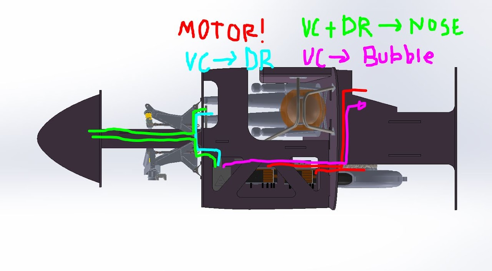

# SSCP - Interfacing w/ Wiring

# Interfacing w/ Wiring

Last cycle: used rubber grommets with metal edges from sealsit.com. EE team likes these but they're really expensive ($16+ ea, depending on size).  EE team did *not* like the all-rubber push in style grommets, probably because we didn't manage to find any that were sized for a 5/8" panel.

most promising looking grommet options are 

* 1.5" outer diameter with 1" of rubber, punch your own hole3" outer diameter with 1.25" prepunched hole in 2.25" of rubber, or punch your own hole4" outer diameter with 1.8" prepunched hole in 3" of rubber, or punch your own
* 1.5" outer diameter with 1" of rubber, punch your own hole
* 3" outer diameter with 1.25" prepunched hole in 2.25" of rubber, or punch your own hole
* 4" outer diameter with 1.8" prepunched hole in 3" of rubber, or punch your own

* 1.5" outer diameter with 1" of rubber, punch your own hole
* 3" outer diameter with 1.25" prepunched hole in 2.25" of rubber, or punch your own hole
* 4" outer diameter with 1.8" prepunched hole in 3" of rubber, or punch your own

1.5" outer diameter with 1" of rubber, punch your own hole

3" outer diameter with 1.25" prepunched hole in 2.25" of rubber, or punch your own hole

4" outer diameter with 1.8" prepunched hole in 3" of rubber, or punch your own

Planning on picking two sizes (small and large) to use throughout the chassis, and leaning towards the 1.5" and 3" sizes pending input from EE team. Tritiums + VC all live in the same compartment (abbreviating this as EEC) right above the battery so wiring between them is easy. List of wire-routing channels is as follows:

* Battery-> all goes through large potted openings in the EE shelf/dashboard shelf. No grommets necessaryTritium 1 -> motor leftwill go straight back out of EEC to motor, this bundle will have its own dedicated grommetsTritium 2 -> motor rightwill go back out of EEC and then across car, this bundle will have its own dedicated grommetsVC -> steering wheelgoes forward out of EEC, across car, then back to driver, will have own dedicated grommetsfront lights -> ? (are these on topshell?) where do the lights connect to, the VC?mid lights -> ? rear lights -> ? (has to be on topshell)VC/steering wheel -> misc nose shelf (GPS/Antennae)channels will run forward from both driver and EEC, meet in the centerline of the car, and then forward to nose (own grommets out of EEC/Dr.Cmpt and then share grommets to the front?VC -> shelf under canopy rear (GPS/Antennae) (tbd if this is attached to the topshell)planning on running backwards from EEC, across car and then upcan this share a grommet with brake lines? can also have its ownrearview cam -> steering wheel only? (does this need to route to the EE shelf?)
* Battery-> all goes through large potted openings in the EE shelf/dashboard shelf. No grommets necessary
* Tritium 1 -> motor leftwill go straight back out of EEC to motor, this bundle will have its own dedicated grommets
* will go straight back out of EEC to motor, this bundle will have its own dedicated grommets
* Tritium 2 -> motor rightwill go back out of EEC and then across car, this bundle will have its own dedicated grommets
* will go back out of EEC and then across car, this bundle will have its own dedicated grommets
* VC -> steering wheelgoes forward out of EEC, across car, then back to driver, will have own dedicated grommets
* goes forward out of EEC, across car, then back to driver, will have own dedicated grommets
* front lights -> ? (are these on topshell?) where do the lights connect to, the VC?
* mid lights -> ? 
* rear lights -> ? (has to be on topshell)
* VC/steering wheel -> misc nose shelf (GPS/Antennae)channels will run forward from both driver and EEC, meet in the centerline of the car, and then forward to nose (own grommets out of EEC/Dr.Cmpt and then share grommets to the front?
* channels will run forward from both driver and EEC, meet in the centerline of the car, and then forward to nose (own grommets out of EEC/Dr.Cmpt and then share grommets to the front?
* VC -> shelf under canopy rear (GPS/Antennae) (tbd if this is attached to the topshell)planning on running backwards from EEC, across car and then upcan this share a grommet with brake lines? can also have its own
* planning on running backwards from EEC, across car and then up
* can this share a grommet with brake lines? can also have its own
* rearview cam -> steering wheel only? (does this need to route to the EE shelf?)

* Battery-> all goes through large potted openings in the EE shelf/dashboard shelf. No grommets necessary
* Tritium 1 -> motor leftwill go straight back out of EEC to motor, this bundle will have its own dedicated grommets
* will go straight back out of EEC to motor, this bundle will have its own dedicated grommets
* Tritium 2 -> motor rightwill go back out of EEC and then across car, this bundle will have its own dedicated grommets
* will go back out of EEC and then across car, this bundle will have its own dedicated grommets
* VC -> steering wheelgoes forward out of EEC, across car, then back to driver, will have own dedicated grommets
* goes forward out of EEC, across car, then back to driver, will have own dedicated grommets
* front lights -> ? (are these on topshell?) where do the lights connect to, the VC?
* mid lights -> ? 
* rear lights -> ? (has to be on topshell)
* VC/steering wheel -> misc nose shelf (GPS/Antennae)channels will run forward from both driver and EEC, meet in the centerline of the car, and then forward to nose (own grommets out of EEC/Dr.Cmpt and then share grommets to the front?
* channels will run forward from both driver and EEC, meet in the centerline of the car, and then forward to nose (own grommets out of EEC/Dr.Cmpt and then share grommets to the front?
* VC -> shelf under canopy rear (GPS/Antennae) (tbd if this is attached to the topshell)planning on running backwards from EEC, across car and then upcan this share a grommet with brake lines? can also have its own
* planning on running backwards from EEC, across car and then up
* can this share a grommet with brake lines? can also have its own
* rearview cam -> steering wheel only? (does this need to route to the EE shelf?)

Battery-> all goes through large potted openings in the EE shelf/dashboard shelf. No grommets necessary

Tritium 1 -> motor left

* will go straight back out of EEC to motor, this bundle will have its own dedicated grommets

will go straight back out of EEC to motor, this bundle will have its own dedicated grommets

Tritium 2 -> motor right

* will go back out of EEC and then across car, this bundle will have its own dedicated grommets

will go back out of EEC and then across car, this bundle will have its own dedicated grommets

VC -> steering wheel

* goes forward out of EEC, across car, then back to driver, will have own dedicated grommets

goes forward out of EEC, across car, then back to driver, will have own dedicated grommets

front lights -> ? (are these on topshell?) where do the lights connect to, the VC?

mid lights -> ? 

rear lights -> ? (has to be on topshell)

VC/steering wheel -> misc nose shelf (GPS/Antennae)

* channels will run forward from both driver and EEC, meet in the centerline of the car, and then forward to nose (own grommets out of EEC/Dr.Cmpt and then share grommets to the front?

channels will run forward from both driver and EEC, meet in the centerline of the car, and then forward to nose (own grommets out of EEC/Dr.Cmpt and then share grommets to the front?

VC -> shelf under canopy rear (GPS/Antennae) (tbd if this is attached to the topshell)

* planning on running backwards from EEC, across car and then up
* can this share a grommet with brake lines? can also have its own

planning on running backwards from EEC, across car and then up

can this share a grommet with brake lines? can also have its own

rearview cam -> steering wheel only? (does this need to route to the EE shelf?)

In addition,

* Brakes master -> front brakesBrakes master -> rear brakeswill probably route through back of EEC instead of through driver cmpt to get to rears, and then tie in with motor bundles (not the same grommet though)latching cables -> help
* Brakes master -> front brakes
* Brakes master -> rear brakeswill probably route through back of EEC instead of through driver cmpt to get to rears, and then tie in with motor bundles (not the same grommet though)
* will probably route through back of EEC instead of through driver cmpt to get to rears, and then tie in with motor bundles (not the same grommet though)
* latching cables -> help

* Brakes master -> front brakes
* Brakes master -> rear brakeswill probably route through back of EEC instead of through driver cmpt to get to rears, and then tie in with motor bundles (not the same grommet though)
* will probably route through back of EEC instead of through driver cmpt to get to rears, and then tie in with motor bundles (not the same grommet though)
* latching cables -> help

Brakes master -> front brakes

Brakes master -> rear brakes

* will probably route through back of EEC instead of through driver cmpt to get to rears, and then tie in with motor bundles (not the same grommet though)

will probably route through back of EEC instead of through driver cmpt to get to rears, and then tie in with motor bundles (not the same grommet though)

latching cables -> help

