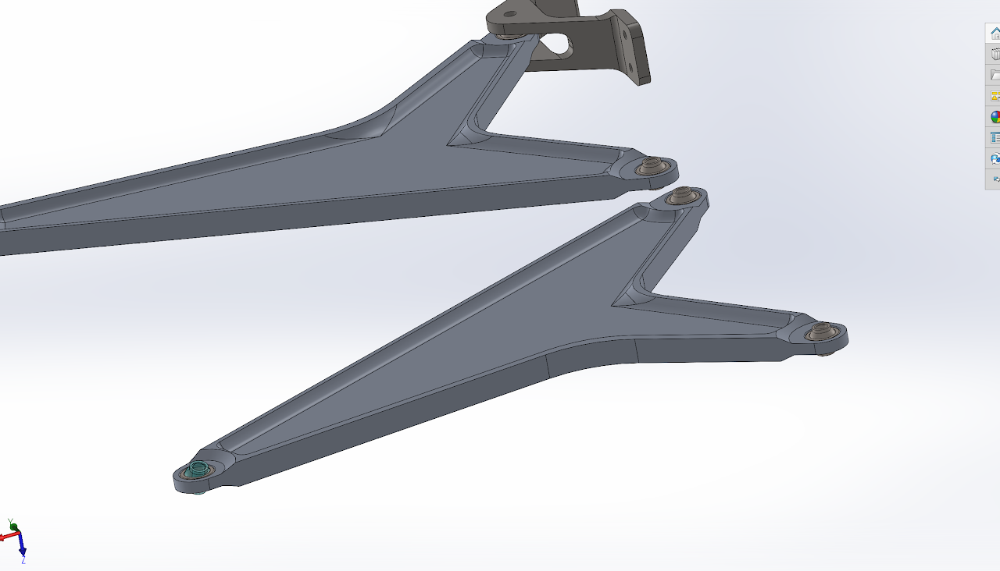

# front-suspension-components

## SSCP - Front Suspension Components

## Front Suspension Components

Lower Control Arm ------------------------------------------------

The lower control arm has two spherical bearings at each of the hardpoint joints, and another connecting the control arm to the upright. The arm acts as a two force member between each of the joints (see pic). The lower control arm essentially a triangle intended to handle tension and compression. Most of the stress runs down the edge of the triangle, putting the beam in tension and compressoin. The webbing in the middle of the triangle is 2mm providing stability and connecting the edges. The cutout is designed around the steered wheel.&#x20;

3 spherical bearings were used for the LCA. The Aurora HAB-4T high misalignment spherical bearing was used in the hardpoint interfaces. HAB-6T was used for the lower ball joint. The larger bearing was used to alleviate clearance issues with the upright. The max force at any one of the joints for our max loading conditions was 16 kN (see sim tracker). The max radial load for the HAB-4T is 7500 lbs (33 kN) for a safety factor of 2.

The bearings were housed with pressfits and circlips. Due to the axial loads when the sway bar is used, a circlip and shelving was used with a pressfit. (See cross section below, the circlip is pointed to in blue, and the shelf is pointed to in red). The pressfits were designed with these two calculators (limits and fits, stresses and interferences). The press fit was sized to a M7. The circlip was gotten from Smallley (XAH-90 for HAB-6T and FHE-0075 for HAB-4T). Both circlip have a max shear load well over the max axial force. A print of the calculator is attached to this webpage. The material properties were taken from asmweb. Loctite 648 was used in addition.

[limits and fits](https://www.amesweb.info/FitTolerance/FitTolerance.aspx)

[stresses and interferences](https://www.engineersedge.com/calculators/machine-design/press-fit/press-fit-calculator.htm)

The simulation was set up with body to ground joints at each of the hardpoint spherical bearings and an input force applied to the bore of the upright spherical bearing. The max deformation was 2 mm at the upright spherical bearing and the minium safety factor was 1.15 with the sway bar input force. I added another rib at the weak point of the rib to reinforce but have not re simmed it yet (see below). The entire project is attached to this doc.

&#x20;

Upper Control Arm -----------------------------------------------

The upper control arm is designed very similar to the lower control arm.  There is a rib down the edge of the outer contor that is loaded mainly in&#x20;

compression and tension. The interal webbing is 2 mm and locks the ribing together. The cutout is designed around the steered fairing. All three bearings are HAB-4TG, with the same specs as the HAB-4T. This design uses a swedged bearing instead of a circlip to lock the bearing in axially. The bearing is pressfit in with K7 pressfit, loctited in, and then swedged in place. The swedging process deforms a lip on the outer race of the bearing and bends it over a chamfered edge on the housing. The shank is designed to the product catalog (pg 118). We "yammed" on the stake until. When pull testing to see how strong the stake was, it pulled out at 100 lbs. Given there should be no axial load on these bearings we felt that was sufficient.

[HAB-4TG](http://cad.aurorabearing.com/item/all-categories/-hab-t-high-misalignment-series-spherical-bearings/hab-4t-2?plpver=10)

[product catalog (pg 118)](http://www.aurorabearing.com/pdf/aurora-bearing-319-catalog.pdf)

The simulation was set up very similar to the LCA as well with body to ground contacts and an input force at the upright bearing. The min safety factor was 1.5 and the max deflection was .1 mm at the upright joint. (safety factor on top, deflection on bottom)

Upright -----------------------------------------------------------

Hub --------------------------------------------------------------

Hardpoint Hand Calcs

These were the hand calcs that were done in order to determine the normal and shear force exhibited on the hardpoint bolts when they were all mounted in the x direction. The normal force calculation is done by adding the normal force applied (in x) to the x reaction force to counteract the moment generated by the force in y. This is divided by the number of bolts.&#x20;

The shear force is calculated by adding the two shear components (y and z).&#x20;

For example, in the LCHO, the X force was 13954 N, the Y force was 7925 N, and the Z force was 0.09 N, and there were 4 bolts. Distance A was .05m and Distance B was .075m.

The number and orientation of bolts was chosen to keep the normal force under 2000N, the shear force under 6000N on each bolt.

Hardpoint FEA

#### Embedded Content

Embedded content: [Embedded Content](front-suspension-components.md)

Reflections

* Our bearings were really tight, tighter than they should have been. This may have been done to a press that was too tight or a missing step in the installation process.&#x20;
* Test your bearings before you ship the parts to get the presses right. We ended up reshipping the LCA because the bearing press was too loose. We only found out when we had tried to pull test the real thing
* Refine your meshes, many of my meshes were too course to have accurate minimum safety factors
* Before you start trying to lightweight things make sure you know how to determine what material is useful and what material is useless from stress plots, otherwise you will waste a lot of time
* Double check your drawings before you send them out
* Have standard deflection allowances. I just set mine to 1 mm for all parts without really figuring out how much that would affect the suspension
* Give yourself extra clearance at joints, chances are the car you build will not be perfect and you don't want to be pressed up against joint limits
* design in ways to adjust supsension parameters - this suspension is virtually unchangable once its built. You can only really shim hardpoints which is a pain in the ass
* Keep a sim notebook so you know what you've done and how to fix random ass bugs ANSYS (there are many), both for yourself and others
* don't load your hardpoint inserts in pull, like the upper control arm is

#### Embedded Google Drive File

Google Drive File: [Embedded Content](https://drive.google.com/embeddedfolderview?id=1ApCJisV36bEbKEXxYZBZkkAKVfirK3Vi#list)
