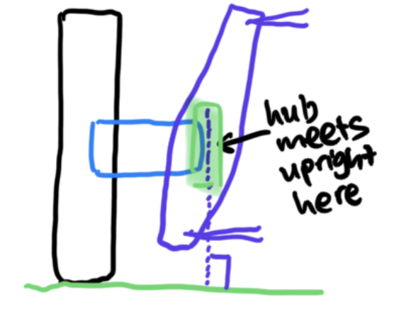
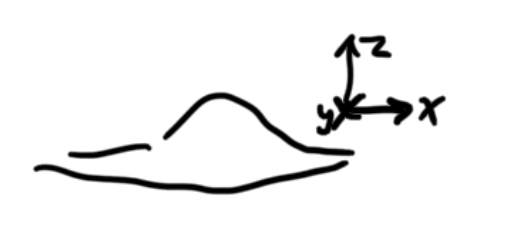
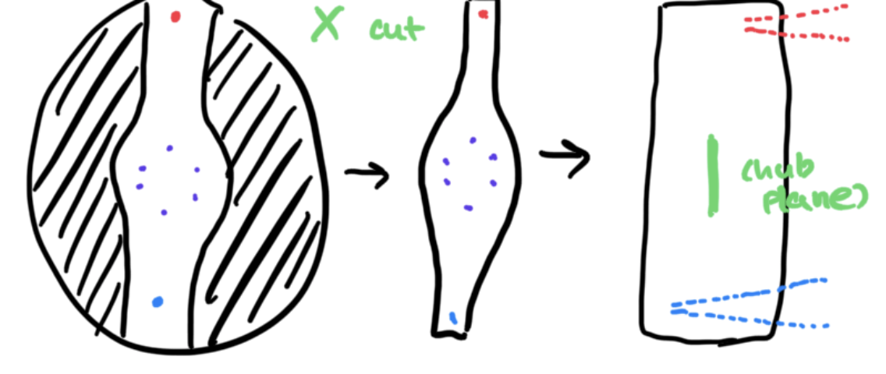
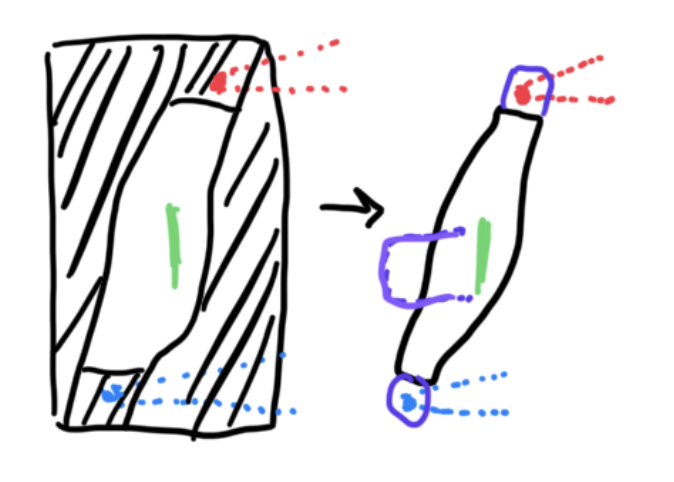
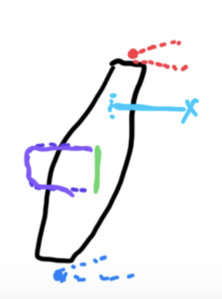
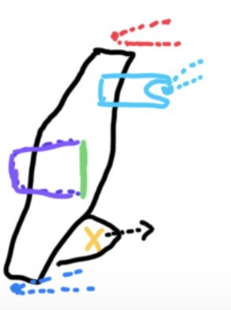
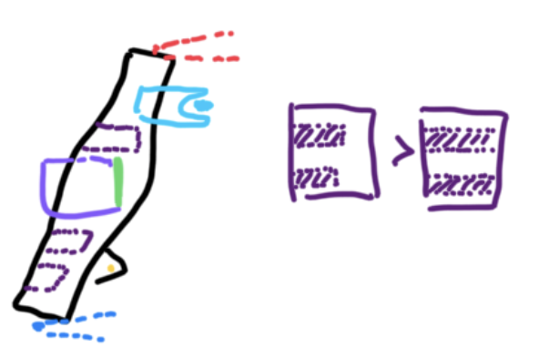

# front-uprights

## SSCP - Front Uprights

## Front Uprights

How to Design an Upright!!!

&#x20;   1\) Get 3D points in space from the suspension

* Define hard pointsUpper ball jointLower ball jointSteering (tie rod)Push rodMake sure to draw lines for control arms to check clearanceLabel the points with different colors so you know which one is the upper and lower control armI've made the mistake of designing the upright upside down the first time so pls check!!
* Define hard pointsUpper ball jointLower ball jointSteering (tie rod)Push rodMake sure to draw lines for control arms to check clearanceLabel the points with different colors so you know which one is the upper and lower control armI've made the mistake of designing the upright upside down the first time so pls check!!
* Upper ball joint
* Lower ball joint
* Steering (tie rod)
* Push rod
* Make sure to draw lines for control arms to check clearance
* Label the points with different colors so you know which one is the upper and lower control armI've made the mistake of designing the upright upside down the first time so pls check!!
* I've made the mistake of designing the upright upside down the first time so pls check!!
* Define hard pointsUpper ball jointLower ball jointSteering (tie rod)Push rodMake sure to draw lines for control arms to check clearanceLabel the points with different colors so you know which one is the upper and lower control armI've made the mistake of designing the upright upside down the first time so pls check!!
* Upper ball joint
* Lower ball joint
* Steering (tie rod)
* Push rod
* Make sure to draw lines for control arms to check clearance
* Label the points with different colors so you know which one is the upper and lower control armI've made the mistake of designing the upright upside down the first time so pls check!!
* I've made the mistake of designing the upright upside down the first time so pls check!!

Define hard points

* Upper ball joint
* Lower ball joint
* Steering (tie rod)
* Push rod
* Make sure to draw lines for control arms to check clearance
* Label the points with different colors so you know which one is the upper and lower control armI've made the mistake of designing the upright upside down the first time so pls check!!
* I've made the mistake of designing the upright upside down the first time so pls check!!

Upper ball joint

Lower ball joint

Steering (tie rod)

Push rod

Make sure to draw lines for control arms to check clearance

Label the points with different colors so you know which one is the upper and lower control arm

* I've made the mistake of designing the upright upside down the first time so pls check!!

I've made the mistake of designing the upright upside down the first time so pls check!!

&#x20;   2\) Define where hub needs to go-draw a 3D plane there + 6 3D points for the hub fixture fasteners

* This plane needs to be perpendicular to "ground" even if the upright isn't!
* This plane needs to be perpendicular to "ground" even if the upright isn't!
* This plane needs to be perpendicular to "ground" even if the upright isn't!
* This plane needs to be perpendicular to "ground" even if the upright isn't!
* This plane needs to be perpendicular to "ground" even if the upright isn't!
* This plane needs to be perpendicular to "ground" even if the upright isn't!

This plane needs to be perpendicular to "ground" even if the upright isn't!

&#x20;   3\) Connect the dots!! Using the hub plane, extrude a huge section that encompasses all the hard points. Make it thiccc

&#x20;   4\) Cut away the sides&#x20;

* Basic rules of thumbWalls shouldn't be too thin, at least 0.150" for manufacturing, thicker for heavy loadWill have to handle SSCP's worst-case simulations (1g, 2g, 4g)
* Basic rules of thumbWalls shouldn't be too thin, at least 0.150" for manufacturing, thicker for heavy loadWill have to handle SSCP's worst-case simulations (1g, 2g, 4g)
* Basic rules of thumbWalls shouldn't be too thin, at least 0.150" for manufacturing, thicker for heavy loadWill have to handle SSCP's worst-case simulations (1g, 2g, 4g)
* Walls shouldn't be too thin, at least 0.150" for manufacturing, thicker for heavy load
* Will have to handle SSCP's worst-case simulations (1g, 2g, 4g)
* Basic rules of thumbWalls shouldn't be too thin, at least 0.150" for manufacturing, thicker for heavy loadWill have to handle SSCP's worst-case simulations (1g, 2g, 4g)
* Basic rules of thumbWalls shouldn't be too thin, at least 0.150" for manufacturing, thicker for heavy loadWill have to handle SSCP's worst-case simulations (1g, 2g, 4g)
* Walls shouldn't be too thin, at least 0.150" for manufacturing, thicker for heavy load
* Will have to handle SSCP's worst-case simulations (1g, 2g, 4g)
* Basic rules of thumbWalls shouldn't be too thin, at least 0.150" for manufacturing, thicker for heavy loadWill have to handle SSCP's worst-case simulations (1g, 2g, 4g)
* Walls shouldn't be too thin, at least 0.150" for manufacturing, thicker for heavy load
* Will have to handle SSCP's worst-case simulations (1g, 2g, 4g)

Basic rules of thumb

* Walls shouldn't be too thin, at least 0.150" for manufacturing, thicker for heavy load
* Will have to handle SSCP's worst-case simulations (1g, 2g, 4g)

Walls shouldn't be too thin, at least 0.150" for manufacturing, thicker for heavy load

Will have to handle SSCP's worst-case simulations (1g, 2g, 4g)

&#x20;   5\) Keep cutting away the sides&#x20;

* Label the cuts as you make by the plane you cut with (x, y, z) so when you have to go back and change things, it'll be easy to find
* Label the cuts as you make by the plane you cut with (x, y, z) so when you have to go back and change things, it'll be easy to find
* Label the cuts as you make by the plane you cut with (x, y, z) so when you have to go back and change things, it'll be easy to find
* Label the cuts as you make by the plane you cut with (x, y, z) so when you have to go back and change things, it'll be easy to find
* Label the cuts as you make by the plane you cut with (x, y, z) so when you have to go back and change things, it'll be easy to find
* Label the cuts as you make by the plane you cut with (x, y, z) so when you have to go back and change things, it'll be easy to find

Label the cuts as you make by the plane you cut with (x, y, z) so when you have to go back and change things, it'll be easy to find

* Use equations!!!Minimum thickness for manufacturing (0.150" rule of thumb)Bolt head size (for clearance)Bolt shank/thread diameteretcWith simulation, we learned that the double support (double shear) doesn't do much to support the upper/lower hard point bolts - doesn't result in that much more stiffness or that much less deflection or that much less stress on the boltsRemember to check for clearance for the control arms
* Use equations!!!Minimum thickness for manufacturing (0.150" rule of thumb)Bolt head size (for clearance)Bolt shank/thread diameteretc
* Minimum thickness for manufacturing (0.150" rule of thumb)Bolt head size (for clearance)Bolt shank/thread diameteretc
* Minimum thickness for manufacturing (0.150" rule of thumb)
* Bolt head size (for clearance)
* Bolt shank/thread diameter
* etc
* With simulation, we learned that the double support (double shear) doesn't do much to support the upper/lower hard point bolts - doesn't result in that much more stiffness or that much less deflection or that much less stress on the bolts
* Remember to check for clearance for the control arms
* Use equations!!!Minimum thickness for manufacturing (0.150" rule of thumb)Bolt head size (for clearance)Bolt shank/thread diameteretc
* Minimum thickness for manufacturing (0.150" rule of thumb)Bolt head size (for clearance)Bolt shank/thread diameteretc
* Minimum thickness for manufacturing (0.150" rule of thumb)
* Bolt head size (for clearance)
* Bolt shank/thread diameter
* etc
* With simulation, we learned that the double support (double shear) doesn't do much to support the upper/lower hard point bolts - doesn't result in that much more stiffness or that much less deflection or that much less stress on the bolts
* Remember to check for clearance for the control arms

Use equations!!!

* Minimum thickness for manufacturing (0.150" rule of thumb)Bolt head size (for clearance)Bolt shank/thread diameteretc
* Minimum thickness for manufacturing (0.150" rule of thumb)
* Bolt head size (for clearance)
* Bolt shank/thread diameter
* etc
* Minimum thickness for manufacturing (0.150" rule of thumb)
* Bolt head size (for clearance)
* Bolt shank/thread diameter
* etc

Minimum thickness for manufacturing (0.150" rule of thumb)

Bolt head size (for clearance)

Bolt shank/thread diameter

etc

With simulation, we learned that the double support (double shear) doesn't do much to support the upper/lower hard point bolts - doesn't result in that much more stiffness or that much less deflection or that much less stress on the bolts

Remember to check for clearance for the control arms

&#x20;   6\) Make the cuts for the hub&#x20;

* Make sure it's a clearance fit-should be some space between the hub and the upright
* Make sure it's a clearance fit-should be some space between the hub and the upright
* Make sure it's a clearance fit-should be some space between the hub and the upright
* Make sure it's a clearance fit-should be some space between the hub and the upright
* Make sure it's a clearance fit-should be some space between the hub and the upright
* Make sure it's a clearance fit-should be some space between the hub and the upright

Make sure it's a clearance fit-should be some space between the hub and the upright

&#x20;   7\) Make a separate part for the steering point, and make sure it fits

* Define straight line from the point and mount to the upright. Make sure the mounting point lines up by defining 3D points for the steering attachment as well as 3D points for the upright
* Define straight line from the point and mount to the upright. Make sure the mounting point lines up by defining 3D points for the steering attachment as well as 3D points for the upright
* Define straight line from the point and mount to the upright. Make sure the mounting point lines up by defining 3D points for the steering attachment as well as 3D points for the upright

Define straight line from the point and mount to the upright. Make sure the mounting point lines up by defining 3D points for the steering attachment as well as 3D points for the upright

&#x20;   8\) Make the clevice for the push rod&#x20;

* Define the plane perpendicular to the upright surface, and draw straight "up" until you meet the point for the push rod point
* Define the plane perpendicular to the upright surface, and draw straight "up" until you meet the point for the push rod point
* Define the plane perpendicular to the upright surface, and draw straight "up" until you meet the point for the push rod point
* Define the plane perpendicular to the upright surface, and draw straight "up" until you meet the point for the push rod point
* Define the plane perpendicular to the upright surface, and draw straight "up" until you meet the point for the push rod point
* Define the plane perpendicular to the upright surface, and draw straight "up" until you meet the point for the push rod point

Define the plane perpendicular to the upright surface, and draw straight "up" until you meet the point for the push rod point

&#x20;   9\) Fillet everything, and define an equation with that too! Fillet = less stress concentrations

&#x20;  &#x20;

&#x20;   10\) Model (or copy) aurora bearings to make sure everything fits&#x20;

* For 2019, 6T on the bottom and 4T on the top, steering, and push rod
* For 2019, 6T on the bottom and 4T on the top, steering, and push rod
* For 2019, 6T on the bottom and 4T on the top, steering, and push rod
* For 2019, 6T on the bottom and 4T on the top, steering, and push rod
* For 2019, 6T on the bottom and 4T on the top, steering, and push rod
* For 2019, 6T on the bottom and 4T on the top, steering, and push rod

For 2019, 6T on the bottom and 4T on the top, steering, and push rod

&#x20;   REPEAT THE NEXT COUPLE STEPS UNTIL YOU MEET THE RIGHT FOS AND DEFLECTION CRITERIA

&#x20;   11\) Simulate!

&#x20;   12\) Add lightning holes where FOS > 2. For reference, 2019 front upright was \~3lbs&#x20;

* Keeping the shell instead of just having through holes increase the moment of inertia and also makes it easier to manufacture
* Keeping the shell instead of just having through holes increase the moment of inertia and also makes it easier to manufacture
* Keeping the shell instead of just having through holes increase the moment of inertia and also makes it easier to manufacture
* Keeping the shell instead of just having through holes increase the moment of inertia and also makes it easier to manufacture
* Keeping the shell instead of just having through holes increase the moment of inertia and also makes it easier to manufacture
* Keeping the shell instead of just having through holes increase the moment of inertia and also makes it easier to manufacture

Keeping the shell instead of just having through holes increase the moment of inertia and also makes it easier to manufacture

How to Simulate an Upright!!!

&#x20;   TBD

#### Embedded Google Drive File

Google Drive File: [Embedded Content](https://drive.google.com/embeddedfolderview?id=1pdA4dOn4lu8IsygZyOGkqNwflEVtxGFe#list)
