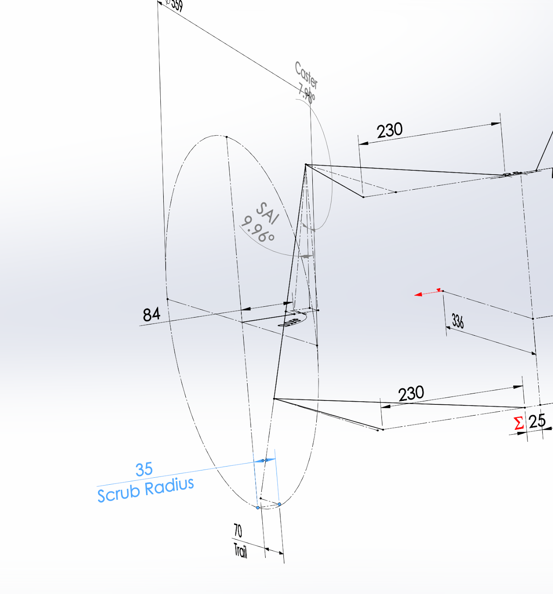
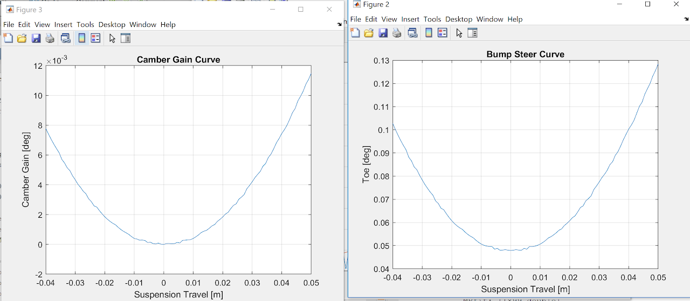
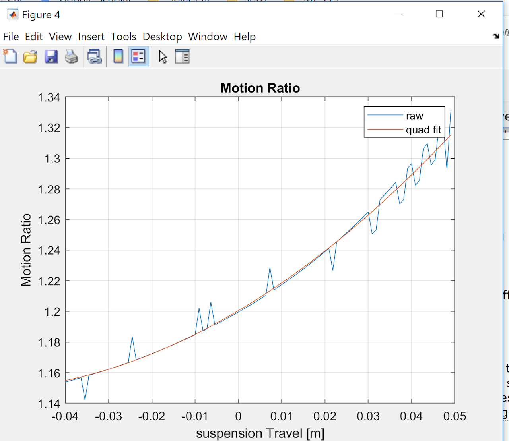

# SSCP - Geometry

# Geometry

To define the geometry for the Black Mamba, I wrote a bunch of matlab scripts that would allow me to iterate through a bunch of different geometries. Given there are so many different parameters and they are all codependent, I wrote up a library that would allow me to generate thousands of different gemetries and then filter for desired properties. 

The design case was the solar car moving in a straight line at 55 kph. This means I was not optimizing for max cornering force as most race forums and texts do. Instead I tried to give the car static geometric parameters to keep it stable and minimize unneccessary scrubbing that would lead to losses in efficiency. Statically many of the parameters were similar to Sundae. 

Max Bump Travel: 50 mm

Max Droop Travel: 50 mm

Static Parameters: (defined at ride height)

Caster - 7.9 deg

Kingpin Angle - 9.9 deg

Static Camber - 0 deg

Static Toe - .05 deg

Mechanical Trail - 70 mm

Scrub Radius -  35 mm

In the optimization I found that for a given caster angle, there was a corresponding Kingpin Angle (steering inclination angle) that created 0 camber gain. I used camber gain as a monitor of bump scrub. With 0 camber gain, both the tire stays upright minimizing losses due to camber thrust, and the contact patch does not scrub laterally. This is the most efficient setup for the straight line driving case.

The static cabmer is to minimize camber thrust that would increase rolling resistance. From the tire model, we found that the tires produce 40 N of camber thrust with each degree of camber, which means if the tire cambers, you induce a lateral force vector. For straight line driving, this is inefficient.

The mechanical trail was taken from Sundae. There was no indication it needed to change. This parameter dictates straight line stability. The larger the trail, the longer the lever arm lateral forces have to straighten the tire about the steering axis (see explanation here).

The scrub radius increased from Sundae. This was to help with packaging as to get the lower ball joint farther inboard so it would not interfere with the rim. Initially I was worried this increase the rolling resistance when the tires were steered. The increased distance from the contact patch to the steering axis would mean the contact patch would have a larger arclength to travel when the tire was steered. However, I assumed that this distance would be accounted for by the rolling tire (becuase the tire is rolling, there is minimal induced scrub).

Dynamic Parameters:

My main goals in defining the suspension were to create a suspension with 0 bump scrub and 0 bump steer. Bump scrub is defined as lateral movement of the contact patch as the tire moves up and down. Bump scrub is essentially an unncessary loss of energy due to scrubbing of the tire. Bump steer is induced steer form the tire traveling up and down. This causes problems with instability.

Camber Gain - Essentially 0

Bump Steer - 0.07 deg (toe in)

Force Analysis and Shock placement  

I used the location of the shock to as a final parameter to lower the forces on the whole suspension. However, given packaging constraints there were not many options for a directly mounted shock, and not much room for a bell crank system. This led to a shock placement that did not minimize the stresses in the suspension. 

I also tried to place the shock in a place to give it a consistent motion ratio. This is important for maintaining consistent roll stiffness and ride stiffness throughout the travel of the suspension.

The force analsyis was done by reducing each linke to a 2 force member. The UCA, LCA, shock, and Tie rods are reduced to a 2 force member. A matrix is then set up to solve the moment, and force equations. (see getSusForces.m)

The worst loading conditions were the [0 -2g 4g] for the LCA, [-g 0 4g] for the UCA, any [ x x 4g] for the shock, and [-g 2g 0] for the tie rod.

The forces were too damn high. The forces for all loading conditions were tracked in the Sim Tracker.

[ Sim Tracker](https://docs.google.com/spreadsheets/d/1bWJFtlUWpoaGmpJgBZxfMLjtX1Pybae_yBtQWG0BcQM/edit#gid=0)

Reflections

In my geometry I was able to achieve this through the method above, however, much of my time spent was futile. I spent far too long trying to optimize without thinking about the level of accurracy to which I would be able to measure things. In addition I did not make the actual suspension easy to adjust and tune these parameters. In general I place too much weight on the geometry outllined above. I should have spent more time desinging in adjustability, a way to measure and align the suspenison, and to worrying more about the force analysis rather as that essentially dictates the weight of the components. I should have made a more vertical and longer upright. This would reduce the forces in each member. I should have tried more variations of the double A arm suspension, especially the force analysis. I think this might have led to a simpler design with smaller members.  

Matlab - 

Git repo here.

[ here](https://github.com/sscp/suspensionMatlab2019)

Its kinda scary and not all of the files have been validated.

The final suspenison gemetry is susTestGeo8.2

The validated functions are anything in getSusSpecs, and its derivatives. The studies should be good, however I don't remember if I changed the base files from when I ran the study. Thus the results might differ.

