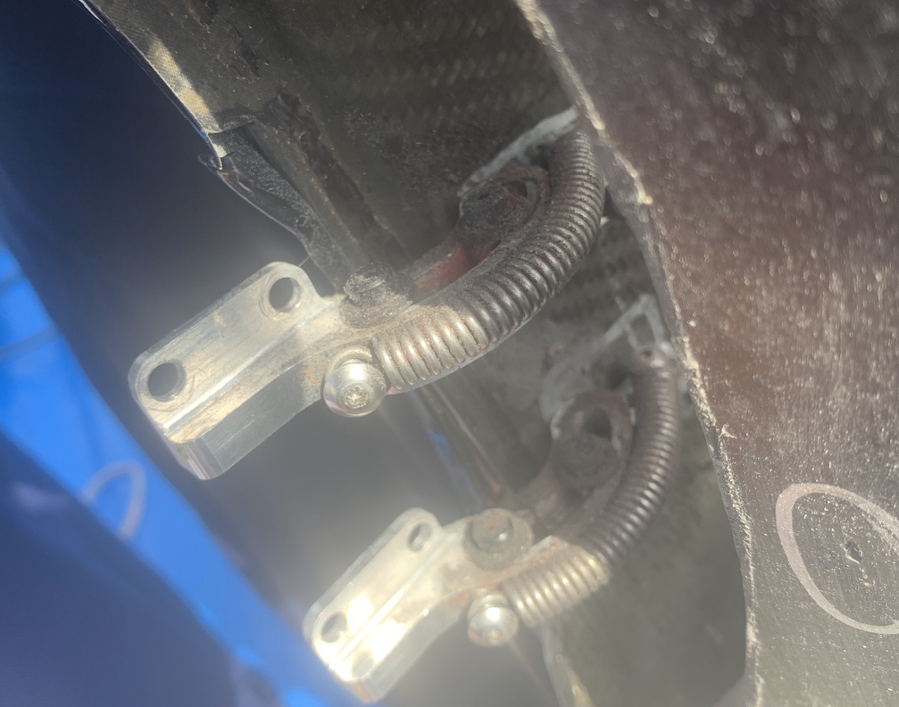
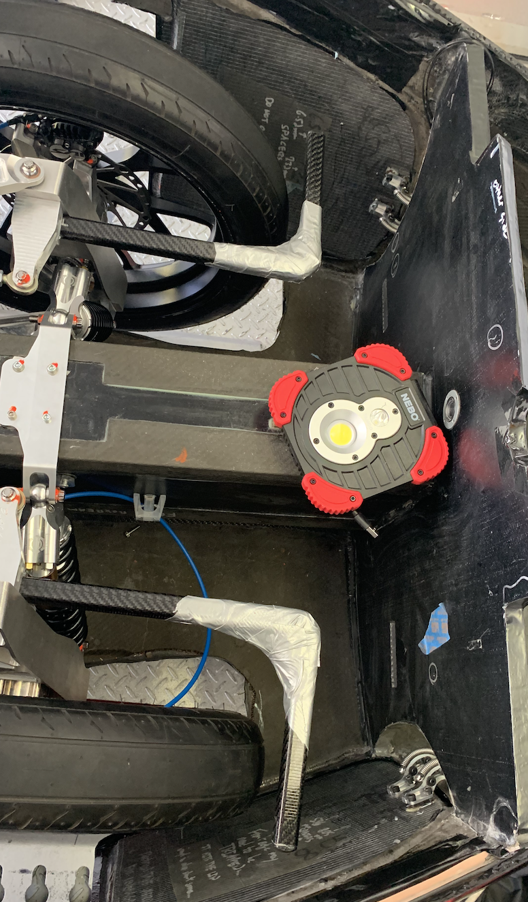

# SSCP - Steered Fairings

# Steered Fairings

For very very detailed steered fairing hinge design and analysis notes, read the pdf documentation attached. This was made by Croccifixio Knight (University of Florida Gator Motorsports suspension lead (Formula SAE), Astranis SDR EE). Big thanks to Cross!!!

Lesson Learned:

Hinges

* Sim correctly! We originally machined with 6061 instead of 7075 but simmed with 7075, and it yieldedThe spring on the hinges to create the "default close" didn't slide over the alumnium easily, ended up using lithium grease all over the inner sliding part
* Sim correctly! We originally machined with 6061 instead of 7075 but simmed with 7075, and it yielded
* The spring on the hinges to create the "default close" didn't slide over the alumnium easily, ended up using lithium grease all over the inner sliding part

* Sim correctly! We originally machined with 6061 instead of 7075 but simmed with 7075, and it yielded
* The spring on the hinges to create the "default close" didn't slide over the alumnium easily, ended up using lithium grease all over the inner sliding part

Sim correctly! We originally machined with 6061 instead of 7075 but simmed with 7075, and it yielded

The spring on the hinges to create the "default close" didn't slide over the alumnium easily, ended up using lithium grease all over the inner sliding part

Actuators

* Add holes to upright beforehand when you're desining it: postmachining takes timeUse box tube carbon fiber (0.016" thickness) for stiffness
* Use box tube carbon fiber (0.016" thickness) for stiffness
* 3D print multiple angles for the attachments, make sure it will open the door close to the middle
* Put teflon on the inside of the door for scraping
* Duct-tape the right angle to reinforce it

Add holes to upright beforehand when you're desining it: postmachining takes time

* Use box tube carbon fiber (0.016" thickness) for stiffness

Use box tube carbon fiber (0.016" thickness) for stiffness

3D print multiple angles for the attachments, make sure it will open the door close to the middle

Put teflon on the inside of the door for scraping

Duct-tape the right angle to reinforce it

Installation

* Marketing masters inserts were TRASH. Stripped almost instantly when torquing down the screws into the aerobody(Shitty) solution: bond them in with blue locktite, very hard to adjust it afterwardsSlide in washers to adjust the height of where the hinge is sitting so the door lined up with the aerobody. Ideally, 3D print spacers instead of using washers. This easily took 1-2 hours to make flush-have patience!When testing, make sure it's just the vinyl is clicking if there's sound. The carbon fiber door/aerobody interface shouldn't be slipping past each other
* Marketing masters inserts were TRASH. Stripped almost instantly when torquing down the screws into the aerobody
* (Shitty) solution: bond them in with blue locktite, very hard to adjust it afterwards
* Slide in washers to adjust the height of where the hinge is sitting so the door lined up with the aerobody. Ideally, 3D print spacers instead of using washers. This easily took 1-2 hours to make flush-have patience!
* When testing, make sure it's just the vinyl is clicking if there's sound. The carbon fiber door/aerobody interface shouldn't be slipping past each other

* Marketing masters inserts were TRASH. Stripped almost instantly when torquing down the screws into the aerobody
* (Shitty) solution: bond them in with blue locktite, very hard to adjust it afterwards
* Slide in washers to adjust the height of where the hinge is sitting so the door lined up with the aerobody. Ideally, 3D print spacers instead of using washers. This easily took 1-2 hours to make flush-have patience!
* When testing, make sure it's just the vinyl is clicking if there's sound. The carbon fiber door/aerobody interface shouldn't be slipping past each other

Marketing masters inserts were TRASH. Stripped almost instantly when torquing down the screws into the aerobody

(Shitty) solution: bond them in with blue locktite, very hard to adjust it afterwards

Slide in washers to adjust the height of where the hinge is sitting so the door lined up with the aerobody. Ideally, 3D print spacers instead of using washers. This easily took 1-2 hours to make flush-have patience!

When testing, make sure it's just the vinyl is clicking if there's sound. The carbon fiber door/aerobody interface shouldn't be slipping past each other

These doors weren't tested extensively because of the batteryfire!! May need reinforcement on the hinges, springs, etc.

### Embedded Google Drive File

Google Drive File: [Embedded Content](https://drive.google.com/embeddedfolderview?id=1AevC3S9p6VDFfZfokAbtISWEbKnOkSfB#list)

<iframe width="100%" height="400" src="https://drive.google.com/embeddedfolderview?id=1AevC3S9p6VDFfZfokAbtISWEbKnOkSfB#list" frameborder="0"></iframe>

