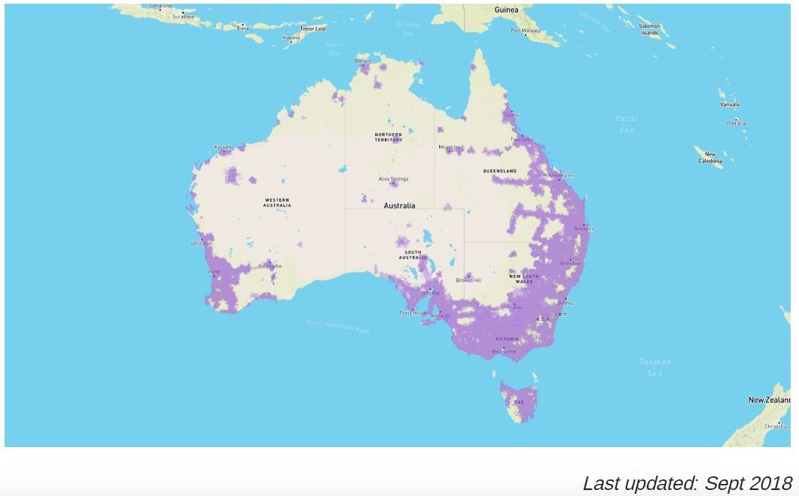

# SSCP - Mobile Wifi

# Mobile Wifi

## Mobile WiFi (For Chase vehicle to connect to the Solar Car + the internet)

The Plan is to buy a router that we can use a sim card with, purchase a plan on the SIM card and use the router to connect to the internet. A separate WiFi Port will also be needed to connect chase to the solar car

Potential Options (Final choice TBD):

### Embedded Content

Embedded content: [Custom embed]()

<iframe width="100%" height="400" src="" frameborder="0"></iframe>

Telstra Coverage Map:

