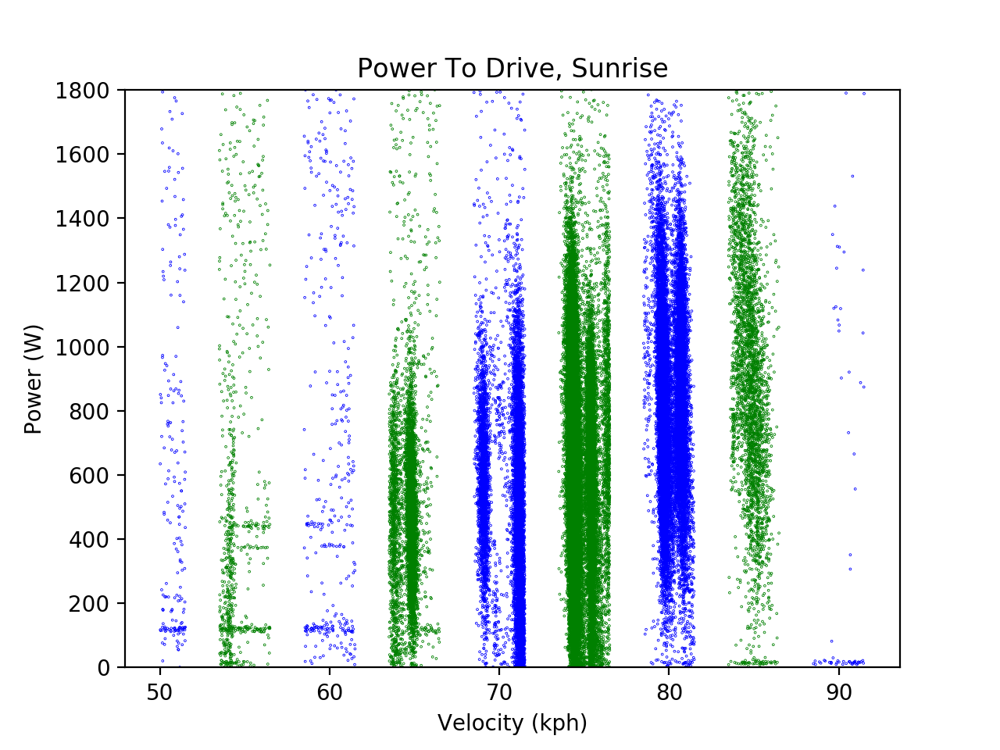

# SSCP - Power to Drive

# Power to Drive

Good afternoon!

This page contains the information about Sunrise's (SSCP 2017-2019) Power to Drive., as well as the investigations/challenges come across while doing so.

Raw Data

Due to many reasons, we were unable to start truly test driving until Oct 1st, so our Power to Drive data is very limited. More good news: Our measurements (in both power and in velocity) were incredibly noisy, so the extent to which we can derive precise and accurate conclusions is limited.

With that said, below is the raw data, plotted in Matlab:

Although the data is noisy, we can gather several insights from just this graph. There is a definitive trend upwards at the higher speeds, and it sort-of looks cubic, so the data we collected, while noisy, can still be valid. Additionally, there seems to be a trendline above the clusters of points (outlined below)

This trendline is believed to be the power consumed while accelerating, since we don't accelerate too often, and when we do, the power consumption increases appreciably.

Data Filtering

So we don't actually care about a bit portion of this data. For one, during Sunrise Cycle, the WSC rules stipulate that we can't go below an average of 60kph, so it's safe to say that we won't be going below 60kph too often. Additionally, we only really care about the bands of points below the many dispersed points, since that's where the bulk of our data is.

Therefore, we created a script that filters outliers and subsequently only takes accepts velocities that are within 1.5kph of the cruise speed (So for example, we only accept 68.5-71.5kph for 70kph cruise speed). The bands are colored now to show a difference between different cruise speed categories.

The data still doesn't look perfect, but it at least we are starting to see the trends that can be seen in the experimental PtD of other cycles.

Data Fitting

Here comes the fun part!

Below is the first-pass polynomial fit (order 3, cubic) of the data.

The coefficients for the cubic polynomial are below:

### Embedded Google Drive File

Google Drive File: [Embedded Content](https://drive.google.com/embeddedfolderview?id=1JAXtN41tU6mBUTN9W24KRlukbyVhm0UU#list)

<iframe width="100%" height="400" src="https://drive.google.com/embeddedfolderview?id=1JAXtN41tU6mBUTN9W24KRlukbyVhm0UU#list" frameborder="0"></iframe>

