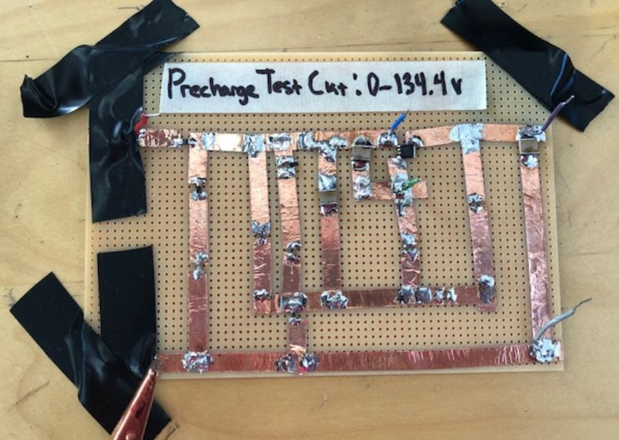

# 19-02-17-updates\_1

## SSCP - 19-02-17 Updates

## 19-02-17 Updates

SPONSOR UPDATES

Tell the team who you talked to.

Array

Key Points:

* Need to get shit doneNeed to select diodes, get feedback, and purchaseNeed to send wiring info to Alta
* Need to get shit done
* Need to select diodes, get feedback, and purchase
* Need to send wiring info to Alta
* Need to get shit done
* Need to select diodes, get feedback, and purchase
* Need to send wiring info to Alta

Need to get shit done

Need to select diodes, get feedback, and purchase

Need to send wiring info to Alta

Business

Key Points:

Wins:

Losses:

Code + Strategy

Key Points:

Wins:

Losses:

Electrical

Key Points:

* Built and tested precharge circuitReworked battery side converter for new pack voltageFinalizing controller board (aiming to send out early this week)
* Built and tested precharge circuit
* Reworked battery side converter for new pack voltage
* Finalizing controller board (aiming to send out early this week)
* Built and tested precharge circuit
* Reworked battery side converter for new pack voltage
* Finalizing controller board (aiming to send out early this week)

Built and tested precharge circuit

Reworked battery side converter for new pack voltage

Finalizing controller board (aiming to send out early this week)

Wins:

* Channel wire is here!&#x20;
* Channel wire is here!&#x20;
* Channel wire is here!&#x20;

Channel wire is here!&#x20;

Losses:

* Difficulties w/ Altium licenses
* Difficulties w/ Altium licenses
* Difficulties w/ Altium licenses

Difficulties w/ Altium licenses

Mechanical + Composites

Key Points:

Wins:

Losses:
