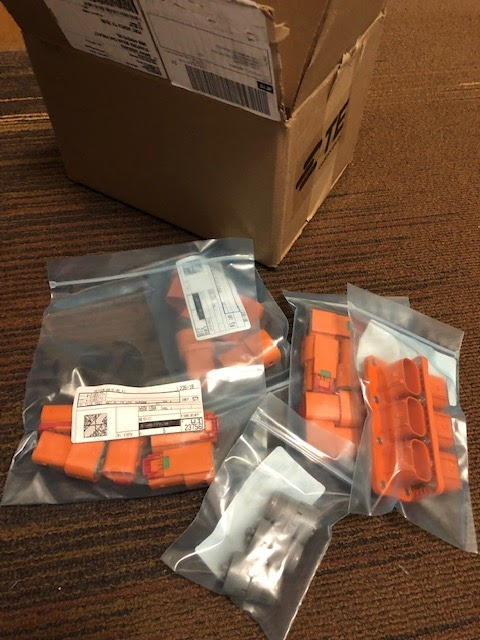

# SSCP - 19-02-23

# 19-02-23

SPONSOR UPDATES

Tell the team who you talked to.

Aero

Key Points:

Wins:

Losses:

Array

Key Points:

Wins:

Losses:

Business

Key Points:

Wins:

Losses:

Code + Strategy

Key Points:

Wins:

Losses:

Electrical

Key Points:

* Ricardo wrapped up next rev of throttle boardShipped the board this past Friday
* Ricardo wrapped up next rev of throttle boardShipped the board this past Friday
* Shipped the board this past Friday

* Ricardo wrapped up next rev of throttle boardShipped the board this past Friday
* Shipped the board this past Friday

Ricardo wrapped up next rev of throttle board

* Shipped the board this past Friday

Shipped the board this past Friday

* Maggie is touching up layout for VC (vehicle computer)Shipping this Wednesday/Thursday along with lights controller
* Shipping this Wednesday/Thursday along with lights controller
* Preparing for BMS design review this Friday

Maggie is touching up layout for VC (vehicle computer)

* Shipping this Wednesday/Thursday along with lights controller

Shipping this Wednesday/Thursday along with lights controller

Preparing for BMS design review this Friday

Wins:

* Free parts from TE came in
* Free parts from TE came in

* Free parts from TE came in

Free parts from TE came in

Losses:

* Altium and Stanford going back and forth about the wording of the updated license agreementThe office providing us the licenses has no phones set up yet... makes communication trickyCurrent licenses expire Wednesday
* Altium and Stanford going back and forth about the wording of the updated license agreementThe office providing us the licenses has no phones set up yet... makes communication trickyCurrent licenses expire Wednesday
* The office providing us the licenses has no phones set up yet... makes communication tricky
* Current licenses expire Wednesday

* Altium and Stanford going back and forth about the wording of the updated license agreementThe office providing us the licenses has no phones set up yet... makes communication trickyCurrent licenses expire Wednesday
* The office providing us the licenses has no phones set up yet... makes communication tricky
* Current licenses expire Wednesday

Altium and Stanford going back and forth about the wording of the updated license agreement

* The office providing us the licenses has no phones set up yet... makes communication tricky
* Current licenses expire Wednesday

The office providing us the licenses has no phones set up yet... makes communication tricky

Current licenses expire Wednesday

Mechanical + Composites

Key Points:

Wins:

Losses:

