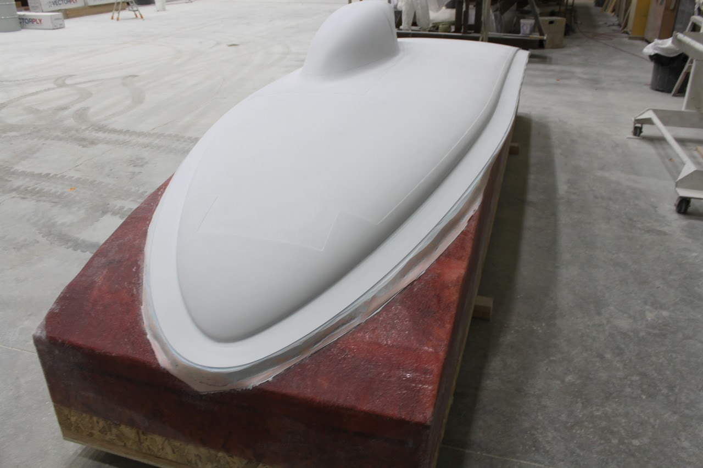
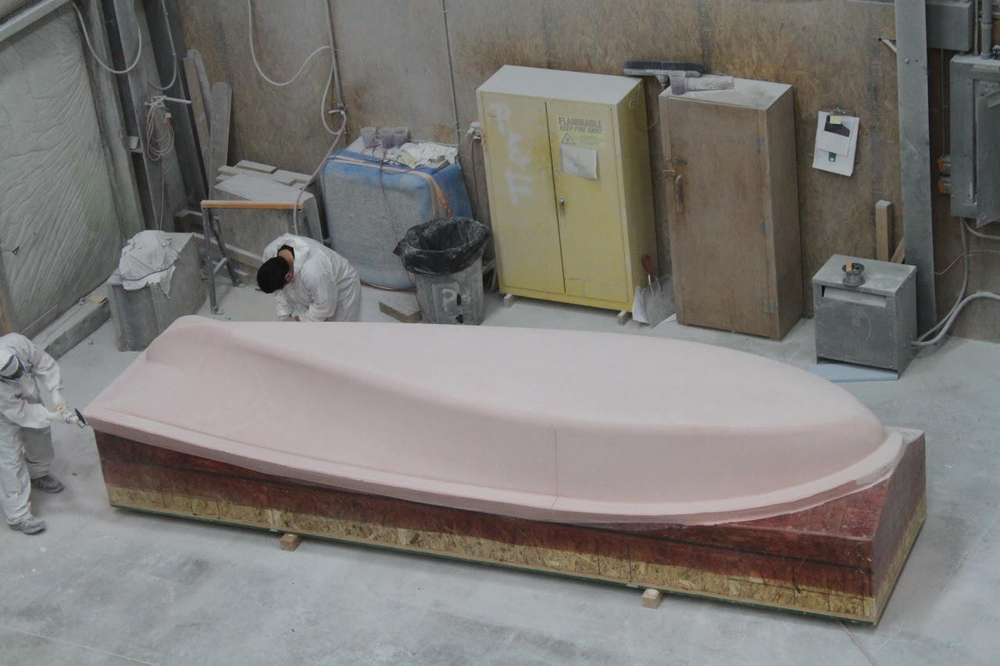
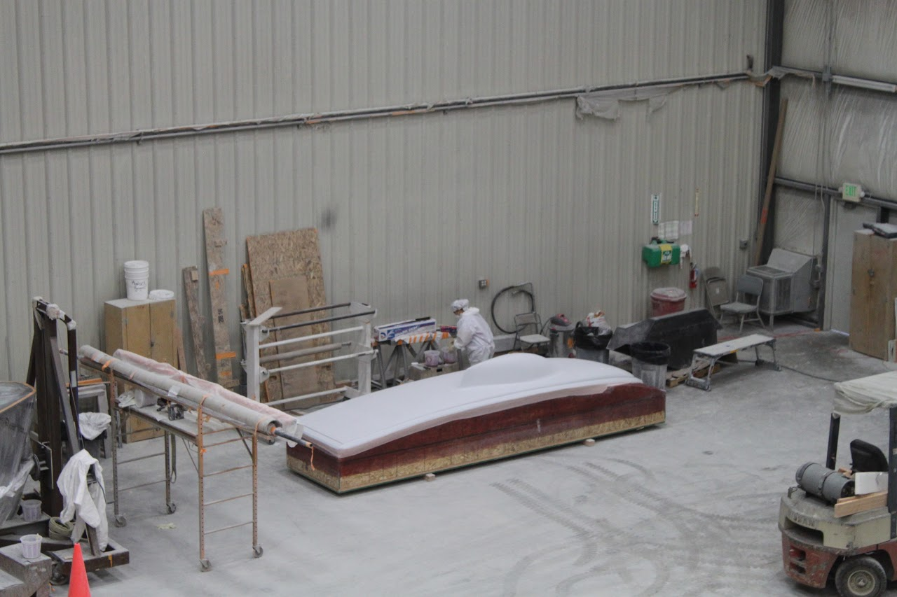
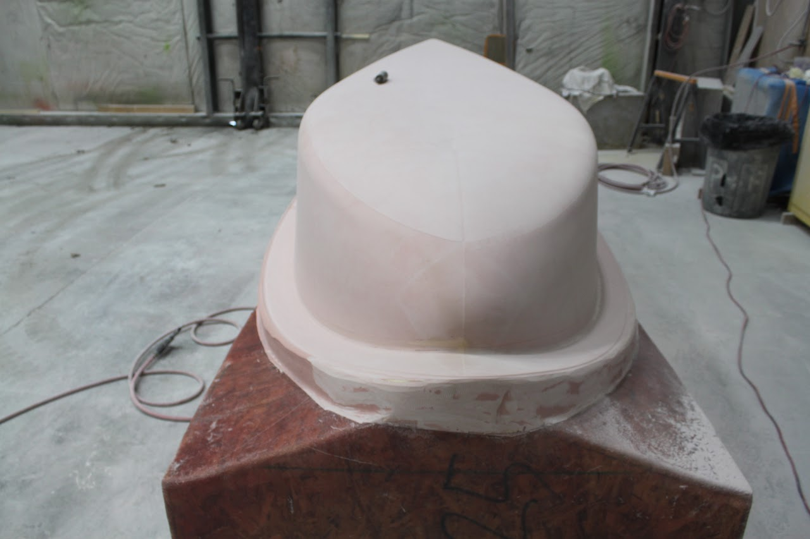

# SSCP - 19-02-24 Updates

# 19-02-24 Updates

SPONSOR UPDATES

Tell the team who you talked to.

* Julia - help Julia hash at Terra on Saturday 3/2 at 9pm! they sponsored our special D space! TitoJohn from Hyundai Cradle is joining us today! We'll be showing him around the shop today.SarahOvens - promising news from ACP Composites; also talked to Kittyhawk and Lawrence Livermore Nat'l Lab and JobyExxon - gave a tour of the lab/car; guy asked about logo sizing and was like "I'll try to get you things but no promises from corporate!"not a sponsor, but have made first reservation in Adelaide for race crew arrivalCourtneyMKE Tool - will be giving us lots of tools, but no tool box, so clean up and make room for new tools6th Man Basketball Game - If we get >20 ppl to commit to going to a game (and actually go), Men's Basketball Marketing will donate ~$20/person worth of stuff to us (team shirts, tools, TV, just about anything we want)Thurs 2/28 6:00 pmSun 3/3 1:00 pmThurs 3/7 8:00 pm - vs Cal
* Julia - help Julia hash at Terra on Saturday 3/2 at 9pm! they sponsored our special D space! 
* TitoJohn from Hyundai Cradle is joining us today! We'll be showing him around the shop today.
* John from Hyundai Cradle is joining us today! We'll be showing him around the shop today.
* SarahOvens - promising news from ACP Composites; also talked to Kittyhawk and Lawrence Livermore Nat'l Lab and JobyExxon - gave a tour of the lab/car; guy asked about logo sizing and was like "I'll try to get you things but no promises from corporate!"not a sponsor, but have made first reservation in Adelaide for race crew arrival
* Ovens - promising news from ACP Composites; also talked to Kittyhawk and Lawrence Livermore Nat'l Lab and Joby
* Exxon - gave a tour of the lab/car; guy asked about logo sizing and was like "I'll try to get you things but no promises from corporate!"
* not a sponsor, but have made first reservation in Adelaide for race crew arrival
* CourtneyMKE Tool - will be giving us lots of tools, but no tool box, so clean up and make room for new tools6th Man Basketball Game - If we get >20 ppl to commit to going to a game (and actually go), Men's Basketball Marketing will donate ~$20/person worth of stuff to us (team shirts, tools, TV, just about anything we want)Thurs 2/28 6:00 pmSun 3/3 1:00 pmThurs 3/7 8:00 pm - vs Cal
* MKE Tool - will be giving us lots of tools, but no tool box, so clean up and make room for new tools
* 6th Man Basketball Game - If we get >20 ppl to commit to going to a game (and actually go), Men's Basketball Marketing will donate ~$20/person worth of stuff to us (team shirts, tools, TV, just about anything we want)Thurs 2/28 6:00 pmSun 3/3 1:00 pmThurs 3/7 8:00 pm - vs Cal
* Thurs 2/28 6:00 pm
* Sun 3/3 1:00 pm
* Thurs 3/7 8:00 pm - vs Cal

* Julia - help Julia hash at Terra on Saturday 3/2 at 9pm! they sponsored our special D space! 
* TitoJohn from Hyundai Cradle is joining us today! We'll be showing him around the shop today.
* John from Hyundai Cradle is joining us today! We'll be showing him around the shop today.
* SarahOvens - promising news from ACP Composites; also talked to Kittyhawk and Lawrence Livermore Nat'l Lab and JobyExxon - gave a tour of the lab/car; guy asked about logo sizing and was like "I'll try to get you things but no promises from corporate!"not a sponsor, but have made first reservation in Adelaide for race crew arrival
* Ovens - promising news from ACP Composites; also talked to Kittyhawk and Lawrence Livermore Nat'l Lab and Joby
* Exxon - gave a tour of the lab/car; guy asked about logo sizing and was like "I'll try to get you things but no promises from corporate!"
* not a sponsor, but have made first reservation in Adelaide for race crew arrival
* CourtneyMKE Tool - will be giving us lots of tools, but no tool box, so clean up and make room for new tools6th Man Basketball Game - If we get >20 ppl to commit to going to a game (and actually go), Men's Basketball Marketing will donate ~$20/person worth of stuff to us (team shirts, tools, TV, just about anything we want)Thurs 2/28 6:00 pmSun 3/3 1:00 pmThurs 3/7 8:00 pm - vs Cal
* MKE Tool - will be giving us lots of tools, but no tool box, so clean up and make room for new tools
* 6th Man Basketball Game - If we get >20 ppl to commit to going to a game (and actually go), Men's Basketball Marketing will donate ~$20/person worth of stuff to us (team shirts, tools, TV, just about anything we want)Thurs 2/28 6:00 pmSun 3/3 1:00 pmThurs 3/7 8:00 pm - vs Cal
* Thurs 2/28 6:00 pm
* Sun 3/3 1:00 pm
* Thurs 3/7 8:00 pm - vs Cal

Julia - help Julia hash at Terra on Saturday 3/2 at 9pm! they sponsored our special D space! 

Tito

* John from Hyundai Cradle is joining us today! We'll be showing him around the shop today.

John from Hyundai Cradle is joining us today! We'll be showing him around the shop today.

Sarah

* Ovens - promising news from ACP Composites; also talked to Kittyhawk and Lawrence Livermore Nat'l Lab and Joby
* Exxon - gave a tour of the lab/car; guy asked about logo sizing and was like "I'll try to get you things but no promises from corporate!"
* not a sponsor, but have made first reservation in Adelaide for race crew arrival

Ovens - promising news from ACP Composites; also talked to Kittyhawk and Lawrence Livermore Nat'l Lab and Joby

Exxon - gave a tour of the lab/car; guy asked about logo sizing and was like "I'll try to get you things but no promises from corporate!"

not a sponsor, but have made first reservation in Adelaide for race crew arrival

Courtney

* MKE Tool - will be giving us lots of tools, but no tool box, so clean up and make room for new tools
* 6th Man Basketball Game - If we get >20 ppl to commit to going to a game (and actually go), Men's Basketball Marketing will donate ~$20/person worth of stuff to us (team shirts, tools, TV, just about anything we want)Thurs 2/28 6:00 pmSun 3/3 1:00 pmThurs 3/7 8:00 pm - vs Cal
* Thurs 2/28 6:00 pm
* Sun 3/3 1:00 pm
* Thurs 3/7 8:00 pm - vs Cal

MKE Tool - will be giving us lots of tools, but no tool box, so clean up and make room for new tools

6th Man Basketball Game - If we get >20 ppl to commit to going to a game (and actually go), Men's Basketball Marketing will donate ~$20/person worth of stuff to us (team shirts, tools, TV, just about anything we want)

* Thurs 2/28 6:00 pm
* Sun 3/3 1:00 pm
* Thurs 3/7 8:00 pm - vs Cal

Thurs 2/28 6:00 pm

Sun 3/3 1:00 pm

Thurs 3/7 8:00 pm - vs Cal

Array

Key Points:

* Hot priority on nailing stringing optimization scriptTrying to close out NDA discussions with Alta DevicesFinish scoping diodes this week, check leadtimes to order
* Hot priority on nailing stringing optimization script
* Trying to close out NDA discussions with Alta Devices
* Finish scoping diodes this week, check leadtimes to order

* Hot priority on nailing stringing optimization script
* Trying to close out NDA discussions with Alta Devices
* Finish scoping diodes this week, check leadtimes to order

Hot priority on nailing stringing optimization script

Trying to close out NDA discussions with Alta Devices

Finish scoping diodes this week, check leadtimes to order

Business

Key Points:

* Working with Office of Development to finalize 3M sponsorship.Continuing to source materials for Mech Team.Continuing to talks with Digikey and other Electrical outreach.Sub-Team leads please fill out the newsletter doc by next week! 
* Working with Office of Development to finalize 3M sponsorship.
* Continuing to source materials for Mech Team.
* Continuing to talks with Digikey and other Electrical outreach.
* Sub-Team leads please fill out the newsletter doc by next week! 

* Working with Office of Development to finalize 3M sponsorship.
* Continuing to source materials for Mech Team.
* Continuing to talks with Digikey and other Electrical outreach.
* Sub-Team leads please fill out the newsletter doc by next week! 

Working with Office of Development to finalize 3M sponsorship.

Continuing to source materials for Mech Team.

Continuing to talks with Digikey and other Electrical outreach.

Sub-Team leads please fill out the newsletter doc by next week! 

Code + Strategy

Key Points:

* Sarah - went over strategy problem setup on Friday w/ grad student advisor, got lots of good adviceGot access to weather forecasting API with Climacell. Talk to Sarah if you're interested in working on weather.ToDo - can strategy/code/possibly telemetry(?) sync up on some details of cruise control/speed change inputs to car?
* Sarah - went over strategy problem setup on Friday w/ grad student advisor, got lots of good advice
* Got access to weather forecasting API with Climacell. Talk to Sarah if you're interested in working on weather.
* ToDo - can strategy/code/possibly telemetry(?) sync up on some details of cruise control/speed change inputs to car?

* Sarah - went over strategy problem setup on Friday w/ grad student advisor, got lots of good advice
* Got access to weather forecasting API with Climacell. Talk to Sarah if you're interested in working on weather.
* ToDo - can strategy/code/possibly telemetry(?) sync up on some details of cruise control/speed change inputs to car?

Sarah - went over strategy problem setup on Friday w/ grad student advisor, got lots of good advice

Got access to weather forecasting API with Climacell. Talk to Sarah if you're interested in working on weather.

ToDo - can strategy/code/possibly telemetry(?) sync up on some details of cruise control/speed change inputs to car?

Electrical

Key Points:

* Steering Wheel & Lights board shipping on Wednesday
* Steering Wheel & Lights board shipping on Wednesday

* Steering Wheel & Lights board shipping on Wednesday

Steering Wheel & Lights board shipping on Wednesday

Wins:

Losses:

Mechanical + Composites

Key Points:

* (probably, pending dimension check) found an oven!Upcoming big things:materials arrive, final inventory for composites weeksarah has been cleaning and organizing the shop. Don't undo my work.need to be working on finalizing ply shapes, numbers, layup schedule. Talk to Sarah w/ questions
* (probably, pending dimension check) found an oven!
* Upcoming big things:materials arrive, final inventory for composites weeksarah has been cleaning and organizing the shop. Don't undo my work.
* materials arrive, final inventory for composites weeksarah has been cleaning and organizing the shop. Don't undo my work.
* sarah has been cleaning and organizing the shop. Don't undo my work.
* need to be working on finalizing ply shapes, numbers, layup schedule. Talk to Sarah w/ questions

* (probably, pending dimension check) found an oven!
* Upcoming big things:materials arrive, final inventory for composites weeksarah has been cleaning and organizing the shop. Don't undo my work.
* materials arrive, final inventory for composites weeksarah has been cleaning and organizing the shop. Don't undo my work.
* sarah has been cleaning and organizing the shop. Don't undo my work.
* need to be working on finalizing ply shapes, numbers, layup schedule. Talk to Sarah w/ questions

(probably, pending dimension check) found an oven!

Upcoming big things:

* materials arrive, final inventory for composites weeksarah has been cleaning and organizing the shop. Don't undo my work.
* sarah has been cleaning and organizing the shop. Don't undo my work.

materials arrive, final inventory for composites week

* sarah has been cleaning and organizing the shop. Don't undo my work.

sarah has been cleaning and organizing the shop. Don't undo my work.

need to be working on finalizing ply shapes, numbers, layup schedule. Talk to Sarah w/ questions

Mold progress pics!

