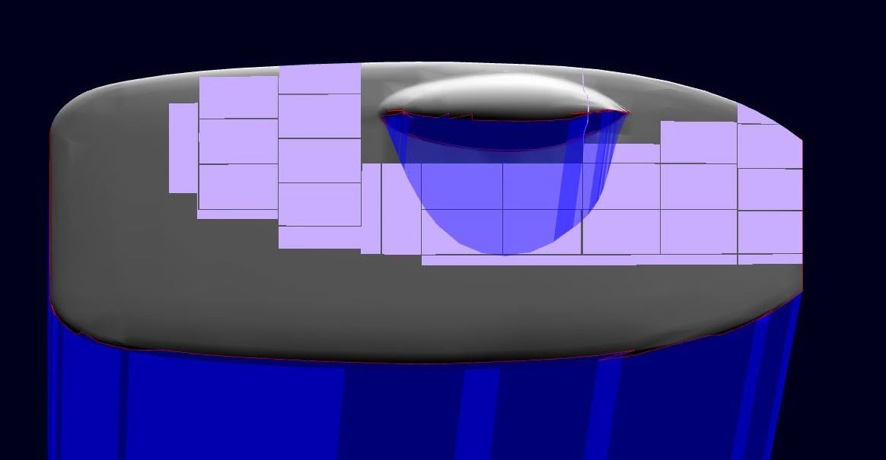

# 19-03-10-updates

## SSCP - 19-03-10 Updates

## 19-03-10 Updates

SPONSOR UPDATES

Tell the team who you talked to.

Array

Key Points:

* Alta NDA signed!Need to work on logistics for mechanical/electrical integrationFairly good idea of optimal power output from wiring; working on best string placement on car --> see jenky shadow model:
* Alta NDA signed!
* Need to work on logistics for mechanical/electrical integration
* Fairly good idea of optimal power output from wiring; working on best string placement on car --> see jenky shadow model:
* Alta NDA signed!
* Need to work on logistics for mechanical/electrical integration
* Fairly good idea of optimal power output from wiring; working on best string placement on car --> see jenky shadow model:

Alta NDA signed!

Need to work on logistics for mechanical/electrical integration

Fairly good idea of optimal power output from wiring; working on best string placement on car --> see jenky shadow model:

Business

Key Points:

* Restructuring purchase form to make purchasing easier.If you haven't filled out the newsletter I will hunt you down. Sending out during the week.  Tito is leaving forever, looking into being FO while abroad.
* Restructuring purchase form to make purchasing easier.
* If you haven't filled out the newsletter I will hunt you down. Sending out during the week. &#x20;
* Tito is leaving forever, looking into being FO while abroad.
* Restructuring purchase form to make purchasing easier.
* If you haven't filled out the newsletter I will hunt you down. Sending out during the week. &#x20;
* Tito is leaving forever, looking into being FO while abroad.

Restructuring purchase form to make purchasing easier.

If you haven't filled out the newsletter I will hunt you down. Sending out during the week. &#x20;

Tito is leaving forever, looking into being FO while abroad.

Code + Strategy

Key Points:

* Strategy: no real progress on code this week. Weather/telemetry need to sync with business on a budget.Got a Proof-of-Concept for debugging by printing to a file.This will be useful when debugging BMS. Previously, we were stuck looking at a single variable's value, and was fairly difficult to debug. By logging to a file, we'll be able to quickly gather tons of data and then analyze it + plot it. Yay! Plots!
* Strategy: no real progress on code this week. Weather/telemetry need to sync with business on a budget.
* Got a Proof-of-Concept for debugging by printing to a file.
* This will be useful when debugging BMS. Previously, we were stuck looking at a single variable's value, and was fairly difficult to debug. By logging to a file, we'll be able to quickly gather tons of data and then analyze it + plot it. Yay! Plots!
* Strategy: no real progress on code this week. Weather/telemetry need to sync with business on a budget.
* Got a Proof-of-Concept for debugging by printing to a file.
* This will be useful when debugging BMS. Previously, we were stuck looking at a single variable's value, and was fairly difficult to debug. By logging to a file, we'll be able to quickly gather tons of data and then analyze it + plot it. Yay! Plots!

Strategy: no real progress on code this week. Weather/telemetry need to sync with business on a budget.

Got a Proof-of-Concept for debugging by printing to a file.

This will be useful when debugging BMS. Previously, we were stuck looking at a single variable's value, and was fairly difficult to debug. By logging to a file, we'll be able to quickly gather tons of data and then analyze it + plot it. Yay! Plots!

Electrical

Key Points:

* Shipped Back Controller BoardNow has 5 controllers on one board.Dom is buying parts today
* Shipped Back Controller BoardNow has 5 controllers on one board.Dom is buying parts today
* Now has 5 controllers on one board.
* Dom is buying parts today
* Shipped Back Controller BoardNow has 5 controllers on one board.Dom is buying parts today
* Now has 5 controllers on one board.
* Dom is buying parts today

Shipped Back Controller Board

* Now has 5 controllers on one board.
* Dom is buying parts today

Now has 5 controllers on one board.

Dom is buying parts today

* Shipped steering wheelHas updates to accommodate for hand throttle
* Has updates to accommodate for hand throttle
* Has updates to accommodate for hand throttle
* Continuing work on oven temp. sense

Shipped steering wheel

* Has updates to accommodate for hand throttle
* Has updates to accommodate for hand throttle
* Has updates to accommodate for hand throttle

Has updates to accommodate for hand throttle

Continuing work on oven temp. sense

Wins:

* Altium licenses finally renewed :')
* Altium licenses finally renewed :')
* Altium licenses finally renewed :')

Altium licenses finally renewed :')

Mechanical + Composites

Key Points:

* Received some feedback from Fire Marshall re: oven proposal; will be forwarding this to Kenyon/Ericclean the shop after you use itfull car design review next Sunday at 7:30 with Dorian take a study break to look at the car! :upside-down-smiley face:
* Received some feedback from Fire Marshall re: oven proposal; will be forwarding this to Kenyon/Eric
* clean the shop after you use it
* full car design review next Sunday at 7:30 with Dorian take a study break to look at the car! :upside-down-smiley face:
* &#x20;take a study break to look at the car! :upside-down-smiley face:
* Received some feedback from Fire Marshall re: oven proposal; will be forwarding this to Kenyon/Eric
* clean the shop after you use it
* full car design review next Sunday at 7:30 with Dorian take a study break to look at the car! :upside-down-smiley face:
* &#x20;take a study break to look at the car! :upside-down-smiley face:

Received some feedback from Fire Marshall re: oven proposal; will be forwarding this to Kenyon/Eric

clean the shop after you use it

full car design review next Sunday at 7:30 with Dorian

* &#x20;take a study break to look at the car! :upside-down-smiley face:

&#x20;take a study break to look at the car! :upside-down-smiley face:
