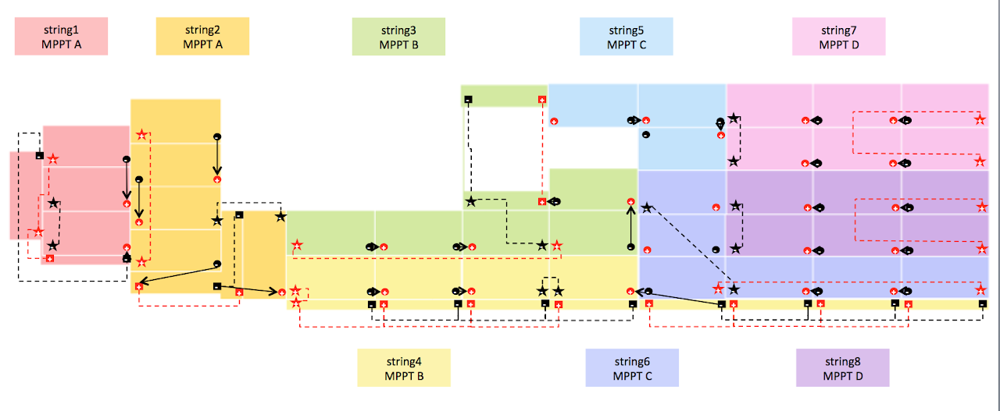
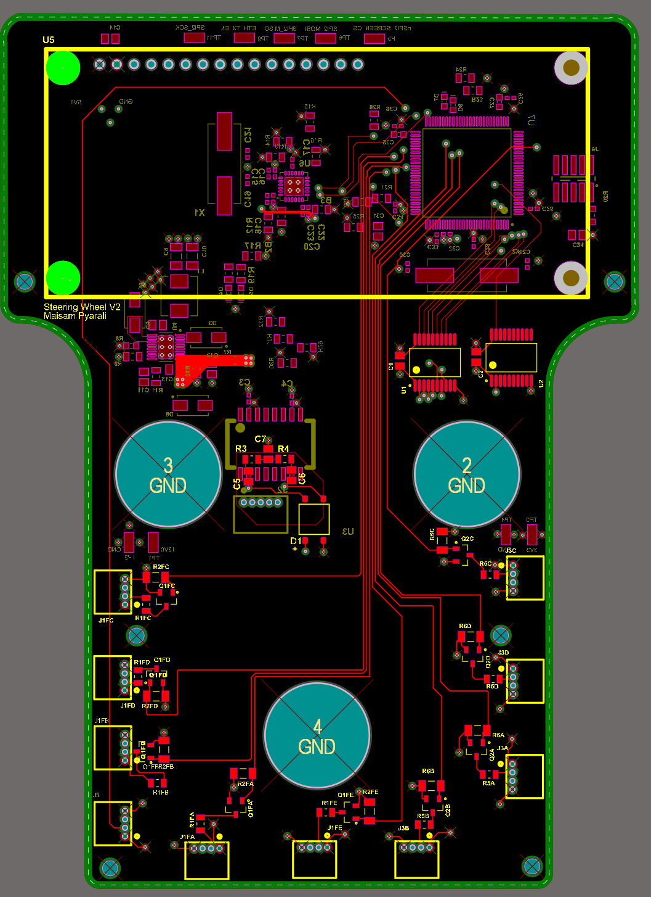

# SSCP - 19-04-07 Updates

# 19-04-07 Updates

SPONSOR UPDATES

Tell the team who you talked to.

* Harker Signups: https://forms.gle/TiJJxbbXNMVFYRPJ7Cori/Jason - Pointwise to try out new tech on Arctan geometryCori - Received array quote from Alta (46k)
* Harker Signups: https://forms.gle/TiJJxbbXNMVFYRPJ7
* Cori/Jason - Pointwise to try out new tech on Arctan geometry
* Cori - Received array quote from Alta (46k)

* Harker Signups: https://forms.gle/TiJJxbbXNMVFYRPJ7
* Cori/Jason - Pointwise to try out new tech on Arctan geometry
* Cori - Received array quote from Alta (46k)

Harker Signups: https://forms.gle/TiJJxbbXNMVFYRPJ7

[https://forms.gle/TiJJxbbXNMVFYRPJ7](https://forms.gle/TiJJxbbXNMVFYRPJ7)

Cori/Jason - Pointwise to try out new tech on Arctan geometry

Cori - Received array quote from Alta (46k)

Array

Key Points:

* Finalized module stringing pattern over spring breakReceived quote from AltaDrafted first pass of wiring (see image)To do: work with EE on wiring needs (insulation, soldering, waterproofing); develop passthrough strategy (potting + silicone, 3D part, etc)
* Finalized module stringing pattern over spring break
* Received quote from Alta
* Drafted first pass of wiring (see image)
* To do: work with EE on wiring needs (insulation, soldering, waterproofing); develop passthrough strategy (potting + silicone, 3D part, etc)

* Finalized module stringing pattern over spring break
* Received quote from Alta
* Drafted first pass of wiring (see image)
* To do: work with EE on wiring needs (insulation, soldering, waterproofing); develop passthrough strategy (potting + silicone, 3D part, etc)

Finalized module stringing pattern over spring break

Received quote from Alta

Drafted first pass of wiring (see image)

To do: work with EE on wiring needs (insulation, soldering, waterproofing); develop passthrough strategy (potting + silicone, 3D part, etc)

Business

Key Points:

Code + Strategy

Key Points:

* Steering wheel is in, loading code onto it today!VC will be here by Wednesday and will start making harness and coding thenStill working with temporary licenses but changes coming soon
* Steering wheel is in, loading code onto it today!
* VC will be here by Wednesday and will start making harness and coding then
* Still working with temporary licenses but changes coming soon

* Steering wheel is in, loading code onto it today!
* VC will be here by Wednesday and will start making harness and coding then
* Still working with temporary licenses but changes coming soon

Steering wheel is in, loading code onto it today!

VC will be here by Wednesday and will start making harness and coding then

Still working with temporary licenses but changes coming soon

Electrical

Key Points:

* Lights boards are in and soldered!Currently in the process of debugging/testingSW shipped and arrived! Screen soldered and coding underway
* Lights boards are in and soldered!Currently in the process of debugging/testing
* Currently in the process of debugging/testing
* SW shipped and arrived! Screen soldered and coding underway

* Lights boards are in and soldered!Currently in the process of debugging/testing
* Currently in the process of debugging/testing
* SW shipped and arrived! Screen soldered and coding underway

Lights boards are in and soldered!

* Currently in the process of debugging/testing

Currently in the process of debugging/testing

SW shipped and arrived! Screen soldered and coding underway

* VC finished, shipped, arriving on 4/9!BMS layout underway - ship date TBD (aiming for this wednesday/thursday)Adding in mechanical switch shut-off per Dorian's advice on ThursdayMet with sponsors from TE and got new connectors :)
* VC finished, shipped, arriving on 4/9!
* BMS layout underway - ship date TBD (aiming for this wednesday/thursday)Adding in mechanical switch shut-off per Dorian's advice on Thursday
* Adding in mechanical switch shut-off per Dorian's advice on Thursday
* Met with sponsors from TE and got new connectors :)

* VC finished, shipped, arriving on 4/9!
* BMS layout underway - ship date TBD (aiming for this wednesday/thursday)Adding in mechanical switch shut-off per Dorian's advice on Thursday
* Adding in mechanical switch shut-off per Dorian's advice on Thursday
* Met with sponsors from TE and got new connectors :)

VC finished, shipped, arriving on 4/9!

BMS layout underway - ship date TBD (aiming for this wednesday/thursday)

* Adding in mechanical switch shut-off per Dorian's advice on Thursday

Adding in mechanical switch shut-off per Dorian's advice on Thursday

Met with sponsors from TE and got new connectors :)

Mechanical + Composites

Key Points:

* We built the outside of a car (go team!, good job). If you haven't seen it, go check it out! Vail was happy we didn't trash the shop! Please continue to not trash the shop.We will send out a when-to-meet for work sessions on the aerobody. There is a lot of work to do! Please plan on plenty of shop time this quarter. If you have a bored hour+, come to vail and there will probably be work for you!Soon (ASAP): need bolt hole patterns finalized for everything going into the chassis (brakes, latches, roll cage).Kenyon and Sarah are behind on things
* We built the outside of a car (go team!, good job). If you haven't seen it, go check it out! Vail was happy we didn't trash the shop! Please continue to not trash the shop.
* Vail was happy we didn't trash the shop! Please continue to not trash the shop.
* We will send out a when-to-meet for work sessions on the aerobody. There is a lot of work to do! Please plan on plenty of shop time this quarter. If you have a bored hour+, come to vail and there will probably be work for you!
* Soon (ASAP): need bolt hole patterns finalized for everything going into the chassis (brakes, latches, roll cage).
* Kenyon and Sarah are behind on things

* We built the outside of a car (go team!, good job). If you haven't seen it, go check it out! Vail was happy we didn't trash the shop! Please continue to not trash the shop.
* Vail was happy we didn't trash the shop! Please continue to not trash the shop.
* We will send out a when-to-meet for work sessions on the aerobody. There is a lot of work to do! Please plan on plenty of shop time this quarter. If you have a bored hour+, come to vail and there will probably be work for you!
* Soon (ASAP): need bolt hole patterns finalized for everything going into the chassis (brakes, latches, roll cage).
* Kenyon and Sarah are behind on things

We built the outside of a car (go team!, good job). If you haven't seen it, go check it out! 

* Vail was happy we didn't trash the shop! Please continue to not trash the shop.

Vail was happy we didn't trash the shop! Please continue to not trash the shop.

We will send out a when-to-meet for work sessions on the aerobody. There is a lot of work to do! Please plan on plenty of shop time this quarter. If you have a bored hour+, come to vail and there will probably be work for you!

Soon (ASAP): need bolt hole patterns finalized for everything going into the chassis (brakes, latches, roll cage).

Kenyon and Sarah are behind on things

