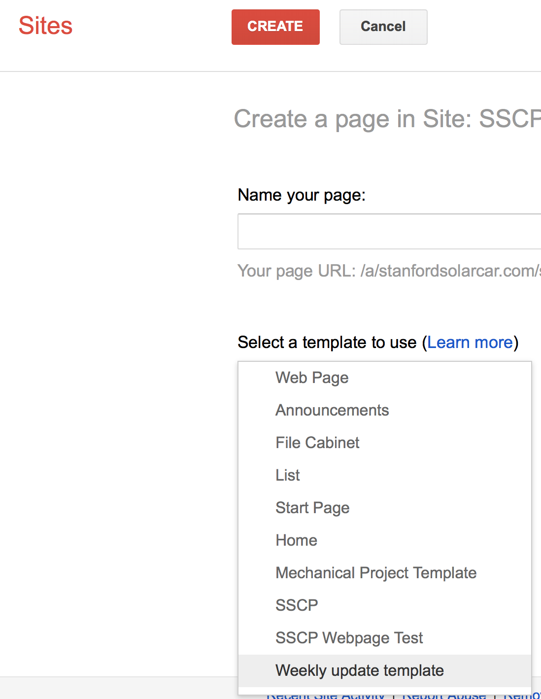

# weekly-updates

## SSCP - Weekly Updates

## Weekly Updates

***

Navigate to the appropriate week and fill in your sub-team update. Use the weekly update as a chance to plan what you want to share with the team in Sunday meetings and in the engineering update emails.

Jot down a bullet point or several in each of the following three categories:

* Key Points: Anything you want to share with the team. This can be a big win (reduced drag by x%, scored a new sponsor, etc.), a critical item that needs help with (major part supplier backed out, cell shipment delayed, etc.), or anything in between that you think deserves team awareness.
* Wins: Good things that happened, if any. (Received parts back from mfr, renewed sponsorship, onboarded 2 new team members, etc.)
* Losses: Not so great things that happened, if any. (Identified error in analysis and need to recalculate, unable to find code bug after a week of debugging, business merger causing relationship tensions, etc.)&#x20;

Key Points: Anything you want to share with the team. This can be a big win (reduced drag by x%, scored a new sponsor, etc.), a critical item that needs help with (major part supplier backed out, cell shipment delayed, etc.), or anything in between that you think deserves team awareness.

Wins: Good things that happened, if any. (Received parts back from mfr, renewed sponsorship, onboarded 2 new team members, etc.)

Losses: Not so great things that happened, if any. (Identified error in analysis and need to recalculate, unable to find code bug after a week of debugging, business merger causing relationship tensions, etc.)&#x20;

You might not always have a key point/win/loss. Use your judgement!

To create a new update page:

1. Click the "Create page" button on the top right of your browser window
2. Under the "Select a template to use" dropdown menu, select "Weekly update template" (see below)
3. Title it "YY-MM-DD Update"

Click the "Create page" button on the top right of your browser window

Under the "Select a template to use" dropdown menu, select "Weekly update template" (see below)

Title it "YY-MM-DD Update"

The update template can be found below.

***

***

Sponsors

Aero

Key Points:

Wins:

Losses:

Array

Key Points:

Wins:

Losses:

Business

Key Points:

Wins:

Losses:

Code + Strategy

Key Points:

Wins:

Losses:

Electrical

Key Points:

Wins:

Losses:

Mechanical + Composites

Key Points:

Wins:

Losses:

***
