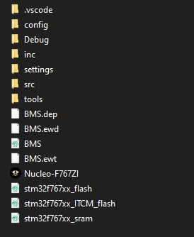
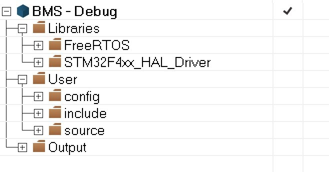
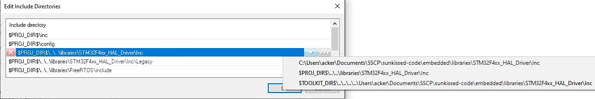

# SSCP - IAR Project/Workspace Creation

# IAR Project/Workspace Creation

Welcome to the IAR Project/Workspace Creation page. Our team uses IAR for the majority of our embedded code development. IAR can be a little bit finicky, but once setup correctly, it works quite nicely.

Intro:

IAR Embedded Workbench is an embedded code IDE. It works similarly to Qt Creator, Eclipse, Visual Studio Code, and other IDEs. That said, IAR uses a proprietary file organization scheme. For most IDEs, you simply open a folder on your hard drive to work on the files within it. IAR does not offer that feature. 

Instead, IAR organizes files by workspaces and, one step below that, projects. A single workspace can have many projects. In SSCP, we have historically just included a single project in a given workspace in order to minimize the amount of merging that must be done in git, our version control software. This file organization difference is what makes IAR project/workspace creation a little more complicated than making a new folder on your desktop. Below are images of the project folder in File Explorer (left image) and the project organization within IAR (right image). As you can see, the IAR version includes various files that are not in the project folder on the file system and it does not contain various files that are in the project folder. 

The key point is that you must specifically add each and every file into a project for it to be included in the build. How one does that is discussed below.

Setup:

- Creating a workspace:

* Open IAR.Then click "File"->"New Workspace"An empty IAR window will open. To save the workspace, click "File"->"Save Workspace As". I recommend naming the workspace and the enclosing folder the same.
* Open IAR.
* Then click "File"->"New Workspace"
* An empty IAR window will open. To save the workspace, click "File"->"Save Workspace As". I recommend naming the workspace and the enclosing folder the same.

1. Open IAR.
2. Then click "File"->"New Workspace"
3. An empty IAR window will open. To save the workspace, click "File"->"Save Workspace As". I recommend naming the workspace and the enclosing folder the same.

Open IAR.

Then click "File"->"New Workspace"

An empty IAR window will open. To save the workspace, click "File"->"Save Workspace As". I recommend naming the workspace and the enclosing folder the same.

- Creating a project:

* Once in a workspace, you can create a project.Click "Project"->"Create New Project". A window will appear asking what type of project you want to make. I recommend making an empty project.Next, you will be asked to save the project. I recommend saving it, with the same name as the enclosing folder/workspace, into the same directory as the workspace file.Once saved, a project will appear in the navigation pane on the left.
* Once in a workspace, you can create a project.
* Click "Project"->"Create New Project". 
* A window will appear asking what type of project you want to make. I recommend making an empty project.
* Next, you will be asked to save the project. I recommend saving it, with the same name as the enclosing folder/workspace, into the same directory as the workspace file.
* Once saved, a project will appear in the navigation pane on the left.

1. Once in a workspace, you can create a project.
2. Click "Project"->"Create New Project". 
3. A window will appear asking what type of project you want to make. I recommend making an empty project.
4. Next, you will be asked to save the project. I recommend saving it, with the same name as the enclosing folder/workspace, into the same directory as the workspace file.
5. Once saved, a project will appear in the navigation pane on the left.

Once in a workspace, you can create a project.

Click "Project"->"Create New Project". 

A window will appear asking what type of project you want to make. I recommend making an empty project.

Next, you will be asked to save the project. I recommend saving it, with the same name as the enclosing folder/workspace, into the same directory as the workspace file.

Once saved, a project will appear in the navigation pane on the left.

- Adding a folder to the project:

* Once you have a project, you will want to add some folders where you can put source files. To do this, right click in the navigation pane and then select "Add"->"Add Group..."You will be asked to name the Group. Group's are IAR's version of a folder. Once you click "OK", the Group (or folder) will appear in the navigation pane. You can drag the folders around to reorganize them. You can also create a folder hierarchy as seen in the right image above.
* Once you have a project, you will want to add some folders where you can put source files. To do this, right click in the navigation pane and then select "Add"->"Add Group..."
* You will be asked to name the Group. Group's are IAR's version of a folder. 
* Once you click "OK", the Group (or folder) will appear in the navigation pane. You can drag the folders around to reorganize them. You can also create a folder hierarchy as seen in the right image above.

1. Once you have a project, you will want to add some folders where you can put source files. To do this, right click in the navigation pane and then select "Add"->"Add Group..."
2. You will be asked to name the Group. Group's are IAR's version of a folder. 
3. Once you click "OK", the Group (or folder) will appear in the navigation pane. You can drag the folders around to reorganize them. You can also create a folder hierarchy as seen in the right image above.

Once you have a project, you will want to add some folders where you can put source files. To do this, right click in the navigation pane and then select "Add"->"Add Group..."

You will be asked to name the Group. Group's are IAR's version of a folder. 

Once you click "OK", the Group (or folder) will appear in the navigation pane. You can drag the folders around to reorganize them. You can also create a folder hierarchy as seen in the right image above.

- Adding files to a folder:

* To add files to a folder, right click it and then select "Add"->"Add Files...".You will be prompted to find the files to add. You can select multiple files. I strongly recommend putting all source files inside the same directory as the workspace and IAR project files so that you are less likely to move them, thus screwing up your IAR project. Once you click "Open", the files should appear within the folder in the navigation pane in IAR. 
* To add files to a folder, right click it and then select "Add"->"Add Files...".
* You will be prompted to find the files to add. You can select multiple files. I strongly recommend putting all source files inside the same directory as the workspace and IAR project files so that you are less likely to move them, thus screwing up your IAR project. 
* Once you click "Open", the files should appear within the folder in the navigation pane in IAR. 

1. To add files to a folder, right click it and then select "Add"->"Add Files...".
2. You will be prompted to find the files to add. You can select multiple files. I strongly recommend putting all source files inside the same directory as the workspace and IAR project files so that you are less likely to move them, thus screwing up your IAR project. 
3. Once you click "Open", the files should appear within the folder in the navigation pane in IAR. 

To add files to a folder, right click it and then select "Add"->"Add Files...".

You will be prompted to find the files to add. You can select multiple files. I strongly recommend putting all source files inside the same directory as the workspace and IAR project files so that you are less likely to move them, thus screwing up your IAR project. 

Once you click "Open", the files should appear within the folder in the navigation pane in IAR. 

Project Options: To finish setting up a new project, you have to configure various project options. Right click on the project in the navigation pane and selection "Options...".

- General:

* Set the the current "Device" to match the MCU that you will be running the code on.There is a button on the right of the text box which you can use to select the MCU.
* Set the the current "Device" to match the MCU that you will be running the code on.There is a button on the right of the text box which you can use to select the MCU.
* There is a button on the right of the text box which you can use to select the MCU.

* Set the the current "Device" to match the MCU that you will be running the code on.There is a button on the right of the text box which you can use to select the MCU.
* There is a button on the right of the text box which you can use to select the MCU.

Set the the current "Device" to match the MCU that you will be running the code on.

* There is a button on the right of the text box which you can use to select the MCU.

There is a button on the right of the text box which you can use to select the MCU.

- Compiler C/C++:

* Select the "Preprocessor" tab and then ensure that the directories for all the headers you need included are listed under the "Additional include directories".You can click on the "..." button to add directories.IMPORTANT: once you have added a directory, click the little downward arrow and select the relative path (2nd option) instead of the absolute path. If you don't do this, then the project won't work on other peoples' machines. See image below.Also under the "Preprocessor" tab, make sure to add "USE_HAL_DRIVER" and "STM32F<device number, ex.  427>xx" to the "Define symbols" list.
* Select the "Preprocessor" tab and then ensure that the directories for all the headers you need included are listed under the "Additional include directories".You can click on the "..." button to add directories.IMPORTANT: once you have added a directory, click the little downward arrow and select the relative path (2nd option) instead of the absolute path. If you don't do this, then the project won't work on other peoples' machines. See image below.
* You can click on the "..." button to add directories.
* IMPORTANT: once you have added a directory, click the little downward arrow and select the relative path (2nd option) instead of the absolute path. If you don't do this, then the project won't work on other peoples' machines. See image below.
* Also under the "Preprocessor" tab, make sure to add "USE_HAL_DRIVER" and "STM32F<device number, ex.  427>xx" to the "Define symbols" list.

* Select the "Preprocessor" tab and then ensure that the directories for all the headers you need included are listed under the "Additional include directories".You can click on the "..." button to add directories.IMPORTANT: once you have added a directory, click the little downward arrow and select the relative path (2nd option) instead of the absolute path. If you don't do this, then the project won't work on other peoples' machines. See image below.
* You can click on the "..." button to add directories.
* IMPORTANT: once you have added a directory, click the little downward arrow and select the relative path (2nd option) instead of the absolute path. If you don't do this, then the project won't work on other peoples' machines. See image below.
* Also under the "Preprocessor" tab, make sure to add "USE_HAL_DRIVER" and "STM32F<device number, ex.  427>xx" to the "Define symbols" list.

Select the "Preprocessor" tab and then ensure that the directories for all the headers you need included are listed under the "Additional include directories".

* You can click on the "..." button to add directories.
* IMPORTANT: once you have added a directory, click the little downward arrow and select the relative path (2nd option) instead of the absolute path. If you don't do this, then the project won't work on other peoples' machines. See image below.

You can click on the "..." button to add directories.

IMPORTANT: once you have added a directory, click the little downward arrow and select the relative path (2nd option) instead of the absolute path. If you don't do this, then the project won't work on other peoples' machines. See image below.

Also under the "Preprocessor" tab, make sure to add "USE_HAL_DRIVER" and "STM32F<device number, ex.  427>xx" to the "Define symbols" list.

- Assembler:

* Select the "Preprocessor" tab and then ensure that the directories for all the headers you need included (for any assembly files in the project) are listed under the "Additional include directories".See the notes above under Compiler C/C++ on how to add to the list.NOTE: You are more likely to learn of these dependencies during a build than before, since we usually don't write assembly, but often need to include pre-written assembly files. If an assembly file is failing to compile, consider the assembler includes.
* Select the "Preprocessor" tab and then ensure that the directories for all the headers you need included (for any assembly files in the project) are listed under the "Additional include directories".See the notes above under Compiler C/C++ on how to add to the list.NOTE: You are more likely to learn of these dependencies during a build than before, since we usually don't write assembly, but often need to include pre-written assembly files. If an assembly file is failing to compile, consider the assembler includes.
* See the notes above under Compiler C/C++ on how to add to the list.
* NOTE: You are more likely to learn of these dependencies during a build than before, since we usually don't write assembly, but often need to include pre-written assembly files. If an assembly file is failing to compile, consider the assembler includes.

* Select the "Preprocessor" tab and then ensure that the directories for all the headers you need included (for any assembly files in the project) are listed under the "Additional include directories".See the notes above under Compiler C/C++ on how to add to the list.NOTE: You are more likely to learn of these dependencies during a build than before, since we usually don't write assembly, but often need to include pre-written assembly files. If an assembly file is failing to compile, consider the assembler includes.
* See the notes above under Compiler C/C++ on how to add to the list.
* NOTE: You are more likely to learn of these dependencies during a build than before, since we usually don't write assembly, but often need to include pre-written assembly files. If an assembly file is failing to compile, consider the assembler includes.

Select the "Preprocessor" tab and then ensure that the directories for all the headers you need included (for any assembly files in the project) are listed under the "Additional include directories".

* See the notes above under Compiler C/C++ on how to add to the list.
* NOTE: You are more likely to learn of these dependencies during a build than before, since we usually don't write assembly, but often need to include pre-written assembly files. If an assembly file is failing to compile, consider the assembler includes.

See the notes above under Compiler C/C++ on how to add to the list.

NOTE: You are more likely to learn of these dependencies during a build than before, since we usually don't write assembly, but often need to include pre-written assembly files. If an assembly file is failing to compile, consider the assembler includes.

- Linker:

* Select the "Config" tab, select "Override default", and then specificy a .icf file that is specific to the processor you are planning to use (ex. stm32f427xx_flash.icf). This file specifies how the compiler should layout the code in memory. We usually use flash memory, so we choose that .icf file.If you have no idea where to find this file, try using the STM32CubeMX tool. It will generate one for you upon code generation.Once again, ensure that the path is relative. If it shows up as absolute, click "Edit..." and then click "Ok" and it should change to being relative.
* Select the "Config" tab, select "Override default", and then specificy a .icf file that is specific to the processor you are planning to use (ex. stm32f427xx_flash.icf). This file specifies how the compiler should layout the code in memory. We usually use flash memory, so we choose that .icf file.If you have no idea where to find this file, try using the STM32CubeMX tool. It will generate one for you upon code generation.Once again, ensure that the path is relative. If it shows up as absolute, click "Edit..." and then click "Ok" and it should change to being relative.
* If you have no idea where to find this file, try using the STM32CubeMX tool. It will generate one for you upon code generation.
* Once again, ensure that the path is relative. If it shows up as absolute, click "Edit..." and then click "Ok" and it should change to being relative.

* Select the "Config" tab, select "Override default", and then specificy a .icf file that is specific to the processor you are planning to use (ex. stm32f427xx_flash.icf). This file specifies how the compiler should layout the code in memory. We usually use flash memory, so we choose that .icf file.If you have no idea where to find this file, try using the STM32CubeMX tool. It will generate one for you upon code generation.Once again, ensure that the path is relative. If it shows up as absolute, click "Edit..." and then click "Ok" and it should change to being relative.
* If you have no idea where to find this file, try using the STM32CubeMX tool. It will generate one for you upon code generation.
* Once again, ensure that the path is relative. If it shows up as absolute, click "Edit..." and then click "Ok" and it should change to being relative.

Select the "Config" tab, select "Override default", and then specificy a .icf file that is specific to the processor you are planning to use (ex. stm32f427xx_flash.icf). This file specifies how the compiler should layout the code in memory. We usually use flash memory, so we choose that .icf file.

* If you have no idea where to find this file, try using the STM32CubeMX tool. It will generate one for you upon code generation.
* Once again, ensure that the path is relative. If it shows up as absolute, click "Edit..." and then click "Ok" and it should change to being relative.

If you have no idea where to find this file, try using the STM32CubeMX tool. It will generate one for you upon code generation.

Once again, ensure that the path is relative. If it shows up as absolute, click "Edit..." and then click "Ok" and it should change to being relative.

