# SSCP - IAR Syntax and Setup

# IAR Syntax and Setup

     1.       How does IAR work

 

Much like a regular editor, there is a main.c function that you execute a set of operations in. You set up and operate everything here.

 

Main operating function for our operating system (FreeRTOS) is xTaskCreate which runs another function in a different source file in the project directory.

 

To call it you use:

 

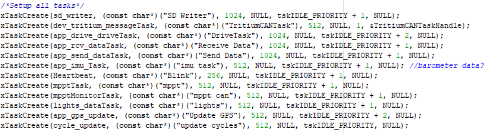

 

The first part of this function matter, i.e you use it to call the function you want to run. The rest can be read about on the xTaskCreate man pages

 

     2.       Correct IAR Settings (Make sure this is the case before you start any of your projects)

 

Right Click project on the left pane:

1.       Debugger > ST-Link

2.       ST-LINK > CPU Clock > Communication > 72 Mhz

3.       ST-LINK > Setup > Interface > SWD

 

     3.       How do I run IAR?

 

You usually run IAR in debugging mode. You press run, then once its compiles and run, you place a break point then step over or click to go to the place you put the break point. Remember to run when you are in the main function page.

 

     4.       How do I print values in some sort of console to see if the program I wrote works?

 

Add a bunch of print statements in the function you want to call then run, let the debugger get to where your function is then click View > Terminal IO

 

A good example of how this runs is in the steering board ADC

Make sure to have your type there before you printf anything. If it is a float use %f

 

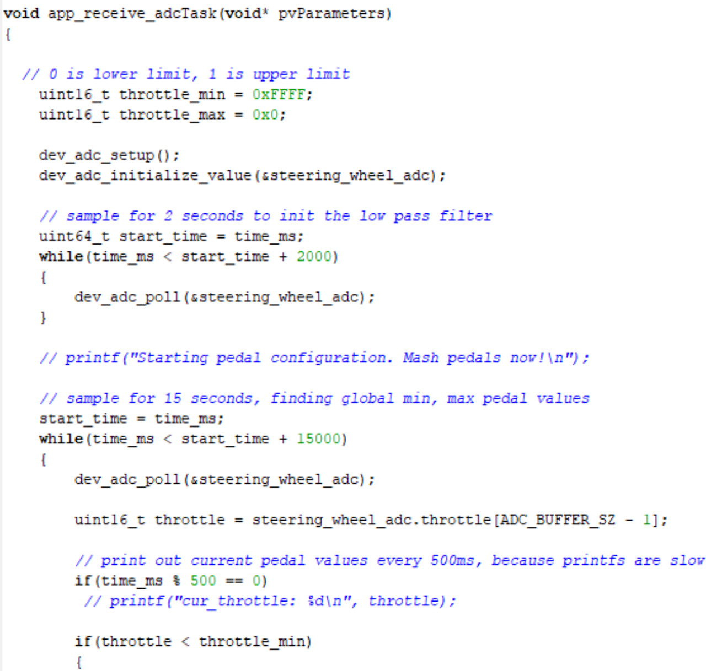

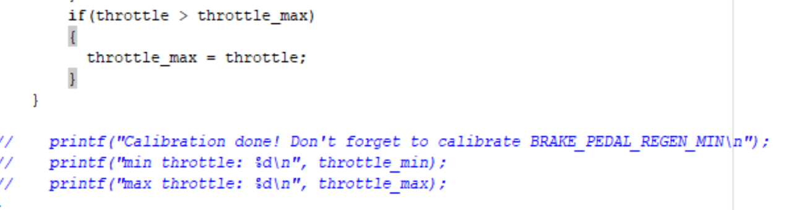

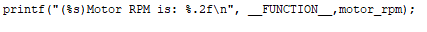

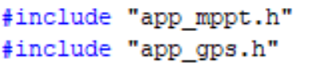

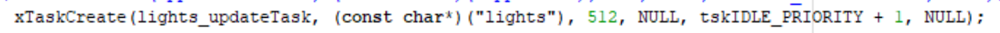

 

     5.       What if I have so many printf's and want to know what function exactly that printf is from you do:

 

     6.       How to make new .c and .h files?

 

Right click the project and click new file, then ctrl + s (Save) saving one file as a .h with a specified name and save it in the inc folder, then create another file and give it the same name with a .c at the end of it and save it in the src folder.

 

Remember the files won't be a part of the project until you manually add them, so you right click the project and click add to project, then select the 2 files. If they are debug files make sure to give them debug names

 

Make sure to go to main and include the header file of your newly created files:

 

 

     7.      How do I create a new task in the newly created .c and .h files?

 

Steps:

 

1.       Create a task and give it a name, in the same way as the below was called BUT_UpdateTask

 

 

2.       Go to the header file and include the most basic of files you need for this to work

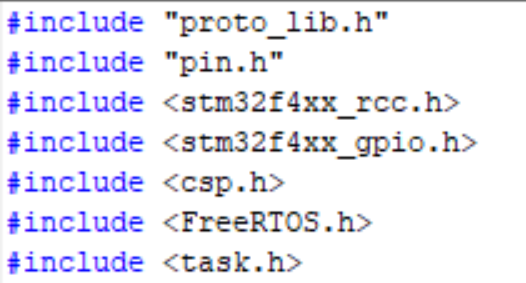

3.       Then add signature of function - just so its available throughout your project:

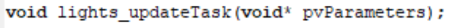

4.       Include your header and global file to the source file

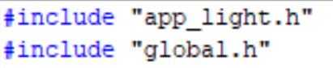

5.       Write your function in the source file

6.       ALWAYS HAVE A WHILE LOOP. Otherwise your function will only be called once and wont do what it needs to. Our current while loop is written like this:

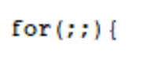

 

     8.       GPIO Pin initialization

 

First step in programming any MCU is initializing the pins you are reading from and writing to. You do this by finding out which pins have been used on the Altium. They should all be GPIO pins

 

     9.   How to find where a function has been called where variables are being used

 

View > Find and Replace > Find in file

10. How do I run a task on IAR and print its values?

 

Solution: Create X task in the format below and call the task. The name of the task can be found usually at the bottom of the .c file you are working on. In the case of the throttle it was:

 

 

When calling it in main.c file, the first part of this function is important, the rest isn't. Any reasonable arbitrary values will suffice.

 

 

11. What are linker errors?

 

Solution: There are 2 different case known to me that cause this:

 

1.       You haven't initialized the steering_wheel_adc value in dev_adc.c. you fix it by finding out its type in the global.h file. In the case of steering_wheel_adc, the type is a stuct specified in the dev_adc.h header file.

 

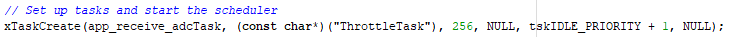

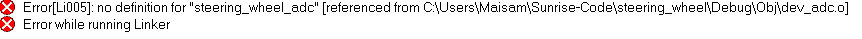

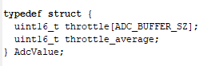

 

You initialize the struct as below:

 

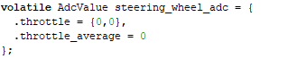

 

Don't forget to type the type of the variable while initializing it. In our case this is volatile

 

2.       You haven't used consistent capitalization in naming a variable or a function. When compiling IAR is case sensitive, so make sure everything is in the same case when writing and compiling.

     

    12. Initializing numerical values

 

 

Use float and assign value of 0.0f which means it can either be a whole value or a decimal. This is great to keep errors on types from happening

 

    13. Sometimes you want to test whether your code is working without actually using ST link, you can switch to simulator mode:

 

Project > Debugger > Driver > Change to simulator instead of ST Link

 

    14. What does Ifdef() do?

 

Checks if that value has been defined

 

 

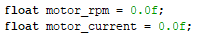

