# SSCP - Altium Designer - Adding a Part to the SSCP Libraries

# Altium Designer - Adding a Part to the SSCP Libraries

Updated for Altium 18.1

For the following example, I will be adding a charge pump chip by Linear Technology called the LTC3265. 

[LTC3265](http://cds.linear.com/docs/en/datasheet/3265fa.pdf)

First, navigate to the specific schematic library that you are going to add a part to. Since the charge pump is a voltage regulator, I am going to add it to ic_pmic.schlib, which stands for 'power management integrated circuit.' Use svn to get the lock for this library so that no one else can change the library while you are working on it.

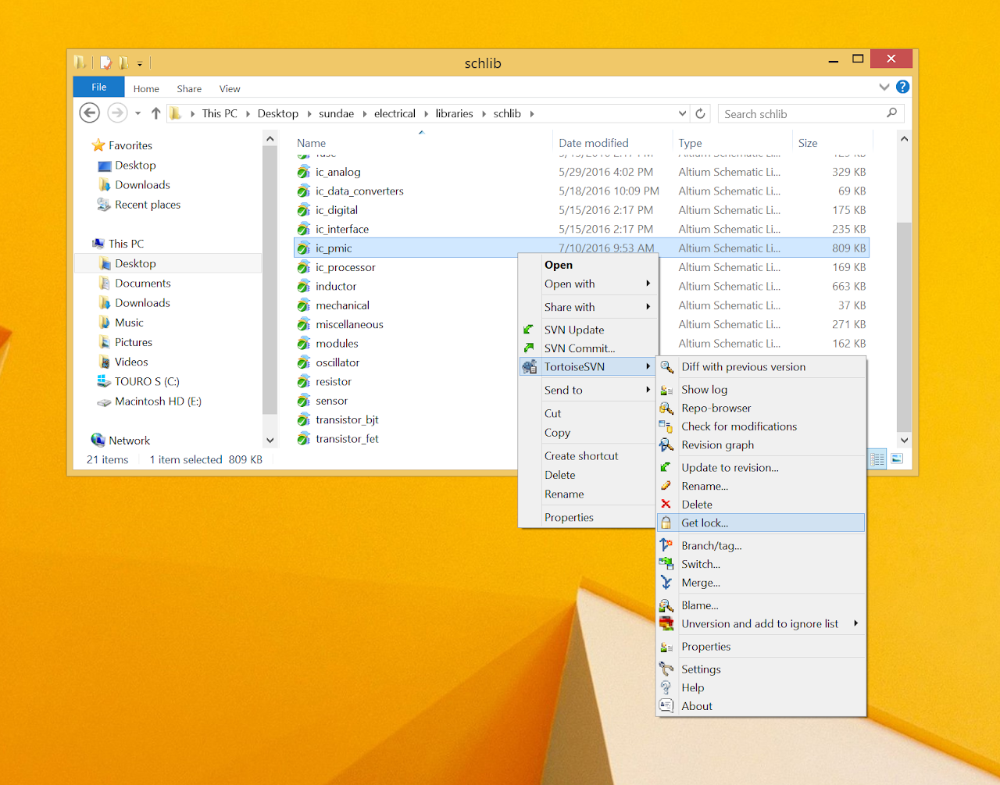

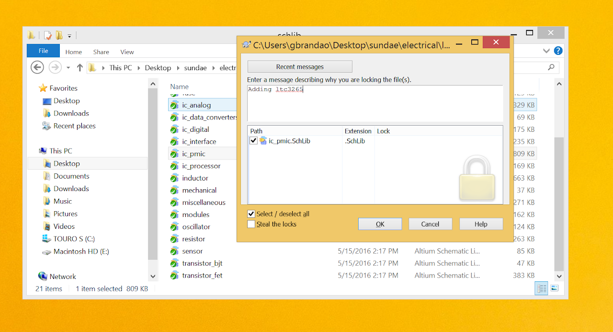

Now double click on the library to open it in Altium. You should see something like this.

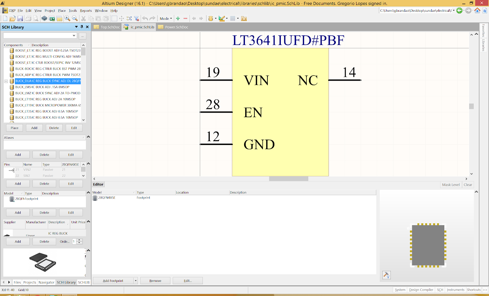

Click on Add to add a new component and type in the name of the component according to the precedent set by the rest of the library. There are other charge pump components in this library that are simply labelled 'PUMP' followed by the exact part name, so I followed suit. For my part, the extra letters after 'LTC3265' indicate the temperature rating of my specific version of the part and its packaging format. All of this info can be found on the datasheet.

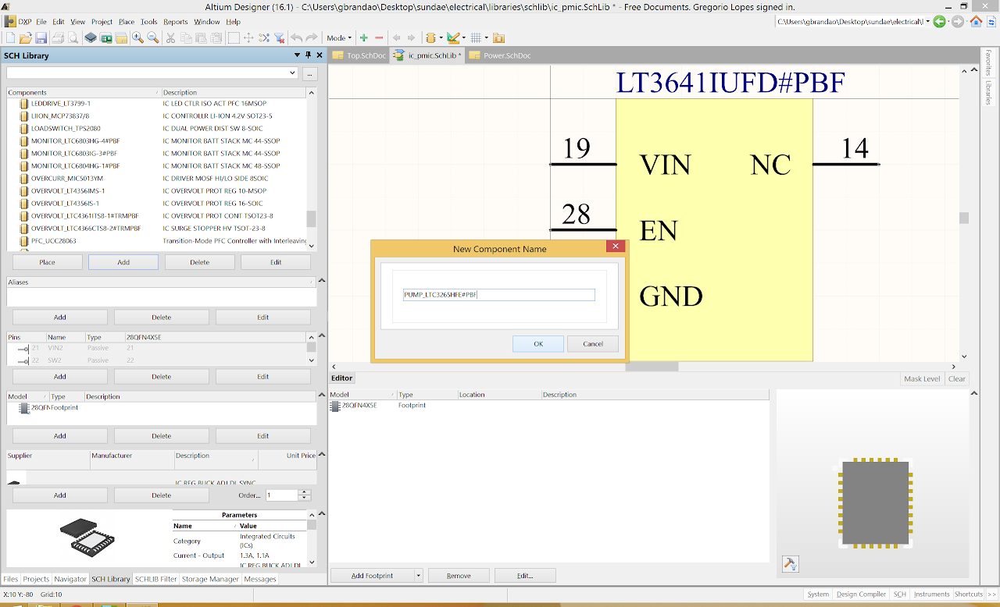

Now, right click the sheet and click 'Supplier links'

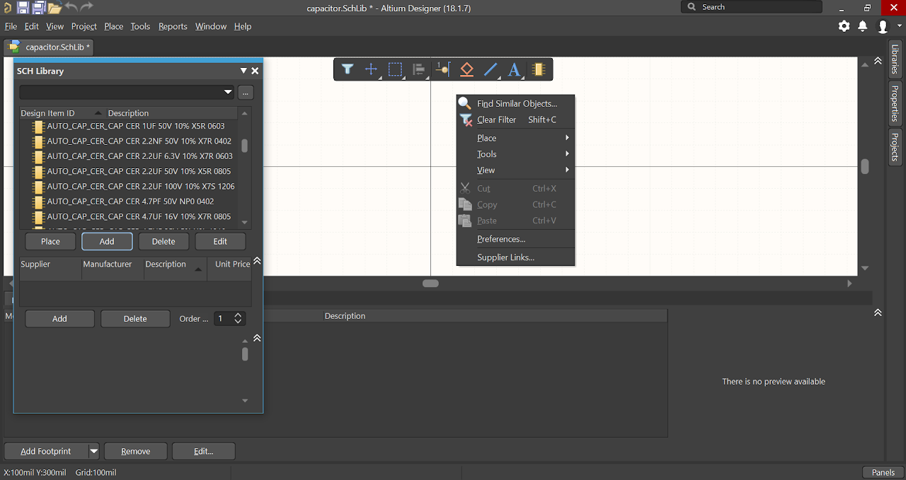

Search for the part you are adding, right click on the supplier you want and click on 'Add Supplier Link and Parameters to COMPONENT_NAME.' 

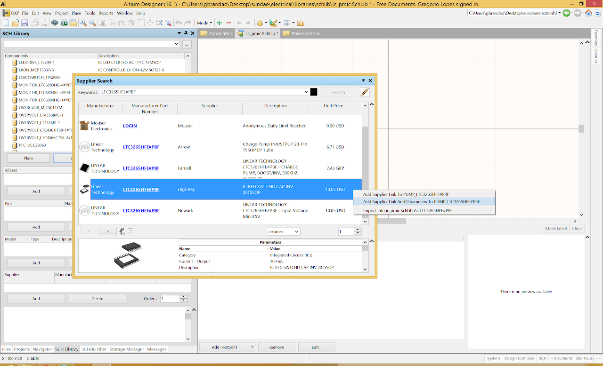

Now click on Edit. You should see something like this.

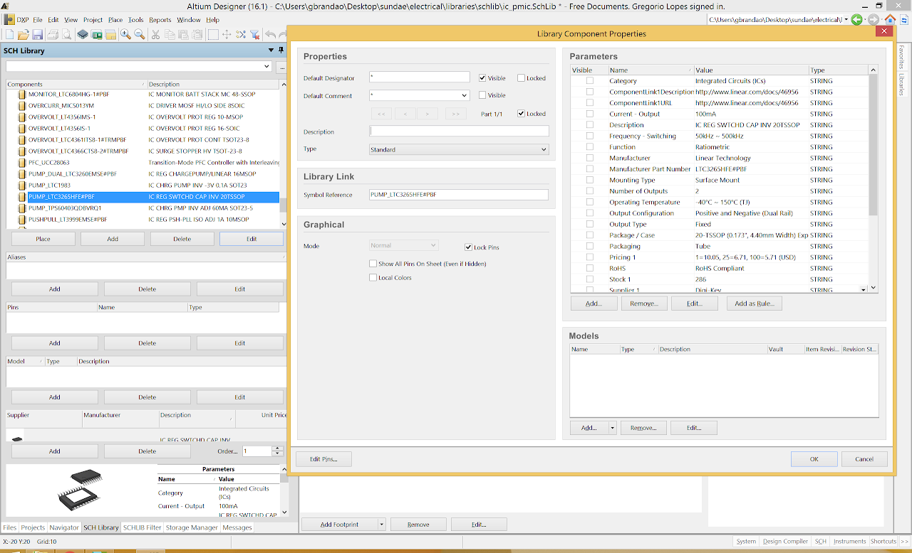

Change the default designator to some letter followed by a question mark. The question mark will be automatically replaced with a number when you place the component on a schematic. The letter should correspond to the function of the component you are adding and is usually the same as the rest of the components in the library. For example, resistors use R?, oscillators/crystals use X?, etc. In this case, we will use U?. Set the Default Comment to not visible. For the Description box, suppliers often provide a description of their component as a line in the Parameters section on the right. In this case, I just copied that right over. If there is no such line, try to follow the general format set by other components in the library. And lastly, for ComponentLink1Description, replace the link with the word Datasheet. Hit OK.

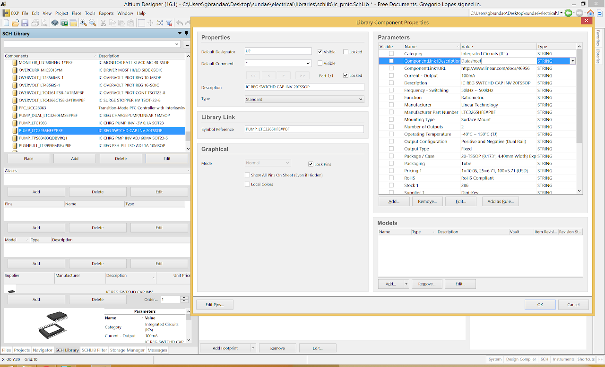

Now click Add Footprint at the bottom of the window and click on Browse...   Add the appropriate pcb footprint from the corresponding pcb library. In my case, this was the 20TSSOP, which I found out from the component description. If that information isn't there, you can also find it in the little informational window on your component at the bottom left of the screen.

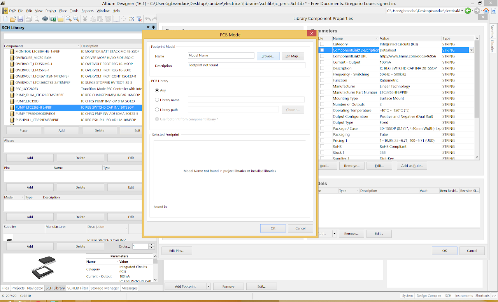

Okay, now we are going to create the schematic representation of the component. First make a rectangle. Make sure to place it with respect to the origin in the same way as shown below.

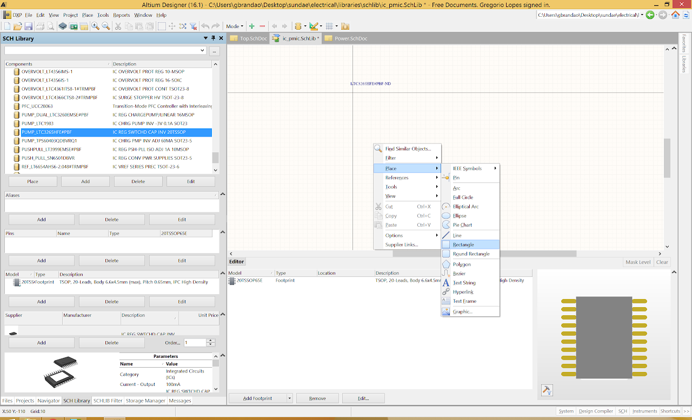

Now, before we add any pins, we want to make sure that the pin numbers on the pcb footprint that this schematic representation will ultimately be linked to are where we expect them to be. They almost always are, but it is better to just make sure every time. Below, you can see that the pin numbering layout is the same on both the pcb footprint and the schematic representation shown in the datasheet, so we're good to start placing pins.

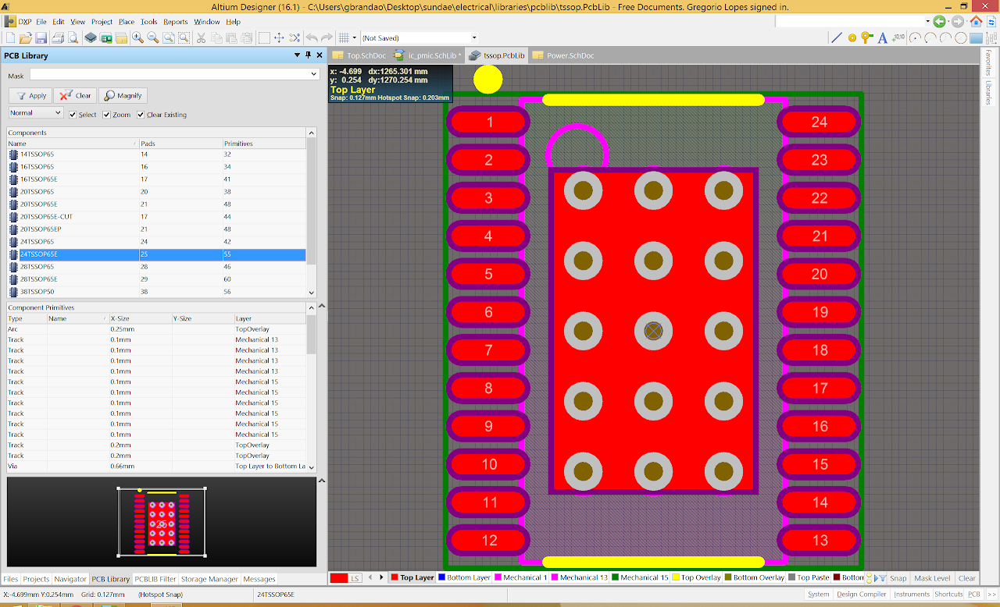

In the Pins section on the left hand side, click Add and start adding pins to the schematic, like so.

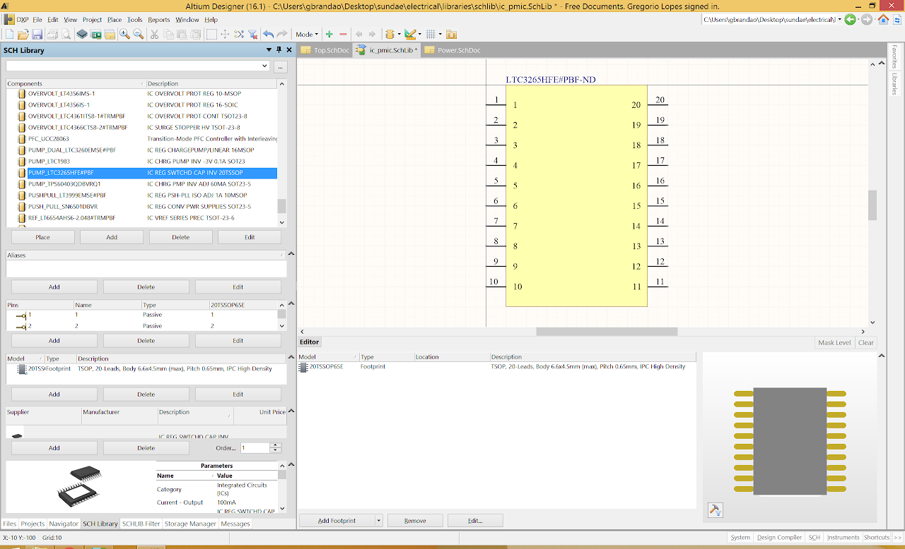

Double click each of the pins on the schematic and change the Display Name on to match the labels on the datasheet.

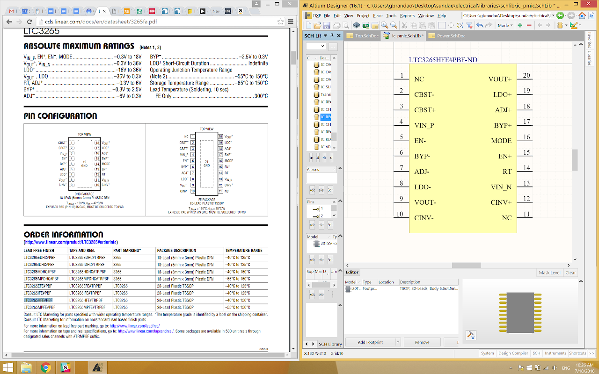

And you're done! Now just switch back to the normal project view (bottom left corner), save your changes, and commit. Committing automatically releases your lock. Please feel free to edit this page if there is anything you find lacking or unclear and think you could improve.

