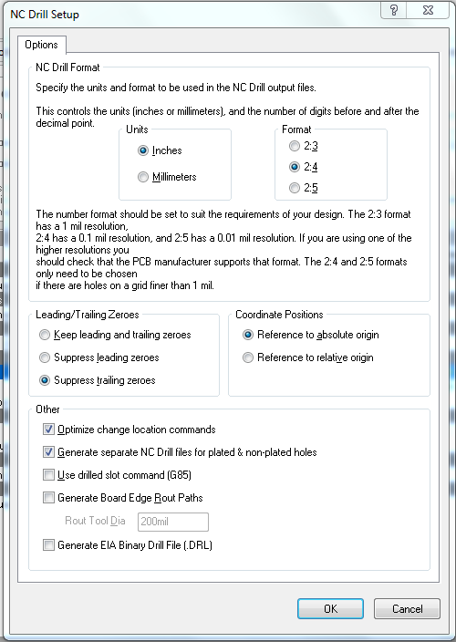
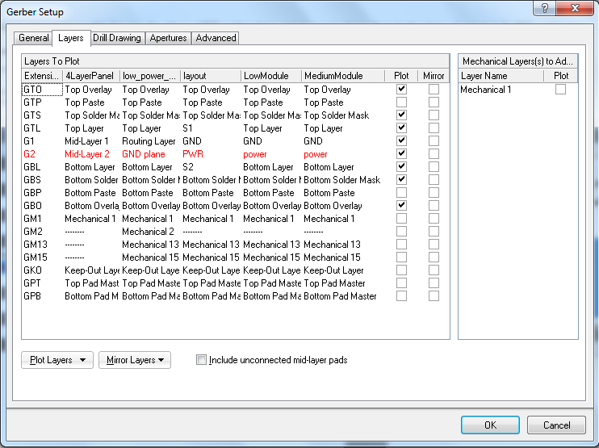
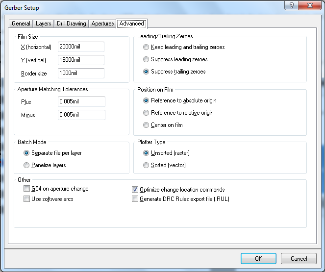
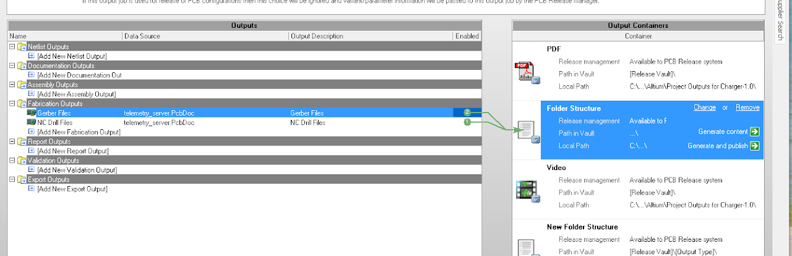

# altium-designer-sending-out-boards

## SSCP - Altium Designer - Sending Out Boards

## Altium Designer - Sending Out Boards

### Output Job File

#### Creating Output Job

An Altium Output Job file is a container that is the standard interface for producing any type of output from Altium including NC Drill Files, Gerber files, and BOMs. For a more complete description/more information see the Altium Wiki page on the topic. To create an output job right click on the project in the Projects pane and go Add New to Project->Output Job. To generate any output with the output job the output job must be saved first. So save it in the default folder and add it, and the change you made to the project you made to SVN.&#x20;

[Altium Wiki page](http://wiki.altium.com/display/ADOH/Design+to+Manufacturing)

#### Creating NC Drill Outputter

NC Drill (somtimes they are called Excellon Drill Files) files are the x, y, and size information of all the holes in a board. They tell the CNC machines where to drill in a clear text format. Each board house has slightly different output requirements for the format they like this in. Its best to check the vendors website for requirements. We commonly use Sierra Protoexpress whose requirement can be found here. To setup an NC Drill outputer click on Add New Fabrication Output->NC Drill Files and select the pcb file in your project to generate outputs for. Double click on the file and change the settings to match your manufactures guidelines. If your board contains holes that are not plated select the "Generate seperate NC Drill files for plated & non-plated holes" option.&#x20;

[here](https://www.protoexpress.com/content/noTouch.jsp?XXREFPATH=TOPMENU-PRODSVCS)

#### Creating Gerber Outputter

Gerber files contain the information that your board house uses to create the masks which define the copper areas on the board. Like NC Drill files each manufacturer likes the output in a bit different format so be sure to follow the guidelines. To add a gerber output to your project go "Add New Fabrication Output" ->Gerber Files and select the pcb file in your project to generate outputs for. To follow the guidelines you will probably have to edit things in only the general and Advanced tabs. After you change the output options to conform to the rules published by the board house, select the layers you want to plot. For boards we dont have assembled this consists of the Silkscreen, Soldermask, and Copper Layers. Altium calls these Overlay, Solder, and Layer respectively. Select all three of these for both the top and bottom layers. In addition, if you are sending out a multilayer board select your inner copper layers as well. For Sierra, you can add Mechanical 2 to all plots in order to give them an easy-to-use board outline reference (https://www.youtube.com/watch?v=A9U9Blym5lI)

[https://www.youtube.com/watch?v=A9U9Blym5lI](https://www.youtube.com/watch?v=A9U9Blym5lI)

Ensure no shelved polygons. Get the dims correct. Don't include empty layers (mark as drawing/other if empty)

#### Generating Outputs

To actually generate the outputs click on the enable buttons as shown and click generate content.&#x20;

Almost all board houses want all the folders in one zip file per project so navigate to your project folder on disk, go to project outputs and put the .txt NC drill file, and generated gerber files (only use the copper, soldermask, and silkscreen layers) and put them in one zip file.&#x20;

### DFM Check

Once you have compiled a zip file, you will need to have Sierra do a design for manufacturing check. If you do not have an account, you should register.

[register](https://www.protoexpress.com/user/register.jsp)

Then you should enter your info into the dfm check and upload the zip file. (Make sure you have a board outline!) You'll have to go through and match each layer with the gerber file that it is associated with. The easiest way to do this is open the none zip folder up and see the description of each file extension in windows explorer. Keep in mind that overlay is silkscreen and layer is copper. If you have a multi-layer board, you will need to specify layer and polarity. Hit next and then ok.

[dfm check](https://www.protoexpress.com/dfm/index.jsp)

[board outline](../../../../../../stanford.edu/testduplicationsscp/home/sscp-2012-2013/electrical-2012-2013/design-references/creating-a-board-outline/)

### Create a BOM

Create a Bill of Materials (BOM) in the out job file. Go to Add New Report Outputs. Select \[project] as the Data Source. Double click and then make sure to check Supplier Part Number, Quantity, Designator, and Description from the left side.
