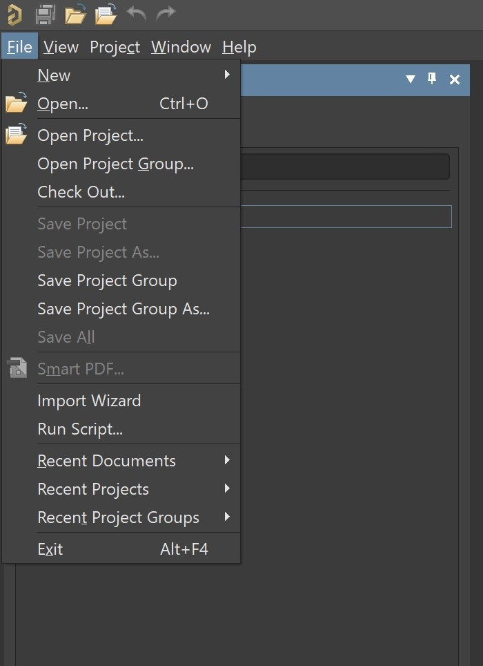

# SSCP - SVN - Using Altium's Internal SVN Tools

# SVN - Using Altium's Internal SVN Tools

Introduction

Altium Designer has SVN software built into it. The following is a guide on how to use it.

There are four sections, including how to use version control software built into Altium Designer to download (or "check-out") the files you are working on, to commit changes you make (to the master version), and to update your local copy of each file to match the master copy whenever it is updated by another user. Below are some basic steps to get you started. If you want to read more on SVN or using it within Altium Designer, click the following links (SVN, SVN with Altium Designer).

[SVN](https://en.wikipedia.org/wiki/Apache_Subversion)

[ SVN with Altium Designer](https://www.altium.com/documentation/altium-designer/using-version-control-ad)

Before working with SVN, make sure you look at SVN Protocol/Etiquette!!

[SVN Protocol/Etiquette](/stanford.edu/testduplicationsscp/home/sscp-2020-2021/electrical-2020-2021/electrical-fundamentals/svn-best-practices)

1. Adding the SVN repository into Altium Designer

The first step is to provide Altium Designer with the server information of the Solar Car SVN repository. To do this, open Altium Designer and click on the gear (settings button) in the upper right corner of the application. This will open up a window that should look something like the screenshot below. Once you have preferences open, navigate to "Data Management"->"Design Repositories". 

Then click the "Connect To" button. This will open up a pane that looks like the one below.

Fill in the boxes with the following info:

* Name: <Project Name>Default Checkout Path: <Path to where you want files to be stored locally (while you are working on them)>Method: httpsServer: solarcar.stanford.eduServer port: defaultRepository Subfolder:Available repositories:/svn/apogee/       - WSC 2009 entry, Apogee/svn/sunflower/    - WSC 2011 entry, Xenith/svn/sunbad/       - WSC 2013 entry, Luminos/svn/sunwhale/    - WSC 2015 entry, Arctan/svn/sundae/       - WSC 2017 entry, Sundae/svn/sunrise/       - WSC 2019 entry, Black Mamba (Most recent)Username: SUNet Password: SUNet password
* Name: <Project Name>
* Default Checkout Path: <Path to where you want files to be stored locally (while you are working on them)>
* Method: https
* Server: solarcar.stanford.edu
* Server port: default
* Repository Subfolder:Available repositories:/svn/apogee/       - WSC 2009 entry, Apogee/svn/sunflower/    - WSC 2011 entry, Xenith/svn/sunbad/       - WSC 2013 entry, Luminos/svn/sunwhale/    - WSC 2015 entry, Arctan/svn/sundae/       - WSC 2017 entry, Sundae/svn/sunrise/       - WSC 2019 entry, Black Mamba (Most recent)
* Available repositories:
* /svn/apogee/       - WSC 2009 entry, Apogee
* /svn/sunflower/    - WSC 2011 entry, Xenith
* /svn/sunbad/       - WSC 2013 entry, Luminos
* /svn/sunwhale/    - WSC 2015 entry, Arctan
* /svn/sundae/       - WSC 2017 entry, Sundae
* /svn/sunrise/       - WSC 2019 entry, Black Mamba (Most recent)
* Username: SUNet 
* Password: SUNet password

* Name: <Project Name>
* Default Checkout Path: <Path to where you want files to be stored locally (while you are working on them)>
* Method: https
* Server: solarcar.stanford.edu
* Server port: default
* Repository Subfolder:Available repositories:/svn/apogee/       - WSC 2009 entry, Apogee/svn/sunflower/    - WSC 2011 entry, Xenith/svn/sunbad/       - WSC 2013 entry, Luminos/svn/sunwhale/    - WSC 2015 entry, Arctan/svn/sundae/       - WSC 2017 entry, Sundae/svn/sunrise/       - WSC 2019 entry, Black Mamba (Most recent)
* Available repositories:
* /svn/apogee/       - WSC 2009 entry, Apogee
* /svn/sunflower/    - WSC 2011 entry, Xenith
* /svn/sunbad/       - WSC 2013 entry, Luminos
* /svn/sunwhale/    - WSC 2015 entry, Arctan
* /svn/sundae/       - WSC 2017 entry, Sundae
* /svn/sunrise/       - WSC 2019 entry, Black Mamba (Most recent)
* Username: SUNet 
* Password: SUNet password

Name: <Project Name>

Default Checkout Path: <Path to where you want files to be stored locally (while you are working on them)>

Method: https

Server: solarcar.stanford.edu

Server port: default

Repository Subfolder:

* Available repositories:
* /svn/apogee/       - WSC 2009 entry, Apogee
* /svn/sunflower/    - WSC 2011 entry, Xenith
* /svn/sunbad/       - WSC 2013 entry, Luminos
* /svn/sunwhale/    - WSC 2015 entry, Arctan
* /svn/sundae/       - WSC 2017 entry, Sundae
* /svn/sunrise/       - WSC 2019 entry, Black Mamba (Most recent)

Available repositories:

/svn/apogee/       - WSC 2009 entry, Apogee

/svn/sunflower/    - WSC 2011 entry, Xenith

/svn/sunbad/       - WSC 2013 entry, Luminos

/svn/sunwhale/    - WSC 2015 entry, Arctan

/svn/sundae/       - WSC 2017 entry, Sundae

/svn/sunrise/       - WSC 2019 entry, Black Mamba (Most recent)

Username: SUNet 

Password: SUNet password

Then click "OK" and then click "Apply". Altium Designer will now be able to connect to the SVN repository for you.

2. Checking out a file

The next step is to download any files you want to work on or want a local copy of (an example would be library files). To do this, click "File" in the upper left hand corner of the application, then click "Check Out..."

This will open up the following window.

If you do not see any folders or you get an error, you may have mistyped some part of the SVN repository information, so go back to step 1 and check that you entered it correctly.

From here, choose any files or folders that you want to "Check Out" and then click "OK". It may take a minute, but a window will show the progress of your download. By checking out a file, you are downloading a copy to the selected folder (AKA the folder listed underneath the text "Check out to:". 

Once the download is complete, you will be able to interact with the downloaded file just like any other local file. To begin editing it within Altium Designer, just click "File"->"Open" and select the file(s) you just downloaded via the "Check Out" menu.

3. Committing a file

Once you have edited a file and you are ready to send your changes to everyone else working on the project, select the file in the "Project" pane and then right click on it. Then hold your mouse over "Version Control" and click "Commit".

A window will pop up asking you to write a commit message and confirming which files you want to commit. Please write a descriptive commit message so other people know what you changed. Finally, click "OK" to commit your changes. That's it! 

You will know for sure that the file has been committed when the red circle next to modified the file becomes a green check mark. That means that the changes have been successfully committed to the master copy.

Note: If you want to undo changes made to a file, select it in the "Project" pane, then right click on it, hover over "Version Control", and then click "Revert Local Modifications". Confirm that you want to undo your local modifications and the file will return to the state it was in before you modified it.

4. Updating your local copy of a file

Before you start working on a project or a file, it is a good idea to ensure that your local copy is up to date with the master copy. 

To do this, right click the "Project" pane, hover over "Version Control", and then click on "Refresh". This will tell Altium Designer to check if there are any changes which need to be downloaded. If there are outdated files, you will see an orange clock symbol next to the name of the file which is out of date with the master copy.

To update the file(s), simply right click the "Project" pane, hover over "Version Control", and then click on "Update". The orange clock should turn into a green checkmark, indicating that your local copy is up to date with the master copy in the SVN repository.

5. Looking at Revision History

If you would like to see the past revisions to a file, you can open the "Storage Manager" panel by clicking "Panels" in the bottom right and selecting "Storage Manager". 

