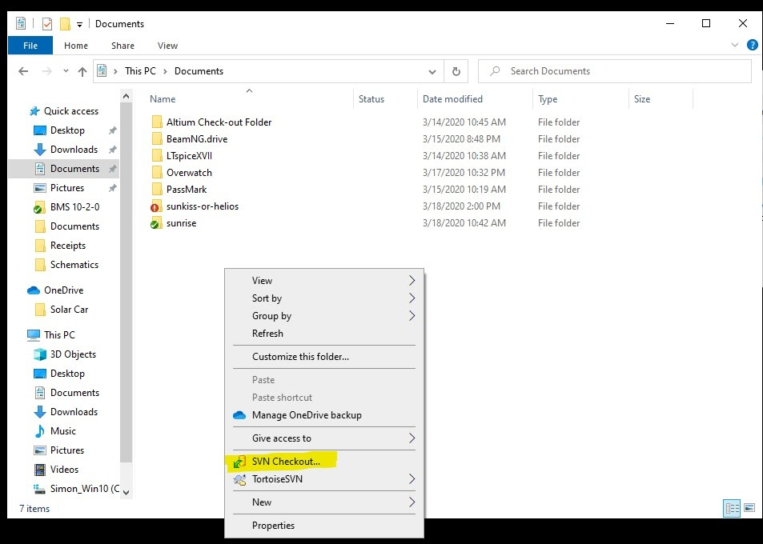
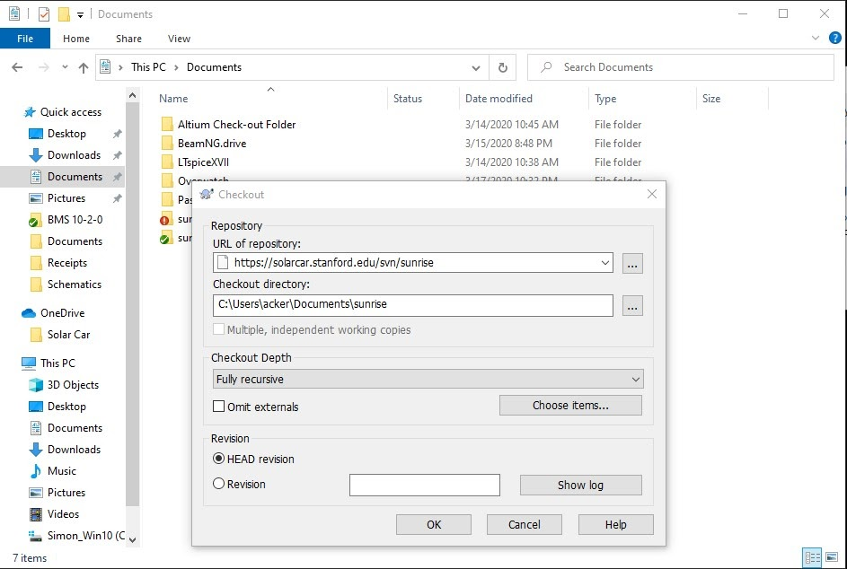
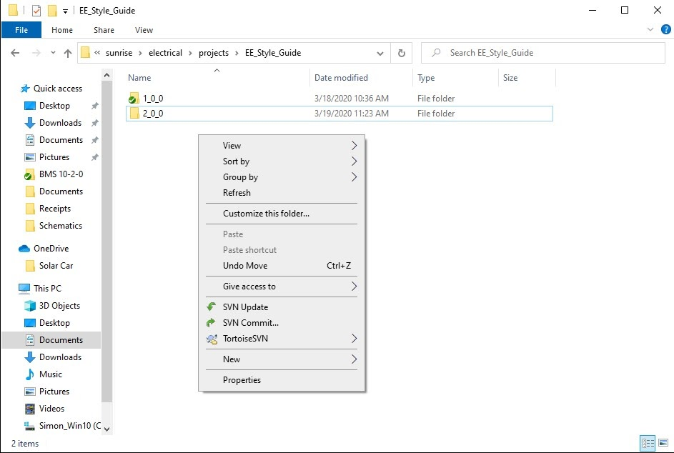
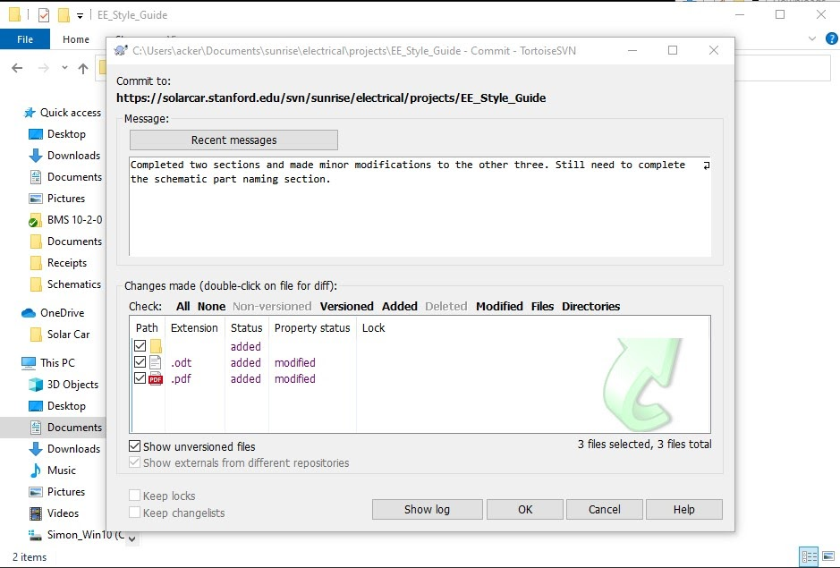
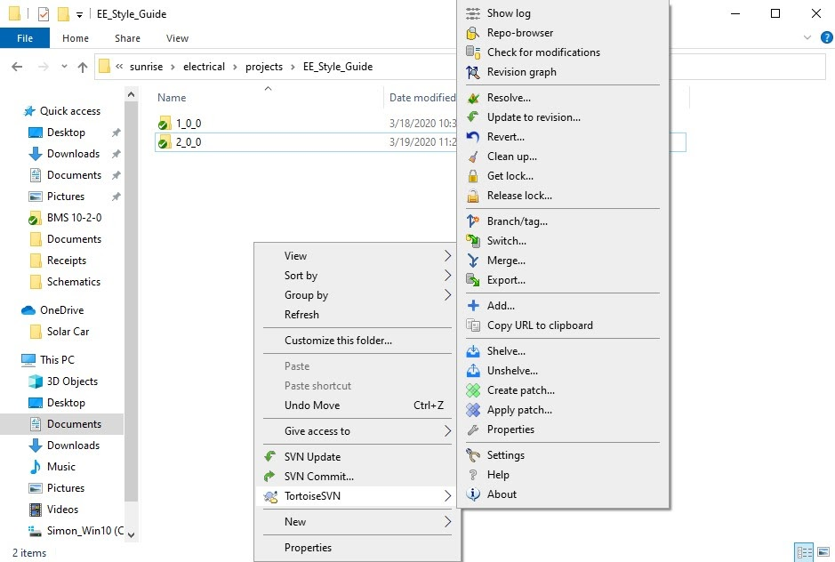

# SSCP - SVN - Using TortoiseSVN

# SVN - Using TortoiseSVN

Introduction

For Windows computers, the Electrical Team has found that TortoiseSVN is the best way to work with SVN repositories. The following is a guide on how to use it.

[ TortoiseSVN](http://tortoisesvn.net)

There are five sections, including how to install TortoiseSVN, how to check-out from a repository, and more. Below are some basic steps to get you started. If you want to read more on SVN or TortoiseSVN, click the following links (SVN, TortoiseSVN Documentation).

[SVN](https://en.wikipedia.org/wiki/Apache_Subversion)

[ TortoiseSVN Documentation](https://tortoisesvn.net/support.html)

Before working with SVN, make sure you look at SVN Protocol/Etiquette!!

[SVN Protocol/Etiquette](/home/sscp-2020-2021/electrical-2020-2021/electrical-fundamentals/svn-best-practices)

1. Installing TortoiseSVN

To install TortoiseSVN, simply visit their website, go to downloads, and select the most recent (largest version number) download which matches your system. Once you have downloaded the installer, open it and follow the installation steps.

[ website](https://tortoisesvn.net/downloads.html)

Note: TortoiseSVN is integrated into File Explorer rather than being a distinct program like a web browser. All of its tools and windows can be accessed by going into File Explorer and right clicking. Once you have installed TortoiseSVN, right-clicking will bring up a menu which will include a TortoiseSVN option. There may also be quick access commands above the TortoiseSVN menu option when you right click in folders where you have checked-out from an SVN repository.

2. Checking out a repository

Now that you have TortoiseSVN installed, you are ready to check out some files from one of the SSCP SVN repositories. It is easiest to checkout the entire repository, but you are able to check out an individual file or folder by specifying that in the check-out URL. The first step is to right click somewhere inside of File Explorer. This should bring up the following menu.

Then click "SVN Checkout...", which will bring up the following page. If you don't see the "SVN Checkout..." option, please navigate to "This PC" or some higher level director and try again.

Enter the URL of the repository you want to checkout from and provide the path to a directory where the checked-out files will reside. I prefer to check out files into my documents folder. A list of SSCP SVN repository URLs is given below. Make sure that all of the other options match those shown in the picture and then click "OK". This should open a window that shows the progress as the files are downloaded. You should not need to do anything more other than wait till it completes.

Available repositories

https://solarcar.stanford.edu/svn/apogee/       - WSC 2009 entry, Apogee

[https://solarcar.stanford.edu/svn/apogee/](https://solarcar.stanford.edu/svn/apogee/)

https://solarcar.stanford.edu/svn/sunflower/    - WSC 2011 entry, Xenith

[https://solarcar.stanford.edu/svn/sunflower/](https://solarcar.stanford.edu/svn/sunflower/)

https://solarcar.stanford.edu/svn/sunbad/       - WSC 2013 entry, Luminos

[https://solarcar.stanford.edu/svn/sunbad/](https://solarcar.stanford.edu/svn/sunbad/)

https://solarcar.stanford.edu/svn/sunwhale/    - WSC 2015 entry, Arctan

[https://solarcar.stanford.edu/svn/sunwhale/](https://solarcar.stanford.edu/svn/sunwhale/)

https://solarcar.stanford.edu/svn/sundae/       - WSC 2017 entry, Sundae

[https://solarcar.stanford.edu/svn/sundae/](https://solarcar.stanford.edu/svn/sundae/)

https://solarcar.stanford.edu/svn/sunrise/       - WSC 2019 entry, Black Mamba

[https://solarcar.stanford.edu/svn/sunrise/](https://solarcar.stanford.edu/svn/sunrise/)

https://solarcar.stanford.edu/svn/sunkissed/   - WSC 2021 entry, Sunkissed

[https://solarcar.stanford.edu/svn/sunkissed/](https://solarcar.stanford.edu/svn/sunkissed/)

3. Committing a file

Once you have modified a file or group of files, you will probably want to add your changes to the SSCP repository. This process is called committing. To commit, navigate to the directory containing the files you have modified and then right click. Doing so should bring up the following menu.

Click on "SVN Commit...". This should bring up the following menu. If you do not see "SVN Commit...", please make sure you are in the correct directory.

Within the commit window, you have the option to select the files that should be committed and to add a commit message. Please add a clear, concise commit message which tells other members what you have modified. In considering which files to commit, please see the note below (copied from the SVN Protocol/Etiquette page). Once you are ready, click "OK". This should open a window that shows the progress as the repository copy is updated. You should not need to do anything more other than wait till it completes.

[ SVN Protocol/Etiquette](/home/sscp-2020-2021/electrical-2020-2021/electrical-fundamentals/svn-best-practices)

Note: SVN is only for "source" files only. That means that only files that are required to generate outputs are to be stored. Do not commit temporary files (ie, Solidworks ~. files, FreePCB .bak files, TinyCAD .autosave files, etc). You may set up a TortoiseSVN filter to ignore those files. Do not add files that are not needed.  Any file that another user would not click on to open the file/required to open the needed file should not be added. (history files, temporary files, etc.)

4. Updating your local copy of a file

Before working on a project or file, it is a great idea to update your local copy of those files to ensure they are up to date with the version in the repository. To do this, right click in the folder holding the files or project you will be working on. Doing so should bring up the following menu.

Click "SVN Update". This should open a window that shows the progress as your local copy is updated. You should not need to do anything more other than wait till it completes.

Note: There is a chance that there is a conflict. This happens when you update a file at the same time as another member and they commit their changes first. To resolve this, simply right click in the folder, then hover over the TortoiseSVN option. This should open the menu shown below.

Click "Resolve...". This will bring up a window where you can tell TortoiseSVN how to resolve those conflicts. If you have issues resolving the conflict(s), please talk to the electrical lead.

5. More

TortoiseSVN offers many more features than those discussed here. To learn more, head over to their documentation or simply poke around their menus. Some useful features include locking files, reverting to older versions, and creating branches.

[ documentation](https://tortoisesvn.net/support.html)

Reminder: Please look at the SVN Protocol/Etiquette before working with SVN!

[ SVN Protocol/Etiquette](/home/sscp-2020-2021/electrical-2020-2021/electrical-fundamentals/svn-best-practices)

