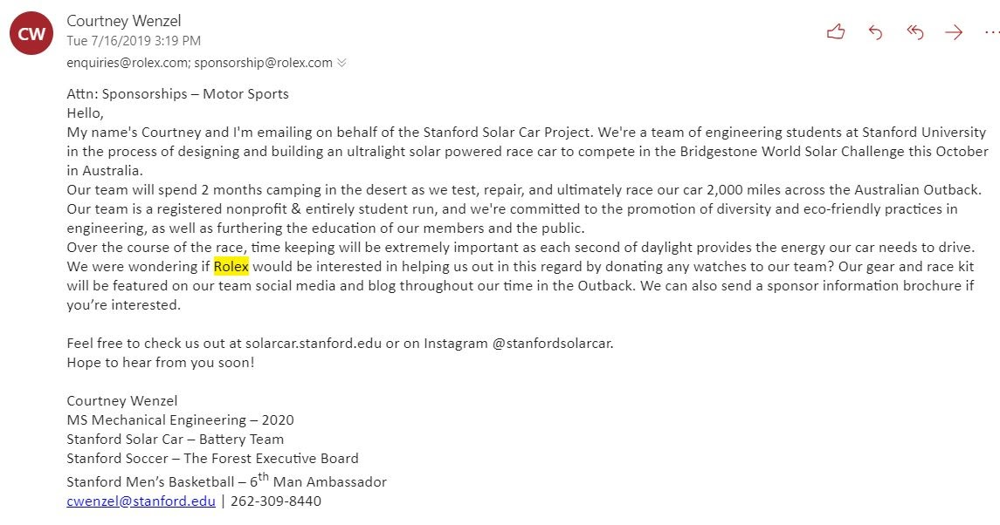

# SSCP - 19-11-10-Updates

# 19-11-10-Updates

Admin Updates

* I added everyone to slack, drive, internal site, and email
* add your email below if you still need access to:slacksolarpower emaildrivefnitta@stanford.eduinternal sitefnitta@stanford.edu
* slack
* solarpower email
* drivefnitta@stanford.edu
* fnitta@stanford.edu
* internal sitefnitta@stanford.edu
* fnitta@stanford.edu
* Let's look at the ASC to do list to get familiar with it

I added everyone to slack, drive, internal site, and email

add your email below if you still need access to:

* slack
* solarpower email
* drivefnitta@stanford.edu
* fnitta@stanford.edu
* internal sitefnitta@stanford.edu
* fnitta@stanford.edu

slack

solarpower email

drive

* fnitta@stanford.edu

fnitta@stanford.edu

internal site

* fnitta@stanford.edu

fnitta@stanford.edu

Let's look at the ASC to do list to get familiar with it

SPONSOR UPDATES

Tell the team who you talked to.

* Courtney's Cold Email Seminarget ready to get some breadHunter.io is goldcreate an account, you get 50 free searches per month, you can also search without an account
* Courtney's Cold Email Seminar
* get ready to get some breadHunter.io is goldcreate an account, you get 50 free searches per month, you can also search without an account
* Hunter.io is gold
* create an account, you get 50 free searches per month, you can also search without an account

* Courtney's Cold Email Seminar
* get ready to get some breadHunter.io is goldcreate an account, you get 50 free searches per month, you can also search without an account
* Hunter.io is gold
* create an account, you get 50 free searches per month, you can also search without an account

Courtney's Cold Email Seminar

get ready to get some bread

* Hunter.io is gold
* create an account, you get 50 free searches per month, you can also search without an account

Hunter.io is gold

create an account, you get 50 free searches per month, you can also search without an account

* What's in an email?Recipient: see hunter.io/linkedinSubject: DO NOT INCLUDE THE WORD SPONSORSHIP IN THE SUBJECTIntro: Hi, I'm...Background: The Stanford Solar Car Project...The Ask: Would you be able to...?The Follow Up: If you are interested, here's some info...Signature: Name, title?, stanford, email, phone, etc.What you should do:Get a list of 5 companies, not on sponsor list from previous years, form your own templatehttps://docs.google.com/spreadsheets/d/1YG_OMf7UeReGVgr3v3A5Ru69bLYWMG4UQxNbnRfGQpE/edit#gid=190947987Next meeting, we will all read off sponsors so we make sure we do not overlap, you will be able to ask me questions/proof read templatesGather email addressesSend some emailsStep 3: ProfitCC Courtney on all emails, message me if you need help respondingPerson to get the greatest valued sponsorship gets a fabulous #sponsored prizeExample:
* Recipient: see hunter.io/linkedin
* Subject: DO NOT INCLUDE THE WORD SPONSORSHIP IN THE SUBJECTIntro: Hi, I'm...Background: The Stanford Solar Car Project...The Ask: Would you be able to...?The Follow Up: If you are interested, here's some info...Signature: Name, title?, stanford, email, phone, etc.
* Intro: Hi, I'm...
* Background: The Stanford Solar Car Project...
* The Ask: Would you be able to...?
* The Follow Up: If you are interested, here's some info...
* Signature: Name, title?, stanford, email, phone, etc.
* What you should do:Get a list of 5 companies, not on sponsor list from previous years, form your own template
* Get a list of 5 companies, not on sponsor list from previous years, form your own template
* https://docs.google.com/spreadsheets/d/1YG_OMf7UeReGVgr3v3A5Ru69bLYWMG4UQxNbnRfGQpE/edit#gid=190947987Next meeting, we will all read off sponsors so we make sure we do not overlap, you will be able to ask me questions/proof read templatesGather email addressesSend some emailsStep 3: ProfitCC Courtney on all emails, message me if you need help respondingPerson to get the greatest valued sponsorship gets a fabulous #sponsored prize
* Next meeting, we will all read off sponsors so we make sure we do not overlap, you will be able to ask me questions/proof read templates
* Gather email addresses
* Send some emails
* Step 3: Profit
* CC Courtney on all emails, message me if you need help responding
* Person to get the greatest valued sponsorship gets a fabulous #sponsored prize
* Example:

What's in an email?

* Recipient: see hunter.io/linkedin
* Subject: DO NOT INCLUDE THE WORD SPONSORSHIP IN THE SUBJECTIntro: Hi, I'm...Background: The Stanford Solar Car Project...The Ask: Would you be able to...?The Follow Up: If you are interested, here's some info...Signature: Name, title?, stanford, email, phone, etc.
* Intro: Hi, I'm...
* Background: The Stanford Solar Car Project...
* The Ask: Would you be able to...?
* The Follow Up: If you are interested, here's some info...
* Signature: Name, title?, stanford, email, phone, etc.
* What you should do:Get a list of 5 companies, not on sponsor list from previous years, form your own template
* Get a list of 5 companies, not on sponsor list from previous years, form your own template
* https://docs.google.com/spreadsheets/d/1YG_OMf7UeReGVgr3v3A5Ru69bLYWMG4UQxNbnRfGQpE/edit#gid=190947987Next meeting, we will all read off sponsors so we make sure we do not overlap, you will be able to ask me questions/proof read templatesGather email addressesSend some emailsStep 3: ProfitCC Courtney on all emails, message me if you need help respondingPerson to get the greatest valued sponsorship gets a fabulous #sponsored prize
* Next meeting, we will all read off sponsors so we make sure we do not overlap, you will be able to ask me questions/proof read templates
* Gather email addresses
* Send some emails
* Step 3: Profit
* CC Courtney on all emails, message me if you need help responding
* Person to get the greatest valued sponsorship gets a fabulous #sponsored prize
* Example:

Recipient: see hunter.io/linkedin

Subject: DO NOT INCLUDE THE WORD SPONSORSHIP IN THE SUBJECT

* Intro: Hi, I'm...
* Background: The Stanford Solar Car Project...
* The Ask: Would you be able to...?
* The Follow Up: If you are interested, here's some info...
* Signature: Name, title?, stanford, email, phone, etc.

Intro: Hi, I'm...

Background: The Stanford Solar Car Project...

The Ask: Would you be able to...?

The Follow Up: If you are interested, here's some info...

Signature: Name, title?, stanford, email, phone, etc.

What you should do:

* Get a list of 5 companies, not on sponsor list from previous years, form your own template

Get a list of 5 companies, not on sponsor list from previous years, form your own template

https://docs.google.com/spreadsheets/d/1YG_OMf7UeReGVgr3v3A5Ru69bLYWMG4UQxNbnRfGQpE/edit#gid=190947987

[https://docs.google.com/spreadsheets/d/1YG_OMf7UeReGVgr3v3A5Ru69bLYWMG4UQxNbnRfGQpE/edit#gid=190947987](https://docs.google.com/spreadsheets/d/1YG_OMf7UeReGVgr3v3A5Ru69bLYWMG4UQxNbnRfGQpE/edit#gid=190947987)

* Next meeting, we will all read off sponsors so we make sure we do not overlap, you will be able to ask me questions/proof read templates
* Gather email addresses
* Send some emails
* Step 3: Profit
* CC Courtney on all emails, message me if you need help responding
* Person to get the greatest valued sponsorship gets a fabulous #sponsored prize

Next meeting, we will all read off sponsors so we make sure we do not overlap, you will be able to ask me questions/proof read templates

Gather email addresses

Send some emails

Step 3: Profit

CC Courtney on all emails, message me if you need help responding

Person to get the greatest valued sponsorship gets a fabulous #sponsored prize

Example:

* Once you have secured a sponsorBe sure to follow through!Update sponsor spreadsheetmake sure check comes inmake sure the team follows through on our end of the bargain
* Once you have secured a sponsorBe sure to follow through!Update sponsor spreadsheetmake sure check comes inmake sure the team follows through on our end of the bargain
* Be sure to follow through!
* Update sponsor spreadsheet
* make sure check comes in
* make sure the team follows through on our end of the bargain

* Once you have secured a sponsorBe sure to follow through!Update sponsor spreadsheetmake sure check comes inmake sure the team follows through on our end of the bargain
* Be sure to follow through!
* Update sponsor spreadsheet
* make sure check comes in
* make sure the team follows through on our end of the bargain

Once you have secured a sponsor

* Be sure to follow through!
* Update sponsor spreadsheet
* make sure check comes in
* make sure the team follows through on our end of the bargain

Be sure to follow through!

Update sponsor spreadsheet

make sure check comes in

make sure the team follows through on our end of the bargain

Aero

Key Points:

* task 1 is up for grabs: photo copy the leading edge
* task 1 is up for grabs: photo copy the leading edge

* task 1 is up for grabs: photo copy the leading edge

task 1 is up for grabs: photo copy the leading edge

Wins:

Losses:

Array

Key Points:

Wins:

Losses:

Business

Key Points:

* Chris, updates?Do we send out last year's sponsorship packet for now?  Or wait for a new one to be updated?
* Chris, updates?
* Do we send out last year's sponsorship packet for now?  Or wait for a new one to be updated?

* Chris, updates?
* Do we send out last year's sponsorship packet for now?  Or wait for a new one to be updated?

Chris, updates?

Do we send out last year's sponsorship packet for now?  Or wait for a new one to be updated?

Wins:

Losses:

Code + Strategy

Key Points:

Wins:

Losses:

Electrical

Key Points:

Wins:

Losses:

Mechanical + Composites

Key Points:

* Erik, updates?
* Erik, updates?

* Erik, updates?

Erik, updates?

Wins:

Losses:

Battery

Key Points:

Wins:

Losses:

Notes: starting week 8, off thanksgiving week

